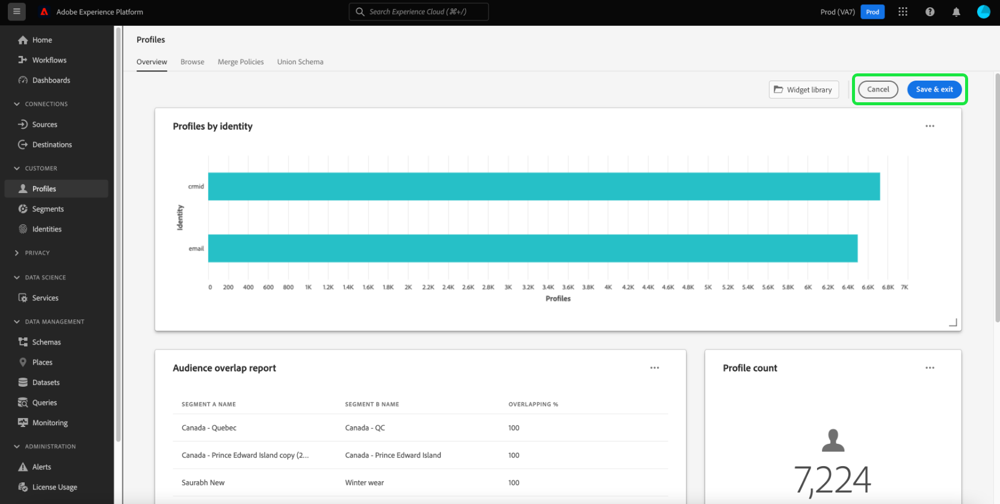

# Ändern von Dashboards {#modify-dashboards}

In der Adobe Experience Platform-Benutzeroberfläche können Sie die Daten Ihres Unternehmens mithilfe mehrerer Dashboards anzeigen und damit interagieren. Die in den Dashboards angezeigten Standard-Widgets und -Metriken können auf Benutzerebene angepasst werden, um bevorzugte Daten anzuzeigen. Außerdem können Widgets erstellt und von Benutzern in derselben Organisation gemeinsam genutzt werden.

Dieses Handbuch enthält schrittweise Anweisungen zum Anpassen der Anzeige von Dashboard-Daten in den Dashboards [!UICONTROL Profile], [!UICONTROL Segmente] und [!UICONTROL Ziele] in der Platform-Benutzeroberfläche.

>[!NOTE]
>
>Die im Dashboard zur Lizenznutzung angezeigten Widgets können nicht angepasst werden. Weitere Informationen zu diesem eindeutigen Dashboard finden Sie in der [Dokumentation zum Dashboard zur Lizenznutzung](../guides/license-usage.md) .

## Erste Schritte

In jedem Dashboard (z. B. im Dashboard [!UICONTROL Profile]) können Sie **[!UICONTROL Dashboard ändern]** auswählen, um die Größe vorhandener Widgets zu ändern und neu anzuordnen.

## Widgets neu anordnen

Nachdem Sie sich entschieden haben, das Dashboard zu ändern, können Sie die Widgets neu anordnen, indem Sie den Widget-Titel auswählen und die Widgets in die gewünschte Reihenfolge ziehen und dort ablegen. In diesem Beispiel wird das Widget **[!UICONTROL Trend der Profilanzahl]** in die oberste Zeile verschoben und das Widget [!UICONTROL Profilanzahl] wird jetzt in der zweiten Zeile angezeigt.

## Größe von Widgets ändern

Sie können die Größe eines Widgets auch ändern, indem Sie das Winkelsymbol in der rechten unteren Ecke des Widgets (`⌟`) auswählen und das Widget auf die gewünschte Größe ziehen. In diesem Beispiel wird die Größe des Widgets **[!UICONTROL Profile nach Identität]** so geändert, dass die gesamte oberste Zeile gefüllt wird, wobei die anderen Widgets automatisch in die zweite Zeile verschoben werden. Beachten Sie, wie sich die horizontale Achse anpasst, um detailliertere Inkremente bereitzustellen, sobald das Widget größer wird.

>[!NOTE]
>
>Wenn Widgets in der Größe angepasst werden, werden umliegende Widgets dynamisch neu positioniert. Dies kann dazu führen, dass einige Widgets in zusätzliche Zeilen verschoben werden, sodass Sie zum Anzeigen aller Widgets einen Bildlauf durchführen müssen.

## Dashboard-Aktualisierungen speichern

Nachdem Sie die Verschieben- und Größenanpassung von Widgets abgeschlossen haben, wählen Sie **[!UICONTROL Speichern]** aus, um Ihre Änderungen zu speichern und zur Haupt-Dashboard-Ansicht zurückzukehren. Wenn Sie Ihre Änderungen nicht beibehalten möchten, wählen Sie **[!UICONTROL Abbrechen]** aus, um das Dashboard zurückzusetzen und zur Haupt-Dashboard-Ansicht zurückzukehren.

## Widget-Bibliothek

Zusätzlich zur Größenanpassung und Neuanordnung von Widgets können Sie durch die Auswahl von **[!UICONTROL Dashboard ändern]** im Dashboard [!UICONTROL Profile], [!UICONTROL Segmente] und [!UICONTROL Ziele] auf die **[!UICONTROL Widget-Bibliothek]** zugreifen, wo Sie weitere Widgets zur Anzeige oder zum Erstellen finden können Widgets für Ihre Organisation.

Eine schrittweise Anleitung zum Zugriff auf und zum Arbeiten mit der [!UICONTROL Widget-Bibliothek] finden Sie im Handbuch zur Widget-Bibliothek [Widget](widget-library.md).

## Nächste Schritte

Nach dem Lesen dieses Dokuments haben Sie erfahren, wie Sie mit der Funktion zum Ändern des Dashboards Widgets neu anordnen und die Größe ändern können, um Ihre Dashboard-Ansicht anzupassen. Um zu erfahren, wie Sie Widgets erstellen und zu Ihren Dashboards hinzufügen können, lesen Sie das [Widget-Bibliothekshandbuch](widget-library.md).
