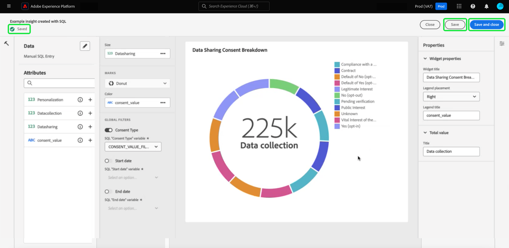

# Abfragepro-Modus {#query-pro-mode}

Query pro mode ist ein auf SQL Editor basierender Workflow, der Sie durch den Prozess der Generierung von Einblicken mit benutzerdefinierten SQL-Abfragen in der Adobe Experience Platform-Benutzeroberfläche führt. Bevor Sie Einblicke mit benutzerdefinierten SQL-Abfragen generieren können, müssen Sie zunächst [Dashboard erstellen](./overview.md#create-custom-dashboard).

## SQL erstellen {#compose-sql}

Nachdem Sie ein Dashboard mit Query Pro-Modus erstellt haben, wird die **[!UICONTROL SQL eingeben]** angezeigt. Wählen Sie eine Datenbank (Insight-Datenmodell) aus, die aus dem Dropdown-Menü abgefragt werden soll, und geben Sie eine geeignete Abfrage für Ihren Datensatz im Abfragepro-Editor ein.

>[!NOTE]
>
>Der Pro-Modus &quot;Abfrage&quot;steht nur Benutzern zur Verfügung, die die Data Distiller-SKU erworben haben. Die [[!UICONTROL Geführter Designmodus]](../../user-defined-dashboards.md) steht allen Benutzern zur Erstellung von Einblicken aus einem vorhandenen Datenmodell zur Verfügung.

Siehe [Benutzerhandbuch zum Abfrage-Editor](../../../query-service/ui/user-guide.md#query-authoring) für Informationen zu den UI-Elementen.

![Die [!UICONTROL SQL eingeben] mit dem Dropdown-Menü Datensatz und dem hervorgehobenen Ausführungssymbol angezeigt. Das Dialogfeld enthält eine ausgefüllte SQL-Abfrage und die Registerkarte &quot;Abfrageparameter&quot;.](../../images/customizable-insights/enter-sql-database-dropdown.png)

### Abfrageparameter {#query-parameters}

Einbeziehen [global](./filters/global-filter.md) oder [Datumsfilter](./filters/date-filter.md) Ihre Abfrage **must** Abfrageparameter verwenden. Beim Erstellen Ihrer Anweisung im Abfragepro-Modus müssen Sie Beispielwerte angeben, wenn Ihre Abfrage Abfrageparameter verwendet. Mit den Beispielwerten können Sie die SQL-Anweisung ausführen und das Diagramm erstellen. Beachten Sie, dass die Beispielwerte, die Sie beim Erstellen Ihrer Anweisung angeben, durch die tatsächlichen Werte ersetzt werden, die Sie für den Datums- oder globalen Filter zur Laufzeit auswählen.

>[!IMPORTANT]
>
>Wenn Sie einen globalen Filter verwenden möchten, müssen Sie einen Abfrageparameter in Ihrer SQL platzieren und diesen Abfrageparameter dann mit dem globalen Filter im Widget Composer verknüpfen. Im folgenden Screenshot: `CONSENT_VALUE_FILTER` wird in der SQL als Abfrageparameter für einen globalen Filter verwendet. Siehe [Dokumentation zu globalen Filtern](./filters/global-filter.md#enable-global-filter) für weitere Informationen.

Wählen Sie zum Ausführen Ihrer Abfrage das Ausführungssymbol (). Der Abfrage-Editor zeigt die Registerkarte Ergebnisse an. Um Ihre Konfiguration zu bestätigen und den Widget Composer zu öffnen, wählen Sie **[!UICONTROL Auswählen]**.

>[!TIP]
>
>Wenn Ihre Abfrage Abfrageparameter verwendet, führen Sie die Abfrage einmal aus, um alle verwendeten Abfrageparameterschlüssel vorab auszufüllen. Die Abfrage schlägt fehl, aber die Benutzeroberfläche zeigt automatisch die Registerkarte Abfrageparameter an und listet alle enthaltenen Schlüssel auf. Fügen Sie die entsprechenden Werte für Ihre Schlüssel hinzu.

![Die [!UICONTROL SQL eingeben] mit SQL-Eingabe, die Registerkarte &quot;Ergebnisse&quot;angezeigt und die Option &quot;Auswählen&quot;hervorgehoben.](../../images/customizable-insights/enter-sql-select.png)

## Widget befüllen {#populate-widget}

Der Widget Composer wird jetzt mit den Spalten aus der ausgeführten SQL gefüllt. Der Typ des Dashboards wird oben links angezeigt, in diesem Fall ist es [!UICONTROL Manueller SQL-Eintrag]. Wählen Sie das Stiftsymbol (), um die SQL zu bearbeiten.

>[!TIP]
>
>Die verfügbaren Attribute sind Spalten, die aus der ausgeführten SQL entnommen werden.

Verwenden Sie zum Erstellen Ihres Widgets die Attribute, die im [!UICONTROL Attribute] Spalte. Sie können die Suchleiste verwenden, um nach Attributen zu suchen oder in der Liste einen Bildlauf durchzuführen.

### Hinzufügen von Attributen {#add-attributes}

Um Ihrem Widget ein Attribut hinzuzufügen, wählen Sie das Pluszeichen () neben einem Attributnamen. Im angezeigten Dropdown-Menü können Sie der Grafik aus den von Ihrer SQL bestimmten Optionen ein Attribut hinzufügen. Verschiedene Diagrammtypen haben unterschiedliche Optionen, z. B. ein Dropdown-Menü für die X- und Y-Achse.

In diesem Ringdiagramm-Beispiel sind die Optionen Größe und Farbe. Farbe unterteilt die Ringdiagrammergebnisse und die Größe ist die tatsächlich verwendete Metrik. Fügen Sie dem [!UICONTROL Farbe] -Feld, um die Ergebnisse basierend auf ihrer Zusammensetzung in verschiedene Farben zu unterteilen.

>[!TIP]
>
>Wählen Sie das Pfeilsymbol nach oben und unten (), um die Anordnung der X- und Y-Achse in Balken- oder Liniendiagrammen zu ändern.

Um den Diagrammtyp oder die Grafik Ihres Widgets zu ändern, wählen Sie aus den verfügbaren Optionen des [!UICONTROL Marken] Dropdown. Zu den Optionen gehören [!UICONTROL Linie], [!UICONTROL Ringdiagramm], [!UICONTROL Big number], und [!UICONTROL Balken]. Nach der Auswahl wird eine Vorschau-Visualisierung der aktuellen Einstellungen Ihres Widgets generiert.

## Widget-Eigenschaften {#properties}

Wählen Sie das Eigenschaftensymbol () in der rechten Leiste, um den Eigenschaftenbereich zu öffnen. Im [!UICONTROL Eigenschaften] -Bedienfeld einen Namen für das Widget im **[!UICONTROL Widget-Titel]** Textfeld. Sie können auch verschiedene Aspekte Ihres Diagramms umbenennen.

>[!NOTE]
>
>Die in der Seitenleiste der Eigenschaften verfügbaren spezifischen Felder hängen vom bearbeiteten Diagrammtyp ab.

## Widget speichern {#save-widget}

Durch das Speichern im Widget Composer wird das Widget lokal in Ihrem Dashboard gespeichert. Wenn Sie Ihre Arbeit speichern und später fortsetzen möchten, wählen Sie **[!UICONTROL Speichern]**. Ein Häkchen-Symbol unter dem Widget-Namen zeigt an, dass das Widget gespeichert wurde. Wenn Sie mit dem Widget zufrieden sind, wählen Sie alternativ **[!UICONTROL Speichern und schließen]** , um das Widget allen anderen Benutzern mit Zugriff auf Ihr Dashboard zur Verfügung zu stellen. Wählen Sie Abbrechen aus, um Ihre Arbeit abzubrechen und zu Ihrem benutzerdefinierten Dashboard zurückzukehren.

## Dashboard und Diagramme bearbeiten {#edit}

Auswählen **[!UICONTROL Bearbeiten]** um Ihr gesamtes Dashboard oder Ihre Einblicke zu bearbeiten. Im Bearbeitungsmodus können Sie die Größe von Widgets ändern, SQL bearbeiten oder globale und zeitliche Filter erstellen und anwenden. Diese Filter beschränken die in Ihren Dashboard-Widgets angezeigten Daten. Auf diese Weise können Sie Ihre Einblicke schnell für verschiedene Anwendungsfälle aktualisieren und anpassen.

Auswählen **[!UICONTROL Filter hinzufügen]** , um entweder eine [[!UICONTROL Datumsfilter]](#create-date-filter) oder [[!UICONTROL Globaler Filter]](#create-global-filter). Nach der Erstellung sind alle globalen Filter und Datumsfilter verfügbar von [Filtersymbol](#select-global-filter) () Ihres Dashboards.

## Insight bearbeiten, duplizieren oder löschen

Anweisungen dazu finden Sie im Handbuch zum benutzerdefinierten Dashboard . [ein vorhandenes Widget bearbeiten, duplizieren oder löschen](../../user-defined-dashboards.md#duplicate).

## Nächste Schritte

Nach dem Lesen dieses Dokuments wissen Sie jetzt, wie Sie SQL-Abfragen in die Adobe Experience Platform-Benutzeroberfläche schreiben, um Diagramme für Ihre benutzerdefinierten Dashboards zu generieren. Als Nächstes sollten Sie lernen, wie Sie Journey-Daten weiter anreichern können durch [Datumsfilter erstellen](./filters/date-filter.md)oder [Erstellen eines globalen Filters](./filters/global-filter.md).

Sie können auch mehr über andere benutzerdefinierte Insights-Funktionen erfahren, darunter [die verschiedenen Anzeigeoptionen für SQL-analysierte Daten](./view-more.md) oder wie [Anzeigen der SQL hinter Ihren benutzerdefinierten Einblicken](./view-sql.md).
