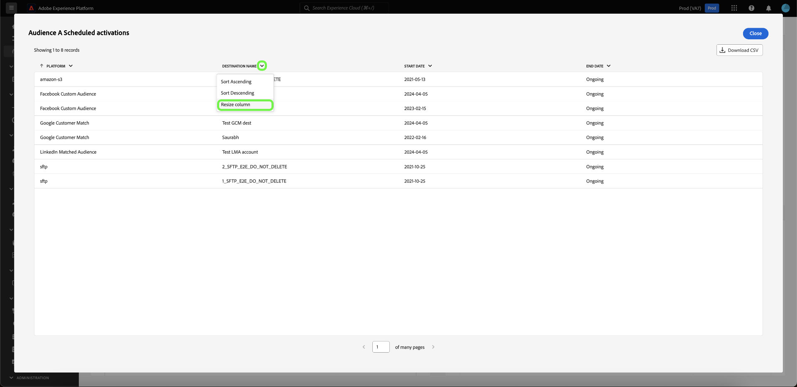

# Mehr anzeigen {#view-more}

Nachdem Sie einen [benutzerdefinierten Insight](../sql-insights/overview.md) mit dem [Abfragepro-Modus](./overview.md) erstellt haben, können Sie Ihre Diagrammdaten in verschiedenen Formaten anzeigen. Sie können entweder eine Tabellenform der Ergebnisse anzeigen oder die Daten als CSV-Datei herunterladen, um sie in einer Tabelle anzuzeigen.

## Tabulatorische Ergebnisse {#tabulated-results}

Für jedes Diagramm, das mit dem Abfragepro-Modus über SQL erstellt wurde, können Sie die tabellarischen Analyseergebnisse in der Experience Platform-Benutzeroberfläche anzeigen.

Wählen Sie in Ihrem benutzerdefinierten Dashboard die Auslassungszeichen (`...`) in einem beliebigen Widget aus, um auf die Optionen [!UICONTROL Mehr anzeigen] und [!UICONTROL SQL anzeigen] zuzugreifen.

## CSV herunterladen {#download-csv}

Die Funktion [!UICONTROL Mehr anzeigen] zeigt die spezifischen Datenpunkte für das Diagramm in Tabellenform an. Um die Datenfreigabe und -bearbeitung zu vereinfachen, können Sie die verarbeiteten Daten im CSV-Format von diesem Dialogfeld herunterladen. Wählen Sie **[!UICONTROL CSV herunterladen]** aus, um Ihre Daten herunterzuladen.

>[!NOTE]
>
>Der CSV-Download ist auf die ersten 500 Datensätze beschränkt.

## Nach Spalte sortieren {#sort-column}

Bei der Anzeige von tabellarischen Ergebnissen können Sie die Sortierfunktion verwenden, um nach Spalten in auf- oder absteigender Reihenfolge zu sortieren. Wählen Sie in Ihrem benutzerdefinierten Dashboard die Ellipsen (`...`) in einer beliebigen Tabelle aus, um auf die Option [!UICONTROL Mehr anzeigen] zuzugreifen.

Sie können Spalten sortieren, indem Sie das Dropdown-Menü neben dem Spaltennamen auswählen und dann **[!UICONTROL Aufsteigende Sortierung]** oder **[!UICONTROL Absteigende Sortierung]** auswählen.

>[!NOTE]
>
>Die Optionen [!UICONTROL Aufsteigende Sortierung] und [!UICONTROL Absteigende Sortierung] werden nur für Spalten angezeigt, die mit der [Sortierungsfunktion](../overview.md/#advanced-attributes) konfiguriert wurden.

## Spaltengröße ändern {#resize-column}

Sie können die Größe von Spalten in tabellarischen Ergebnissen ändern, um die Lesbarkeit der Daten zu verbessern. Wählen Sie in Ihrem benutzerdefinierten Dashboard die Ellipsen (`...`) für Ihre Tabelle aus, um auf die Option [!UICONTROL Mehr anzeigen] zuzugreifen. Verwenden Sie das Dropdown-Menü neben dem Spaltennamen, um die Größe zu ändern, und wählen Sie dann **[!UICONTROL Spaltengröße ändern]** aus.

Wählen Sie den Schieberegler aus und ziehen Sie ihn nach links oder rechts, um die Spaltengröße nach Bedarf anzupassen.

## Tabellenpaginierung {#table-pagination}

Die Paginierung wird automatisch auf Ihre Tabellen in der Funktion [!UICONTROL Mehr anzeigen] angewendet, sodass Sie Ihre SQL-Abfragen nicht mehr manuell ändern müssen. Diese Funktion stellt sicher, dass Ihre Daten in einem besser verwaltbaren Format dargestellt werden, was die Navigation durch große Datensätze erleichtert.

Sie können bis zu 500 Datensätze pro Seite anzeigen. Um durch die Datensätze zu navigieren, verwenden Sie die **[!UICONTROL >]** unten auf der Seite.

## Nächste Schritte

Nach dem Lesen dieses Dokuments wissen Sie jetzt, wie Sie die tabellarischen Ergebnisse der SQL-Analyse Ihres benutzerdefinierten Diagramms anzeigen und die Daten als CSV-Datei herunterladen können. Im Dokument &quot;SQL anzeigen&quot;erfahren Sie, wie Sie die SQL hinter Ihren benutzerdefinierten Einblicken anzeigen.](./view-more.md)[

Sie können auch erfahren, wie Sie mit dem Leitfaden für den Designmodus [ Diagramme aus vorhandenen Datenmodellen in der Adobe Experience Platform-Benutzeroberfläche erstellen.](../../user-defined-dashboards.md)
