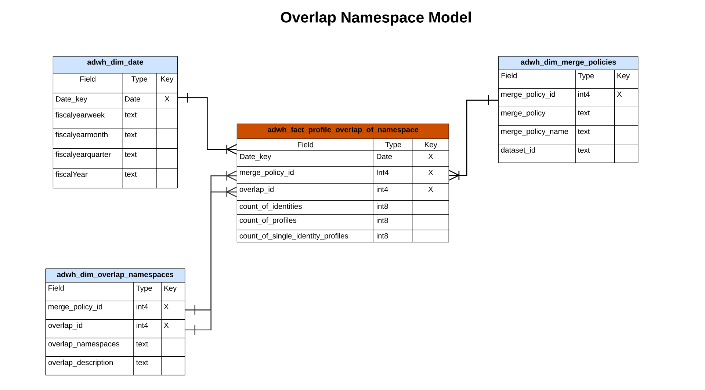

# Real-time Customer Data Platform Insights-Datenmodell B2C Edition

Das Real-time Customer Data Platform Insights-Datenmodell für die [B2C Edition](../../rtcdp/overview.md#rtcdp-b2c) stellt die Datenmodelle und SQL bereit, die die Insights für verschiedene Profil-, Ziel- und Segmentierungs-Widgets ermöglichen. Sie können diese SQL-Abfragevorlagen anpassen, um Real-Time CDP-Berichte für Ihre Marketing- und KPI-Anwendungsfälle zu erstellen. Diese Insights können dann als benutzerdefinierte Widgets für benutzerdefinierte Dashboards verwendet werden. Siehe die Dokumentation zu Reporting-Insights des abfragebeschleunigten Speichers , um zu erfahren[&#x200B; wie man ein Reporting-Insights-Datenmodell über den Abfrage-Service zur Verwendung mit beschleunigten Speicherdaten und benutzerdefinierten Dashboards erstellt](../../query-service/data-distiller/sql-insights/reporting-insights-data-model.md).

>[!NOTE]
>
>Der Begriff „Segment“ wurde in allen Adobe Experience Platform-Systemen in „Zielgruppe“ geändert. Einige Verweise auf Segmente bleiben für Dateipfade und Konventionen zur Benennung von Datensätzen in Verwendung.

## Voraussetzungen

Dieses Handbuch setzt ein Grundverständnis der [benutzerdefinierten Dashboards-Funktion“ &#x200B;](../standard-dashboards.md). Bitte lesen Sie die Dokumentation, bevor Sie mit diesem Handbuch fortfahren.

## Real-Time CDP Insight-Berichte und -Anwendungsfälle

Die Real-Time CDP-Berichterstellung bietet Einblicke in Ihre Profildaten und deren Beziehung zu Audiences und Zielen. Verschiedene Star-Schemamodelle wurden entwickelt, um eine Vielzahl gängiger Marketing-Anwendungsfälle zu beantworten, und jedes Datenmodell kann mehrere Anwendungsfälle unterstützen.

>[!IMPORTANT]
>
>Die für Real-Time CDP-Berichte verwendeten Daten sind für eine ausgewählte Zusammenführungsrichtlinie und für den letzten täglichen Schnappschuss korrekt.

### Profilmodell {#profile-model}

Das Profilmodell besteht aus drei Datensätzen:

- `adwh_dim_date`
- `adwh_fact_profile`
- `adwh_dim_merge_policies`

Die folgende Abbildung enthält die relevanten Datenfelder in jedem Datensatz.


#### Anwendungsfall für die Profilanzahl {#profile-count}

Die für das Widget [!UICONTROL Profilanzahl] verwendete Logik gibt die Gesamtzahl der zusammengeführten Profile im Profilspeicher zum Zeitpunkt des Schnappschusses zurück. Weitere Informationen finden [[!UICONTROL &#x200B; in der Dokumentation &#x200B;]Profilanzahl](../guides/profiles.md#profile-count) Widgets .

Das SQL-Widget, das [!UICONTROL Profilanzahl] generiert, wird im ausblendbaren Abschnitt unten angezeigt.

+++SQL-Abfrage

```sql
SELECT qsaccel.profile_agg.adwh_dim_merge_policies.merge_policy_name,
       sum(qsaccel.profile_agg.adwh_fact_profile.count_of_profiles) CNT
  FROM qsaccel.profile_agg.adwh_fact_profile
  LEFT OUTER JOIN qsaccel.profile_agg.adwh_dim_merge_policies ON qsaccel.profile_agg.adwh_dim_merge_policies.merge_policy_id=adwh_fact_profile.merge_policy_id
  WHERE qsaccel.profile_agg.adwh_fact_profile.date_key='2024-01-10'
    AND qsaccel.profile_agg.adwh_fact_profile.merge_policy_id = 2027892989
  GROUP BY qsaccel.profile_agg.adwh_dim_merge_policies.merge_policy_name;
```

+++

#### Anwendungsfall: Einzelne Identitätsprofile {#single-identity-profiles}

Die für das Widget [!UICONTROL Einzelne Identitätsprofile] verwendete Logik gibt die Anzahl der Profile Ihres Unternehmens an, die nur über einen einzigen ID-Typ verfügen, mit dem ihre Identität erstellt wird. Weitere Informationen finden Sie in der [[!UICONTROL Widget]Dokumentation &#x200B;](../guides/profiles.md#single-identity-profiles)Einzelidentitätsprofile“.

Das SQL-Widget, das [!UICONTROL Einzelne Identitätsprofile] generiert, wird im ausblendbaren Abschnitt unten angezeigt.

+++SQL-Abfrage

```sql
SELECT qsaccel.profile_agg.adwh_dim_merge_policies.merge_policy_name,
       sum(qsaccel.profile_agg.adwh_fact_profile.count_of_Single_Identity_profiles) CNT
  FROM qsaccel.profile_agg.adwh_fact_profile
  LEFT OUTER JOIN qsaccel.profile_agg.adwh_dim_merge_policies ON qsaccel.profile_agg.adwh_dim_merge_policies.merge_policy_id=adwh_fact_profile.merge_policy_id
  WHERE qsaccel.profile_agg.adwh_fact_profile.date_key='2024-01-10'
    AND qsaccel.profile_agg.adwh_fact_profile.merge_policy_id = 2027892989
  GROUP BY qsaccel.profile_agg.adwh_dim_merge_policies.merge_policy_name;
```

+++

### Namespace-Modell {#namespace-model}

Das Namespace-Modell besteht aus den folgenden Datensätzen:

- `adwh_dim_date`
- `adwh_fact_profile_by_namespace`
- `adwh_dim_merge_policies`
- `adwh_dim_namespaces`

Die folgende Abbildung enthält die relevanten Datenfelder in jedem Datensatz.


#### Profile nach Identitäts-Anwendungsfall {#profiles-by-identity}

Das [!UICONTROL Profile nach Identität] zeigt die Aufschlüsselung der Identitäten in allen zusammengeführten Profile in Ihrem Profilspeicher an. Weitere Informationen dazu finden [[!UICONTROL &#x200B; in der Widget]Dokumentation &#x200B;](../guides/profiles.md#profiles-by-identity)Profile nach Identität).

Der SQL-Code, der das Widget [!UICONTROL Profile nach Identität] generiert, wird im ausblendbaren Abschnitt unten angezeigt.

+++SQL-Abfrage

```sql
SELECT qsaccel.profile_agg.adwh_dim_namespaces.namespace_description,
        sum(qsaccel.profile_agg.adwh_fact_profile_by_namespace_trendlines.count_of_profiles) count_of_profiles
  FROM qsaccel.profile_agg.adwh_fact_profile_by_namespace_trendlines
  LEFT OUTER JOIN qsaccel.profile_agg.adwh_dim_namespaces ON qsaccel.profile_agg.adwh_fact_profile_by_namespace_trendlines.namespace_id = qsaccel.profile_agg.adwh_dim_namespaces.namespace_id
  AND qsaccel.profile_agg.adwh_fact_profile_by_namespace_trendlines.merge_policy_id = qsaccel.profile_agg.adwh_dim_namespaces.merge_policy_id
  WHERE qsaccel.profile_agg.adwh_fact_profile_by_namespace_trendlines.merge_policy_id = 2027892989
    AND qsaccel.profile_agg.adwh_fact_profile_by_namespace_trendlines.date_key = '2024-01-10'
  GROUP BY qsaccel.profile_agg.adwh_fact_profile_by_namespace_trendlines.date_key,
          qsaccel.profile_agg.adwh_fact_profile_by_namespace_trendlines.merge_policy_id,
          qsaccel.profile_agg.adwh_dim_namespaces.namespace_description
  ORDER BY count_of_profiles DESC;
```

+++

#### Einzelne Identitätsprofile nach Identitäts-Anwendungsfall {#single-identity-profiles-by-identity}

Die für das Widget [!UICONTROL Einzelne Identitätsprofile nach Identität] verwendete Logik veranschaulicht die Gesamtzahl der Profile, die mit nur einer einzigen eindeutigen Kennung identifiziert werden. Weitere Informationen dazu finden [&#x200B; in der Dokumentation &#x200B;](../guides/profiles.md#single-identity-profiles-by-identity) Identitäts-Widgets Einzelne Identitätsprofile .

Das SQL-Widget, das [!UICONTROL Einzelne Identitätsprofile nach Identität] generiert, wird im ausblendbaren Abschnitt unten angezeigt.

+++SQL-Abfrage

```sql
SELECT qsaccel.profile_agg.adwh_dim_namespaces.namespace_description,
        sum(qsaccel.profile_agg.adwh_fact_profile_by_namespace_trendlines.count_of_Single_Identity_profiles) count_of_Single_Identity_profiles
  FROM qsaccel.profile_agg.adwh_fact_profile_by_namespace_trendlines
  LEFT OUTER JOIN qsaccel.profile_agg.adwh_dim_namespaces ON qsaccel.profile_agg.adwh_fact_profile_by_namespace_trendlines.namespace_id = qsaccel.profile_agg.adwh_dim_namespaces.namespace_id
  AND qsaccel.profile_agg.adwh_fact_profile_by_namespace_trendlines.merge_policy_id = qsaccel.profile_agg.adwh_dim_namespaces.merge_policy_id
  WHERE qsaccel.profile_agg.adwh_fact_profile_by_namespace_trendlines.merge_policy_id = 2027892989
    AND qsaccel.profile_agg.adwh_fact_profile_by_namespace_trendlines.date_key = '2024-01-10'
  GROUP BY qsaccel.profile_agg.adwh_fact_profile_by_namespace_trendlines.date_key,
          qsaccel.profile_agg.adwh_fact_profile_by_namespace_trendlines.merge_policy_id,
          qsaccel.profile_agg.adwh_dim_namespaces.namespace_description;
```

+++

### Zielgruppenmodell {#audience-model}

Das Zielgruppenmodell besteht aus den folgenden Datensätzen:

- `adwh_dim_date`
- `adwh_fact_profile_by_segment`
- `adwh_dim_merge_policies`
- `adwh_dim_segments`
- `adwh_dim_br_segment_destinations`
- `adwh_dim_destination`
- `adwh_dim_destination_platform`

Die folgende Abbildung enthält die relevanten Datenfelder in jedem Datensatz.


#### Anwendungsfall für die Zielgruppengröße {#audience-size}

Die für das Widget [!UICONTROL Zielgruppengröße] verwendete Logik gibt die Gesamtzahl der zusammengeführten Profile innerhalb der ausgewählten Zielgruppe zum Zeitpunkt des letzten Schnappschusses zurück. Weitere Informationen finden Sie in [[!UICONTROL &#x200B; Widget]Dokumentation &#x200B;](../guides/audiences.md#audience-size)Zielgruppengröße) .

Das SQL-Widget, das [!UICONTROL Zielgruppengröße] generiert, wird im ausblendbaren Abschnitt unten angezeigt.

+++SQL-Abfrage

```sql
SELECT
  sum(
    qsaccel.profile_agg.adwh_fact_profile_by_segment_trendlines.count_of_profiles
  ) count_of_profiles
FROM
  qsaccel.profile_agg.adwh_fact_profile_by_segment_trendlines
  LEFT OUTER JOIN qsaccel.profile_agg.adwh_dim_segments ON qsaccel.profile_agg.adwh_fact_profile_by_segment_trendlines.segment_id = qsaccel.profile_agg.adwh_dim_segments.segment_id
WHERE
  qsaccel.profile_agg.adwh_fact_profile_by_segment_trendlines.segment_id = -1323307941
  AND qsaccel.profile_agg.adwh_fact_profile_by_segment_trendlines.merge_policy_id = 1914917902
  AND qsaccel.profile_agg.adwh_fact_profile_by_segment_trendlines.date_key = '2024-01-12';
```

+++

#### Anwendungsfall: Trend zur Änderung der Zielgruppengröße {#audience-size-change-trend}

Die für das Widget [!UICONTROL Entwicklung der Zielgruppengröße] verwendete Logik bietet eine Kantengraph-Illustration der Differenz der Gesamtzahl der Profile, die sich zwischen den letzten täglichen Momentaufnahmen für eine bestimmte Zielgruppe qualifiziert haben. Weitere Informationen finden [[!UICONTROL &#x200B; in der Widget]Dokumentation &#x200B;](../guides/audiences.md#audience-size-change-trend)Entwicklung der Zielgruppengröße“.

Das SQL-Widget, das [!UICONTROL Entwicklung der Zielgruppengröße] generiert, wird im ausblendbaren Abschnitt unten angezeigt.

+++SQL-Abfrage

```sql
SELECT date_key,
      Profiles_added
  FROM
    (SELECT rn_num,
            date_key,
            (count_of_profiles-lag(count_of_profiles, 1, 0) over(
                                                                ORDER BY date_key))Profiles_added
    FROM
      (SELECT date_key,
              sum(x.count_of_profiles)count_of_profiles,
              row_number() OVER (
                                  ORDER BY date_key) rn_num
        FROM qsaccel.profile_agg.adwh_fact_profile_by_segment_trendlines x
        INNER JOIN
          (SELECT MAX(process_date) last_process_date,
                  merge_policy_id
          FROM qsaccel.profile_agg.adwh_lkup_process_delta_log
          WHERE process_name = 'FACT_TABLES_PROCESSING'
            AND process_status = 'SUCCESSFUL'
          GROUP BY merge_policy_id) y ON x.merge_policy_id = y.merge_policy_id
        WHERE segment_id = 1333234510
          AND x.date_key >= dateadd(DAY, -30 -1, y.last_process_date)
        GROUP BY x.date_key) a)b
  WHERE rn_num > 1;
```

+++

#### Anwendungsfall für die am häufigsten verwendeten Ziele {#most-used-destinations}

Die im Widget [!UICONTROL Am häufigsten verwendete Ziele] verwendete Logik listet die am häufigsten verwendeten Ziele Ihres Unternehmens entsprechend der Anzahl der ihnen zugeordneten Zielgruppen auf. Diese Rangfolge bietet Einblicke, welche Ziele verwendet werden, und zeigt gleichzeitig, welche möglicherweise nicht ausreichend genutzt werden. Weitere Informationen finden Sie in der Dokumentation [[!UICONTROL &#x200B; Widgets &#x200B;]Am häufigsten verwendete Ziele](../guides/destinations.md#most-used-destinations) .

Das SQL-Widget, das [!UICONTROL Am häufigsten verwendeten Ziele] generiert, wird im ausblendbaren Abschnitt unten angezeigt.

+++SQL-Abfrage

```sql
SELECT qsaccel.profile_agg.adwh_dim_destination.destination_name,
       qsaccel.profile_agg.adwh_dim_destination.destination_id,
       qsaccel.profile_agg.adwh_dim_destination.destination,
       count(DISTINCT qsaccel.profile_agg.adwh_dim_br_segment_destinations.segment_id) segment_count
  FROM qsaccel.profile_agg.adwh_dim_destination
  JOIN qsaccel.profile_agg.adwh_dim_br_segment_destinations ON qsaccel.profile_agg.adwh_dim_destination.destination_id = qsaccel.profile_agg.adwh_dim_br_segment_destinations.destination_id
  WHERE qsaccel.profile_agg.adwh_dim_destination.destination_name IS NOT NULL
  GROUP BY qsaccel.profile_agg.adwh_dim_destination.destination_name,
           qsaccel.profile_agg.adwh_dim_destination.destination,
           qsaccel.profile_agg.adwh_dim_destination.destination_id
  ORDER BY segment_count DESC
  LIMIT 20;
```

+++

#### Anwendungsfall für kürzlich aktivierte Zielgruppen {#recently-activated-audiences}

Die Logik für das Widget [!UICONTROL Kürzlich aktivierte Zielgruppen] stellt eine Liste der Zielgruppen bereit, die einem Ziel zuletzt zugeordnet wurden. Diese Liste enthält eine Momentaufnahme der Zielgruppen und Ziele, die aktiv im System verwendet werden, und kann bei der Fehlerbehebung bei fehlerhaften Zuordnungen hilfreich sein. Weitere Informationen finden Sie in der [[!UICONTROL Widget]Dokumentation &#x200B;](../guides/destinations.md#recently-activated-audiences)Kürzlich aktivierte Zielgruppen“.

Das SQL-Widget, das [!UICONTROL Kürzlich aktivierte Zielgruppen] generiert, wird im ausblendbaren Abschnitt unten angezeigt.

+++SQL-Abfrage

```sql
SELECT
  segment_name,
  segment,
  destination_name,
  a.create_time create_time
FROM
  qsaccel.profile_agg.adwh_dim_br_segment_destinations a
  INNER JOIN qsaccel.profile_agg.adwh_dim_segments b ON a.segment_id = b.segment_id
  INNER JOIN qsaccel.profile_agg.adwh_dim_destination c ON a.destination_id = c.destination_id
ORDER BY
  create_time DESC,
  segment
LIMIT
  20;
```

+++

### Namespace-Audience-Modell {#namespace-audience-model}

Das Namespace-Zielgruppen-Modell besteht aus den folgenden Datensätzen:

- `adwh_dim_date`
- `adwh_dim_namespaces`
- `adwh_fact_profile_by_segment_and_namespace`
- `adwh_dim_merge_policies`
- `adwh_dim_segments`
- `adwh_dim_br_segment_destinations`
- `adwh_dim_destination`
- `adwh_dim_destination_platform`

Die folgende Abbildung enthält die relevanten Datenfelder in jedem Datensatz.


#### Profile nach Identität für einen Anwendungsfall mit einer Audience {#audience-profiles-by-identity}

Die im Widget [!UICONTROL Profile nach Identität] verwendete Logik bietet eine Aufschlüsselung der Identitäten über alle zusammengeführten Profile in Ihrem Profilspeicher für eine bestimmte Zielgruppe hinweg. Weitere Informationen dazu finden [[!UICONTROL &#x200B; in der Widget]Dokumentation &#x200B;](../guides/audiences.md#profiles-by-identity)Profile nach Identität).

Der SQL-Code, der das Widget [!UICONTROL Profile nach Identität] generiert, wird im ausblendbaren Abschnitt unten angezeigt.

+++SQL-Abfrage

```sql
SELECT qsaccel.profile_agg.adwh_dim_namespaces.namespace_description,
        sum(qsaccel.profile_agg.adwh_fact_profile_by_segment_and_namespace_trendlines.count_of_profiles) count_of_profiles
  FROM qsaccel.profile_agg.adwh_fact_profile_by_segment_and_namespace_trendlines
  LEFT OUTER JOIN qsaccel.profile_agg.adwh_dim_namespaces ON qsaccel.profile_agg.adwh_fact_profile_by_segment_and_namespace_trendlines.namespace_id = qsaccel.profile_agg.adwh_dim_namespaces.namespace_id
  AND qsaccel.profile_agg.adwh_fact_profile_by_segment_and_namespace_trendlines.merge_policy_id = qsaccel.profile_agg.adwh_dim_namespaces.merge_policy_id
  WHERE qsaccel.profile_agg.adwh_fact_profile_by_segment_and_namespace_trendlines.segment_id = 1333234510
    AND qsaccel.profile_agg.adwh_fact_profile_by_segment_and_namespace_trendlines.merge_policy_id = 1709997014
    AND qsaccel.profile_agg.adwh_fact_profile_by_segment_and_namespace_trendlines.date_key = '2024-01-10'
  GROUP BY qsaccel.profile_agg.adwh_dim_namespaces.namespace_description
  ORDER BY count_of_profiles DESC;
```

+++

### Überlappendes Namespace-Modell

Das Überschneidungs-Namespace-Modell besteht aus den folgenden Datensätzen:

- `adwh_dim_date`
- `adwh_dim_overlap_namespaces`
- `adwh_fact_profile_overlap_of_namespace`
- `adwh_dim_merge_policies`

Die folgende Abbildung enthält die relevanten Datenfelder in jedem Datensatz.



#### Anwendungsfall für Identitätsüberschneidung (Profile) {#profiles-identity-overlap}

Die im Widget [!UICONTROL Identitätsüberschneidung] verwendete Logik zeigt die Überschneidung von Profilen in Ihrem **Profilspeicher** an, die die beiden ausgewählten Identitäten enthalten. Weitere Informationen finden Sie im Widget[[!UICONTROL Abschnitt „Identitätsüberschneidung] der Dokumentation zum [!UICONTROL Profile]-Dashboard](../guides/profiles.md#identity-overlap).

Das SQL-Widget, das [!UICONTROL Identitätsüberschneidung] generiert, wird im ausblendbaren Abschnitt unten angezeigt.

+++SQL-Abfrage

```sql
SELECT Sum(overlap_col1) overlap_col1,
        Sum(overlap_col2) overlap_col2,
        coalesce(Sum(overlap_count), 0) overlap_count
  FROM
    (SELECT 0 overlap_col1,
            0 overlap_col2,
            Sum(count_of_profiles) overlap_count
    FROM qsaccel.profile_agg.adwh_fact_profile_overlap_of_namespace
    WHERE qsaccel.profile_agg.adwh_fact_profile_overlap_of_namespace.merge_policy_id = 2027892989
      AND qsaccel.profile_agg.adwh_fact_profile_overlap_of_namespace.date_key = '2024-01-10'
      AND qsaccel.profile_agg.adwh_fact_profile_overlap_of_namespace.overlap_id IN
        (SELECT a.overlap_id
          FROM
            (SELECT qsaccel.profile_agg.adwh_dim_overlap_namespaces.overlap_id overlap_id,
                    count(*) cnt_num
            FROM qsaccel.profile_agg.adwh_dim_overlap_namespaces
            WHERE qsaccel.profile_agg.adwh_dim_overlap_namespaces.merge_policy_id = 2027892989
              AND qsaccel.profile_agg.adwh_dim_overlap_namespaces.overlap_namespaces in ('avid',
                                                                                          'crmid')
            GROUP BY qsaccel.profile_agg.adwh_dim_overlap_namespaces.overlap_id)a
          WHERE a.cnt_num>1 )
    UNION ALL SELECT count_of_profiles overlap_col1,
                      0 overlap_col2,
                      0 overlap_count
    FROM qsaccel.profile_agg.adwh_fact_profile_by_namespace_trendlines
    JOIN qsaccel.profile_agg.adwh_dim_namespaces ON qsaccel.profile_agg.adwh_fact_profile_by_namespace_trendlines.namespace_id = qsaccel.profile_agg.adwh_dim_namespaces.namespace_id
    AND qsaccel.profile_agg.adwh_fact_profile_by_namespace_trendlines.merge_policy_id = qsaccel.profile_agg.adwh_dim_namespaces.merge_policy_id
    WHERE qsaccel.profile_agg.adwh_fact_profile_by_namespace_trendlines.merge_policy_id = 2027892989
      AND qsaccel.profile_agg.adwh_fact_profile_by_namespace_trendlines.date_key = '2024-01-10'
      AND qsaccel.profile_agg.adwh_dim_namespaces.namespace_description = 'avid'
    UNION ALL SELECT 0 overlap_col1,
                      count_of_profiles overlap_col2,
                      0 Overlap_count
    FROM qsaccel.profile_agg.adwh_fact_profile_by_namespace_trendlines
    JOIN qsaccel.profile_agg.adwh_dim_namespaces ON qsaccel.profile_agg.adwh_fact_profile_by_namespace_trendlines.namespace_id = qsaccel.profile_agg.adwh_dim_namespaces.namespace_id
    AND qsaccel.profile_agg.adwh_fact_profile_by_namespace_trendlines.merge_policy_id = qsaccel.profile_agg.adwh_dim_namespaces.merge_policy_id
    WHERE qsaccel.profile_agg.adwh_fact_profile_by_namespace_trendlines.merge_policy_id = 2027892989
      AND qsaccel.profile_agg.adwh_fact_profile_by_namespace_trendlines.date_key = '2024-01-10'
      AND qsaccel.profile_agg.adwh_dim_namespaces.namespace_description = 'crmid' )a;
```

+++

### Überschneidung des Namespace nach Zielgruppenmodell {#overlap-namespace-by-audience-model}

Der Überschneidungs-Namespace nach Zielgruppenmodell besteht aus den folgenden Datensätzen:

- `adwh_dim_date`
- `adwh_dim_overlap_namespaces`
- `adwh_fact_profile_overlap_of_namespace_by_segment`
- `adwh_dim_merge_policies`
- `adwh_dim_segments`
- `adwh_dim_br_segment_destinations`
- `adwh_dim_destination`
- `adwh_dim_destination_platform`

Die folgende Abbildung enthält die relevanten Datenfelder in jedem Datensatz.


#### Anwendungsfall für Identitätsüberschneidung (Zielgruppen) {#audiences-identity-overlap}

Die im Widget [!UICONTROL Zielgruppen]-Dashboard [!UICONTROL Identitätsüberschneidung] verwendete Logik veranschaulicht die Überschneidung von Profilen, die die beiden ausgewählten Identitäten für eine bestimmte Zielgruppe enthalten. Weitere Informationen finden Sie im Widget[[!UICONTROL Abschnitt „Identitätsüberschneidung] der Dokumentation [!UICONTROL Zielgruppen]-Dashboards](../guides/audiences.md#identity-overlap).

Das SQL-Widget, das [!UICONTROL Identitätsüberschneidung] generiert, wird im ausblendbaren Abschnitt unten angezeigt.

+++SQL-Abfrage

```sql
SELECT Sum(overlap_col1) overlap_col1,
        Sum(overlap_col2) overlap_col2,
        Sum(overlap_count) Overlap_count
  FROM
    (SELECT 0 overlap_col1,
            0 overlap_col2,
            Sum(count_of_profiles) Overlap_count
    FROM qsaccel.profile_agg.adwh_fact_profile_overlap_of_namespace_by_segment
    WHERE qsaccel.profile_agg.adwh_fact_profile_overlap_of_namespace_by_segment.segment_id = 1333234510
      AND qsaccel.profile_agg.adwh_fact_profile_overlap_of_namespace_by_segment.merge_policy_id = 1709997014
      AND qsaccel.profile_agg.adwh_fact_profile_overlap_of_namespace_by_segment.date_key = '2024-01-10'
      AND qsaccel.profile_agg.adwh_fact_profile_overlap_of_namespace_by_segment.overlap_id IN
        (SELECT a.overlap_id
          FROM
            (SELECT qsaccel.profile_agg.adwh_dim_overlap_namespaces.overlap_id overlap_id,
                    count(*) cnt_num
            FROM qsaccel.profile_agg.adwh_dim_overlap_namespaces
            WHERE qsaccel.profile_agg.adwh_dim_overlap_namespaces.merge_policy_id = 1709997014
              AND qsaccel.profile_agg.adwh_dim_overlap_namespaces.overlap_namespaces in ('crmid',
                                                                                          'email')
            GROUP BY qsaccel.profile_agg.adwh_dim_overlap_namespaces.overlap_id)a
          WHERE a.cnt_num>1 )
    UNION ALL SELECT count_of_profiles overlap_col1,
                      0 overlap_col2,
                      0 Overlap_count
    FROM qsaccel.profile_agg.adwh_fact_profile_by_segment_and_namespace_trendlines
    LEFT OUTER JOIN qsaccel.profile_agg.adwh_dim_namespaces ON qsaccel.profile_agg.adwh_fact_profile_by_segment_and_namespace_trendlines.namespace_id = qsaccel.profile_agg.adwh_dim_namespaces.namespace_id
    AND qsaccel.profile_agg.adwh_fact_profile_by_segment_and_namespace_trendlines.merge_policy_id = qsaccel.profile_agg.adwh_dim_namespaces.merge_policy_id
    WHERE qsaccel.profile_agg.adwh_dim_namespaces.namespace_description = 'crmid'
      AND qsaccel.profile_agg.adwh_fact_profile_by_segment_and_namespace_trendlines.segment_id = 1333234510
      AND qsaccel.profile_agg.adwh_fact_profile_by_segment_and_namespace_trendlines.merge_policy_id = 1709997014
      AND qsaccel.profile_agg.adwh_fact_profile_by_segment_and_namespace_trendlines.date_key = '2024-01-10'
    UNION ALL SELECT 0 overlap_col1,
                      count_of_profiles overlap_col2,
                      0 Overlap_count
    FROM qsaccel.profile_agg.adwh_fact_profile_by_segment_and_namespace_trendlines
    LEFT OUTER JOIN qsaccel.profile_agg.adwh_dim_namespaces ON qsaccel.profile_agg.adwh_fact_profile_by_segment_and_namespace_trendlines.namespace_id = qsaccel.profile_agg.adwh_dim_namespaces.namespace_id
    AND qsaccel.profile_agg.adwh_fact_profile_by_segment_and_namespace_trendlines.merge_policy_id = qsaccel.profile_agg.adwh_dim_namespaces.merge_policy_id
    WHERE qsaccel.profile_agg.adwh_dim_namespaces.namespace_description = 'email'
      AND qsaccel.profile_agg.adwh_fact_profile_by_segment_and_namespace_trendlines.segment_id = 1333234510
      AND qsaccel.profile_agg.adwh_fact_profile_by_segment_and_namespace_trendlines.merge_policy_id = 1709997014
      AND qsaccel.profile_agg.adwh_fact_profile_by_segment_and_namespace_trendlines.date_key = '2024-01-10' ) a;
```

+++

<!-- Commented out as Anil wanted to add something but did not provide information yet:
### Overlap Namespace-Audience model {#overlap-namespace-audience-model}

The overlap namespace-audience model is comprised of the following datasets: 

- `adwh_fact_profile_overlap_by_namespace_and_segment`
- `adwh_dim_date`
- `adwh_dim_namespace`
- `adwh_dim_overlap_namespaces`
- `adwh_dim_merge_policies`
- `adwh_dim_segments`
- `adwh_dim_br_segment_destinations`
- `adwh_dim_destination`
- `adwh_dim_destination_platform`

 -->

<!-- What insights are gathered from this particular data model? -->

<!-- Commented out as Anil wanted to add something but did not provide information yet:
### AI model {#ai-model}

The AI model is comprised of the following datasets: 

- `adwh_fact_profile_ai_models`
- `adwh_dim_date`
- `adwh_dim_merge_policies`
- `adwh_dim_ai_models`

 -->

<!-- What insights are gathered from this particular data model? -->

