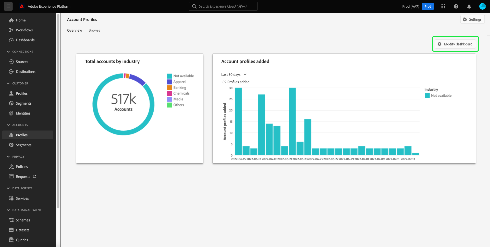

# [!UICONTROL Kontoprofile] Dashboard

Die Adobe Experience Platform-Benutzeroberfläche bietet ein Dashboard, über das Sie wichtige Informationen zu Ihren Kontoprofilen anzeigen können, die in einer täglichen Momentaufnahme erfasst werden. In diesem Handbuch wird beschrieben, wie Sie auf die [!UICONTROL Kontoprofile] Dashboard in der Benutzeroberfläche und bietet weitere Informationen zu den im Dashboard angezeigten Visualisierungen.

Einen Überblick über alle Funktionen in der Benutzeroberfläche des Kontoprofils erhalten Sie im [Benutzeroberflächenleitfaden für Kontoprofile](../../rtcdp/accounts/account-profile-ui-guide.md).

## Erste Schritte

Sie müssen [Adobe Real-time Customer Data Platform B2B Edition](../../rtcdp/b2b-overview.md) für den Zugang zum B2B [!UICONTROL Kontoprofile] Dashboard.

## Kontoprofildaten

Die [!UICONTROL Kontoprofile] Dashboard zeigt eine Momentaufnahme der einheitlichen Kontoinformationen aus den verschiedenen Quellen in Ihren Marketing-Kanälen und den verschiedenen Systemen an, die Ihr Unternehmen derzeit zum Speichern von Kundenkontoinformationen verwendet.

Die Profildaten im Schnappschuss zeigen die Daten exakt so an, wie sie zu dem Zeitpunkt angezeigt werden, zu dem der Schnappschuss erstellt wurde. Mit anderen Worten, der Schnappschuss ist keine Annäherung oder Stichprobe der Daten, und die [!UICONTROL Kontoprofile] Das Dashboard wird nicht in Echtzeit aktualisiert.

>[!NOTE]
>
>Änderungen oder Aktualisierungen, die seit der Aufnahme der Momentaufnahme an den Daten vorgenommen wurden, werden erst dann im Dashboard angezeigt, wenn die nächste Momentaufnahme erstellt wird.

## Die [!UICONTROL Kontoprofile] Dashboard

So navigieren Sie zum [!UICONTROL Kontoprofile] Dashboard in der Platform-Benutzeroberfläche auswählen **[!UICONTROL Profile]** under [!UICONTROL Konten] im linken Navigationsbereich.

Aus dem [!UICONTROL Kontoprofile] Dashboard können Sie [die in Ihrer Organisation erfassten Kontoprofile durchsuchen](#browse-account-profiles)oder [Anzeigen aller Kontoprofildaten mit Widgets auf einen Blick](#standard-widgets) , die Aspekte der Daten visualisieren.

## Durchsuchen von Account-Profilen {#browse-account-profiles}

Die [!UICONTROL Durchsuchen] -Tab können Sie die in Ihrem Unternehmen erfassten schreibgeschützten Kontoprofile mithilfe einer Konto-ID aus einer verbundenen Unternehmensquelle suchen und anzeigen oder Quelldetails direkt eingeben. Von hier aus können Sie wichtige Informationen aus dem Kontoprofil sehen, einschließlich Name, Branche, Umsatz und Zielgruppe.

Wählen Sie die [!UICONTROL Profil-ID] aus den Ergebnissen, die auf der [!UICONTROL Durchsuchen] Registerkarte zum Öffnen der [!UICONTROL Details] für das Kontoprofil.

Die Kontoprofilinformationen werden auf der Seite [!UICONTROL Details] wurde aus mehreren Profilfragmenten zusammengeführt, um eine Ansicht des einzelnen Kontos zu bilden. Siehe die Dokumentation unter [Durchsuchen von Kontoprofilen in Adobe Real-time Customer Data Platform](../../rtcdp/accounts/account-profile-ui-guide.md#browse-account-profiles) , um mehr über die Anzeigefunktionen von Kontoprofilen in der Platform-Benutzeroberfläche zu erfahren.

## Die [!UICONTROL Kontoprofile] [!UICONTROL Übersicht] {#overview}

Die [!UICONTROL Übersicht] -Registerkarte besteht aus Widgets, die schreibgeschützte Metriken bereitstellen, um wichtige Informationen zu Ihren Kontoprofilen zu vermitteln. Auswählen **[!UICONTROL Dashboard ändern]** , um das Erscheinungsbild der [!UICONTROL Übersicht] durch Verschieben und Ändern der Größe von Widgets.

Weitere Informationen finden Sie im Dokument unter [Ändern von Dashboards](../customize/modify.md) und [Übersicht über die Widget-Bibliothek](../customize/widget-library.md) , um mehr zu erfahren.

## Standard-Widgets {#standard-widgets}

Adobe stellt standardmäßige Widgets bereit, mit denen Sie verschiedene Metriken im Zusammenhang mit Ihren Kontoprofilen visualisieren können.

Um mehr über die einzelnen verfügbaren Standard-Widgets zu erfahren, wählen Sie den Namen eines Widgets aus der folgenden Liste aus:

* [ für die Gesamtanzahl der Konten nach Branchen](#total-accounts-by-industry)
* [Kontoprofile hinzugefügt](#account-profiles-added)
* [Prädiktive Scoring-Verteilung](#predictive-scoring-distribution)
* [Einflussfaktoren für prädiktive Scoring](#predictive-scoring-top-influential-factors)

###  für die Gesamtanzahl der Konten nach Branchen {#total-accounts-by-industry}

Dieses Widget zeigt die Gesamtanzahl der Konten in einer einzelnen Metrik und verwendet ein Ringdiagramm, um die proportionalen Anteile für die Branchen zu veranschaulichen, aus denen sich die Gesamtanzahl zusammensetzt. Der Schlüssel bietet Informationen zur Farbcodierung für die verschiedenen Branchen, aus denen das Ringdiagramm besteht.

Einzelne Zahlen für die verschiedenen Branchen werden in einem Dialogfeld angezeigt, wenn der Cursor den Mauszeiger über den entsprechenden Abschnitt des Ringdiagramms bewegt.

### Kontoprofile hinzugefügt {#account-profiles-added}

Dieses Widget verwendet ein farbkodiertes Balkendiagramm, um die Anzahl der Profile, die einem Konto über einen bestimmten Zeitraum hinzugefügt wurden, und den Anteil der verschiedenen Branchen, aus denen diese hinzugefügten Profile bestehen, zu veranschaulichen. Die Branchen sind farbcodiert, und ein Schlüssel liefert Informationen zur Farbcodierung für die verschiedenen Branchen, aus denen das Balkendiagramm besteht. Der Analysezeitraum wird aus dem Widget-Dropdown-Menü ausgewählt. Das Balkendiagramm kann über einen Zeitraum von 30 Tagen, 90 Tagen und 12 Monaten visualisiert werden.

>[!NOTE]
>
>Da Profile nur zu einem Konto hinzugefügt und nie entfernt werden, ist die niedrigstmögliche Anzahl von Profilen, die über einen Zeitraum hinzugefügt werden, null.

### Prädiktive Scoring-Verteilung {#predictive-scoring-distribution}

Die [!UICONTROL Prädiktive Scoring-Verteilung] -Widget zeigt die Verteilung der Bewertungen aller Kontoprofile an, damit Sie den Zustand Ihrer Verkaufspipelines auf einen Blick verstehen können. Die Scoring-Daten werden über ein Ringdiagramm und ein Spaltendiagramm übermittelt.

Die Ringdiagramm veranschaulicht den Anteil Ihrer gesamten Kontoprofile an den einzelnen Bereichen mit der hohen, mittleren und niedrigen Kaufneigung. Der Schlüssel enthält weitere Details zu den farbcodierten Abschnitten, einschließlich der Scoring-Bucket-Bereiche und der Anzahl der Kontoprofile in diesem Bereich.

Das Spaltendiagramm bietet eine detailliertere Scoring-Aufschlüsselung. Jede Spalte zeigt die Anzahl der Kontoprofile in jedem der 20 in 5-Punkt-Schritten zusammengefassten Behälter an.

Über das Dropdown-Menü im Widget können Sie das Konto-Scoring-Modell auswählen.

### Einflussfaktoren für prädiktive Scoring {#predictive-scoring-top-influential-factors}

Die [!UICONTROL Einflussfaktoren für prädiktive Scoring] -Widget hilft Ihnen, die wichtigsten Faktoren zu verstehen, die die Ergebnisse für jeden Tendenzbehälter steuern.

Dieses Widget zeigt die wichtigsten Einflussfaktoren für die einzelnen Bereiche mit hoher, mittlerer und niedriger Tendenz. Ein Balken für jeden Einflussfaktor gibt den Prozentsatz der Kontoprofile in diesem Tendenzbehälter an, der den spezifischen Einflussfaktor enthält.

Über das Dropdown-Menü im Widget können Sie das Konto-Scoring-Modell auswählen.

## Nächste Schritte

In diesem Dokument sollten Sie jetzt wissen, wie Sie die [!UICONTROL Kontoprofile] Dashboard. Sie sollten auch die Metriken verstehen, die in den verfügbaren Widgets angezeigt werden. Weiterführende Informationen zum Arbeiten mit Kontoprofilen als Teil Ihrer B2B-Daten in der Experience Platform-Benutzeroberfläche finden Sie im Abschnitt [Übersicht über Kontoprofile](../../rtcdp/accounts/account-profile-overview.md) für Adobe Real-Time CDP, B2B Edition.
