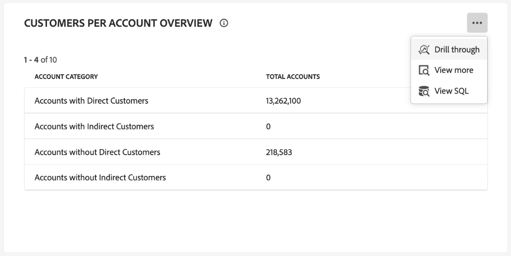
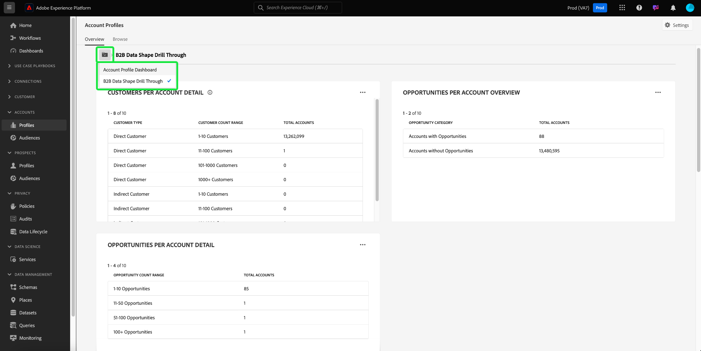
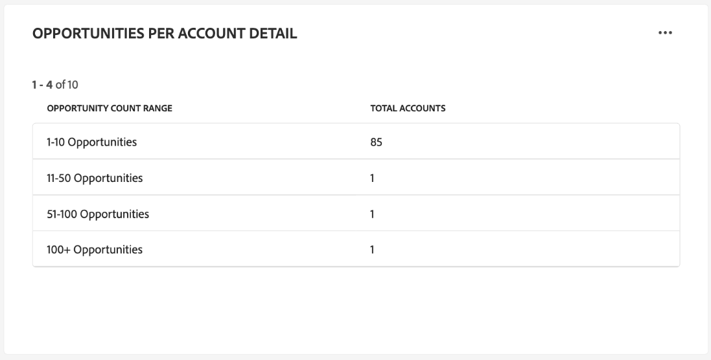

# Dashboard für Kontoprofile

Die Benutzeroberfläche von Adobe Experience Platform verfügt über ein Dashboard, über das Sie wichtige Informationen zu Ihren Kontoprofilen anzeigen können. Diese Informationen werden bei einem täglichen Schnappschuss erfasst. In diesem Handbuch wird beschrieben, wie Sie das Dashboard [!UICONTROL Kontoprofile] in der Benutzeroberfläche aufrufen und verwenden können. Außerdem erhalten Sie weitere Informationen zu den im Dashboard angezeigten Visualisierungen.

Dieses Dokument bietet einen Überblick über die Funktionen im Dashboard [!UICONTROL Kontoprofile] und beschreibt die verfügbaren standardmäßigen Einblicke. Ausführliche Informationen zu [[!UICONTROL  verfügbaren Funktionen finden Sie ] Handbuch ](../../rtcdp/accounts/account-profile-ui-guide.md)Kontoprofile) zur Benutzeroberfläche .

## Erste Schritte

Sie müssen über eine Berechtigung für [Adobe Real-Time Customer Data Platform B2B edition](../../rtcdp/b2b-overview.md) verfügen, um auf das B2B-Dashboard [!UICONTROL Kontoprofile] zugreifen zu können.

## Kontoprofildaten {#data}

Das Dashboard [!UICONTROL Kontoprofile] zeigt einen Schnappschuss Ihrer einheitlichen Kontoinformationen an. Diese Kontoinformationen stammen aus verschiedenen Quellen in Ihren Marketing-Kanälen und den verschiedenen Systemen, die Ihr Unternehmen derzeit zum Speichern von Kundenkontoinformationen verwendet.

Die Profildaten in der Momentaufnahme zeigen die Daten exakt so an, wie sie zum Zeitpunkt der Momentaufnahme aufgetreten sind. Das heißt, der Schnappschuss ist keine Annäherung oder Stichprobe der Daten und das Dashboard [!UICONTROL Kontoprofile] wird nicht in Echtzeit aktualisiert.

>[!NOTE]
>
>Änderungen oder Aktualisierungen, die seit der Aufnahme der Momentaufnahme an den Daten vorgenommen wurden, werden erst dann im Dashboard angezeigt, wenn die nächste Momentaufnahme erstellt wird.

## Erkunden des Dashboards [!UICONTROL Kontoprofile] {#explore}

Um zum Dashboard [!UICONTROL Kontoprofile] in der Experience Platform-Benutzeroberfläche zu navigieren, wählen Sie **[!UICONTROL Profile]** unter [!UICONTROL Konten] im linken Navigationsbereich aus.

Im Dashboard [!UICONTROL Kontoprofile] können Sie entweder [die in Ihre Organisation aufgenommenen Kontoprofile durchsuchen](#browse-account-profiles) oder [die gesamten Kontoprofildaten mithilfe von Widgets auf einen Blick anzeigen](#standard-widgets).

### Datumsfilter {#date-filter}

Die [!UICONTROL Übersicht] besteht aus Widgets, die schreibgeschützte Metriken bereitstellen, um wichtige Informationen zu Ihren Kontoprofilen zu übermitteln. Wählen Sie das Kalendersymbol oder die Datumsangaben aus, um den globalen Datumsfilter für Ihre Widgets zu ändern.

>[!IMPORTANT]
>
>Der Datumsbereich, den Sie im Dropdown-Kalender auswählen, wirkt sich auf alle Insights aus, mit Ausnahme der beiden Widgets für die Prognosebewertung [Verteilung](#predictive-scoring-distribution) und [wichtigste Einflussfaktoren](#predictive-scoring-top-influential-factors).

### Konfigurieren des Lead-Konto-Abgleichs-Service {#lead-to-account-matching-service}

Wählen Sie **[!UICONTROL Einstellungen]** aus, um den Service Lead-Konto-Zuordnung im Dialogfeld [!UICONTROL Kontoeinstellungen] zu konfigurieren. Ausführliche Informationen zum Konfigurieren der Lead-Konto-Zuordnung finden Sie im [UI-Handbuch](../../rtcdp/accounts/account-profile-ui-guide.md#configure-lead-to-account-matching). Weitere Informationen zur Lead-Konto-Zuordnung finden Sie unter [Lead-Konto-Zuordnung in der Real-Time CDP B2B-Dokumentation](../../rtcdp/b2b-ai-ml-services/lead-to-account-matching.md).

## Durchsuchen von Account-Profilen {#browse-account-profiles}

Auf der Registerkarte [!UICONTROL Durchsuchen] können Sie die schreibgeschützten Kontoprofile durchsuchen und anzeigen, die in Ihre Organisation aufgenommen wurden. Verwenden Sie eine Konto-ID aus einer verbundenen Unternehmensquelle oder geben Sie Quelldetails direkt ein. In diesem Arbeitsbereich können Sie wichtige Informationen zum Kontoprofil anzeigen, darunter Name, Branche, Umsatz und Zielgruppe.

Wählen Sie [!UICONTROL Profil-ID] aus den Ergebnissen auf der Registerkarte [!UICONTROL Durchsuchen] aus, um die Registerkarte [!UICONTROL Details] für das Kontoprofil zu öffnen.

Die auf der Registerkarte [!UICONTROL Details] angezeigten Kontoprofilinformationen wurden aus mehreren Profilfragmenten zusammengeführt, um eine einzige Ansicht des jeweiligen Kontos zu erstellen. Weitere Informationen zu den Funktionen [ Kontoprofilanzeige in der Experience Platform-Benutzeroberfläche finden ](../../rtcdp/accounts/account-profile-ui-guide.md#browse-account-profiles) in der Dokumentation unter „Durchsuchen von Kontoprofilen in Adobe Real-Time Customer Data Platform&quot;.

## Standard-Widgets {#standard-widgets}

>[!CONTEXTUALHELP]
>id="platform_dashboards_accountprofiles_customersperaccountoverview"
>title="Überblick über Kundinnen und Kunden pro Konto"
>abstract="Dieses Drillthrough-Widget bietet Einblicke in die Struktur Ihrer B2B-Daten. Sie können damit feststellen, wie viele Kontoprofile mit keinem, einem oder mehreren Kundenprofilen verknüpft sind.<ul><li>Direkte Kundschaft: Profile von Kundinnen und Kunden, die über die `personComponents`-Route direkt mit einem Konto verknüpft sind.</li><li>Indirekte Kundschaft: Profile von Kundinnen und Kunden, die über die `Account-Person`-Route mit einem Konto verknüpft sind.</li></ul>"

Adobe bietet Standard-Widgets, mit denen Sie verschiedene Metriken im Zusammenhang mit Ihren Kontoprofilen visualisieren können.

>[!IMPORTANT]
>
>Wenn Sie keinen Datumsfilter angeben, analysiert das Standardverhalten von Insights die Daten, die vom Vorjahr bis heute hinzugefügt wurden.

Um mehr über die einzelnen verfügbaren Standard-Widgets zu erfahren, wählen Sie den Namen eines Widgets aus der folgenden Liste aus:

* [Hinzugefügte Kontoprofile](#account-profiles-added)
* [Überblick über Kundinnen und Kunden pro Konto](#customers-per-account-overview)
   * [Vertriebschancen pro Konto - Übersicht](#opportunities-per-account-overview)
   * [Vertriebschancen nach Kontodetails](#opportunities-per-account-detail)
   * [Kunden pro Kontodetails](#customers-per-account-detail)
* [Neue Konten nach Branche](#accounts-by-industry)
* [Neue Konten nach Typ](#accounts-by-type)
* [Neue Opportunitys nach Personenrolle](#opportunities-by-person-role)
* [Neue Chancen nach Umsatz](#opportunities-by-revenue)
* [Neue Opportunities nach Status und Phase](#opportunities-by-status-&-stage)
* [Neue gewonnene Gelegenheiten](#opportunities-won)
* [Hinzugefügte Opportunities](#opportunities-added)
* [Verteilung der prädiktiven Bewertung](#predictive-scoring-distribution)
* [Prädiktive Bewertung - wichtigste Einflussfaktoren](#predictive-scoring-top-influential-factors)

### Hinzugefügte Kontoprofile {#account-profiles-added}

Das [!UICONTROL Account-Profile hinzugefügt] verwendet ein Liniendiagramm, um die Anzahl der Account-Profile anzuzeigen, die jeden Tag über einen bestimmten Zeitraum hinzugefügt wurden. Verwenden Sie den globalen Datumsfilter oben in Ihrem Dashboard, um den Analysezeitraum zu bestimmen. Wenn kein Datumsfilter angegeben ist, listet das Standardverhalten die Kontoprofile auf, die für das Jahr vor dem heutigen Tag hinzugefügt wurden. Die Ergebnisse können verwendet werden, um einen Trend in der Anzahl der hinzugefügten Kontoprofile abzuleiten.

### Überblick über Kundinnen und Kunden pro Konto {#customers-per-account-overview}

>[!NOTE]
>
>Die [!UICONTROL Kunden pro Konto - Übersicht] insight und seine Drill-Through-Diagramme ([!UICONTROL Kunden pro Kontodetails], [!UICONTROL Vertriebschancen pro Konto - Übersicht], [!UICONTROL Vertriebschancen pro Kontodetail]) sind von keinen globalen Datumsfiltern betroffen, die Sie möglicherweise festgelegt haben.

Das Diagramm [!UICONTROL Kunden pro Konto - Übersicht] bietet eine Zusammenfassung der Konten basierend auf ihren Kundentypen. Es wird eine vierzeilige Tabelle angezeigt, die Konten als mit direkten oder indirekten Kunden oder als Konten ohne Kunden kategorisiert. Sie enthält die Gesamtzahl der Konten für jede Kategorie. Das Diagramm hilft bei der Identifizierung der Verteilung von Konten, die direkte und indirekte Kunden haben.

Direktkunden sind Kundenprofile, die über die `personComponents` Route direkt mit einem Konto verknüpft sind. Diese Beziehung ist einfacher und beinhaltet eine direkte, explizite Verbindung zwischen dem Kunden und dem Konto.

Indirekte Kunden sind Kundenprofile, die über die `Account-Person` Route mit einem Konto verknüpft sind. Diese Beziehung ist weniger einfach und beinhaltet eine Zwischenentität oder eine komplexere Verbindung zwischen dem Kunden und dem Konto, in der Regel über andere Konten oder Beziehungen.

Um auf detailliertere Einblicke zuzugreifen, wählen Sie die Ellipse (**…**) im Diagramm [!UICONTROL Kunden pro Konto - Übersicht] und wählen Sie **[!UICONTROL Drill-Through]** aus dem Dropdown-Menü aus.

Die Drill-Through-Ansicht wird angezeigt. Als Nächstes sehen Sie sich die verfügbaren Drill-Through-Diagramme an, um ein tieferes Verständnis der Struktur Ihrer B2B-Daten zu erhalten. Anhand dieser Drill-Through-Diagramme können Sie ermitteln, mit wie vielen Account-Profilen keine Kundenprofile verknüpft sind oder mit welchen ein oder mehrere Kundenprofile verknüpft sind. Sie können damit auch ermitteln, wie viele direkte oder indirekte Kunden mit Ihren Konten verknüpft sind.

* [[!UICONTROL Kunden pro Kontodetails]](#customers-per-account-detail)
* [[!UICONTROL Konten pro Opportunity - Übersicht]](#accounts-per-opportunity-overview)
* [[!UICONTROL Vertriebschancen nach Kontodetails]](#accounts-per-opportunity-detail)

### [!UICONTROL Navigieren zwischen Dashboard-Ansichten] {#dashboard-view-navigation}

Um zwischen dem Drill-Through und dem Kontoprofil-Dashboard zu wechseln, wählen Sie das Ordnersymbol (), gefolgt von der richtigen Ansicht aus dem Dropdown-Menü.

Weitere Informationen zu Drill-Throughs in der Experience Platform-Benutzeroberfläche finden Sie unter [Drill-Through-Handbuch](../sql-insights-query-pro-mode/drill-through.md).

#### [!UICONTROL Kunden pro Kontodetails] {#customers-per-account-detail}

Das Diagramm [!UICONTROL Kunden pro ]) bietet detailliertere Details zur Anzahl der Konten, die mit verschiedenen Kundentypen verknüpft sind. Es wird eine dreispaltige Tabelle angezeigt, in der die Anzahl der Konten nach Kundentyp (direkt oder indirekt) und dem damit verbundenen Kundenbereich aufgeführt ist. Dieses Diagramm hilft Ihnen zu verstehen, wie die Kunden auf verschiedene Kundenkategorien verteilt sind und wie viele Konten insgesamt mit den einzelnen Kunden verbunden sind.

#### [!UICONTROL Vertriebschancen pro Konto - Übersicht] {#opportunities-per-account-overview}

Das [!UICONTROL Vertriebschancen pro Konto - Übersicht] stellt eine Zusammenfassung der Konten dar, die entweder Vertriebschancen haben oder nicht. Diese zweizeilige Tabelle hilft Ihnen, schnell die Anzahl der Konten zu ermitteln, die mit Opportunities verbunden sind, und bietet eine Momentaufnahme der Opportunity-Interaktion über alle Konten hinweg.

#### [!UICONTROL Vertriebschancen nach Kontodetails] {#opportunities-per-account-detail}

Das Diagramm [!UICONTROL Vertriebschancen pro ]) bietet eine detailliertere Aufschlüsselung der Konten auf der Grundlage der Anzahl der Vertriebschancen, die sie haben. Die Tabelle zeigt die Anzahl der Konten gruppiert nach Opportunity-Zählbereichen an, wie z. B. 1-10 Opportunitys oder 100+ Opportunitys. Dieses Diagramm hilft Ihnen dabei, zu erkennen, wie Konten nach der Anzahl der von ihnen verwalteten Opportunitys verteilt sind.

### Neue Konten nach Branche {#accounts-by-industry}

Das [!UICONTROL Neue Konten nach Branche] Widget zeigt die Gesamtzahl der Konten in einer einzelnen Metrik in einem Ringdiagramm an. Das Ringdiagramm veranschaulicht die relative Zusammensetzung der verschiedenen Branchen, aus denen diese Summe besteht. Ein farbcodierter Schlüssel bietet eine Aufschlüsselung aller eingeschlossenen Branchen. Die einzelnen Zählungen für jede Branche werden in einem Dialogfeld angezeigt, wenn der Cursor über den entsprechenden Abschnitt des Ringdiagramms bewegt wird.

### Neue Konten nach Typ {#accounts-by-type}

Das [!UICONTROL Neue Konten nach Typ] Widget zeigt die Gesamtzahl der Konten in einer einzelnen Metrik in einem Ringdiagramm an. Das Ringdiagramm veranschaulicht die relative Zusammensetzung verschiedener Kontotypen, aus denen diese Summe besteht. Ein farbcodierter Schlüssel bietet eine Aufschlüsselung aller enthaltenen Kontotypen. Die einzelnen Zählungen für jeden Kontotyp werden in einem Dialogfeld angezeigt, wenn der Cursor über den entsprechenden Abschnitt des Ringdiagramms bewegt wird.

### Neue Opportunitys nach Personenrolle {#opportunities-by-person-role}

Das Widget [!UICONTROL Neue Opportunitys nach ]) zeigt die Gesamtzahl Ihrer Opportunitys in einer einzigen Metrik in einem Ringdiagramm an. Das Ringdiagramm veranschaulicht die relative Zusammensetzung der Rollen, aus denen diese Gesamtzahl von Opportunitys besteht. Ein farbcodierter Schlüssel bietet eine Aufschlüsselung aller enthaltenen Rollen. Die einzelnen Zählungen für jede Rolle werden in einem Dialogfeld angezeigt, wenn der Cursor über den entsprechenden Abschnitt des Ringdiagramms bewegt wird.

>[!NOTE]
>
>Der Fehler [!UICONTROL Keine Daten gefunden] oder [!UICONTROL Laden nicht möglich] wird verursacht, wenn die Brückentabelle „Opportunity-Person“ nicht in Ihrem Schema verwendet wird. Wenn Ihre insight einen dieser Fehler anzeigt, überprüfen Sie Ihr Vereinigungsschema und stellen Sie sicher, dass die Feldergruppe „Opportunity-Person“ Daten aufnimmt.

### Neue Chancen nach Umsatz {#opportunities-by-revenue}

Das [!UICONTROL Neue Opportunitys nach Umsatz] Widget verwendet ein Balkendiagramm, um die geschätzte Gesamteinnahmemenge zu veranschaulichen, die durch Ihre Opportunitys generiert wird. Das Widget unterstützt bis zu sechs Opportunities.

Um ein Dialogfeld anzuzeigen, das den spezifischen Umsatz für eine Opportunity enthält, bewegen Sie den Mauszeiger über die einzelnen Balken.

### Neue Opportunities nach Status und {#opportunities-by-status-&-stage}

Dieses Widget verwendet ein Balkendiagramm, um die Anzahl der Vertriebschancen zu veranschaulichen, die entweder in allen Phasen des Marketing-/Verkaufstrichters offen oder geschlossen sind. Das Widget verwendet Farben, um die Phase der Opportunities zu unterscheiden. Ein farbcodierter Schlüssel zeigt die verfügbaren Phasen für Opportunitys an.

### Neue gewonnene Gelegenheiten {#opportunities-won}

Das Widget [!UICONTROL Neue gewonnene Opportunitys] zeigt die Gesamtzahl Ihrer Opportunitys an, die in einem Ringdiagramm in einer einzigen Metrik erfolgreich abgeschlossen wurden. Das Ringdiagramm veranschaulicht die relative Zusammensetzung von Opportunitys, die entweder gewonnen oder nicht gewonnen werden. Ein farbcodierter Schlüssel unterscheidet zwischen gewonnenen und nicht gewonnenen Opportunities. Die einzelnen Zählungen für jede Rolle werden in einem Dialogfeld angezeigt, wenn der Cursor über den entsprechenden Abschnitt des Ringdiagramms bewegt wird.

### Hinzugefügte Opportunities {#opportunities-added}

Das [!UICONTROL Opportunitys hinzugefügt] verwendet ein Liniendiagramm, um die Anzahl der Opportunitys anzuzeigen, die jeden Tag über einen bestimmten Zeitraum hinzugefügt werden. Verwenden Sie den globalen Datumsfilter oben in Ihrem Dashboard, um den Analysezeitraum zu bestimmen. Wenn kein Datumsfilter angegeben ist, listet das Standardverhalten die Opportunitys auf, die für das Jahr vor dem heutigen Tag hinzugefügt wurden. Die Ergebnisse können verwendet werden, um einen Trend in der Anzahl der hinzugefügten Opportunitys abzuleiten.

<!-- Link to date filter documentation from Annamalai -->

### Verteilung der prädiktiven Bewertung {#predictive-scoring-distribution}

Das Widget [!UICONTROL Predictive Scoring] zeigt die Score-Verteilung aller Kontoprofile an, damit Sie den Zustand Ihrer Vertriebs-Pipeline auf einen Blick verstehen können. Die Bewertungsdaten werden durch ein Ringdiagramm und ein Säulendiagramm übertragen.

Das Ringdiagramm zeigt den Anteil Ihrer gesamten Account-Profile in jedem der Buckets mit hoher, mittlerer und geringer Kauftendenz. Der Schlüssel bietet weitere Details zu den farbcodierten Abschnitten, einschließlich der Scoring-Bucket-Bereiche und der Anzahl der Account-Profile in diesem Bereich.

Das Säulendiagramm bietet eine detailliertere Aufschlüsselung der Bewertung. Jede Spalte zeigt die Anzahl der Account-Profile in jedem der 20 Buckets mit fünf Punkten.

Das Dropdown-Menü innerhalb des Widgets ermöglicht die Auswahl des Kontobewertungsmodells.

>[!NOTE]
>
>Filter für globale Datumsbereiche gelten nicht für Insights bei der prädiktiven Bewertung. Die Widgets für die prädiktive Bewertung analysieren Daten basierend auf dem im Dropdown-Menü ausgewählten Konto-Scoring-Modell.

### Prädiktive Bewertung - wichtigste Einflussfaktoren {#predictive-scoring-top-influential-factors}

Das [!UICONTROL Widget Prädiktive Bewertung - ] Einflussfaktoren) hilft Ihnen, die wichtigsten Faktoren zu verstehen, die die Bewertungen für jeden Neigungs-Bucket antreiben.

Dieses Widget zeigt die wichtigsten Einflussfaktoren für die Buckets mit hoher, mittlerer und niedriger Neigung an. Ein Balken für jeden Einflussfaktor gibt den Prozentsatz der Kontoprofile in dem Neigungs-Bucket an, der den spezifischen Einflussfaktor enthält.

Das Dropdown-Menü innerhalb des Widgets ermöglicht die Auswahl des Kontobewertungsmodells.

>[!NOTE]
>
>Filter für globale Datumsbereiche gelten nicht für Insights bei der prädiktiven Bewertung. Die Widgets für die prädiktive Bewertung analysieren Daten basierend auf dem im Dropdown-Menü ausgewählten Konto-Scoring-Modell.

## Fehler beim Laden der Daten {#errors}

Wenn ein Widget angezeigt wird *[!UICONTROL kann nicht geladen werden. Erneut versuchen.]* liegt daran, dass keine Daten für die B2B-Entität verfügbar sind. Beispielsweise zeigt das unten angezeigte Widget [!UICONTROL Neue Opportunities nach Personengruppe] die Meldung &quot;[!UICONTROL  kann nicht geladen werden. Erneut versuchen.]&quot;, da diese Sandbox keine Opportunity-Daten hat.

Um das Problem zu beheben, müssen Sie B2B-Entitätsdaten, z. B *Opportunity-*, in die Sandbox aufnehmen. Nach 48 Stunden werden die Daten in den Widgets angezeigt.

## Nächste Schritte

Wenn Sie dieses Dokument gelesen haben, sollten Sie jetzt wissen, wie Sie das Dashboard [!UICONTROL Kontoprofile] finden und auch die in den verfügbaren Widgets angezeigten Metriken verstehen. Weitere Informationen zum Arbeiten mit Account-Profilen als Teil Ihrer B2B-Daten in der Experience Platform-Benutzeroberfläche finden Sie in der Übersicht [ Account-Profile ](../../rtcdp/accounts/account-profile-overview.md) Adobe Real-Time CDP, B2B edition.
