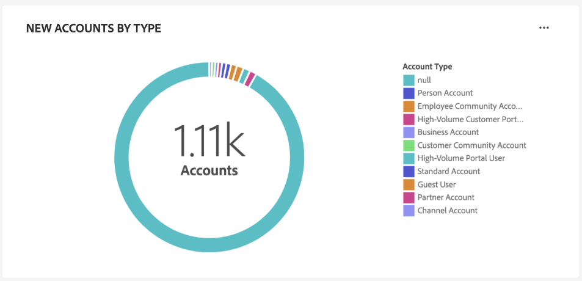

# [!UICONTROL Kontoprofile] Dashboard

Die Adobe Experience Platform-Benutzeroberfläche bietet ein Dashboard, über das Sie wichtige Informationen zu Ihren Kontoprofilen anzeigen können, die in einer täglichen Momentaufnahme erfasst werden. In diesem Handbuch wird beschrieben, wie Sie auf die [!UICONTROL Kontoprofile] Dashboard in der Benutzeroberfläche und bietet weitere Informationen zu den im Dashboard angezeigten Visualisierungen.

Dieses Dokument bietet einen Überblick über die Funktionen der [!UICONTROL Kontoprofile] Dashboard und beschreibt die verfügbaren standardmäßigen Einblicke. Siehe [[!UICONTROL Kontoprofile] UI-Handbuch](../../rtcdp/accounts/account-profile-ui-guide.md) für ausführliche Informationen zu den verfügbaren Funktionen.

## Erste Schritte

Sie müssen [Adobe Real-time Customer Data Platform B2B Edition](../../rtcdp/b2b-overview.md) auf B2B zugreifen [!UICONTROL Kontoprofile] Dashboard.

## Kontoprofildaten {#data}

Die [!UICONTROL Kontoprofile] Dashboard zeigt eine Momentaufnahme Ihrer einheitlichen Kontoinformationen an. Diese Kontoinformationen stammen aus verschiedenen Quellen in Ihren Marketing-Kanälen und den verschiedenen Systemen, die Ihr Unternehmen derzeit zum Speichern von Kundenkontoinformationen verwendet.

Die Profildaten im Schnappschuss zeigen die Daten exakt so an, wie sie zu dem Zeitpunkt angezeigt werden, zu dem der Schnappschuss erstellt wurde. Mit anderen Worten, der Schnappschuss ist keine Annäherung oder Stichprobe der Daten, und die [!UICONTROL Kontoprofile] Das Dashboard wird nicht in Echtzeit aktualisiert.

>[!NOTE]
>
>Änderungen oder Aktualisierungen, die seit der Aufnahme der Momentaufnahme an den Daten vorgenommen wurden, werden erst dann im Dashboard angezeigt, wenn die nächste Momentaufnahme erstellt wird.

## Die [!UICONTROL Kontoprofile] Dashboard {#explore}

So navigieren Sie zum [!UICONTROL Kontoprofile] Dashboard in der Platform-Benutzeroberfläche auswählen **[!UICONTROL Profile]** under [!UICONTROL Konten] im linken Navigationsbereich.

Aus dem [!UICONTROL Kontoprofile] Dashboard, können Sie [die in Ihrer Organisation erfassten Kontoprofile durchsuchen](#browse-account-profiles)oder [Anzeigen aller Kontoprofildaten mit Widgets auf einen Blick](#standard-widgets).

### Datumsfilter {#date-filter}

Die [!UICONTROL Übersicht] -Registerkarte besteht aus Widgets, die schreibgeschützte Metriken bereitstellen, um wichtige Informationen zu Ihren Kontoprofilen zu vermitteln. Wählen Sie das Kalendersymbol oder die Daten aus, um den globalen Datumsfilter für Ihre Widgets zu ändern.

>[!IMPORTANT]
>
>Der Datumsbereich, den Sie im Dropdown-Kalender auswählen, wirkt sich auf alle Einblicke mit Ausnahme der beiden prädiktiven Scoring-Widgets ([distribution](#predictive-scoring-distribution) und [Top-Einflussfaktoren](#predictive-scoring-top-influential-factors)).

### Konfigurieren des Leads zum Kontoabgleichdienst {#lead-to-account-matching-service}

Auswählen **[!UICONTROL Einstellungen]** , um den Lead-to-Account-Matching-Service von der [!UICONTROL Kontoeinstellungen] angezeigt. Ausführliche Informationen zum Konfigurieren Ihres Leads für die Kontozuordnung finden Sie im Abschnitt [UI-Handbuch](../../rtcdp/accounts/account-profile-ui-guide.md#configure-lead-to-account-matching). Weiterführende Informationen zur Kontozuordnung finden Sie im Abschnitt [zu Kontoübereinstimmung in der Real-Time CDP B2B-Dokumentation führen](../../rtcdp/b2b-ai-ml-services/lead-to-account-matching.md).

## Durchsuchen von Account-Profilen {#browse-account-profiles}

Aus dem [!UICONTROL Durchsuchen] -Registerkarte können Sie die in Ihrem Unternehmen erfassten schreibgeschützten Kontoprofile durchsuchen und anzeigen. Verwenden Sie eine Konto-ID aus einer verbundenen Unternehmensquelle oder geben Sie Quelldetails direkt ein. In diesem Arbeitsbereich können Sie wichtige Informationen aus dem Kontoprofil sehen, einschließlich Name, Branche, Umsatz und Zielgruppe.

Wählen Sie die [!UICONTROL Profil-ID] aus den Ergebnissen, die auf der [!UICONTROL Durchsuchen] Registerkarte zum Öffnen der [!UICONTROL Details] für das Kontoprofil.

Die Kontoprofilinformationen werden auf der Seite [!UICONTROL Details] wurde aus mehreren Profilfragmenten zusammengeführt, um eine Ansicht des einzelnen Kontos zu bilden. Siehe die Dokumentation unter [Durchsuchen von Kontoprofilen in Adobe Real-time Customer Data Platform](../../rtcdp/accounts/account-profile-ui-guide.md#browse-account-profiles) , um mehr über die Anzeigefunktionen von Kontoprofilen in der Platform-Benutzeroberfläche zu erfahren.

## Standard-Widgets {#standard-widgets}

Adobe stellt standardmäßige Widgets bereit, mit denen Sie verschiedene Metriken im Zusammenhang mit Ihren Kontoprofilen visualisieren können.

>[!IMPORTANT]
>
>Wenn Sie keinen Datumsfilter bereitstellen, analysiert das Standardverhalten von Insights Daten, die aus dem Vorjahr bis heute hinzugefügt wurden.

Um mehr über die einzelnen verfügbaren Standard-Widgets zu erfahren, wählen Sie den Namen eines Widgets aus der folgenden Liste aus:

* [Hinzugefügte Kontoprofile](#account-profiles-added)
* [Neue Abschlüsse nach Wirtschaftszweigen](#accounts-by-industry)
* [Neue Konten nach Typ](#accounts-by-type)
* [Neue Möglichkeiten für die Rolle der Person](#opportunities-by-person-role)
* [Neue Einnahmenmöglichkeiten](#opportunities-by-revenue)
* [Neue Möglichkeiten nach Status und Phase](#opportunities-by-status-&-stage)
* [Neue Chancen gewonnen](#opportunities-won)
* [Hinzugefügte Opportunities](#opportunities-added)
* [Verteilung der prädiktiven Bewertung](#predictive-scoring-distribution)
* [Prädiktive Bewertung - wichtigste Einflussfaktoren](#predictive-scoring-top-influential-factors)

### Hinzugefügte Kontoprofile {#account-profiles-added}

Die [!UICONTROL Kontoprofile hinzugefügt] Widget verwendet ein Liniendiagramm, um die Anzahl der Kontoprofile anzuzeigen, die jeden Tag über einen bestimmten Zeitraum hinzugefügt werden. Verwenden Sie den globalen Datumsfilter oben im Dashboard, um den Analysezeitraum zu bestimmen. Wenn kein Datumsfilter angegeben wird, werden im Standardverhalten die Kontoprofile aufgelistet, die für das Jahr vor dem aktuellen Datum hinzugefügt wurden. Die Ergebnisse können verwendet werden, um einen Trend bei der Anzahl der hinzugefügten Kontoprofile zu erkennen.

### Neue Abschlüsse nach Wirtschaftszweigen {#accounts-by-industry}

Die [!UICONTROL Neue Abschlüsse nach Wirtschaftszweigen] -Widget zeigt die Gesamtanzahl der Konten in einer einzelnen Metrik innerhalb eines Ringdiagramms an. Das Ringdiagramm zeigt die relative Zusammensetzung der verschiedenen Branchen, aus denen diese Summe besteht. Ein farbkodierter Schlüssel bietet eine Aufschlüsselung aller eingeschlossenen Branchen. Einzelne Zahlen für jede Branche werden in einem Dialogfeld angezeigt, wenn der Cursor den Mauszeiger über den entsprechenden Abschnitt des Ringdiagramms bewegt.

### Neue Konten nach Typ {#accounts-by-type}

Die [!UICONTROL Neue Konten nach Typ] -Widget zeigt die Gesamtanzahl der Konten in einer einzelnen Metrik innerhalb eines Ringdiagramms an. Das Ringdiagramm zeigt die relative Zusammensetzung der verschiedenen Kontotypen, aus denen diese Summe besteht. Ein farbcodierter Schlüssel bietet eine Aufschlüsselung aller enthaltenen Kontotypen. Einzelne Zählungen für jeden Kontotyp werden in einem Dialogfeld angezeigt, wenn der Cursor den Mauszeiger über den entsprechenden Abschnitt des Ringdiagramms bewegt.

### Neue Möglichkeiten für die Rolle der Person {#opportunities-by-person-role}

Die [!UICONTROL Neue Möglichkeiten für die Rolle der Person] Widget zeigt die Gesamtanzahl Ihrer Möglichkeiten in einer einzelnen Metrik innerhalb eines Ringdiagramms an. Das Ringdiagramm zeigt die relative Zusammensetzung der Rollen, die diese Gesamtzahl von Möglichkeiten ausmachen. Ein farbkodierter Schlüssel bietet eine Aufschlüsselung aller enthaltenen Rollen. Einzelne Zahlen für jede Rolle werden in einem Dialogfeld angezeigt, wenn der Cursor den Mauszeiger über den entsprechenden Abschnitt des Ringdiagramms bewegt.

>[!NOTE]
>
>Die [!UICONTROL Keine Daten gefunden] oder [!UICONTROL Ladevorgang nicht möglich] -Fehler wird verursacht, wenn die Bridge-Tabelle &quot;Opportunity-Person&quot;in Ihrem Schema nicht verwendet wird. Wenn in Ihrem Insight einer dieser Fehler angezeigt wird, überprüfen Sie Ihr Vereinigungsschema und stellen Sie sicher, dass die Feldergruppe &quot;Chancen - Person&quot;Daten erfasst.

### Neue Einnahmenmöglichkeiten {#opportunities-by-revenue}

Die [!UICONTROL Neue Einnahmenmöglichkeiten] Widget verwendet ein Balkendiagramm, um die geschätzte Gesamtumsätze zu veranschaulichen, die durch Ihre Chancen generiert wurden. Das Widget unterstützt bis zu sechs Möglichkeiten.

Um ein Dialogfeld zu sehen, das die spezifische Umsatzsumme für eine Gelegenheit enthält, verwenden Sie den Cursor, um den Mauszeiger über einzelne Balken zu bewegen.

### Neue Möglichkeiten nach Status und Phase {#opportunities-by-status-&-stage}

Dieses Widget verwendet ein Balkendiagramm, um die Anzahl der Möglichkeiten zu veranschaulichen, die in allen Phasen des Marketing-/Verkaufstrichter geöffnet oder geschlossen sind. Das Widget verwendet Farben, um die Stufe der Möglichkeiten zu differenzieren. Ein farbkodierter Schlüssel zeigt die verfügbaren Phasen für Gelegenheiten an.

### Neue Chancen gewonnen {#opportunities-won}

Die [!UICONTROL Neue Chancen gewonnen] Widget zeigt die Gesamtzahl Ihrer Möglichkeiten an, die erfolgreich in einer einzelnen Metrik innerhalb eines Ringdiagramms abgeschlossen wurden. Das Ringdiagramm veranschaulicht die relative Zusammensetzung der Chancen, die entweder gewonnen werden oder nicht. Ein farbkodierter Schlüssel unterscheidet zwischen erfolgreichen und nicht erfolgreichen Möglichkeiten. Einzelne Zahlen für jede Rolle werden in einem Dialogfeld angezeigt, wenn der Cursor den Mauszeiger über den entsprechenden Abschnitt des Ringdiagramms bewegt.

### Hinzugefügte Opportunities {#opportunities-added}

Die [!UICONTROL Hinzugefügte Möglichkeiten] Widget verwendet ein Liniendiagramm, um die Anzahl der Möglichkeiten anzuzeigen, die jeden Tag über einen bestimmten Zeitraum hinzugefügt werden. Verwenden Sie den globalen Datumsfilter oben im Dashboard, um den Analysezeitraum zu bestimmen. Wenn kein Datumsfilter angegeben wird, werden im Standardverhalten die Chancen aufgeführt, die für das Jahr vor dem heutigen hinzugefügt wurden. Die Ergebnisse können dazu dienen, einen Trend bei der Anzahl der hinzugefügten Chancen zu erkennen.

<!-- Link to date filter documentation from Annamalai -->

### Verteilung der prädiktiven Bewertung {#predictive-scoring-distribution}

Die [!UICONTROL Prädiktive Scoring-Verteilung] -Widget zeigt die Verteilung der Bewertungen aller Kontoprofile an, damit Sie den Zustand Ihrer Verkaufspipelines auf einen Blick verstehen können. Die Scoring-Daten werden über ein Ringdiagramm und ein Spaltendiagramm übermittelt.

Die Ringdiagramm veranschaulicht den Anteil Ihrer gesamten Kontoprofile an den einzelnen Bereichen mit der hohen, mittleren und niedrigen Kaufneigung. Der Schlüssel enthält weitere Details zu den farbcodierten Abschnitten, einschließlich der Scoring-Bucket-Bereiche und der Anzahl der Kontoprofile in diesem Bereich.

Das Spaltendiagramm bietet eine detailliertere Scoring-Aufschlüsselung. Jede Spalte zeigt die Anzahl der Kontoprofile in jedem der 20 in 5-Punkt-Schritten zusammengefassten Behälter an.

Über das Dropdown-Menü im Widget können Sie das Konto-Scoring-Modell auswählen.

>[!NOTE]
>
>Globale Datumsbereichsfilter gelten nicht für prädiktive Scoring-Einblicke. Prädiktive Scoring-Widgets analysieren Daten basierend auf dem im Dropdown-Menü ausgewählten Konto-Scoring-Modell.

### Prädiktive Bewertung - wichtigste Einflussfaktoren {#predictive-scoring-top-influential-factors}

Die [!UICONTROL Einflussfaktoren für prädiktive Scoring] -Widget hilft Ihnen, die wichtigsten Faktoren zu verstehen, die die Ergebnisse für jeden Tendenzbehälter steuern.

Dieses Widget zeigt die wichtigsten Einflussfaktoren für die einzelnen Bereiche mit hoher, mittlerer und niedriger Tendenz. Ein Balken für jeden Einflussfaktor gibt den Prozentsatz der Kontoprofile in diesem Tendenzbehälter an, der den spezifischen Einflussfaktor enthält.

Über das Dropdown-Menü im Widget können Sie das Konto-Scoring-Modell auswählen.

>[!NOTE]
>
>Globale Datumsbereichsfilter gelten nicht für prädiktive Scoring-Einblicke. Prädiktive Scoring-Widgets analysieren Daten basierend auf dem im Dropdown-Menü ausgewählten Konto-Scoring-Modell.

## Nächste Schritte

In diesem Dokument sollten Sie jetzt wissen, wie Sie die [!UICONTROL Kontoprofile] Dashboard hinzugefügt werden, und verstehen Sie auch die Metriken, die in den verfügbaren Widgets angezeigt werden. Weiterführende Informationen zum Arbeiten mit Kontoprofilen als Teil Ihrer B2B-Daten in der Experience Platform-Benutzeroberfläche finden Sie im Abschnitt [Übersicht über Kontoprofile](../../rtcdp/accounts/account-profile-overview.md) für Adobe Real-Time CDP, B2B Edition.
