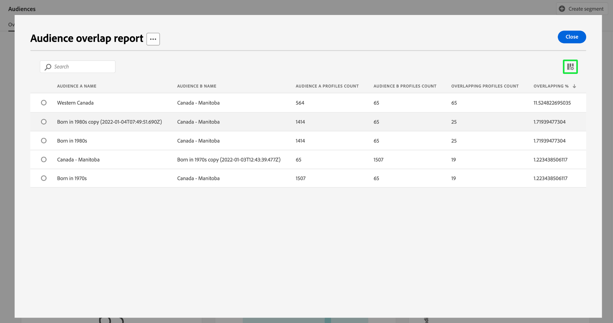

# [!UICONTROL Zielgruppen]-Dashboard {#audiences-dashboard}

Die Benutzeroberfläche von Adobe Experience Platform verfügt über ein Dashboard, über das Sie wichtige, bei einem täglichen Schnappschuss erfasste Informationen zu Ihren Zielgruppen anzeigen können. In diesem Handbuch wird beschrieben, wie Sie das Dashboard [!UICONTROL Zielgruppen] in der Benutzeroberfläche aufrufen und verwenden können. Außerdem erhalten Sie weitere Informationen zu den im Dashboard angezeigten Visualisierungen.

Einen Überblick über alle Funktionen des Segmentierungs-Services von Adobe Experience Platform in der Platform-Benutzeroberfläche erhalten Sie im [Handbuch zur Benutzeroberfläche des Segmentierungs-Services](../../segmentation/ui/overview.md).

## [!UICONTROL Audiences] Dashboard-Daten

Das Dashboard [!UICONTROL Zielgruppen] zeigt eine Momentaufnahme der Attributdaten (Datensatzdaten) an, die sich in Ihrem Unternehmen im Profilspeicher in Experience Platform befinden. Die Momentaufnahme enthält keine Ereignisdaten (Zeitreihendaten).

Die Attributdaten in der Momentaufnahme zeigen die Daten exakt so an, wie sie zum Zeitpunkt der Momentaufnahme vorgefunden werden. Das heißt, der Schnappschuss ist keine Annäherung oder Stichprobe der Daten und das Dashboard [!UICONTROL Zielgruppen] wird nicht in Echtzeit aktualisiert.

>[!NOTE]
>
>Änderungen oder Aktualisierungen, die seit der Aufnahme der Momentaufnahme an den Daten vorgenommen wurden, werden erst dann im Dashboard angezeigt, wenn die nächste Momentaufnahme erstellt wird.

## Erkunden des [!UICONTROL Zielgruppen] Dashboards {#explore}

Um in der Platform-Benutzeroberfläche zum [!UICONTROL Zielgruppen]-Dashboard zu navigieren, wählen Sie **[!UICONTROL Zielgruppen]** in der linken Leiste und dann die Registerkarte **[!UICONTROL Übersicht]** aus, um das Dashboard anzuzeigen.

>[!NOTE]
>
>Wenn Ihre Organisation erst seit kurzem Platform nutzt und noch keine aktiven Profildatensätze oder Zusammenführungsrichtlinien erstellt hat, ist das Dashboard [!UICONTROL Zielgruppen] nicht sichtbar. Stattdessen werden auf der Registerkarte [!UICONTROL Übersicht] Links und Dokumentation angezeigt, die Ihnen bei den ersten Schritten im Zusammenhang mit der Segmentierung helfen können.

![Die Registerkarte [!UICONTROL Zielgruppen]-Dashboard [!UICONTROL Übersicht] mit [!UICONTROL Zielgruppen] und [!UICONTROL Übersicht] hervorgehoben.](../images/audiences/dashboard-overview.png)

### Ändern des [!UICONTROL Zielgruppen]-Dashboards {#modify}

Sie können das Erscheinungsbild des Dashboards [!UICONTROL Zielgruppen] durch Auswahl von **[!UICONTROL Dashboard ändern]** ändern. Dadurch können Sie Widgets aus dem Dashboard verschieben, hinzufügen und entfernen sowie auf die **[!UICONTROL Widget-Bibliothek]** zugreifen, um verfügbare Widgets zu erkunden und benutzerdefinierte Widgets für Ihre Organisation zu erstellen.

Weitere Informationen finden Sie in der Dokumentation zum [Ändern von Dashboards](../customize/modify.md) und zur [Übersicht über die Widget-Bibliothek](../customize/widget-library.md).

### Hinzufügen von Widgets {#add-widget}

Wählen Sie **[!UICONTROL Widget hinzufügen]** aus, um zur Widget-Bibliothek zu navigieren und eine Liste der verfügbaren Widgets anzuzeigen, die Sie Ihrem Dashboard hinzufügen können.

![Die Übersicht [!UICONTROL Zielgruppen]-Dashboard mit hervorgehobenem [!UICONTROL Widget hinzufügen].](../images/audiences/audiences-overview-add-widget.png)

In der Widget-Bibliothek können Sie die standardmäßigen und benutzerdefinierten Zielgruppen-Widgets durchsuchen. Informationen zum Hinzufügen von Widgets finden Sie in der Widget-Bibliothek-Dokumentation zum [Hinzufügen eines Widget](../customize/widget-library.md#add-widgets).

### SQL anzeigen {#view-sql}

Sie können den SQL-Code, der die in Ihrem Dashboard visualisierten Einblicke generiert, mit einem Umschalter im Arbeitsbereich [!UICONTROL Übersicht] anzeigen. Sie können sich von der SQL Ihrer bestehenden Einblicke inspirieren lassen, um neue Abfragen zu erstellen, die basierend auf Ihren Geschäftsanforderungen eindeutige Einblicke aus Platform-Daten ableiten. Weitere Informationen zu dieser Funktion finden Sie im [Handbuch zur SQL-Benutzeroberfläche ](../view-sql.md).

## Audience auswählen {#select-audience}

Das Dashboard wählt automatisch eine anzuzeigende Zielgruppe aus. Sie können die Zielgruppe jedoch mithilfe des Dropdown-Menüs oder der Zielgruppenauswahl ändern.

Um eine andere Zielgruppe auszuwählen, wählen Sie das Dropdown-Menü neben dem Zielgruppennamen aus oder verwenden Sie die Zielgruppenauswahl, um das Dialogfeld für die Zielgruppenauswahl zu öffnen.

>[!IMPORTANT]
>
>In der Liste der auswählbaren Zielgruppen werden nur Zielgruppen mit einer Profilanzahl über null angezeigt.

![Das Dialogfeld [!UICONTROL Zielgruppe auswählen] mit allen verfügbaren Zielgruppen.](../images/audiences/select-audience-dialog.png)

## Widgets und Metriken {#widgets-and-metrics}

Das [!UICONTROL Zielgruppen]-Dashboard besteht aus Widgets, bei denen es sich um schreibgeschützte Metriken handelt und die wichtige Informationen zur ausgewählten Zielgruppe enthalten.

Datum und Uhrzeit des letzten Schnappschusses werden oben auf der Registerkarte [!UICONTROL Übersicht] neben dem Dropdown-Menü „Zielgruppe“ angezeigt. Alle Widget-Daten sind zum Stand dieses Datums und dieser Uhrzeit korrekt. Der Zeitstempel der Momentaufnahme wird im UTC-Format angegeben, nicht in der Zeitzone der jeweiligen Person oder Organisation.

## Standard-Widgets {#default-widgets}

Für alle neuen Instanzen von Adobe Experience Platform wird ein standardmäßiges Widget-Load-out bereitgestellt, das die neuesten verfügbaren Einblicke aus Ihren Daten hervorhebt. Die folgenden Widgets sind von Anfang an in Ihrer Segmentansicht vorkonfiguriert. Ausführliche Informationen zu Zweck und Funktion der Widgets finden Sie in den jeweiligen Abschnitten.

* [[!UICONTROL Zielgruppen-Größe]](#audience-size)
* [[!UICONTROL Trend bei der Änderung der Zielgruppen-Größe]](#audience-size-change-trend)
* [[!UICONTROL Identitätsüberschneidung]](#identity-overlap)
* [[!UICONTROL Profile nach Identität]](#profiles-by-identity)

>[!NOTE]
>
>Seit dem 26. Juli 2023 wurden die Dashboards [!UICONTROL Profile], [!UICONTROL Audiences] und [!UICONTROL Ziele]-Übersicht für alle Benutzer, die ihre Ansichten in den letzten sechs Monaten nicht geändert haben, auf einen neuen Standard-Widget-Ladevorgang zurückgesetzt.
>In der Dokumentation in den Abschnitten [Profile](./profiles.md#default-widgets) und [Ziele](./destinations.md#default-widgets) der Standard-Widgets finden Sie Einzelheiten darüber, welche Widgets als Teil der Standard-Widget-Ladevorgänge enthalten sind. Sie können Ihre Dashboard-Widgets wie zuvor anpassen.

## Kunden-KI-Widgets {#customer-ai-audiences-widgets}

Customer AI wird verwendet, um für einzelne Profile skaliert benutzerdefinierte Tendenzwerte wie Abwanderung und Konversion zu berechnen. Kunden-KI analysiert dazu vorhandene Kundenerlebnisereignisdaten, um Abwanderungs- **Konversionsneigungswerte vorherzusagen**. Diese hochpräzisen Modelle für die Kundentendenz ermöglichen eine genauere Segmentierung und Zielgruppenbestimmung. Die Insights [Verteilung der ](#customer-ai-distribution-of-scores) und [Scoring-](#customer-ai-scoring-summary)) veranschaulichen die Teilung in Ihrer Audience. Sie zeigen an, welche Profile die hohe/niedrige/mittlere Neigung sind und wie sie über die Anzahl Ihrer Profile verteilt sind.

* [[!UICONTROL Kunden-KI – Bewertungszusammenfassung]](#customer-ai-scoring-summary)
* [[!UICONTROL Kunden-KI – Verteilung von Bewertungen]](#customer-ai-distribution-of-scores)

### [!UICONTROL Kunden-KI – Verteilung von Bewertungen] {#customer-ai-distribution-of-scores}

>[!CONTEXTUALHELP]
>id="platform_dashboards_segments_distributionOfScores"
>title="Verteilung der Scores"
>abstract="Dieses Widget visualisiert die Verteilung der Gesamtanzahl der Profile anhand ihrer Tendenzwerte in Schritten von fünf Prozent. Die Verteilung der Profilanzahl wird durch das KI-Modell und die ausgewählte Zusammenführungsrichtlinie bestimmt. Sie können das KI-Modell im Dropdown-Menü unter dem Widget-Titel ändern."

Das Widget [!UICONTROL Kunden-KI-Verteilung der ]&quot; kategorisiert die Gesamtzahl der Profile anhand ihrer Neigungs-Scores. Die Verteilung der Profilanzahl wird durch das KI-Modell und die ausgewählte Zusammenführungsrichtlinie bestimmt und dann in 5-prozentigen Inkrementen visualisiert, die ihre Neigung angeben. Die Anzahl der Profile wird entlang der Y-Achse und die Tendenz-Scores entlang der X-Achse angegeben.

>[!NOTE]
>
>Wenn es sich bei der Visualisierung um einen Konversionsneigungs-Score handelt, werden die Highscores in grün und die Low Scores in rot angezeigt. Wenn Sie eine Abwanderungsneigung vorhersagen, wird diese umgekehrt. Die Highscores sind rot und die Low Scores grün. Der mittlere Bucket bleibt unabhängig vom ausgewählten Neigungstyp gelb.

Das KI-Modell, das die Neigungs-Scores bestimmt, wird aus der Dropdown-Auswahl unter dem Widget-Titel ausgewählt. Die Dropdown-Liste enthält eine Liste aller konfigurierten Kunden-KI-Modelle. Wählen Sie das für Ihre Analyse geeignete KI-Modell aus der Liste der verfügbaren Modelle aus. Wenn kein Kunden-KI-Modell verfügbar ist, werden Sie in einer Meldung innerhalb des Widgets aufgefordert, mindestens ein Kunden-KI-Modell zu konfigurieren, und es wird ein Hyperlink zur Seite für die Konfiguration des Kunden-KI-Modells bereitgestellt. In der Dokumentation finden Sie Anweisungen [ Konfigurieren einer Kunden-KI-Instanz](../../intelligent-services/customer-ai/user-guide/configure.md).

>[!NOTE]
>
>Wählen Sie das Dropdown-Menü direkt unter der Registerkarte Übersicht aus, um die Zusammenführungsrichtlinie zu ändern, die bestimmt, welche Profile in die Analyse eingeschlossen werden. Eine kurze Beschreibung finden Sie [ Abschnitt ](#merge-policies) Zusammenführungsrichtlinien oder [Übersicht über Zusammenführungsrichtlinien](../../profile/merge-policies/overview.md) für weitere Details.

Um zur detaillierten Insights-Seite für das ausgewählte Kunden-KI-Modell zu navigieren, wählen Sie **[!UICONTROL Modelldetails anzeigen]** aus.

![Das Dashboard &quot;Experience Platform-Zielgruppen“ mit [!UICONTROL  hervorgehobenen Widget „Kunden]KI-Verteilung der Scores[!UICONTROL  und „Modelldetails anzeigen].](../images/segments/customer-ai-distribution-of-scores.png)

Die detaillierte Seite mit Modelleinblicken wird angezeigt.

Weitere Informationen zur Kunden-KI finden Sie im Handbuch [Benutzeroberfläche für Einblicke entdecken](../../intelligent-services/customer-ai/user-guide/discover-insights.md).

### [!UICONTROL Kunden-KI – Bewertungszusammenfassung] {#customer-ai-scoring-summary}

>[!CONTEXTUALHELP]
>id="platform_dashboards_segments_scoringSummary"
>title="Bewertungszusammenfassung"
>abstract="Dieses Widget zeigt die Gesamtzahl der bewerteten Profile und kategorisiert sie in hohe, mittlere und niedrige Tendenz. Das Ringdiagramm zeigt die proportionale Zusammensetzung der Gesamtprofile über eine hohe, mittlere und niedrige Tendenz hinweg."

Dieses Widget zeigt die Gesamtzahl der bewerteten Profile an und kategorisiert sie in Buckets mit hoher, mittlerer und geringer Neigung als grün, gelb bzw. rot. Ein Ringdiagramm wird verwendet, um die proportionale Zusammensetzung der Gesamtprofile mit hoher, mittlerer und niedriger Neigung als grün, gelb bzw. rot zu veranschaulichen. Ein Profil eignet sich für eine hohe Neigung bei über 75, eine mittlere Neigung zwischen 25 und 74 und eine niedrige Neigung bei unter 24 Jahren. Eine Legende gibt den Farbcode und die Schwellenwerte für Tendenzen an. Die Anzahl der Profile für hohe, mittlere und niedrige Tendenzen wird in einem Dialogfeld angezeigt, wenn der Cursor über den entsprechenden Abschnitt des Ringdiagramms bewegt wird.

>[!NOTE]
>
>Wenn es sich bei der Visualisierung um einen Konversionsneigungs-Score handelt, werden die Highscores in grün und die Low Scores in rot angezeigt. Wenn Sie eine Abwanderungsneigung vorhersagen, wird diese umgekehrt. Die Highscores sind rot und die Low Scores grün. Der mittlere Bucket bleibt unabhängig vom ausgewählten Neigungstyp gelb.

Das Dropdown-Menü unter dem Widget-Titel enthält eine Liste aller konfigurierten Kunden-KI-Modelle. Wählen Sie das für Ihre Analyse geeignete KI-Modell aus der Liste der verfügbaren Modelle aus. Wenn kein Kunden-KI-Modell verfügbar ist, werden Sie in einer Meldung innerhalb des Widgets aufgefordert, mindestens ein Kunden-KI-Modell zu konfigurieren, und es wird ein Hyperlink zur Seite für die Konfiguration des Kunden-KI-Modells bereitgestellt. Detaillierte Anweisungen finden Sie in [ Dokumentation unter „Konfigurieren einer Kunden](../../intelligent-services/customer-ai/user-guide/configure.md)KI-Instanz“.

>[!NOTE]
>
>Die Gesamtzahl der berechneten Profile hängt von der ausgewählten Zusammenführungsrichtlinie ab. Um die verwendete Zusammenführungsrichtlinie zu ändern, wählen Sie das Dropdown-Menü direkt unter der Registerkarte Übersicht aus. Eine kurze Beschreibung finden Sie [ Abschnitt ](#merge-policies) Zusammenführungsrichtlinien oder [Übersicht über Zusammenführungsrichtlinien](../../profile/merge-policies/overview.md) für weitere Details.

Wählen Sie **[!UICONTROL Modelldetails anzeigen]** aus, um zur detaillierten Insights-Seite für das ausgewählte Kunden-KI-Modell zu navigieren. Weitere Informationen zur Kunden-KI finden Sie im Handbuch [Benutzeroberfläche für Einblicke entdecken](../../intelligent-services/customer-ai/user-guide/discover-insights.md).

## Standard-Widgets {#standard-widgets}

Adobe bietet mehrere Standard-Widgets, mit denen Sie verschiedene Metriken in Bezug auf Ihre Zielgruppen visualisieren können. In der [!UICONTROL Widget-Bibliothek] können Sie auch benutzerdefinierte Widgets erstellen und für Ihre gesamte Organisation freigeben. Um mehr über das Erstellen benutzerdefinierter Widgets zu erfahren, lesen Sie zunächst den Abschnitt [Widget-Bibliothek – Übersicht](../customize/widget-library.md).

Um mehr über die einzelnen verfügbaren Standard-Widgets zu erfahren, wählen Sie den Namen eines Widgets aus der folgenden Liste aus:

* [[!UICONTROL Zielgruppen-Größe]](#audience-size)
* [[!UICONTROL Reihenfolge der Zielgruppen-Aktivierung]](#audience-activation-order)
* [[!UICONTROL Trend der Zielgruppen-Größe]](#audience-size-trend)
* [[!UICONTROL Trend bei der Änderung der Zielgruppen-Größe]](#audience-size-change-trend)
* [[!UICONTROL Trend der Zielgruppen-Größe nach Identität]](#audience-size-trend-by-identity)
* [[!UICONTROL Zielgruppenüberschneidung]](#audience-overlap)
* [[!UICONTROL Bericht zur Zielgruppenüberschneidung]](#audience-overlap-report)
* [[!UICONTROL Identitätsüberschneidung]](#identity-overlap)
* [[!UICONTROL Profile nach Identität]](#profiles-by-identity)
* [[!UICONTROL Geplante Aktivierungen]](#scheduled-activations)

### [!UICONTROL Zielgruppen-Größe] {#audience-size}

>[!CONTEXTUALHELP]
>id="platform_dashboards_segments_audiencesize"
>title="Zielgruppen-Größe"
>abstract="Dieses Widget zeigt die Gesamtzahl der zusammengeführten Profile innerhalb der ausgewählten Zielgruppe an. Diese Zahl hängt von der auf Ihre Daten angewendeten Zusammenführungsrichtlinie ab und ist zum Zeitpunkt der letzten Momentaufnahme korrekt."

Das Widget **[!UICONTROL Zielgruppengröße]** zeigt die Gesamtzahl der zusammengeführten Profile innerhalb der ausgewählten Zielgruppe zum Zeitpunkt des Snapshots an. Diese Zahl ist das Ergebnis der Anwendung der Zielgruppen-Zusammenführungsrichtlinie auf Ihre Profildaten, um Profilfragmente zusammenzuführen und für jede Person in der Zielgruppe ein Profil zu bilden.

Weitere Informationen zu Fragmenten und zusammengeführten Profilen finden Sie in der [Übersicht über das Echtzeit-Kundenprofil](../../profile/home.md).

![Die Übersicht [!UICONTROL Zielgruppen]-Dashboard mit dem hervorgehobenen [!UICONTROL Zielgruppengröße]-Widget.](../images/audiences/audience-size.png)

### [!UICONTROL Trend der Zielgruppen-Größe] {#audience-size-trend}

>[!CONTEXTUALHELP]
>id="platform_dashboards_segments_audiencesizetrend"
>title="Trend der Zielgruppen-Größe"
>abstract="Dieses Widget liefert Informationen zur Gesamtanzahl der Profile, die den Kriterien **einer beliebigen** Segmentdefinition entsprechen und die während des täglichen Snapshots in den letzten 30 Tagen, 90 Tagen oder 12 Monate erfasst wurden."

Das Widget **[!UICONTROL Entwicklung der Zielgruppengröße]** bietet eine Kantengraph-Illustration für die Gesamtzahl der Profile, **für eine** Zielgruppe in einem bestimmten Zeitraum qualifiziert sind. Die Entwicklung der Zielgruppengröße kann über einen Zeitraum von 30 Tagen, 90 Tagen und 12 Monaten visualisiert werden. Der Zeitraum wird aus einem Dropdown-Menü im Widget ausgewählt. Die Zielgruppengröße wird auf der Y-Achse und die Zeit auf der X-Achse dargestellt.

Dieses Widget enthält auch die automatische Funktion [!UICONTROL Beschriftungen], bei der ein maschinelles Lernmodell die Diagramm- und Zielgruppendaten analysiert und automatisch Beschriftungen generiert, um die wichtigsten Trends und Ereignisse zu beschreiben. Wählen Sie **[!UICONTROL Beschriftungen]** aus, um das Dialogfeld für automatische Beschriftungen zu öffnen.

![In der [!UICONTROL Zielgruppen]-Übersicht wird das Widget „Entwicklung der Zielgruppengröße“ angezeigt.](../images/audiences/audience-size-trend-captions.png)

Das Dialogfeld für automatische Beschriftungen wird geöffnet und bietet Einblicke in Ihre Daten.

Weitere Informationen zur Auswertung von Audiences und dazu, wie Profile für Audiences qualifiziert und daraus entfernt werden, finden Sie in der Dokumentation [Segmentierungs-Service](../../segmentation/home.md).

### [!UICONTROL Trend bei der Änderung der Zielgruppen-Größe] {#audience-size-change-trend}

Dieses Widget bietet ein Liniendiagramm, das die Differenz der Gesamtzahl der Profile anzeigt, die sich zwischen den letzten täglichen Momentaufnahmen für eine bestimmte Zielgruppe qualifiziert haben. Die für die Analyse ausgewählte Audience wird aus dem Dropdown-Menü „Übersicht“ ausgewählt. Der Trend kann über einen Zeitraum von 30 Tagen, 90 Tagen und 12 Monaten visualisiert werden. Der Zeitraum wird aus einem Dropdown-Menü im Widget ausgewählt. Die Zielgruppengröße wird auf der Y-Achse und die Zeit auf der X-Achse dargestellt.

### [!UICONTROL Trend der Zielgruppen-Größe nach Identität] {#audience-size-trend-by-identity}

Dieses Widget veranschaulicht die Entwicklung der Zielgruppengröße für eine bestimmte Zielgruppe basierend auf dem Identitätstyp, der im Widget-Dropdown-Menü ausgewählt wurde. Die für die Analyse verwendete Audience wird aus dem Dropdown-Menü „Übersicht“ ausgewählt. Der Trend kann über einen Zeitraum von 30 Tagen, 90 Tagen und 12 Monaten visualisiert werden. Der Zeitraum wird aus einem Dropdown-Menü im Widget ausgewählt.

### [!UICONTROL Reihenfolge der Zielgruppen-Aktivierung] {#audience-activation-order}

Das Widget [!UICONTROL Reihenfolge der Zielgruppenaktivierung] bietet eine dreispaltige Tabelle, in der der Zielname, die Plattform und das Aktivierungsdatum der Zielgruppe aufgelistet sind. Die Liste ist entsprechend der Aktualität von oben nach unten geordnet und kann bis zu 10 Zeilen enthalten.

### [!UICONTROL Zielgruppenüberschneidung] {#audience-overlap}

Dieses Widget verwendet ein Venn-Diagramm, um die Anzahl der Personen zu visualisieren, die den Kriterien für beide Zielgruppen entsprechen. Die für den Vergleich verwendeten Zielgruppen werden aus den Widget-Dropdown-Menüs ausgewählt. Die Gesamtzahl der in der entsprechenden Segmentdefinition enthaltenen Profile kann durch Bewegen des Mauszeigers über einen Kreis oder die Schnittmenge des Venn-Diagramms angezeigt werden.

Mit diesem Widget können Sie Ihre Segmentierungsstrategie optimieren, indem Sie die Ähnlichkeiten in den Ergebnissen Ihrer Segmentdefinitionen visualisieren.

### [!UICONTROL Bericht zur Zielgruppenüberschneidung] {#audience-overlap-report}

Dieses Widget enthält eine tabellarische Darstellung der Profilüberschneidungsdaten für eine bestimmte Zielgruppe. Für die Zielgruppe, die oben im Bildschirm im Dropdown-Menü ausgewählt wird, wird eine Liste mit fünf Zielgruppen, sortiert vom höchsten bis zum niedrigsten Überschneidungsprozentsatz, bereitgestellt. Aus Gründen der Übersichtlichkeit wird die ausgewählte Zielgruppe in der Spalte [!UICONTROL NAME DER ZIELGRUPPE A] aufgeführt. Die Analyse der Zielgruppenüberschneidung wird für die zweite Zielgruppe bereitgestellt, die in der Spalte [!UICONTROL NAME VON ZIELGRUPPE B“ ] ist. Die prozentuale Überschneidung wird in der dritten Spalte auf zwölf Dezimalstellen genau angegeben.

Der Bericht zur Zielgruppenüberschneidung hilft Ihnen beim Erstellen neuer, hochleistungsfähiger Zielgruppen. Durch die Beachtung hoher prozentualer Überschneidungen können Sie Zielgruppen unterdrücken und das Senden derselben Zielgruppe an verschiedene Ziele verhindern. Diese Daten helfen Ihnen auch dabei, verborgene Insights zu entdecken, die bei einer besseren Segmentierung hilfreich sein können. Eine geringe prozentuale Überschneidung hilft, eindeutige Profile zu finden, deren Kontaktierung Sie fortsetzen sollten.

Wählen Sie **[!UICONTROL Mehr anzeigen]** aus, um ein Vollbilddialogfeld zu öffnen, das mehr Daten zu Zielgruppenüberschneidungen enthält.

Das Dialogfeld [!UICONTROL Bericht zur Zielgruppenüberschneidung] wird angezeigt. Dieses Dialogfeld kann bis zu 50 Zeilen mit Analysen zur Zielgruppenüberschneidung enthalten, die in sechs Spalten unterteilt sind. Wählen Sie das Einstellungssymbol () aus, um Spalten aus der Tabelle zu entfernen oder zur Tabelle hinzuzufügen.

>[!NOTE]
>
>Wählen Sie die Spaltenüberschrift **[!UICONTROL Überschneidung]** aus, um die Rangfolge der Ergebnisse vom höchsten zum niedrigsten bzw. vom niedrigsten zum höchsten zu ändern.

Um den gesamten Bericht im PDF-Format herunterzuladen, wählen Sie das Optionsmenü (**`...`**) und dann **[!UICONTROL Download]** aus.

Wählen Sie eine Zeile aus dem Bericht aus, um ein Venn-Diagramm der Überschneidungsanalyse zu öffnen. Bewegen Sie den Mauszeiger über einen Abschnitt des Venn-Diagramms, um die Profilanzahl in einem Dialogfeld anzuzeigen.

Wählen Sie **[!UICONTROL Schließen]** aus, um zum [!UICONTROL Zielgruppen]-Dashboard zurückzukehren.

### [!UICONTROL Identitätsüberschneidung] {#identity-overlap}

>[!CONTEXTUALHELP]
>id="platform_dashboards_segments_identityoverlap"
>title="Identitätsüberschneidung"
>abstract="Dieses Widget zeigt die Überschneidung von Profilen in der Zielgruppe an, die beide ausgewählten Identitäten enthalten. Die Kreise zeigen die relative Größe jeder Identität an. Die Anzahl der Profile, die beide Namespaces enthalten, wird durch den Überschneidungsbereich der Kreise dargestellt."

Das Widget **[!UICONTROL Identitätsüberschneidung]** zeigt ein Venn-Diagramm (oder Mengendiagramm) an, das die Überschneidung von Profilen in Ihrer Zielgruppe mit mehreren Identitäten anzeigt.

Verwenden Sie die Dropdown-Menüs im Widget, um die Identitäten auszuwählen, die Sie vergleichen möchten. Die Kreise zeigen die relative Größe jeder ausgewählten Identität an, wobei die Anzahl der Profile, die beide Namespaces enthalten, der Größe des Überschneidungsbereichs der Kreise entspricht.

Wenn ein Kunde mit Ihrer Marke auf mehr als einem Kanal interagiert, werden diesem einzelnen Kunden mehrere Identitäten zugeordnet. Aufgrund dieser Situation ist es wahrscheinlich, dass Ihre Organisation über mehrere Profile verfügt, die Fragmente aus mehr als einer Identität enthalten.

Weitere Informationen zu Identitäten finden Sie in der [Identity Service-Dokumentation](../../identity-service/home.md).

![Die Übersicht des [!UICONTROL Zielgruppen]-Dashboards mit dem hervorgehobenen Widget „Identitätsüberschneidung“.](../images/audiences/identity-overlap.png)

### [!UICONTROL Profile nach Identität] {#profiles-by-identity}

>[!CONTEXTUALHELP]
>id="platform_dashboards_segments_profilesbyidentity"
>title="Profile nach Identität"
>abstract="Dieses Widget zeigt die Aufschlüsselung der Identitäten für jedes zusammengeführte Profil in der ausgewählten Zielgruppe an."

Das **[!UICONTROL Profile nach Identität]** zeigt die Aufschlüsselung der Identitäten für jedes zusammengeführte Profil in Ihrer ausgewählten Zielgruppe an. Die Gesamtzahl der Profile nach Identität kann höher sein als die Gesamtzahl der Profile in der Zielgruppe, da einem Profil mehrere Identitäten zugeordnet sein können. Das heißt, dass die Summe der für jede Identität angezeigten Werte größer sein kann als die Gesamtgröße der Zielgruppe. Dies liegt daran, dass bei der Interaktion eines Kunden mit Ihrer Marke über mehr als einen Kanal mehrere Identitäten mit diesem einzelnen Kunden verknüpft werden können.

Wählen Sie **[!UICONTROL Beschriftungen]** aus, um das Dialogfeld für automatische Beschriftungen zu öffnen.

![Die Übersicht des [!UICONTROL Zielgruppen]-Dashboards mit dem hervorgehobenen Widget „Profile nach Identität“ und der hervorgehobenen Option „Beschriftungen“.](../images/audiences/profiles-by-identity.png)

Ein maschinelles Lernmodell generiert automatisch Dateneinblicke, indem es die Gesamtverteilung und die Schlüsselaspekte der Daten analysiert.

Weitere Informationen zu Identitäten finden Sie in der [Identity Service-Dokumentation](../../identity-service/home.md).

### Geplante Aktivierungen {#scheduled-activations}

Das Widget [!UICONTROL Geplante Aktivierungen] bietet eine tabellarische Übersicht über die zuletzt aktivierten Ziele. Die Tabelle enthält die Zielplattform, den Namen Ihres Aktivierungsflusses zu diesem Ziel sowie das Start- und Enddatum der Aktivierung für die ausgewählte Zielgruppe. Wenn für die Aktivierung kein Enddatum angegeben wurde, wird sie als [!UICONTROL Fortaufend] angezeigt. Die Audience für die Analyse wird oben auf der Seite aus dem Dropdown-Menü ausgewählt.

Mit diesem Widget können Sie auf einen Blick erkennen, wo und wann die Zielgruppe aktiviert wird, und es macht doppelte oder unnötige Aktivierungen transparenter. Diese gesammelten Informationen zeigen auch, wo jegliche Aktivierungen ausgeschlossen wurden.

## Nächste Schritte

Wenn Sie diesem Dokument folgen, sollten Sie jetzt in der Lage sein, das [!UICONTROL Zielgruppen]-Dashboard zu finden und eine Zielgruppe auszuwählen, die angezeigt werden soll. Sie sollten auch die Metriken verstehen, die in den verfügbaren Widgets angezeigt werden. Weitere Informationen zum Arbeiten mit Zielgruppen in der Experience Platform-Benutzeroberfläche finden Sie im [Handbuch zur Benutzeroberfläche des Segmentierungs-Services](../../segmentation/ui/overview.md).
