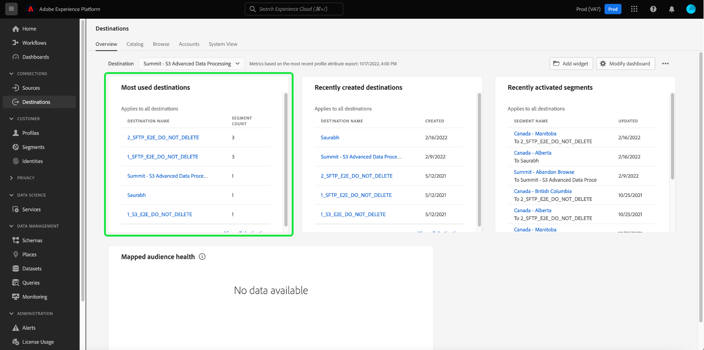

# [!UICONTROL Dashboard „Ziele“]

Die Adobe Experience Platform-Benutzeroberfläche bietet ein Dashboard, über das Sie wichtige Informationen zu den aktiven Zielen Ihres Unternehmens anzeigen können, wie sie in einer täglichen Momentaufnahme erfasst werden. In diesem Handbuch wird beschrieben, wie Sie in der Benutzeroberfläche auf das Ziel-Dashboard zugreifen und mit ihm arbeiten können. Außerdem erhalten Sie weitere Informationen zu den im Dashboard angezeigten Metriken.

Eine Übersicht über Ziele sowie einen Katalog aller in der Experience Platform verfügbaren Ziele finden Sie im [Dokumentation zu Zielen](../../destinations/home.md).

## [!UICONTROL Ziele] Dashboard-Daten {#destinations-dashboard-data}

Die [!UICONTROL Ziele] Dashboard zeigt eine Momentaufnahme der Ziele an, die Ihr Unternehmen in Experience Platform aktiviert hat. Der Schnappschuss zeigt die Daten exakt so an, wie sie zum Zeitpunkt der Schnappschussaufnahme aufgetreten sind. Mit anderen Worten, der Schnappschuss ist keine Annäherung oder Stichprobe der Daten und das Ziel-Dashboard wird nicht in Echtzeit aktualisiert.

>[!NOTE]
>
>Änderungen oder Aktualisierungen, die seit der Aufnahme des Schnappschusses an den Daten vorgenommen wurden, werden erst dann im Dashboard angezeigt, wenn der nächste Schnappschuss erstellt wurde.

## Dashboard &quot;Ziele&quot;durchsuchen

Um in der Platform-Benutzeroberfläche zum Ziel-Dashboard zu navigieren, wählen Sie **[!UICONTROL Ziele]** Wählen Sie in der linken Leiste die **[!UICONTROL Übersicht]** zum Anzeigen des Dashboards.

>[!NOTE]
>
>Wenn Ihr Unternehmen neu bei Experience Platform ist und noch keine aktiven Ziele hat, wird die [!UICONTROL Ziele] Dashboard und [!UICONTROL Übersicht] nicht sichtbar sind. Wählen Sie stattdessen [!UICONTROL Ziele] über die linke Navigation zeigt die [!UICONTROL Katalog] Registerkarte. Weitere Informationen zum [!UICONTROL Katalog] Registerkarte, siehe [[!UICONTROL Ziele] Arbeitsbereichshandbuch](../../destinations/ui/destinations-workspace.md).

### Ändern des Ziel-Dashboards

Sie können das Erscheinungsbild des Ziel-Dashboards durch Auswahl von **[!UICONTROL Dashboard ändern]**. Dadurch können Sie Widgets aus dem Dashboard verschieben, hinzufügen und entfernen sowie auf die **[!UICONTROL Widget-Bibliothek]** , um verfügbare Widgets zu erkunden und benutzerdefinierte Widgets für Ihre Organisation zu erstellen.

Weitere Informationen finden Sie unter [Ändern von Dashboards](../customize/modify.md) und [Übersicht über Widget-Bibliotheken](../customize/widget-library.md) Dokumentation .

## Standard-Widgets

Adobe bietet mehrere Standard-Widgets, mit denen Sie verschiedene Metriken in Bezug auf Ihre Ziele visualisieren und die Vollständigkeit der für Ihre Datenanalyse verfügbaren Segmente bewerten können. Sie können auch benutzerdefinierte Widgets erstellen, die für Ihre Organisation freigegeben werden, indem Sie die [!UICONTROL Widget-Bibliothek]. Um mehr über das Erstellen benutzerdefinierter Widgets zu erfahren, lesen Sie zunächst den Abschnitt [Übersicht über Widget-Bibliotheken](../customize/widget-library.md).

Um mehr über die einzelnen verfügbaren Standard-Widgets zu erfahren, wählen Sie den Namen eines Widgets aus der folgenden Liste aus:

* [[!UICONTROL Am häufigsten verwendete Ziele]](#most-used-destinations)
* [[!UICONTROL Kürzlich erstellte Ziele]](#recently-created-destinations)
* [[!UICONTROL Kürzlich aktivierte Segmente]](#recently-activated-segments)
* [[!UICONTROL Kürzlich aktivierte Segmente nach Ziel]](#recently-activated-segments-by-destination)
* [[!UICONTROL Zielgruppengrößentrend]](#audience-size-trends)
* [[!UICONTROL Nicht zugeordnete Segmente nach Identität]](#unmapped-segments-by-identity)
* [[!UICONTROL Zugeordnete Segmente nach Identität]](#mapped-segments-by-identity)
* [[!UICONTROL Häufige Zielgruppen]](#common-audiences)

### [!UICONTROL Am häufigsten verwendete Ziele] {#most-used-destinations}

Die **[!UICONTROL Am häufigsten verwendete Ziele]** -Widget zeigt die wichtigsten Ziele Ihres Unternehmens nach der Anzahl der zugeordneten Segmente ab dem letzten Schnappschuss an. Dieses Ranking bietet Einblicke, welche Ziele verwendet werden, und zeigt möglicherweise auch diejenigen, die möglicherweise nicht genutzt werden.

Wenn Sie beispielsweise gestern ein Ziel konfiguriert haben, ihm jedoch keine Segmente zugeordnet haben, können Sie sehen, dass das Ziel derzeit nicht genutzt wird.

Die Anzahl der zugeordneten Segmente, die in der Spalte mit der Segmentanzahl angezeigt werden, ist ab der letzten täglichen Momentaufnahme korrekt. Wenn Sie ein neues Segment dem Ziel zuordnen, wird die Anzahl erst aktualisiert, wenn der nächste Schnappschuss erstellt wurde.

Wenn Sie den Namen eines Ziels aus der im Widget angezeigten Liste auswählen, gelangen Sie zu den Zieldetails, die über das **[!UICONTROL Durchsuchen]** Registerkarte. Sie können auch **[!UICONTROL Alle anzeigen]** , um zur **[!UICONTROL Durchsuchen]** und wählen Sie dann den Namen eines Ziels aus, um dessen Details anzuzeigen.

### [!UICONTROL Kürzlich erstellte Ziele] {#recently-created-destinations}

Die **[!UICONTROL Kürzlich erstellte Ziele]** -Widget können Sie eine Liste der zuletzt konfigurierten Ziele Ihres Unternehmens anzeigen.

Das angezeigte Erstellungsdatum entspricht der letzten täglichen Momentaufnahme. Mit anderen Worten: Wenn Sie ein neues Ziel erstellen, wird es erst nach dem nächsten Schnappschuss in der Liste angezeigt.

Wenn Sie den Namen eines Ziels aus der im Widget angezeigten Liste auswählen, gelangen Sie zu den Zieldetails, die über das **[!UICONTROL Durchsuchen]** Registerkarte. Sie können auch **[!UICONTROL Alle anzeigen]** , um zur **[!UICONTROL Durchsuchen]** und wählen Sie dann den Namen eines Ziels aus, um dessen Details anzuzeigen.

Weitere Informationen zum Konfigurieren bestimmter Zieltypen finden Sie unter [Dokumentation zu Zielen](../../destinations/home.md).

### [!UICONTROL Kürzlich aktivierte Segmente] {#recently-activated-segments}

Die **[!UICONTROL Kürzlich aktivierte Segmente]** -Widget stellt eine Liste der Segmente bereit, die einem Ziel zuletzt zugeordnet wurden. Diese Liste zeigt, welche Segmente und Ziele aktiv im System verwendet werden, und kann bei der Fehlerbehebung bei fehlerhaften Zuordnungen helfen.

Das angezeigte aktualisierte Datum zeigt an, wann das Segment zuletzt für das Ziel aktiviert wurde, und ist für den letzten täglichen Schnappschuss korrekt. Wenn Sie also ein Segment für das Ziel aktivieren, ändert sich das aktualisierte Datum erst, nachdem der nächste Schnappschuss erstellt wurde.

Wenn Sie den Namen eines Segments aus der im Widget angezeigten Liste auswählen, gelangen Sie zu den Segmentdetails. Sie können auch **[!UICONTROL Alle anzeigen]** , um zur Registerkarte &quot;Segmentsuche&quot;zu navigieren und dann den Namen eines Segments auszuwählen, um dessen Details anzuzeigen.

Weitere Informationen zum Arbeiten mit Segmenten in Experience Platform erhalten Sie im Abschnitt [Übersicht über den Segmentierungsdienst](../../segmentation/home.md).

### [!UICONTROL Kürzlich aktivierte Segmente nach Ziel] {#recently-activated-segments-by-destination}

Die **[!UICONTROL Kürzlich aktivierte Segmente nach Ziel]** -Widget zeigt die fünf am häufigsten aktivierten Segmente in absteigender Reihenfolge an, je nach dem im Dropdown-Menü &quot;Übersicht&quot;ausgewählten Ziel. Sie ähnelt dem [!UICONTROL Kürzlich aktivierte Segmente] Widget, aber die angezeigten Daten **only** gilt für das ausgewählte Ziel.

Dieses Widget enthält zwei Metriken: den Segmentnamen und das Datum, an dem das Segment zuletzt für das Ziel aktiviert wurde. Die angezeigten Daten sind ab der letzten täglichen Momentaufnahme korrekt.

Sie können die Details eines Segments anzeigen, indem Sie den Namen eines Segments aus der angezeigten Liste auswählen.

### [!UICONTROL Zielgruppengrößentrend] {#audience-size-trend}

Die **[!UICONTROL Zielgruppengrößentrend]** Widget zeigt die Beziehung der Profilanzahl über einen bestimmten Zeitraum für ein Segment an, das diesem Zielkonto zugeordnet wurde. Das Widget verwendet ein Liniendiagramm, um die Anzahl der im Segment enthaltenen Profile zu veranschaulichen, die täglich an das Zielkonto gesendet werden.

Ein Zeitraum für den Zielgruppentrend in den letzten 30 Tagen, 90 Tagen oder 12 Monaten kann über das erste Dropdown-Menü angepasst werden.

Im zweiten Dropdown-Menü werden alle verfügbaren Segmente aufgelistet, die an das im oberen Bereich des Dashboards ausgewählte Zielkonto gesendet werden können.

### [!UICONTROL Nicht zugeordnete Segmente nach Identität] {#unmapped-segments-by-identity}

Die **[!UICONTROL Nicht zugeordnete Segmente nach Identität]** Widget listet die fünf obersten **nicht zugeordnet** Segmente, die nach absteigender Identitätszahl für ein bestimmtes Ziel und eine bestimmte Identität sortiert sind. Es werden Segmente hervorgehoben, die basierend auf der ausgewählten ID dem ausgewählten Zielkonto am besten zugeordnet werden.

Das Dropdown-Menü Ziel-ID filtert Ihre verfügbaren Segmente. Die im Dropdown-Menü aufgelisteten Filter-IDs ändern sich je nach dem Zielkonto, das oben auf der Übersichtsseite ausgewählt wurde.

Die Spalte &quot;Identitäten&quot;zählt die Anzahl der Quell-IDs innerhalb des Segments, die der in der Dropdown-Liste &quot;Widget-ID&quot;ausgewählten ID zugeordnet werden können.

### [!UICONTROL Zugeordnete Segmente nach Identität] {#mapped-segments-by-identity}

Dieses Widget bietet die fünf wichtigsten Listen von **zugeordnet** Segmente. Die Liste wird von oben nach unten entsprechend der Anzahl der Quell-IDs in den Segmenten sortiert. Die zu zählende Ziel-ID wird aus dem Dropdown-Menü unter dem Widget-Titel ausgewählt. Die Ziel-IDs, die über die Dropdown-Liste im Widget verfügbar sind, ändern sich entsprechend dem Zielkontofilter, der oben im Übersichts-Dashboard ausgewählt wird.

Die **[!UICONTROL Zugeordnete Segmente nach Identität]** Widget hebt auf einen Blick die Wahrscheinlichkeit eines erfolgreichen Targetings von Profilmöglichkeiten für eine Kampagne innerhalb des ausgewählten Ziels hervor. Eine effiziente zielgerichtete Kampagne hängt nicht von der Anzahl der an das Ziel gesendeten Profile ab, sondern von der Anzahl der Quell-IDs, die wahrscheinlich mit den Ziel-IDs abgeglichen werden, um nützliche und umsetzbare Daten bereitzustellen.

### Häufige Zielgruppen

Die **[!UICONTROL Häufige Zielgruppen]** Widget bietet eine Liste der fünf wichtigsten Segmente, die für das am oberen Rand der Seite ausgewählte Zielkonto aktiviert wurden, sowie das im Widget-Dropdown-Menü ausgewählte Ziel. Die Liste der Segmente wird nach der kürzlich aktivierten Funktion geordnet. Das zuletzt aktivierte Segment wird oben angezeigt.

Die [!UICONTROL ZIELGRUPPENGRÖSSE] gibt die Gesamtanzahl der Profile jedes aufgelisteten Segments an.

### Zugewiesene Zielgruppen-Konsistenz

Das Widget bietet eine Liste von bis zu 20 zugeordneten Segmenten, deren Gesamtprofilanzahl ab dem letzten täglichen Schnappschuss um einen Faktor von mindestens einer Standardabweichung von der 30-Tage-Mittelwert der Zielgruppengröße abweicht, die diesem Ziel zugeordnet ist.

Kurz gesagt, es bietet eine berechnete Metrik für die Verteilung der Zielgruppengrößen vom Mittelwert über die letzten 30 Tage. Dabei wird verglichen, ob die heutige Zielgruppengröße außerhalb der historischen Standardabweichung liegt, die in den Daten der letzten 30 Tage zu beobachten war.

Alle Zielgruppengrößen im System werden von hoher bis niedriger Zielgruppengröße sortiert, wie in der [!UICONTROL NEUESTE GRÖSSE] Spalte.

Wenn die Anzahl Ihrer segmentzugeordneten Profile außerhalb einer Standardabweichung von der durchschnittlichen zugeordneten Profilgröße in den letzten 30 Tagen liegt, deutet dies auf eine Anomalie im System hin und sollte untersucht werden.

Wenn ein Segment innerhalb der [!UICONTROL Zugewiesene Zielgruppen-Konsistenz] -Widget um einen breiten Rand abweicht, sollten Sie auf das Trend-Diagramm zur Zielgruppengröße verweisen und das anormale Segment lokalisieren. Der Trend kann weitere Einblicke in die Gesundheit Ihres Segments bieten.

## Nächste Schritte

Durch Befolgen dieses Dokuments sollten Sie jetzt in der Lage sein, das Ziel-Dashboard zu finden und die in den verfügbaren Widgets angezeigten Metriken zu verstehen. Weitere Informationen zum Arbeiten mit Zielen in Experience Platform finden Sie im Abschnitt [Dokumentation zu Zielen](../../destinations/home.md).
