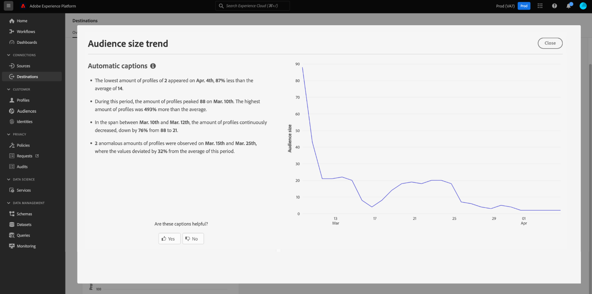

# [!UICONTROL Destinations] dashboard

Die Benutzeroberfläche von Adobe Experience Platform verfügt über ein Dashboard, in dem Sie wichtige Informationen über die aktiven Ziele Ihres Unternehmens anzeigen können, die in einem täglichen Schnappschuss erfasst wurden. In diesem Handbuch wird beschrieben, wie Sie in der Benutzeroberfläche auf das Ziele-Dashboard zugreifen und mit ihm arbeiten können. Außerdem erhalten Sie weitere Informationen zu den im Dashboard angezeigten Metriken.

Eine Übersicht über Ziele sowie einen Katalog aller in Experience Platform verfügbaren Ziele finden Sie in der [Dokumentation zu Zielen](../../destinations/home.md).

## Dashboard-Daten [!UICONTROL Destinations] {#destinations-dashboard-data}

Im Dashboard „Ziele“ finden Sie eine Momentaufnahme der Ziele, die Ihre Organisation in Experience Platform aktiviert hat. Die Momentaufnahme zeigt die Daten exakt so an, wie sie zum Zeitpunkt der Momentaufnahme aufgetreten sind. Das heißt, der Schnappschuss ist keine Annäherung oder Stichprobe der Daten, und das Ziele-Dashboard wird nicht in Echtzeit aktualisiert.

>[!NOTE]
>
>Änderungen oder Aktualisierungen, die seit der Aufnahme der Momentaufnahme an den Daten vorgenommen wurden, werden erst dann im Dashboard angezeigt, wenn die nächste Momentaufnahme erstellt wird.

## Erkunden des [!UICONTROL Destinations]-Dashboards {#explore}

Um in der Experience Platform-Benutzeroberfläche zum Ziele-Dashboard zu navigieren, klicken Sie in der linken Leiste auf **[!UICONTROL Destinations]** und wählen Sie dann die Registerkarte **[!UICONTROL Overview]** aus, um das Dashboard anzuzeigen.

Datum und Uhrzeit des letzten Schnappschusses werden oben in der [!UICONTROL Overview] neben dem Ziel-Dropdown-Menü angezeigt. Alle Widget-Daten sind zum Stand dieses Datums und dieser Uhrzeit korrekt. Der Zeitstempel der Momentaufnahme wird im UTC-Format angegeben, nicht in der Zeitzone der jeweiligen Person oder Organisation.

>[!NOTE]
>
>Wenn Experience Platform neu in Ihrem Unternehmen ist und es noch keine aktiven Ziele hat, sind das Ziele-Dashboard und die Registerkarte [!UICONTROL Overview] nicht sichtbar. Wenn Sie [!UICONTROL Destinations] in der linken Navigation auswählen, wird stattdessen die Registerkarte [!UICONTROL Catalog] angezeigt. Weitere Informationen zur Registerkarte [!UICONTROL Catalog] finden Sie im Handbuch zum [[!UICONTROL Destinations] Workspace](../../destinations/ui/destinations-workspace.md).

### Ändern des [!UICONTROL Destinations] Dashboards {#modify}

Wählen Sie **[!UICONTROL Modify dashboard]** aus, um das Erscheinungsbild des Ziele-Dashboards zu ändern. Änderungen am Dashboard sind benutzerspezifisch und nicht organisationsweit. Sie können Widgets aus dem Dashboard verschieben, hinzufügen, ihre Größe ändern und entfernen und auf die Widget-Bibliothek zugreifen, um Ihr Dashboard anzupassen. In der Widget-Bibliothek können Sie die verfügbaren Widgets durchsuchen und benutzerdefinierte Widgets für Ihre Organisation erstellen.

Weitere Informationen finden Sie in der Dokumentation [Dashboards modifzieren](../customize/modify.md) und [Widget-Bibliothek – Übersicht](../customize/widget-library.md).

### Hinzufügen von Widgets {#add-widget}

Wählen Sie **[!UICONTROL Add widget]** aus, um zur Widget-Bibliothek zu navigieren und eine Liste der verfügbaren Widgets anzuzeigen, die Sie Ihrem Dashboard hinzufügen können.

In der Widget-Bibliothek können Sie die standardmäßigen und benutzerdefinierten Zielgruppen-Widgets durchsuchen. Informationen zum Hinzufügen von Widgets finden Sie in der Widget-Bibliothek-Dokumentation zum [Hinzufügen eines Widget](../customize/widget-library.md#add-widgets).

### SQL anzeigen {#view-sql}

Sie können den SQL-Code, der die in Ihrem Dashboard visualisierten Einblicke generiert, mit einem Umschalter im [!UICONTROL Overview] Arbeitsbereich anzeigen. Sie können sich von der SQL Ihrer bestehenden Einblicke inspirieren lassen, um neue Abfragen zu erstellen, die basierend auf Ihren Geschäftsanforderungen eindeutige Einblicke aus Experience Platform-Daten ableiten. Weitere Informationen zu dieser Funktion finden Sie im [Handbuch zur SQL-Benutzeroberfläche ](../view-sql.md).

## Standard-Widgets {#default-widgets}

Für alle neuen Instanzen von Adobe Experience Platform wird ein standardmäßiges Widget-Load-out bereitgestellt, das die neuesten verfügbaren Einblicke aus Ihren Daten hervorhebt. Die folgenden Widgets sind von Anfang an in Ihrer Segmentansicht vorkonfiguriert. Ausführliche Informationen zu Zweck und Funktion der Widgets finden Sie unten.

* [[!UICONTROL Most used destinations]](#most-used-destinations)
* [[!UICONTROL Recently created destinations]](#recently-created-destinations)
* [[!UICONTROL Recently activated segments]](#recently-activated-segments)

>[!NOTE]
>
>Seit dem 26. Juli 2023 wurden [!UICONTROL Profiles]-, [!UICONTROL Audiences]- und [!UICONTROL Destinations]-Übersichts-Dashboards für alle Benutzer, die ihre Ansichten in den letzten sechs Monaten nicht geändert haben, auf einen neuen Standard-Widget-Ladevorgang zurückgesetzt.
>Weitere Informationen dazu, welche Widgets als Teil der Standard[Widget-Ladevorgänge enthalten sind, finden Sie in der Dokumentation ](./profiles.md#default-widgets) den Abschnitten „Profile[ und ](./audiences.md#default-widgets)Zielgruppen der Standard-Widgets“. Sie können Ihre Dashboard-Widgets wie zuvor anpassen.

## Standard-Widgets {#standard-widgets}

Adobe bietet mehrere Standard-Widgets, mit denen Sie verschiedene Zielmetriken visualisieren und die Vollständigkeit der für Ihre Datenanalyse verfügbaren Zielgruppen bewerten können. Sie können auch benutzerdefinierte Widgets erstellen, die über die [!UICONTROL Widget library] für Ihre Organisation freigegeben werden können. Um mehr über das Erstellen benutzerdefinierter Widgets zu erfahren, lesen Sie zunächst den Abschnitt [Widget-Bibliothek – Übersicht](../customize/widget-library.md).

### Voraussetzungen {#prerequisites}

Bevor Sie mit den Beschreibungen von Standard-Widgets fortfahren, stellen Sie sicher, dass Sie mit den Definitionen der folgenden Schlüsselbegriffe vertraut sind, die in der Dokumentation verwendet werden:

* **Segmentdefinition:** Eine Segmentdefinition ist ein **Regelsatz** der zur Beschreibung wichtiger Merkmale oder Verhaltensweisen einer Zielgruppe verwendet wird. Diese Regeln enthalten Attribut- und Ereignisdaten, die die Profile als Teil einer Zielgruppe qualifizieren.
* **Zielgruppe**: Eine Gruppe von Personen, Konten, Haushalten oder anderen Entitäten, die gemeinsame Merkmale und Verhaltensweisen aufweisen.
* **Zugeordnet/Zuordnung**: Bei der Datenzuordnung werden Quelldatenfelder mit verwandten Zielfeldern in einem Ziel zugeordnet.
* **Identität**: Eine Identität ist eine Kennung, die einen einzelnen Kunden eindeutig repräsentiert, z. B. eine Cookie-ID, eine Geräte-ID oder eine E-Mail-ID.
* **Aktivieren**: „Aktivieren“ ist die Aktion, die eine Benutzerin oder ein Benutzer ausführt, um eine Zielgruppe oder Profile einem Ziel wie Oracle Eloqua, Google oder Salesforce Marketing Cloud zuzuordnen.

Um mehr über die einzelnen verfügbaren Standard-Widgets zu erfahren, wählen Sie den Namen eines Widgets aus der folgenden Liste aus:

* [[!UICONTROL Most used destinations]](#most-used-destinations)
* [[!UICONTROL Recently created destinations]](#recently-created-destinations)
* [[!UICONTROL Recently activated audiences]](#recently-activated-audiences)
* [[!UICONTROL Recently activated audiences by destination]](#recently-activated-audiences-by-destination)
* [[!UICONTROL Audience size trend]](#audience-size-trend)
* [[!UICONTROL Unmapped audiences by identity]](#unmapped-audiences-by-identity)
* [[!UICONTROL Mapped audiences by identity]](#mapped-audiences-by-identity)
* [[!UICONTROL Common audiences]](#common-audiences)
* [[!UICONTROL Mapped audiences]](#mapped-audiences)
* [[!UICONTROL Mapped audience health]](#mapped-audience-health)
* [[!UICONTROL Destinations count]](#destinations-count)
* [[!UICONTROL Destination status]](#destination-status)
* [[!UICONTROL Active destinations by destination platform]](#active-destinations-by-destination-platform)
* [[!UICONTROL Activated audiences across all destinations]](#activated-audiences-across-all-destinations)
* [[!UICONTROL Activated audiences]](#activated-audiences)

### [!UICONTROL Most used destinations] {#most-used-destinations}

>[!CONTEXTUALHELP]
>id="platform_dashboards_destinations_mostuseddestinations"
>title="Am häufigsten verwendete Ziele"
>abstract="Dieses Widget zeigt die aktivsten Ziele Ihres Unternehmens gemessen an der Anzahl der zugeordneten Zielgruppen an. Diese Zahlen sind zum Zeitpunkt des letzten Schnappschusses korrekt. Diese Rangfolge bietet Einblicke, welche Ziele derzeit am häufigsten verwendet werden, und hebt jene hervor, die möglicherweise nicht ausreichend genutzt werden."

Das **[!UICONTROL Most used destinations]**-Widget zeigt die wichtigsten Ziele Ihrer Organisation nach der Anzahl der zugeordneten Zielgruppen ab dem letzten Schnappschuss an. Diese Rangfolge bietet Einblicke, welche Ziele verwendet werden, und zeigt gleichzeitig, welche möglicherweise nicht genügend genutzt werden.

Wenn Sie beispielsweise gestern ein Ziel konfiguriert haben, ihm jedoch keine Zielgruppen zugeordnet haben, können Sie sehen, dass das Ziel derzeit nicht genutzt wird.

Die Anzahl der in der Spalte &quot;[!UICONTROL Audience count]&quot; angezeigten zugeordneten Zielgruppen ist zum Zeitpunkt des letzten täglichen Schnappschusses korrekt. Wenn Sie dem Ziel eine neue Zielgruppe zuordnen, wird die Anzahl erst aktualisiert, wenn der nächste Schnappschuss erstellt wird.

Wählen Sie den Namen eines Ziels aus der im Widget angezeigten Liste aus, um zu den Zieldetails für dieses bestimmte Ziel zu navigieren. Sie können auch **[!UICONTROL View All]** auswählen, um zur Registerkarte **[!UICONTROL Browse]** zu navigieren, und dann den Namen eines Ziels auswählen, um dessen Details anzuzeigen.

### [!UICONTROL Recently created destinations] {#recently-created-destinations}

>[!CONTEXTUALHELP]
>id="platform_dashboards_destinations_recentlycreateddestinations"
>title="Kürzlich erstellte Ziele"
>abstract="Dieses Widget zeigt eine Liste der zuletzt konfigurierten Ziele in Ihrer Organisation an."

Mit dem Widget **[!UICONTROL Recently created destinations]** können Sie eine Liste der zuletzt konfigurierten Ziele Ihrer Organisation anzeigen.

Das angezeigte Erstellungsdatum entspricht der letzten täglichen Momentaufnahme. Mit anderen Worten: Wenn Sie ein neues Ziel erstellen, wird es erst nach der nächsten Momentaufnahme in der Liste angezeigt.

Wenn Sie den Namen eines Ziels in der im Widget angezeigten Liste auswählen, gelangen Sie zu den Zieldetails, die über die Registerkarte **[!UICONTROL Browse]** verknüpft sind. Sie können auch **[!UICONTROL View All]** auswählen, um zur Registerkarte **[!UICONTROL Browse]** zu navigieren, und dann den Namen eines Ziels auswählen, um dessen Details anzuzeigen.

Weitere Informationen zum Konfigurieren bestimmter Zieltypen finden Sie in der [Dokumentation zu Zielen](../../destinations/home.md).

### [!UICONTROL Recently activated audiences] {#recently-activated-audiences}

>[!CONTEXTUALHELP]
>id="platform_dashboards_destinations_recentlyactivatedsegments"
>title="Zuletzt aktivierte Zielgruppen"
>abstract="Dieses Widget bietet eine Liste der Zielgruppen, die zuletzt einem Ziel zugeordnet wurden. Diese Liste enthält eine Momentaufnahme der Zielgruppen und Ziele, die aktiv im System verwendet werden, und kann bei der Fehlerbehebung bei fehlerhaften Zuordnungen hilfreich sein."

Das **[!UICONTROL Recently activated audiences]**-Widget bietet eine Liste der Zielgruppen, die einem Ziel zuletzt zugeordnet wurden. Diese Liste enthält eine Momentaufnahme der Zielgruppen und Ziele, die aktiv im System verwendet werden, und kann bei der Fehlerbehebung bei fehlerhaften Zuordnungen hilfreich sein.

Das angezeigte [!UICONTROL Updated] zeigt an, wann die Zielgruppe zuletzt für das Ziel aktiviert wurde, und ist für die letzte tägliche Momentaufnahme korrekt. Anders ausgedrückt: Wenn Sie eine Zielgruppe für das Ziel aktivieren, ändert sich das aktualisierte Datum erst, nachdem der nächste Schnappschuss erstellt wurde.

Wenn Sie den Namen einer Zielgruppe aus der im Widget angezeigten Liste auswählen, gelangen Sie zu den Details der Zielgruppe. Sie können auch **[!UICONTROL View All]** auswählen, um zur Registerkarte [!UICONTROL Audiences]-[!UICONTROL Browse] zu navigieren, und dann den Namen einer Zielgruppe auswählen, um deren Details anzuzeigen.

Weiterführende Informationen zum Arbeiten mit Audiences in Experience Platform finden Sie in der [Segmentierungs-Service - Übersicht](../../segmentation/home.md).

### [!UICONTROL Recently activated audiences by destination] {#recently-activated-audiences-by-destination}

>[!CONTEXTUALHELP]
>id="platform_dashboards_destinations_recentlyactivatedsegmentsbydestination"
>title="Zuletzt aktivierte Zielgruppen nach Ziel"
>abstract="Dieses Widget zeigt in absteigender Reihenfolge die fünf am häufigsten aktivierten Zielgruppen für das Ziel an, das im Dropdown-Menü „Übersicht“ ausgewählt wurde."

Das **[!UICONTROL Recently activated audiences by destination]**-Widget zeigt die fünf am häufigsten aktivierten Zielgruppen in absteigender Reihenfolge für das im Dropdown-Menü „Übersicht“ ausgewählte Ziel an. Es ähnelt dem [!UICONTROL Recently activated audiences]-Widget, doch gelten die angezeigten **nur** für das ausgewählte Ziel.

Dieses Widget enthält zwei Metriken: den Namen der Zielgruppe und das Datum, an dem die Zielgruppe zuletzt für das Ziel aktiviert wurde. Die angezeigten Daten sind zum Zeitpunkt der letzten täglichen Momentaufnahme korrekt.

Sie können die Details einer Zielgruppe anzeigen, indem Sie den Namen der Zielgruppe aus der angezeigten Liste auswählen.

Lesen Sie den Abschnitt Voraussetzungen für die [Definitionen der verwendeten Begriffe](#prerequisites) in dieser Beschreibung.

### [!UICONTROL Audience size trend] {#audience-size-trend}

>[!CONTEXTUALHELP]
>id="platform_dashboards_destinations_audiencesizetrend"
>title="Trend der Zielgruppen-Größe"
>abstract="Dieses Widget veranschaulicht die Anzahl der in der Zielgruppe enthaltenen Profile, die täglich an das Zielkonto gesendet werden. Mit dem ersten Dropdown-Menü wird der Zeitraum für die Entwicklung der Zielgruppe angepasst. Im zweiten Dropdown-Menü des Widgets wird die Zielgruppe für die Analyse ausgewählt. Das Ziel wird im Dropdown-Menü „Übersicht“ ausgewählt."

Das Widget **[!UICONTROL Audience size trend]** stellt die Beziehung der Profilanzahl über einen bestimmten Zeitraum für eine Zielgruppe dar, die diesem Zielkonto zugeordnet wurde. Das Widget verwendet ein Liniendiagramm, um die Anzahl der in der Zielgruppe enthaltenen Profile zu veranschaulichen, die täglich an das Zielkonto gesendet werden.

Ein Zeitraum für die Entwicklung der Zielgruppe in den letzten 30 Tagen, 90 Tagen oder 12 Monaten kann über das erste Dropdown-Menü angepasst werden.

Im zweiten Dropdown-Menü werden alle verfügbaren Zielgruppen aufgelistet, die an das im oberen Bereich des Dashboards ausgewählte Zielkonto gesendet werden können.

Das **[!UICONTROL Audience size trend]**-Widget verfügt oben rechts im Widget über eine Schaltfläche [!UICONTROL Captions] . Wählen Sie **[!UICONTROL Captions]** aus, um das Dialogfeld für automatische Beschriftungen zu öffnen. Ein Modell für maschinelles Lernen generiert automatisch Beschriftungen zur Beschreibung der wichtigsten Trends und Ereignisse, indem Diagramm- und Zielgruppendaten analysiert werden.

### [!UICONTROL Unmapped audiences by identity] {#unmapped-audiences-by-identity}

>[!CONTEXTUALHELP]
>id="platform_dashboards_destinations_unmappedsegmentsbyidentity"
>title="Nicht zugeordnete Zielgruppen nach Identität"
>abstract="Dieses Widget listet die fünf häufigsten **nicht zugeordneten** Zielgruppen auf, die nach absteigender Identitätsanzahl für ein bestimmtes Ziel und eine bestimmte Identität angeordnet werden. Die Filter-IDs, die im Dropdown-Menü des Widgets aufgeführt sind, ändern sich je nach dem Zielkonto, das oben auf der Übersichtsseite ausgewählt wurde."

Das Widget **[!UICONTROL Unmapped audiences by identity]** listet die fünf häufigsten **nicht zugeordneten** Zielgruppen auf, die nach absteigender Identitätsanzahl für ein bestimmtes Ziel und eine bestimmte Identität angeordnet werden. Es werden Zielgruppen hervorgehoben, die basierend auf der ausgewählten ID dem ausgewählten Zielkonto am besten zugeordnet werden können.

Das Dropdown-Menü Ziel-ID filtert Ihre verfügbaren Zielgruppen. Die im Dropdown-Menü aufgelisteten Filter-IDs ändern sich je nach dem Zielkonto, das oben auf der Übersichtsseite ausgewählt wurde.

Die Spalte „Identitäten“ zählt die Anzahl der Quell-IDs innerhalb der Zielgruppe, die der im Dropdown-Menü „Widget-ID“ ausgewählten ID zugeordnet werden könnten.

Lesen Sie den Abschnitt Voraussetzungen für die [Definitionen der verwendeten Begriffe](#prerequisites) in dieser Beschreibung.

### [!UICONTROL Mapped audiences by identity] {#mapped-audiences-by-identity}

>[!CONTEXTUALHELP]
>id="platform_dashboards_destinations_mappedsegmentsbyidentity"
>title="Zugeordnete Zielgruppen nach Identität"
>abstract="Dieses Widget listet die fünf am häufigsten **zugeordneten** Zielgruppen auf. Die Liste wird in absteigender Reihenfolge nach der Anzahl der in den Zielgruppen enthaltenen Quell-IDs sortiert. Die zu zählende Ziel-ID wird aus dem Dropdown-Menü unter dem Widget-Titel ausgewählt. Die in der Widget-Dropdown-Liste verfügbaren Ziel-IDs hängen vom oben im Dashboard „Übersicht“ ausgewählten Ziel ab."

Dieses Widget listet die fünf am häufigsten **zugeordneten** Zielgruppen auf. Die Liste wird in absteigender Reihenfolge nach der Anzahl der in den Zielgruppen enthaltenen Quell-IDs sortiert. Die zu zählende Ziel-ID wird aus dem Dropdown-Menü unter dem Widget-Titel ausgewählt. Die Ziel-IDs, die über die Dropdown-Liste im Widget verfügbar sind, ändern sich entsprechend dem Zielkontofilter, der oben im Dashboard „Übersicht“ ausgewählt wird.

Das **[!UICONTROL Mapped audiences by identity]**-Widget zeigt auf einen Blick, wie hoch die Wahrscheinlichkeit der erfolgreichen Zielgruppenbestimmung anhand von Profilen für eine Kampagne im gewählten Ziel ist. Eine effiziente zielgerichtete Kampagne hängt nicht von der Anzahl der an das Ziel gesendeten Profile ab, sondern von der Anzahl der Quell-IDs, die mit großer Wahrscheinlichkeit den Ziel-IDs zugeordnet werden können, um nützliche und verwertbare Daten bereitzustellen.

### Häufige Zielgruppen {#common-audiences}

>[!CONTEXTUALHELP]
>id="platform_dashboards_destinations_commonaudiences"
>title="Häufige Zielgruppen"
>abstract="Dieses Widget bietet eine Liste der fünf wichtigsten Zielgruppen, die für das am oberen Seitenrand ausgewählte Zielkonto aktiviert wurden, sowie das im Widget-Dropdown-Menü ausgewählte Ziel. Die Liste der Zielgruppen wird nach dem Zeitpunkt ihrer Aktivierung geordnet. Die zuletzt aktivierte Zielgruppe wird oben angezeigt."

Das Widget **[!UICONTROL Common audiences]** enthält eine Liste der fünf häufigsten Zielgruppen, die für das am oberen Seitenrand ausgewählte Zielkonto aktiviert wurden, sowie das im Dropdown-Menü des Widgets ausgewählte Ziel. Die Liste der Zielgruppen wird nach dem Zeitpunkt ihrer Aktivierung geordnet. Die zuletzt aktivierte Zielgruppe wird oben angezeigt.

Die Spalte [!UICONTROL AUDIENCE SIZE] gibt die Gesamtanzahl der Profile für jede aufgelistete Zielgruppe an.

### Zugeordnete Zielgruppen {#mapped-audiences}

Das Widget [!UICONTROL Mapped audiences] zeigt die Gesamtzahl der zugeordneten Zielgruppen an, die für das am oberen Seitenrand ausgewählte Ziel aktiviert werden können.

Wählen Sie **[!UICONTROL Audiences]** aus, um zur Registerkarte [!UICONTROL Browse] im Zielgruppen-Dashboard zu navigieren. Dieser Arbeitsbereich enthält eine Liste aller Segmentdefinitionen für Ihre Organisation.

### Zustand der zugeordneten Zielgruppe {#mapped-audience-health}

>[!CONTEXTUALHELP]
>id="platform_dashboards_destinations_mappedaudiencehealth"
>title="Zustand der zugeordneten Zielgruppe"
>abstract="Dieses Widget bietet eine Liste von bis zu 20 zugeordneten Zielgruppen, deren Gesamtprofilanzahl um einen Faktor von mindestens einer Standardabweichung vom 30-Tage-Mittelwert der Zielgruppengröße abweicht, die diesem Ziel zugeordnet ist. Es bietet eine berechnete Metrik für die Streuung der Zielgruppengrößen vom Mittelwert der letzten 30 Tage. Die Zielgruppengrößen werden absteigend sortiert."

Das Widget bietet eine Liste von bis zu 20 zugeordneten Zielgruppen, deren Gesamtprofilanzahl ab dem letzten täglichen Schnappschuss um einen Faktor von mindestens einer Standardabweichung vom 30-Tage-Mittelwert der Zielgruppengröße, die diesem Ziel zugeordnet ist, abweicht.

Kurz gesagt, es bietet eine berechnete Metrik für die Streuung der Zielgruppengrößen vom Mittelwert der letzten 30 Tage. Dabei wird verglichen, ob die heutige Zielgruppengröße außerhalb der historischen Standardabweichung liegt, die in den Daten der letzten 30 Tage zu beobachten war.

Alle Zielgruppengrößen im System werden von der größten zur kleinsten Zielgruppengröße sortiert, wie in der Spalte [!UICONTROL LATEST SIZE] angegeben.

Wenn die Anzahl der zugeordneten Zielgruppenprofile außerhalb der Standardabweichung von der durchschnittlichen zugeordneten Profilgröße der letzten 30 Tage liegt, deutet dies auf eine Anomalie im System hin und sollte untersucht werden.

Wenn eine Zielgruppe innerhalb des Widgets [!UICONTROL Mapped audience health] stark abweicht, sollten Sie das Diagramm zur Entwicklung der Zielgruppengröße heranziehen und die anomale Zielgruppe lokalisieren. Der Trend kann weitere insight zur Verbesserung der Konsistenz Ihrer Zielgruppe liefern.

>[!NOTE]
>
>Die Standardgröße des Widgets „Zustand der zugeordneten Zielgruppen“ kann die Tabelleninformationen überdecken. Ändern Sie die Größe des Widgets, um die Lesbarkeit Ihrer zugeordneten Zielgruppennamen und Spaltentitel zu verbessern. Anleitungen dazu finden Sie in der Dokumentation zum Ändern von Dashboards unter [Größe eines Widgets ändern](../customize/modify.md).

### [!UICONTROL Destinations count] {#destinations-count}

>[!CONTEXTUALHELP]
>id="platform_dashboards_destinations_destinationscount"
>title="Anzahl der Ziele"
>abstract="Dieses Widget gibt die Gesamtzahl der verfügbaren Endpunkte an, an denen eine Zielgruppe im System aktiviert und bereitgestellt werden kann. Diese Zahl umfasst sowohl aktive als auch inaktive Ziele."

Das [!UICONTROL Destinations count]-Widget gibt die Gesamtzahl der verfügbaren Endpunkte an, an denen eine Zielgruppe im System aktiviert und bereitgestellt werden kann. Diese Zahl umfasst sowohl aktive als auch inaktive Ziele.

Wählen Sie unter der Gesamtzahl die Option **[!UICONTROL Destinations]** aus, um zur Registerkarte zum Durchsuchen von Zielen zu navigieren. Auf dieser Seite werden alle Ziele aufgelistet, mit denen Sie bisher eine Verbindung hergestellt haben.

### [!UICONTROL Destination status] {#destination-status}

Das [!UICONTROL Destination status]-Widget zeigt die Gesamtzahl der aktivierten Ziele als einzelne Metrik an und veranschaulicht in einem Ringdiagramm den proportionalen Unterschied zwischen aktivierten und deaktivierten Zielen.

Die jeweilige Anzahl für aktivierte oder deaktivierte Ziele wird in einem Dialogfeld angezeigt, wenn der Cursor über den entsprechenden Abschnitt des Ringdiagramms bewegt wird.

### [!UICONTROL Active destinations by destination platform] {#active-destinations-by-destination-platform}

Das Widget bietet eine zweispaltige Tabelle, um eine Liste der aktiven Zielplattformen und die Gesamtzahl der aktiven Ziele für jede Zielplattform anzuzeigen. Die Liste der Zielplattformen ist von der höchsten zur niedrigsten sortiert.

### [!UICONTROL Activated audiences across all destinations] {#activated-audiences-across-all-destinations}

Das [!UICONTROL Activated audiences across all destinations]-Widget gibt in einer einzigen Metrik die Gesamtzahl der Zielgruppen an, die für alle Ziele aktiviert sind. Diese Zahl entspricht der Anzahl beim aktuellen Schnappschuss.

Wählen Sie **[!UICONTROL Audiences]** aus, um zur Registerkarte [!UICONTROL Browse] zu navigieren. Diese Seite enthält eine Liste aller aktivierten Ziele und zahlreiche relevante Metriken. Weitere Informationen zur Registerkarte [[!UICONTROL Browse] finden Sie in der Dokumentation ](../../destinations/ui/destinations-workspace.md#browse).

Lesen Sie den Abschnitt Voraussetzungen für die [Definitionen der verwendeten Begriffe](#prerequisites) in dieser Beschreibung.

### [!UICONTROL Activated audiences] {#activated-audiences}

Dieses Widget bietet eine einzelne Metrik für die Gesamtzahl der für ein Ziel aktivierten Zielgruppen.

Wählen Sie **[!UICONTROL Audiences]** aus, um zur Detailseite des Ziele-Dashboards zu navigieren. Auf der Registerkarte [!UICONTROL Activation data] wird eine Liste der Zielgruppen angezeigt, die dem Ziel zugeordnet wurden, einschließlich des Start- und Enddatums (falls zutreffend) sowie anderer relevanter Informationen für den Datenexport, wie Exporttyp, -zeitplan und -frequenz. Um die Details zu einer bestimmten Zielgruppe anzuzeigen, wählen Sie den Namen in der Spalte [!UICONTROL Audience Name] aus.

Dieses Widget hilft Ihnen, den Wert Ihrer Ziele anhand der Anzahl der aktivierten Zielgruppen auf einen Blick zu erfassen. Es bietet auch einfachen Zugriff auf detailliertere Informationen, die für weitere Analysen verwendet werden können.

Lesen Sie den Abschnitt Voraussetzungen für die [Definitionen der verwendeten Begriffe](#prerequisites) in dieser Beschreibung.

## Nächste Schritte

Wenn Sie dieses Dokument gelesen haben, sollten Sie jetzt in der Lage sein, das Ziel-Dashboard zu finden und die in den verfügbaren Widgets angezeigten Metriken zu verstehen. Weitere Informationen zum Arbeiten mit Zielen in Experience Platform finden Sie in der [Dokumentation zu Zielen](../../destinations/home.md).
