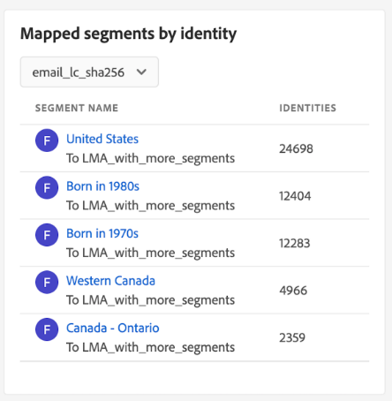
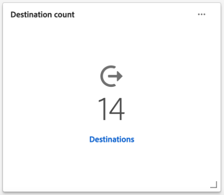

# Dashboard [!UICONTROL Ziele]

Die Benutzeroberfläche von Adobe Experience Platform verfügt über ein Dashboard, in dem Sie wichtige Informationen über die aktiven Ziele Ihres Unternehmens anzeigen können, die in einem täglichen Schnappschuss erfasst wurden. In diesem Handbuch wird beschrieben, wie Sie in der Benutzeroberfläche auf das Ziele-Dashboard zugreifen und mit ihm arbeiten können. Außerdem erhalten Sie weitere Informationen zu den im Dashboard angezeigten Metriken.

Eine Übersicht über Ziele sowie einen Katalog aller in Experience Platform verfügbaren Ziele finden Sie in der [Dokumentation zu Zielen](../../destinations/home.md).

## Daten des [!UICONTROL Ziele]-Dashboards {#destinations-dashboard-data}

Im Dashboard „Ziele“ finden Sie eine Momentaufnahme der Ziele, die Ihre Organisation in Experience Platform aktiviert hat. Die Momentaufnahme zeigt die Daten exakt so an, wie sie zum Zeitpunkt der Momentaufnahme aufgetreten sind. Das heißt, der Schnappschuss ist keine Annäherung oder Stichprobe der Daten, und das Ziele-Dashboard wird nicht in Echtzeit aktualisiert.

>[!NOTE]
>
>Änderungen oder Aktualisierungen, die seit der Aufnahme der Momentaufnahme an den Daten vorgenommen wurden, werden erst dann im Dashboard angezeigt, wenn die nächste Momentaufnahme erstellt wird.

## Das [!UICONTROL Ziele]-Dashboard erkunden {#explore}

Um in der Platform-Benutzeroberfläche zum Ziele-Dashboard zu gelangen, wählen Sie **[!UICONTROL Ziele]** in der linken Leiste und dann die Registerkarte **[!UICONTROL Übersicht]** aus.

Datum und Uhrzeit des letzten Schnappschusses werden oben in der [!UICONTROL Übersicht] neben dem Ziel-Dropdown-Menü angezeigt. Alle Widget-Daten sind zum Stand dieses Datums und dieser Uhrzeit korrekt. Der Zeitstempel der Momentaufnahme wird im UTC-Format angegeben, nicht in der Zeitzone der jeweiligen Person oder Organisation.

>[!NOTE]
>
>Wenn Experience Platform neu in Ihrem Unternehmen ist und es noch keine aktiven Ziele hat, sind das Ziele-Dashboard und die Registerkarte [!UICONTROL Übersicht] nicht zu sehen. Wenn Sie [!UICONTROL Ziele] über die linke Navigation auswählen, wird stattdessen die Registerkarte [!UICONTROL Katalog] angezeigt. Weitere Informationen über die Registerkarte [!UICONTROL Katalog] finden Sie im Handbuch zum Arbeitsbereich [[!UICONTROL Ziele]](../../destinations/ui/destinations-workspace.md).

### Das [!UICONTROL Ziele]-Dashboard modifizieren {#modify}

Wählen Sie **[!UICONTROL Dashboard modifzieren]** aus, um das Erscheinungsbild des Ziele-Dashboards zu ändern. Änderungen am Dashboard gelten pro Benutzer und nicht für die gesamte Organisation. Sie können Widgets aus dem Dashboard verschieben, hinzufügen, ändern und entfernen und auf die Widget-Bibliothek zugreifen, um Ihr Dashboard anzupassen. In der Widget-Bibliothek können Sie die verfügbaren Widgets durchsuchen und benutzerdefinierte Widgets für Ihre Organisation erstellen.

Weitere Informationen finden Sie in der Dokumentation [Dashboards modifzieren](../customize/modify.md) und [Widget-Bibliothek – Übersicht](../customize/widget-library.md).

### Hinzufügen von Widgets {#add-widget}

Wählen Sie **[!UICONTROL Widget hinzufügen]** aus, um zur Widget-Bibliothek zu navigieren und eine Liste der verfügbaren Widgets anzuzeigen, die Sie Ihrem Dashboard hinzufügen können.

In der Widget-Bibliothek können Sie die Auswahl von Standard- und benutzerdefinierten Zielgruppen-Widgets durchsuchen. Informationen zum Hinzufügen von Widgets finden Sie in der Widget-Bibliothek-Dokumentation zum [Hinzufügen eines Widget](../customize/widget-library.md#add-widgets).

### SQL anzeigen {#view-sql}

Sie können die SQL, die die in Ihrem Dashboard visualisierten Einblicke generiert, mit einem Umschalter im [!UICONTROL Übersicht] Arbeitsbereich. Sie können sich die SQL Ihrer vorhandenen Einblicke inspirieren lassen, um neue Abfragen zu erstellen, die anhand Ihrer geschäftlichen Anforderungen eindeutige Einblicke aus Platform-Daten gewinnen. Weitere Informationen zu dieser Funktion finden Sie unter [Handbuch zur SQL-Benutzeroberfläche](../view-sql.md).

## Standard-Widgets {#default-widgets}

Für alle neuen Instanzen von Adobe Experience Platform wird ein standardmäßiges Widget-Load-out bereitgestellt, in dem die neuesten verfügbaren Einblicke aus Ihren Daten hervorgehoben werden. Die folgenden Widgets werden von Anfang an in Ihrer Segmentansicht vorkonfiguriert. Ausführliche Informationen zum Zweck und zur Funktion der Widgets finden Sie unten.

* [[!UICONTROL Am häufigsten verwendete Ziele]](#most-used-destinations)
* [[!UICONTROL Kürzlich erstellte Ziele]](#recently-created-destinations)
* [[!UICONTROL Kürzlich aktivierte Segmente]](#recently-activated-segments)

>[!NOTE]
>
>Seit dem 26. Juli 2023 [!UICONTROL Profile], [!UICONTROL Zielgruppen], und [!UICONTROL Ziele] Die Übersichts-Dashboards wurden für alle Benutzer, die ihre Ansichten in den letzten sechs Monaten nicht geändert haben, auf ein neues standardmäßiges Widget-Load-out zurückgesetzt.
>Weitere Informationen finden Sie in der Dokumentation unter [Profile](./profiles.md#default-widgets) und [Zielgruppen](./audiences.md#default-widgets) Standard-Widget-Abschnitte für Details darüber, welche Widgets als Teil der standardmäßigen Widget-Ladevorgänge einbezogen werden. Sie können Ihre Dashboard-Widgets weiterhin wie bisher anpassen.

## Standard-Widgets {#standard-widgets}

Adobe bietet mehrere Standard-Widgets, mit denen Sie verschiedene Metriken in Bezug auf Ihre Ziele visualisieren und die Vollständigkeit der für Ihre Datenanalyse verfügbaren Zielgruppen bewerten können. In der [!UICONTROL Widget-Bibliothek] können Sie auch benutzerdefinierte Widgets erstellen und für Ihre gesamte Organisation freigeben. Um mehr über das Erstellen benutzerdefinierter Widgets zu erfahren, lesen Sie zunächst den Abschnitt [Widget-Bibliothek – Übersicht](../customize/widget-library.md).

### Voraussetzungen {#prerequisites}

Bevor Sie mit den Beschreibungen der Standard-Widgets fortfahren, sollten Sie mit den Definitionen der folgenden Schlüsselbegriffe vertraut sein, die in der Dokumentation verwendet werden:

* **Segmentdefinition:** Eine Segmentdefinition ist **Regelsatz** zur Beschreibung der Hauptmerkmale oder des Verhaltens einer Zielgruppe verwendet werden. Diese Regeln enthalten Attribut- und Ereignisdaten, die die Profile als Teil einer Zielgruppe qualifizieren.
* **Zielgruppe**: Eine Gruppe von Personen, Konten, Haushalten oder anderen Entitäten, die gemeinsame Merkmale und Verhaltensweisen aufweisen.
* **Zugeordnet/Zuordnung**: Bei der Datenzuordnung werden Quelldatenfelder mit verwandten Zielfeldern in einem Ziel verknüpft.
* **Identität**: Eine Identität ist eine Kennung, die einen einzelnen Kunden eindeutig kennzeichnet, z. B. eine Cookie-ID, Geräte-ID oder E-Mail-ID.
* **Aktivieren**: Activate ist die Aktion, die ein Benutzer durchführt, um eine oder mehrere Zielgruppen einem Ziel wie Oracle Eloqua, Google oder Salesforce-Marketing Cloud zuzuordnen.

Um mehr über die einzelnen verfügbaren Standard-Widgets zu erfahren, wählen Sie den Namen eines Widgets aus der folgenden Liste aus:

* [[!UICONTROL Am häufigsten verwendete Ziele]](#most-used-destinations)
* [[!UICONTROL Kürzlich erstellte Ziele]](#recently-created-destinations)
* [[!UICONTROL Zuletzt aktivierte Zielgruppen]](#recently-activated-audiences)
* [[!UICONTROL Zuletzt aktivierte Zielgruppen nach Ziel]](#recently-activated-audiences-by-destination)
* [[!UICONTROL Trend der Zielgruppen-Größe]](#audience-size-trend)
* [[!UICONTROL Nicht zugeordnete Zielgruppen nach Identität]](#unmapped-audiences-by-identity)
* [[!UICONTROL Zugeordnete Zielgruppen nach Identität]](#mapped-audiences-by-identity)
* [[!UICONTROL Häufige Zielgruppen]](#common-audiences)
* [[!UICONTROL Zugeordnete Zielgruppen]](#mapped-audiences)
* [[!UICONTROL Zustand der zugeordneten Zielgruppe]](#mapped-audience-health)
* [[!UICONTROL Anzahl von Zielen]](#destinations-count)
* [[!UICONTROL Zielstatus]](#destination-status)
* [[!UICONTROL Aktive Ziele nach Zielplattform]](#active-destinations-by-destination-platform)
* [[!UICONTROL Aktivierte Zielgruppen für alle Ziele]](#activated-audiences-across-all-destinations)
* [[!UICONTROL Aktivierte Zielgruppen]](#activated-audiences)

### [!UICONTROL Am häufigsten verwendete Ziele] {#most-used-destinations}

>[!CONTEXTUALHELP]
>id="platform_dashboards_destinations_mostuseddestinations"
>title="Am häufigsten verwendete Ziele"
>abstract="Dieses Widget zeigt die aktivsten Ziele Ihres Unternehmens gemessen an der Anzahl der zugeordneten Zielgruppen an. Diese Zahlen sind zum Zeitpunkt des letzten Schnappschusses korrekt. Diese Rangfolge bietet Einblicke, welche Ziele derzeit am häufigsten verwendet werden, und hebt jene hervor, die möglicherweise nicht ausreichend genutzt werden."

Die **[!UICONTROL Am häufigsten verwendete Ziele]** -Widget zeigt die wichtigsten Ziele Ihres Unternehmens nach der Anzahl der zugeordneten Zielgruppen ab dem letzten Schnappschuss an. Diese Rangfolge bietet Einblicke, welche Ziele verwendet werden, und zeigt gleichzeitig, welche möglicherweise nicht genügend genutzt werden.

Wenn Sie beispielsweise gestern ein Ziel konfiguriert haben, ihm aber keine Zielgruppen zugeordnet haben, können Sie sehen, dass das Ziel derzeit nicht genutzt wird.

Die Anzahl der zugeordneten Zielgruppen, die in der [!UICONTROL Zielgruppenanzahl] -Spalte ist zum letzten täglichen Schnappschuss korrekt. Wenn Sie dem Ziel eine neue Zielgruppe zuordnen, wird die Anzahl erst aktualisiert, wenn der nächste Schnappschuss erstellt wurde.

Wählen Sie den Namen eines Ziels aus der Liste im Widget aus, um zu den Zieldetails für dieses Ziel zu navigieren. Sie können auch **[!UICONTROL Alle anzeigen]** auswählen, um zur Registerkarte **[!UICONTROL Durchsuchen]** zu navigieren, und dann den Namen eines Ziels auswählen, um dessen Details anzuzeigen.

### [!UICONTROL Kürzlich erstellte Ziele] {#recently-created-destinations}

>[!CONTEXTUALHELP]
>id="platform_dashboards_destinations_recentlycreateddestinations"
>title="Kürzlich erstellte Ziele"
>abstract="Dieses Widget zeigt eine Liste der zuletzt konfigurierten Ziele in Ihrer Organisation an."

Das Widget **[!UICONTROL Kürzlich erstellte Ziele]** versetzt Sie in die Lage, eine Liste der zuletzt konfigurierten Ziele Ihrer Organisation anzuzeigen.

Das angezeigte Erstellungsdatum entspricht der letzten täglichen Momentaufnahme. Mit anderen Worten: Wenn Sie ein neues Ziel erstellen, wird es erst nach der nächsten Momentaufnahme in der Liste angezeigt.

Wenn Sie den Namen eines Ziels in der im Widget angezeigten Liste auswählen, gelangen Sie zu den Zieldetails, die über die Registerkarte **[!UICONTROL Durchsuchen]** verknüpft sind. Sie können auch auf **[!UICONTROL Alle anzeigen]** klicken, um zur Registerkarte **[!UICONTROL Durchsuchen]** zu navigieren, und dann den Namen eines Ziels auswählen, um dessen Details anzuzeigen.

Weitere Informationen zum Konfigurieren bestimmter Zieltypen finden Sie in der [Dokumentation zu Zielen](../../destinations/home.md).

### [!UICONTROL Zuletzt aktivierte Zielgruppen] {#recently-activated-audiences}

>[!CONTEXTUALHELP]
>id="platform_dashboards_destinations_recentlyactivatedsegments"
>title="Zuletzt aktivierte Zielgruppen"
>abstract="Dieses Widget bietet eine Liste der Zielgruppen, die zuletzt einem Ziel zugeordnet wurden. Diese Liste enthält eine Momentaufnahme der Zielgruppen und Ziele, die aktiv im System verwendet werden, und kann bei der Fehlerbehebung bei fehlerhaften Zuordnungen hilfreich sein."

Die **[!UICONTROL Kürzlich aktivierte Zielgruppen]** -Widget stellt eine Liste der Zielgruppen bereit, die zuletzt einem Ziel zugeordnet wurden. Diese Liste enthält eine Momentaufnahme der Zielgruppen und Ziele, die aktiv im System verwendet werden, und kann bei der Fehlerbehebung bei fehlerhaften Zuordnungen hilfreich sein.

Die [!UICONTROL Aktualisiert] Das angezeigte Datum zeigt an, wann die Zielgruppe zuletzt für das Ziel aktiviert wurde, und ist auf den letzten täglichen Schnappschuss genau. Wenn Sie also eine Zielgruppe für das Ziel aktivieren, ändert sich das aktualisierte Datum erst, nachdem der nächste Schnappschuss erstellt wurde.

Wenn Sie den Namen einer Audience aus der im Widget angezeigten Liste auswählen, gelangen Sie zu den Details der Audience. Sie können auch **[!UICONTROL Alle anzeigen]** , um zur [!UICONTROL Zielgruppen] [!UICONTROL Durchsuchen] und wählen Sie dann den Namen einer Audience aus, um deren Details anzuzeigen.

Weitere Informationen zum Arbeiten mit Zielgruppen in Experience Platform finden Sie im Abschnitt [Übersicht über den Segmentierungsdienst](../../segmentation/home.md).

### [!UICONTROL Zuletzt aktivierte Zielgruppen nach Ziel] {#recently-activated-audiences-by-destination}

>[!CONTEXTUALHELP]
>id="platform_dashboards_destinations_recentlyactivatedsegmentsbydestination"
>title="Zuletzt aktivierte Zielgruppen nach Ziel"
>abstract="Dieses Widget zeigt in absteigender Reihenfolge die fünf am häufigsten aktivierten Zielgruppen für das Ziel an, das im Dropdown-Menü „Übersicht“ ausgewählt wurde."

Die **[!UICONTROL Kürzlich aktivierte Zielgruppen nach Ziel]** -Widget zeigt die fünf zuletzt aktivierten Zielgruppen in absteigender Reihenfolge an, je nach dem im Dropdown-Menü &quot;Übersicht&quot;ausgewählten Ziel. Sie ähnelt dem [!UICONTROL Kürzlich aktivierte Zielgruppen] Widget, aber die angezeigten Daten **only** gilt für das ausgewählte Ziel.

Dieses Widget enthält zwei Metriken: den Namen der Zielgruppen und das Datum, an dem die Zielgruppen zuletzt für das Ziel aktiviert wurden. Die angezeigten Daten sind zum Zeitpunkt der letzten täglichen Momentaufnahme korrekt.

Sie können die Details einer Audience anzeigen, indem Sie den Namen der Audience aus der gezeigten Liste auswählen.

Weitere Informationen finden Sie im Abschnitt Voraussetzungen für das [verwendete Begriffsdefinitionen](#prerequisites) in dieser Beschreibung.

### [!UICONTROL Trend der Zielgruppen-Größe] {#audience-size-trend}

>[!CONTEXTUALHELP]
>id="platform_dashboards_destinations_audiencesizetrend"
>title="Trend der Zielgruppen-Größe"
>abstract="Dieses Widget veranschaulicht die Anzahl der in der Zielgruppe enthaltenen Profile, die täglich an das Zielkonto gesendet werden. Mit dem ersten Dropdown-Menü wird der Zeitraum für die Entwicklung der Zielgruppe angepasst. Im zweiten Dropdown-Menü des Widgets wird die Zielgruppe für die Analyse ausgewählt. Das Ziel wird im Dropdown-Menü „Übersicht“ ausgewählt."

Die **[!UICONTROL Zielgruppengrößentrend]** Widget zeigt die Beziehung der Profilanzahl über einen bestimmten Zeitraum für eine Zielgruppe an, die diesem Zielkonto zugeordnet wurde. Das Widget verwendet ein Liniendiagramm, um die Anzahl der in der Zielgruppe enthaltenen Profile zu veranschaulichen, die täglich an das Zielkonto gesendet werden.

Ein Zeitraum für die Entwicklung der Zielgruppe in den letzten 30 Tagen, 90 Tagen oder 12 Monaten kann über das erste Dropdown-Menü angepasst werden.

Im zweiten Dropdown-Menü werden alle verfügbaren Zielgruppen aufgelistet, die an das im oberen Bereich des Dashboards ausgewählte Zielkonto gesendet werden können.

Das Widget **[!UICONTROL Entwicklung der Zielgruppengröße]** enthält oben rechts eine Schaltfläche [!UICONTROL Beschriftungen]. Wählen Sie **[!UICONTROL Beschriftungen]** aus, um den Dialog „Automatische Beschriftungen“ zu öffnen. Ein Modell für maschinelles Lernen generiert automatisch Untertitel, um die wichtigsten Trends und Ereignisse zu beschreiben, indem es die Diagramme und Zielgruppendaten analysiert.

### [!UICONTROL Nicht zugeordnete Zielgruppen nach Identität] {#unmapped-audiences-by-identity}

>[!CONTEXTUALHELP]
>id="platform_dashboards_destinations_unmappedsegmentsbyidentity"
>title="Nicht zugeordnete Zielgruppen nach Identität"
>abstract="Dieses Widget listet die fünf häufigsten **nicht zugeordneten** Zielgruppen auf, die nach absteigender Identitätsanzahl für ein bestimmtes Ziel und eine bestimmte Identität angeordnet werden. Die Filter-IDs, die im Dropdown-Menü des Widgets aufgeführt sind, ändern sich je nach dem Zielkonto, das oben auf der Übersichtsseite ausgewählt wurde."

Die **[!UICONTROL Nicht zugeordnete Zielgruppen nach Identität]** Widget listet die fünf obersten **nicht zugeordnet** Zielgruppen, die nach absteigender Identitätsanzahl für ein bestimmtes Ziel und eine bestimmte Identität geordnet sind. Es werden Zielgruppen hervorgehoben, die basierend auf der ausgewählten ID am besten dem ausgewählten Zielkonto zugeordnet werden können.

Das Dropdown-Menü Ziel-ID filtert Ihre verfügbaren Zielgruppen. Die im Dropdown-Menü aufgelisteten Filter-IDs ändern sich je nach dem Zielkonto, das oben auf der Übersichtsseite ausgewählt wurde.

In der Spalte &quot;Identitäten&quot;wird die Anzahl der Quell-IDs innerhalb der Zielgruppe gezählt, die der im Dropdown-Menü &quot;Widget-ID&quot;ausgewählten ID zugeordnet werden können.

Weitere Informationen finden Sie im Abschnitt Voraussetzungen für das [verwendete Begriffsdefinitionen](#prerequisites) in dieser Beschreibung.

### [!UICONTROL Zugeordnete Zielgruppen nach Identität] {#mapped-audiences-by-identity}

>[!CONTEXTUALHELP]
>id="platform_dashboards_destinations_mappedsegmentsbyidentity"
>title="Zugeordnete Zielgruppen nach Identität"
>abstract="Dieses Widget listet die fünf am häufigsten **zugeordneten** Zielgruppen auf. Die Liste wird in absteigender Reihenfolge nach der Anzahl der in den Zielgruppen enthaltenen Quell-IDs sortiert. Die zu zählende Ziel-ID wird aus dem Dropdown-Menü unter dem Widget-Titel ausgewählt. Die in der Widget-Dropdown-Liste verfügbaren Ziel-IDs hängen vom oben im Dashboard „Übersicht“ ausgewählten Ziel ab."

Dieses Widget listet die fünf am häufigsten **zugeordneten** Zielgruppen auf. Die Liste wird in absteigender Reihenfolge nach der Anzahl der in den Zielgruppen enthaltenen Quell-IDs sortiert. Die zu zählende Ziel-ID wird aus dem Dropdown-Menü unter dem Widget-Titel ausgewählt. Die Ziel-IDs, die über die Dropdown-Liste im Widget verfügbar sind, ändern sich entsprechend dem Zielkontofilter, der oben im Dashboard „Übersicht“ ausgewählt wird.

Die **[!UICONTROL Zugeordnete Zielgruppen nach Identität]** Widget hebt auf einen Blick die Wahrscheinlichkeit eines erfolgreichen Targetings von Profilmöglichkeiten für eine Kampagne innerhalb des ausgewählten Ziels hervor. Eine effiziente zielgerichtete Kampagne hängt nicht von der Anzahl der an das Ziel gesendeten Profile ab, sondern von der Anzahl der Quell-IDs, die mit großer Wahrscheinlichkeit den Ziel-IDs zugeordnet werden können, um nützliche und verwertbare Daten bereitzustellen.

### Häufige Zielgruppen {#common-audiences}

>[!CONTEXTUALHELP]
>id="platform_dashboards_destinations_commonaudiences"
>title="Häufige Zielgruppen"
>abstract="Dieses Widget bietet eine Liste der fünf wichtigsten Zielgruppen, die für das am oberen Seitenrand ausgewählte Zielkonto aktiviert wurden, sowie das im Widget-Dropdown-Menü ausgewählte Ziel. Die Liste der Zielgruppen wird nach dem Zeitpunkt ihrer Aktivierung geordnet. Die zuletzt aktivierte Zielgruppe wird oben angezeigt."

Die **[!UICONTROL Häufige Zielgruppen]** Widget bietet eine Liste der fünf wichtigsten Zielgruppen, die für das am oberen Seitenrand ausgewählte Zielkonto aktiviert werden, sowie das im Widget-Dropdown-Menü ausgewählte Ziel. Die Liste der Zielgruppen wird nach dem Zeitpunkt ihrer Aktivierung geordnet. Die zuletzt aktivierte Zielgruppe wird oben angezeigt.

Die [!UICONTROL AUDIENCE SIZE] gibt die Gesamtzahl der Profile jeder aufgelisteten Zielgruppe an.

### Zugeordnete Zielgruppen {#mapped-audiences}

Das Widget [!UICONTROL Zugeordnete Zielgruppen] zeigt die Gesamtanzahl der zugeordneten Zielgruppen an, die für das am oberen Seitenrand ausgewählte Ziel aktiviert werden können.

Auswählen **[!UICONTROL Zielgruppen]** Navigieren zum Zielgruppen-Dashboard [!UICONTROL Durchsuchen] Registerkarte. Dieser Arbeitsbereich enthält eine Liste aller Segmentdefinitionen für Ihre Organisation.

### Zustand der zugeordneten Zielgruppe {#mapped-audience-health}

>[!CONTEXTUALHELP]
>id="platform_dashboards_destinations_mappedaudiencehealth"
>title="Zustand der zugeordneten Zielgruppe"
>abstract="Dieses Widget bietet eine Liste von bis zu 20 zugeordneten Zielgruppen, deren Gesamtprofilanzahl um einen Faktor von mindestens einer Standardabweichung vom 30-Tage-Mittelwert der Zielgruppengröße abweicht, die diesem Ziel zugeordnet ist. Es bietet eine berechnete Metrik für die Streuung der Zielgruppengrößen vom Mittelwert der letzten 30 Tage. Die Zielgruppengrößen werden absteigend sortiert."

Das Widget bietet eine Liste von bis zu 20 zugeordneten Zielgruppen, deren Gesamtzahl der Profile ab der letzten täglichen Momentaufnahme um einen Faktor von mindestens einer Standardabweichung von der 30 Tage mittleren Zielgruppengröße, die diesem Ziel zugeordnet ist, abweicht.

Kurz gesagt, es bietet eine berechnete Metrik für die Streuung der Zielgruppengrößen vom Mittelwert der letzten 30 Tage. Dabei wird verglichen, ob die heutige Zielgruppengröße außerhalb der historischen Standardabweichung liegt, die in den Daten der letzten 30 Tage zu beobachten war.

Alle Zielgruppengrößen im System werden von der größten zur kleinsten Zielgruppengröße sortiert, wie in der Spalte [!UICONTROL NEUESTE GRÖSSE] angegeben.

Wenn die Anzahl Ihrer zugeordneten Zielgruppenprofile außerhalb einer Standardabweichung von der durchschnittlichen zugeordneten Profilgröße in den letzten 30 Tagen liegt, deutet dies auf eine Anomalie im System hin und sollte untersucht werden.

Wenn eine Zielgruppe innerhalb der [!UICONTROL Zugewiesene Zielgruppen-Konsistenz] um einen breiten Rand abweichen, sollten Sie sich auf das Trend-Diagramm zur Zielgruppengröße beziehen und die anormale Zielgruppe finden. Der Trend kann weitere Einblicke in die Gesundheit Ihrer Zielgruppe bieten.

>[!NOTE]
>
>Die Standardgröße des Widgets „Zustand der zugeordneten Zielgruppen“ kann die Tabelleninformationen überdecken. Ändern Sie die Größe des Widgets, um die Lesbarkeit Ihrer zugeordneten Zielgruppennamen und Spaltentitel zu verbessern. Anleitungen dazu finden Sie in der Dokumentation zum Ändern von Dashboards unter [Größe eines Widgets ändern](../customize/modify.md).

### [!UICONTROL Anzahl der Ziele] {#destinations-count}

>[!CONTEXTUALHELP]
>id="platform_dashboards_destinations_destinationscount"
>title="Anzahl der Ziele"
>abstract="Dieses Widget gibt die Gesamtzahl der verfügbaren Endpunkte an, an denen eine Zielgruppe im System aktiviert und bereitgestellt werden kann. Diese Zahl umfasst sowohl aktive als auch inaktive Ziele."

Das Widget [!UICONTROL Anzahl der Ziele] gibt die Gesamtzahl der verfügbaren Endpunkte an, an denen eine Zielgruppe im System aktiviert und bereitgestellt werden kann. Diese Zahl umfasst sowohl aktive als auch inaktive Ziele.

Wählen Sie unter der Gesamtzahl die Option **[!UICONTROL Ziele]** aus, um zur Registerkarte zum Durchsuchen von Zielen zu navigieren. Auf dieser Seite werden alle Ziele aufgelistet, mit denen Sie bisher eine Verbindung hergestellt haben.

### [!UICONTROL Zielstatus] {#destination-status}

Das Widget [!UICONTROL Zielstatus] zeigt die Gesamtzahl der aktivierten Ziele als einzelne Metrik an und veranschaulicht in einem Ringdiagramm den proportionalen Unterschied zwischen aktivierten und deaktivierten Zielen.

Die jeweilige Anzahl für aktivierte oder deaktivierte Ziele wird in einem Dialogfeld angezeigt, wenn der Cursor über den entsprechenden Abschnitt des Ringdiagramms bewegt wird.

### [!UICONTROL Aktive Ziele nach Zielplattform] {#active-destinations-by-destination-platform}

Das Widget bietet eine zweispaltige Tabelle, um eine Liste der aktiven Zielplattformen und die Gesamtzahl der aktiven Ziele für jede Zielplattform anzuzeigen. Die Liste der Zielplattformen ist von der höchsten zur niedrigsten sortiert.

### [!UICONTROL Aktivierte Zielgruppen für alle Ziele] {#activated-audiences-across-all-destinations}

Das Widget [!UICONTROL Aktivierte Zielgruppen für alle Ziele] stellt die Gesamtzahl der Zielgruppen bereit, die für alle Ziele in einer einzelnen Metrik aktiviert sind. Diese Zahl entspricht der Anzahl beim aktuellen Schnappschuss.

Wählen Sie **[!UICONTROL Zielgruppen]** aus, um zur Registerkarte [!UICONTROL Durchsuchen] der Ziele zu navigieren. Diese Seite enthält eine Liste aller aktivierten Ziele und zahlreiche relevante Metriken. Weitere Informationen zu finden Sie in der Dokumentation . [[!UICONTROL Durchsuchen] tab](../../destinations/ui/destinations-workspace.md#browse).

Weitere Informationen finden Sie im Abschnitt Voraussetzungen für das [verwendete Begriffsdefinitionen](#prerequisites) in dieser Beschreibung.

### [!UICONTROL Aktivierte Zielgruppen] {#activated-audiences}

Dieses Widget bietet eine einzelne Metrik für die Gesamtzahl der für ein Ziel aktivierten Zielgruppen.

Wählen Sie **[!UICONTROL Zielgruppen]** aus, um zur Detailseite des Ziel-Dashboards zu navigieren. Die [!UICONTROL Aktivierungsdaten] zeigt eine Liste der Zielgruppen an, die dem Ziel zugeordnet wurden, einschließlich des Anfangs- und Enddatums (falls zutreffend) sowie anderer relevanter Informationen für den Datenexport, wie Exporttyp, -zeitplan und -frequenz. Um Details zu einer bestimmten Zielgruppe anzuzeigen, wählen Sie deren Namen aus dem [!UICONTROL Zielgruppenname] Spalte.

Dieses Widget hilft Ihnen, den Wert Ihrer Ziele anhand der Anzahl der aktivierten Zielgruppen auf einen Blick zu erfassen. Es bietet auch einfachen Zugriff auf detailliertere Informationen, die für weitere Analysen verwendet werden können.

Weitere Informationen finden Sie im Abschnitt Voraussetzungen für das [verwendete Begriffsdefinitionen](#prerequisites) in dieser Beschreibung.

## Nächste Schritte

Wenn Sie dieses Dokument gelesen haben, sollten Sie jetzt in der Lage sein, das Ziel-Dashboard zu finden und die in den verfügbaren Widgets angezeigten Metriken zu verstehen. Weitere Informationen zum Arbeiten mit Zielen in Experience Platform finden Sie in der [Dokumentation zu Zielen](../../destinations/home.md).
