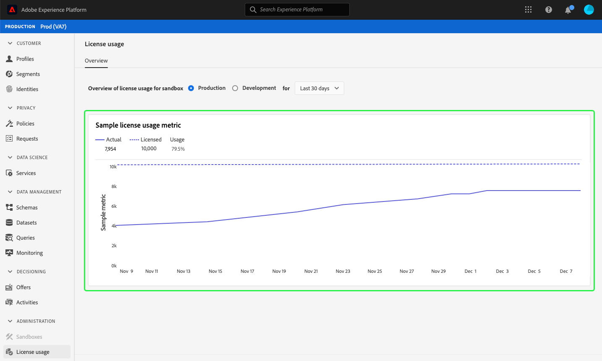

# (Beta) [!UICONTROL Lizenzverwendung] Dashboard {#license-usage-dashboard}

>[!IMPORTANT]
>
>Die in diesem Dokument beschriebene Dashboard-Funktion befindet sich derzeit in der Beta-Version und steht nicht allen Benutzern zur Verfügung. Die Dokumentation und Funktionalität können sich ändern.

Die Adobe Experience Platform-Benutzeroberfläche (UI) bietet ein Dashboard, mit dem Sie wichtige Informationen zur Lizenznutzung in Ihrem Unternehmen, wie sie in einem täglichen Schnappschuss erfasst werden, Ansichten vornehmen können. In diesem Handbuch wird beschrieben, wie Sie auf das Lizenzverwendungs-Dashboard in der Benutzeroberfläche zugreifen und mit ihm arbeiten. Außerdem werden weitere Informationen zu den Visualisierungen im Dashboard bereitgestellt.

Eine allgemeine Übersicht über die Plattform-Benutzeroberfläche finden Sie im Handbuch [Experience Platform UI guide](../../landing/ui-guide.md).

## Daten zum Dashboard der Lizenzverwendung

Das Dashboard zur Lizenznutzung zeigt eine Momentaufnahme der lizenzbezogenen Daten Ihres Unternehmens zur Experience Platform an. Die Daten im Dashboard werden exakt so angezeigt, wie sie zu dem Zeitpunkt angezeigt werden, zu dem der Schnappschuss erstellt wurde. Das heißt, der Schnappschuss ist keine Annäherung oder Stichprobe der Daten und das Dashboard wird nicht in Echtzeit aktualisiert.

>[!NOTE]
>
>Änderungen oder Aktualisierungen, die seit der Erstellung des Schnappschusses an den Daten vorgenommen wurden, werden erst dann im Dashboard angezeigt, wenn der nächste Schnappschuss erstellt wurde.

## Dashboard zur Lizenznutzung

Um zum Dashboard zur Lizenzverwendung in der Plattform-Benutzeroberfläche zu navigieren, wählen Sie in der linken Leiste **[!UICONTROL Lizenzverwendung]**. Dies wird mit der Registerkarte **[!UICONTROL Übersicht]** geöffnet, auf der das Dashboard angezeigt wird.

### Sandbox auswählen

Um eine zu Ansicht Sandbox im Dashboard auszuwählen, wählen Sie entweder [!UICONTROL Produktion] oder [!UICONTROL Entwicklung]. Die ausgewählte Sandbox wird durch das Optionsfeld neben dem Sandbox-Namen angezeigt.

>[!NOTE]
>
>Der Berichte &quot;Verbrauch&quot;für Sandboxen ist für alle Sandboxen desselben Typs kumulativ. Mit anderen Worten, wenn Sie [!UICONTROL Produktion] oder [!UICONTROL Entwicklung] auswählen, werden Berichte zu allen Produktions- bzw. Entwicklungs-Sandboxen erstellt.

### Datumsbereich auswählen

Nach Auswahl einer Sandbox können Sie mit der Dropdownliste Datumsbereich den Zeitraum auswählen, der im Dashboard angezeigt werden soll. Es stehen drei Optionen zur Verfügung: [!UICONTROL Letzte 30 Tage], [!UICONTROL Letzte 90 Tage] und [!UICONTROL Letzte 12 Monate]. Die letzten 30 Tage sind standardmäßig ausgewählt.

### Widgets und Metriken

Das Dashboard zur Lizenznutzung besteht aus Widgets, die schreibgeschützte Metriken anzeigen, die wichtige Informationen zur Lizenznutzung in Ihrem Unternehmen enthalten. Weitere Informationen zu diesen Widgets finden Sie im Abschnitt zu den verfügbaren Widgets in diesem Handbuch.

## Verfügbare Widgets {#available-widgets}

Experience Platform stellt derzeit ein Widget zur Verfügung, mit dem Sie die Lizenznutzung visualisieren können. Weitere Widgets werden demnächst veröffentlicht.

### [!UICONTROL Addressable Audiencen] {#addressable-audiences}

Das Widget **[!UICONTROL Addressable Audiencen]** zeigt die Gesamtanzahl der zusammengeführten Profil im Profil Data Store an, nachdem eine systemgenerierte Zusammenführungsrichtlinie angewendet wurde, um Profil-Fragmente aus allen vorhandenen Datensätzen mit einem deterministischen (privaten) Diagrammalgorithmus zu kombinieren.

Weitere Informationen zu Fragmenten und zusammengeführten Profilen finden Sie im Abschnitt *Profil-Fragmente vs. zusammengeführte Profil* des [Profil-Überblicks](../../profile/home.md).

>[!NOTE]
>
>Die zur Berechnung dieser Metrik verwendete Richtlinie zum Zusammenführen wird von der Experience Platform generiert und kann nicht bearbeitet werden. Es kann auch keine andere Richtlinie zum Zusammenführen ausgewählt werden. Diese systemgenerierte Mergerichtlinie ist nicht mit der standardmäßigen Mergerichtlinie identisch, die zur Berechnung der [!UICONTROL Audience] im [!DNL Profile]-Dashboard verwendet wird. Daher ist es unwahrscheinlich, dass die Audience in den Dashboards [!UICONTROL Lizenznutzung] und [!DNL Profile] genau gleich ist.

## Nächste Schritte

Indem Sie diesem Dokument folgen, sollten Sie nun in der Lage sein, das Dashboard zur Lizenznutzung zu finden und eine Sandbox zur Ansicht auszuwählen. Sie sollten auch die Metriken verstehen, die in den verfügbaren Widgets angezeigt werden. Weitere Informationen zur Benutzeroberfläche der Experience Platform finden Sie im Handbuch [Plattformbenutzeroberfläche](../../landing/ui-guide.md).