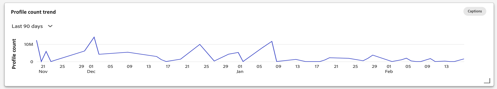

# [!UICONTROL Profile] Dashboard

Die Adobe Experience Platform-Benutzeroberfläche bietet ein Dashboard, über das Sie wichtige Informationen zu Ihrer [!DNL Real-time Customer Profile] Daten, wie sie in einer täglichen Momentaufnahme erfasst werden. In diesem Handbuch wird beschrieben, wie Sie auf die [!UICONTROL Profile] -Dashboard in der Benutzeroberfläche angezeigt und bietet Informationen zu den im Dashboard angezeigten Metriken.

Einen Überblick über alle Profilfunktionen in der Benutzeroberfläche der Experience Platform erhalten Sie im [Handbuch zur Benutzeroberfläche des Echtzeit-Kundenprofils](../../profile/ui/user-guide.md).

## Profil-Dashboard-Daten

Die [!UICONTROL Profile] Dashboard zeigt eine Momentaufnahme der Attributdaten (Datensatzdaten) an, die Ihr Unternehmen im Profilspeicher in der Experience Platform hat. Der Schnappschuss enthält keine Ereignisdaten (Zeitreihendaten).

Die Attributdaten im Snapshot zeigen die Daten exakt so an, wie sie zu dem Zeitpunkt angezeigt werden, zu dem die Momentaufnahme erstellt wurde. Mit anderen Worten, der Schnappschuss ist keine Annäherung oder Stichprobe der Daten, und das Profil-Dashboard wird nicht in Echtzeit aktualisiert.

>[!NOTE]
>
>Änderungen oder Aktualisierungen, die seit der Aufnahme des Schnappschusses an den Daten vorgenommen wurden, werden erst dann im Dashboard angezeigt, wenn der nächste Schnappschuss erstellt wurde.

## Die [!UICONTROL Profile] Dashboard

So navigieren Sie zum [!UICONTROL Profile] Dashboard in der Platform-Benutzeroberfläche auswählen **[!UICONTROL Profile]** Wählen Sie in der linken Leiste die **[!UICONTROL Übersicht]** zum Anzeigen des Dashboards.

>[!NOTE]
>
>Wenn Ihr Unternehmen neu bei Platform ist und noch keine aktiven Profildatensätze oder Zusammenführungsrichtlinien erstellt wurden, wird die [!UICONTROL Profile] Das Dashboard ist nicht sichtbar. Stattdessen wird die [!UICONTROL Übersicht] enthält Links und Dokumentation, die Ihnen bei den ersten Schritten mit dem Echtzeit-Kundenprofil helfen.

### Ändern der [!UICONTROL Profile] Dashboard

Sie können das Erscheinungsbild der [!UICONTROL Profile] Dashboard durch Auswahl von **[!UICONTROL Dashboard ändern]**. Dadurch können Sie Widgets aus dem Dashboard verschieben, hinzufügen und entfernen sowie auf die **[!UICONTROL Widget-Bibliothek]** , um verfügbare Widgets zu erkunden und benutzerdefinierte Widgets für Ihre Organisation zu erstellen.

Weitere Informationen finden Sie unter [Ändern von Dashboards](../customize/modify.md) und [Übersicht über die Widget-Bibliothek](../customize/widget-library.md) Dokumentation .

## (Beta) Einblicke in die Profilwirksamkeit {#profile-efficacy-insights}

>[!IMPORTANT]
>
>Die Funktion zur Einsicht der Wirksamkeit des Profils befindet sich derzeit in der Betaphase und steht nicht allen Anwendern zur Verfügung. Die Dokumentation und Funktionalität können sich ändern.

Die [!UICONTROL Wirksamkeit] -Tab liefert Metriken zur Qualität und Vollständigkeit Ihrer Profildaten mithilfe von Widgets zur Profilwirksamkeit. Diese Widgets veranschaulichen auf einen Blick die Zusammensetzung Ihrer Profile, Trends in der Vollständigkeit im Zeitverlauf und Bewertungen der Qualität Ihrer Profildaten.

Siehe [Abschnitt mit Widgets zur Profilwirksamkeit](#profile-efficacy-widgets) für weitere Informationen zu den momentan verfügbaren Widgets.

Das Layout dieses Dashboards kann auch durch Auswahl von [**[!UICONTROL Dashboard ändern]**](../customize/modify.md) von [!UICONTROL Übersicht] Registerkarte.

## Profile durchsuchen {#browse-profiles}

Die [!UICONTROL Durchsuchen] -Tab können Sie die schreibgeschützten Profile durchsuchen und anzeigen, die in Ihrer IMS-Organisation erfasst wurden. Von hier aus können Sie wichtige Informationen aus dem Profil bezüglich Voreinstellungen, vergangener Ereignisse, Interaktionen und Segmenten sehen

Weitere Informationen zu den in der Platform-Benutzeroberfläche bereitgestellten Funktionen zur Profilanzeige finden Sie in der Dokumentation unter [Durchsuchen von Profilen in Real-time Customer Data Platform](../../rtcdp/profile/profile-browse.md).

## Zusammenführungsrichtlinien {#merge-policies}

Die in der [!UICONTROL Profile] Dashboard basiert auf Zusammenführungsrichtlinien, die auf Ihre Echtzeit-Kundenprofildaten angewendet werden. Wenn Daten aus mehreren Quellen zusammengeführt werden, um das Kundenprofil zu erstellen, können die Daten widersprüchliche Werte enthalten. Beispielsweise kann ein Datensatz einen Kunden als &quot;einzeln&quot;auflisten, während ein anderer Datensatz den Kunden als &quot;verheiratet&quot;auflisten kann. Es ist der Auftrag der Zusammenführungsrichtlinie, zu bestimmen, welche Daten als Teil des Profils priorisiert und angezeigt werden sollen.

Weitere Informationen zu Zusammenführungsrichtlinien, einschließlich der Erstellung, Bearbeitung und Deklarierung einer standardmäßigen Zusammenführungsrichtlinie für Ihre Organisation, finden Sie im Abschnitt [Übersicht über Zusammenführungsrichtlinien](../../profile/merge-policies/overview.md).

Das Dashboard wählt automatisch eine anzuzeigende Zusammenführungsrichtlinie aus, Sie können jedoch die ausgewählte Zusammenführungsrichtlinie über das Dropdown-Menü ändern. Um eine andere Zusammenführungsrichtlinie auszuwählen, wählen Sie das Dropdown-Menü neben dem Namen der Zusammenführungsrichtlinie und dann die Zusammenführungsrichtlinie aus, die Sie anzeigen möchten.

>[!NOTE]
>
>Im Dropdown-Menü werden nur Zusammenführungsrichtlinien angezeigt, die sich auf die Klasse &quot;XDM Individual Profile&quot;beziehen. Wenn Ihr Unternehmen jedoch mehrere Zusammenführungsrichtlinien erstellt hat, müssen Sie möglicherweise einen Bildlauf durchführen, um die vollständige Liste der verfügbaren Zusammenführungsrichtlinien anzuzeigen.

## Vereinigungsschemas

Die [!UICONTROL Vereinigungsschema] Dashboard zeigt das Vereinigungsschema für eine bestimmte XDM-Klasse an. Durch Auswahl der **[!UICONTROL Klasse]** -Dropdown-Liste können Sie die Vereinigungsschemas für verschiedene XDM-Klassen anzeigen.

Vereinigungsschemas bestehen aus mehreren Schemas, die dieselbe Klasse teilen und für Profile aktiviert wurden. Sie ermöglichen es Ihnen, in einer einzigen Ansicht eine Zusammenführung aller Felder zu sehen, die in jedem Schema enthalten sind, das dieselbe Klasse aufweist.

Weitere Informationen finden Sie im Handbuch zur Benutzeroberfläche des Vereinigungsschemas . [Anzeigen von Vereinigungsschemas in der Platform-Benutzeroberfläche](../../profile/ui/union-schema.md#view-union-schemas).

## Widgets und Metriken

Das Dashboard besteht aus Widgets, die schreibgeschützte Metriken sind und wichtige Informationen zu Ihren Profildaten enthalten.

Das Datum und die Uhrzeit der letzten Aktualisierung eines Widgets zeigen an, wann die letzte Momentaufnahme der Daten erstellt wurde. Datum und Uhrzeit der Momentaufnahme werden in UTC angegeben. Es befindet sich nicht in der Zeitzone des einzelnen Benutzers oder der IMS-Organisation.

## Standard-Widgets

Adobe bietet mehrere Standard-Widgets, mit denen Sie verschiedene Metriken im Zusammenhang mit Ihren Profildaten visualisieren können. Sie können auch benutzerdefinierte Widgets erstellen, die für Ihre Organisation freigegeben werden, indem Sie die [!UICONTROL Widget-Bibliothek]. Um mehr über das Erstellen benutzerdefinierter Widgets zu erfahren, lesen Sie zunächst den Abschnitt [Übersicht über die Widget-Bibliothek](../customize/widget-library.md).

Um mehr über die einzelnen verfügbaren Standard-Widgets zu erfahren, wählen Sie den Namen eines Widgets aus der folgenden Liste aus:

* [[!UICONTROL Anzahl der Profile]](#profile-count)
* [[!UICONTROL Hinzugefügte Profile]](#profiles-added)
* [[!UICONTROL Hinzugefügte Trends bei Profilen]](#profiles-added-trend)
* [[!UICONTROL Profile nach Identität]](#profiles-by-identity)
* [[!UICONTROL Identitätsüberschneidung]](#identity-overlap)
* [[!UICONTROL Einzelne Identitätsprofile]](#single-identity-profiles)
* [[!UICONTROL Nicht segmentierte Profile]](#unsegmented-profiles)
* [[!UICONTROL Trend zu nicht segmentierten Profilen]](#unsegmented-profiles-trend)
* [[!UICONTROL Nicht segmentierte Profile nach Identität]](#unsegmented-profiles-by-identity)
* [[!UICONTROL Zielgruppen, die dem Zielstatus zugeordnet sind]](#audiences-mapped-to-destination-status)
* [[!UICONTROL Zielgruppengröße]](#audiences-size)
* [[!UICONTROL Trend zur Profilanzahl]](#profile-count-trend)
* [[!UICONTROL Einzelne Identitätsprofile nach Identität]](#single-identity-profiles-by-identity)

### [!UICONTROL Anzahl der Profile] {#profile-count}

Die **[!UICONTROL Profilanzahl]** Widget zeigt die Gesamtzahl der zusammengeführten Profile im Profilspeicher zum Zeitpunkt der Momentaufnahme an. Diese Zahl ist das Ergebnis der ausgewählten Zusammenführungsrichtlinie, die auf Ihre Profildaten angewendet wird, um Profilfragmente zu einem einzelnen Profil für jede Person zusammenzuführen.

Siehe [Abschnitt zu Zusammenführungsrichtlinien weiter oben in diesem Dokument](#merge-policies) , um mehr zu erfahren.

>[!NOTE]
>
>Die [!UICONTROL Profilanzahl] Das Widget kann eine andere Zahl anzeigen als die in der [!UICONTROL Durchsuchen] im [!UICONTROL Profile] aus mehreren Gründen. Der häufigste Grund dafür ist, dass die [!UICONTROL Durchsuchen] -Registerkarte gibt die Gesamtzahl der zusammengeführten Profile basierend auf der standardmäßigen Zusammenführungsrichtlinie Ihres Unternehmens an, während die Variable [!UICONTROL Profilanzahl] -Widget verweist auf die Gesamtzahl der zusammengeführten Profile basierend auf der Zusammenführungsrichtlinie, die Sie im Dashboard angezeigt haben.
>
>Ein weiterer häufiger Grund sind die Unterschiede zwischen der Zeit, zu der der Dashboard-Schnappschuss erstellt wird, und der Zeit, zu der der Beispielauftrag für die [!UICONTROL Durchsuchen] Registerkarte. Sie können sehen, wann die [!UICONTROL Profilanzahl] Widget wurde zuletzt aktualisiert, indem der Zeitstempel im Widget betrachtet wurde und um mehr darüber zu erfahren, wie der Beispielauftrag im [!UICONTROL Durchsuchen] Registerkarte, siehe [Abschnitt zur Profilanzahl im Handbuch zur Benutzeroberfläche des Echtzeit-Kundenprofils](https://experienceleague.adobe.com/docs/experience-platform/profile/ui/user-guide.html?lang=en#profile-count).

### [!UICONTROL Hinzugefügte Profile] {#profiles-added}

Die **[!UICONTROL Hinzugefügte Profile]** -Widget zeigt die Gesamtzahl der zusammengeführten Profile an, die zum Profilspeicher hinzugefügt wurden, und zwar ab dem letzten abgerufenen Schnappschuss. Diese Zahl ist das Ergebnis der ausgewählten Zusammenführungsrichtlinie, die auf Ihre Profildaten angewendet wird, um Profilfragmente zu einem einzelnen Profil für jede Person zusammenzuführen. Mit der Dropdown-Auswahl können Sie die Profile anzeigen, die in den letzten 30 Tagen, 90 Tagen oder 12 Monaten hinzugefügt wurden.

>[!NOTE]
>
>Die [!UICONTROL Hinzugefügte Profile] Widget spiegelt die Anzahl der hinzugefügten Profile wider **after** die anfängliche Profilaufnahme und die Einrichtung des Profilspeichers. Mit anderen Worten: Wenn Ihr Unternehmen den Profilspeicher eingerichtet hat und 4.000.000 an Tag 1 aufgenommen hat, wäre das Dashboard innerhalb von 24 Stunden verfügbar, jedoch würde die [!UICONTROL Hinzugefügte Profile] -Widget auf 0 gesetzt. Dies geschieht, um eine Spitze zu vermeiden, die mit der anfänglichen Aufnahme von Profilen in das System verbunden ist. In den nächsten 30 Tagen nimmt Ihr Unternehmen weitere 1.000.000 Profile in den Profilspeicher auf. Nachdem der nächste Schnappschuss erstellt wurde, wird die [!UICONTROL Hinzugefügte Profile] würde das Widget insgesamt 1.000.000 Profile anzeigen, während die [!UICONTROL Profilanzahl] -Widget würde insgesamt 5.000.000 Profile anzeigen.

### [!UICONTROL Hinzugefügte Trends bei Profilen] {#profiles-added-trend}

Die **[!UICONTROL Hinzugefügte Trends bei Profilen]** Widget zeigt die Gesamtanzahl der zusammengeführten Profile an, die in den letzten 30 Tagen, 90 Tagen oder 12 Monaten täglich zum Profilspeicher hinzugefügt wurden. Diese Zahl wird jeden Tag aktualisiert, wenn die Momentaufnahme erstellt wird. Wenn Sie also Profile in Platform aufnehmen möchten, wird die Anzahl der Profile erst angezeigt, wenn die nächste Momentaufnahme erfolgt. Die Anzahl der hinzugefügten Profile ist das Ergebnis der ausgewählten Zusammenführungsrichtlinie, die auf Ihre Profildaten angewendet wird, um Profilfragmente zusammenzuführen und so für jede Person ein Profil zu erstellen.

Siehe [Abschnitt zu Zusammenführungsrichtlinien weiter oben in diesem Dokument](#merge-policies) , um mehr zu erfahren.

Die **[!UICONTROL Hinzugefügte Trends bei Profilen]** -Widget zeigt oben rechts im Widget die Schaltfläche &quot;Untertitel&quot;an. Auswählen **[!UICONTROL Untertitel]** , um das Dialogfeld mit den automatischen Beschriftungen zu öffnen.

Ein Modell für maschinelles Lernen generiert automatisch Untertitel zur Beschreibung der wichtigsten Trends und Ereignisse, indem es die Grafik und die Daten analysiert.

### [!UICONTROL Profile nach Identität] {#profiles-by-identity}

Die **[!UICONTROL Profile nach Identität]** -Widget zeigt die Aufschlüsselung der Identitäten über alle zusammengeführten Profile in Ihrem Profilspeicher an. Die Gesamtzahl der Profile nach Identität (d. h. das Addieren der für jeden Namespace angezeigten Werte) kann höher sein als die Gesamtzahl der zusammengeführten Profile, da einem Profil mehrere Namespaces zugeordnet sein können. Wenn beispielsweise ein Kunde mit Ihrer Marke auf mehr als einem Kanal interagiert, werden diesem einzelnen Kunden mehrere Namespaces zugeordnet.

Siehe [Abschnitt zu Zusammenführungsrichtlinien weiter oben in diesem Dokument](#merge-policies) , um mehr zu erfahren.

Auswählen **[!UICONTROL Untertitel]** , um das Dialogfeld mit den automatischen Beschriftungen zu öffnen.

Ein maschinelles Lernmodell generiert automatisch Dateneinblicke, indem es die Gesamtverteilung und die Schlüsseldimensionen der Daten analysiert.

Weitere Informationen zu Identitäten finden Sie unter [Dokumentation zu Adobe Experience Platform Identity Service](../../identity-service/home.md).

### [!UICONTROL Identitätsüberschneidung] {#identity-overlap}

Die **[!UICONTROL Identitätsüberschneidung]** -Widget zeigt ein Venn-Diagramm oder ein Set-Diagramm an, das die Überschneidung von Profilen in Ihrem Profilspeicher mit mehreren Identitäten anzeigt.

Nachdem Sie die zu vergleichenden Identitäten mithilfe der Dropdown-Menüs im Widget ausgewählt haben, werden Kreise angezeigt, die die relative Größe jeder Identität anzeigen. Die Anzahl der Profile, die beide Namespaces enthalten, wird durch die Größe der Überschneidung zwischen den Kreisen dargestellt. Wenn ein Kunde mit Ihrer Marke auf mehr als einem Kanal interagiert, werden diesem einzelnen Kunden mehrere Identitäten zugeordnet. Daher ist es wahrscheinlich, dass Ihr Unternehmen über mehrere Profile verfügt, die Fragmente aus mehr als einer Identität enthalten.

Weitere Informationen zu Profilfragmenten finden Sie im Abschnitt unter [Profilfragmente im Vergleich zu zusammengeführten Profilen](https://experienceleague.adobe.com/docs/experience-platform/profile/home.html?lang=en#profile-fragments-vs-merged-profiles) in der Übersicht über das Echtzeit-Kundenprofil .

Weitere Informationen zu Identitäten finden Sie unter [Dokumentation zu Adobe Experience Platform Identity Service](../../identity-service/home.md).

### [!UICONTROL Einzelne Identitätsprofile] {#single-identity-profiles}

Die [!UICONTROL Einzelne Identitätsprofile] -Widget stellt die Anzahl der Profile Ihres Unternehmens bereit, die nur über einen ID-Typ verfügen, der ihre Identität erstellt. Dieser ID-Typ kann entweder eine E-Mail oder eine ECID sein. Die Anzahl der Profile wird aus den Daten der letzten Momentaufnahme generiert.

### [!UICONTROL Nicht segmentierte Profile] {#unsegmented-profiles}

Die [!UICONTROL Nicht segmentierte Profile] -Widget stellt die Gesamtanzahl aller Profile bereit, die an kein Segment angehängt sind. Der generierte Wert gibt die zum Zeitpunkt der letzten Momentaufnahme korrekte Anzahl an und zeigt, wie viele Profile in Ihrem gesamten Unternehmen aktiviert werden können. Sie zeigt auch die Möglichkeit an, Profile auszuschließen, die keinen angemessenen ROI bieten.

### [!UICONTROL Trend zu nicht segmentierten Profilen] {#unsegmented-profiles-trend}

Die [!UICONTROL Trend für nicht segmentierte Profile] -Widget bietet eine Liniendiagrammdarstellung für die Anzahl der Profile, die in einem bestimmten Zeitraum nicht an ein Segment angehängt sind. Der Trend der Profile, die keinem Segment zugeordnet sind, kann über einen Zeitraum von 30 Tagen, 90 Tagen und 12 Monaten visualisiert werden. Der Zeitraum wird aus einem Dropdown-Menü im Widget ausgewählt. Die Anzahl der Profile wird auf der Y-Achse und der Zeit auf der X-Achse angezeigt.

### [!UICONTROL Nicht segmentierte Profile nach Identität] (#unsegmentation-profiles-by-identity)

Die [!UICONTROL Nicht segmentierte Profile nach Identität] Widget kategorisiert die Gesamtzahl der nicht segmentierten Profile anhand ihrer eindeutigen Kennung. Die Daten werden in einem Balkendiagramm visualisiert, um einen einfachen Vergleich zu ermöglichen.

### [!UICONTROL Zielgruppen, die dem Zielstatus zugeordnet sind] {#audiences-mapped-to-destination-status}

Die [!UICONTROL Zielgruppen, die dem Zielstatus zugeordnet sind] -Widget zeigt die Gesamtanzahl der zugeordneten und nicht zugeordneten Zielgruppen in einer einzelnen Metrik an und verwendet ein doppeltes Diagramm, um den proportionalen Unterschied zwischen den Summen zu veranschaulichen. Die berechneten Zahlen hängen von der gewählten Zusammenführungsrichtlinie ab.

Einzelne Zählungen für zugeordnete oder nicht zugeordnete Zielgruppen werden in einem Dialogfeld angezeigt, wenn der Cursor den Mauszeiger über den entsprechenden Abschnitt des Ringdiagramms bewegt.

### [!UICONTROL Zielgruppengröße] {#audiences-size}

Die [!UICONTROL Zielgruppengröße] Widget bietet eine zweispaltige Tabelle, die bis zu 20 Segmente und die Gesamtzahl der in jedem Segment enthaltenen Zielgruppen auflistet. Die Liste wird in Abhängigkeit von der Gesamtzahl der Zielgruppen von hoch zu niedrig geordnet. Die Gesamtzahl der Zielgruppengrößen hängt von der angewendeten Zusammenführungsrichtlinie ab.

Um umfassende Informationen zu einem Segment anzuzeigen, wählen Sie einen Segmentnamen aus der bereitgestellten Liste aus, um zur [!UICONTROL Segmente] [!UICONTROL Detail] Seite. Außerdem durch Auswahl von **[!UICONTROL Alle Segmente anzeigen]** Sie können am Ende des Widgets zur [!UICONTROL Segmente] [!UICONTROL Durchsuchen] um ein vorhandenes Segment zu finden.

Weitere Informationen zu finden Sie in der Dokumentation . [[!UICONTROL Segmente] [!UICONTROL  Durchsuchen] tab](https://experienceleague.adobe.com/docs/experience-platform/segmentation/ui/overview.html#browse).

### [!UICONTROL Trend zur Profilanzahl] {#profile-count-trend}

Die [!UICONTROL Trend zur Profilanzahl] Widget verwendet ein Kantengraph, um den Trend der Gesamtanzahl der im System enthaltenen Profile im Zeitverlauf zu veranschaulichen. Diese Gesamtzahl enthält alle Profile, die seit der letzten täglichen Momentaufnahme in das System importiert wurden. Die Daten können über einen Zeitraum von 30 Tagen, 90 Tagen und 12 Monaten visualisiert werden. Der Zeitraum wird aus einem Dropdown-Menü im Widget ausgewählt.

### [!UICONTROL Einzelne Identitätsprofile nach Identität] {#single-identity-profiles-by-identity}

Dieses Widget verwendet ein Balkendiagramm, um die Gesamtanzahl der Profile zu veranschaulichen, die mit nur einer eindeutigen Kennung identifiziert werden. Das Widget unterstützt bis zu fünf der am häufigsten auftretenden Identitäten.

Bewegen Sie den Mauszeiger über einzelne Balken, um ein Dialogfeld mit der Gesamtanzahl der Profile für eine Identität anzuzeigen.

## (Beta) Widgets zur Profilwirksamkeit {#profile-efficacy-widgets}

>[!IMPORTANT]
>
>Die Widgets zur Profilwirksamkeit befinden sich derzeit in der Betaversion und stehen nicht allen Anwendern zur Verfügung. Die Dokumentation und Funktionalität können sich ändern.

Adobe bietet mehrere Widgets, um die Vollständigkeit der erfassten Profile zu bewerten, die für Ihre Datenanalyse verfügbar sind. Jedes der Profilwirksamkeits-Widgets kann nach der Zusammenführungsrichtlinie gefiltert werden. Um den Filter für Zusammenführungsrichtlinien zu ändern, wählen Sie die[!UICONTROL Profile mithilfe von Zusammenführungsrichtlinien] und wählen Sie die entsprechende Richtlinie aus der verfügbaren Liste aus.

Um mehr über die einzelnen Wirksamkeits-Widgets des Profils zu erfahren, wählen Sie den Namen eines Widgets aus der folgenden Liste aus:

* [[!UICONTROL Beurteilung der Attributqualität]](#attribute-quality-assessment)
* [[!UICONTROL Profilvollständigkeit]](#profile-completeness)
* [[!UICONTROL Profilvollständigkeitstrend]](#profile-completeness-trend)

### (Beta) [!UICONTROL Beurteilung der Attributqualität] {#attribute-quality-assessment}

Dieses Widget zeigt die Vollständigkeit und Kardinalität jedes Profilattributs seit dem letzten Verarbeitungsdatum. Diese Informationen werden als Tabelle mit vier Spalten dargestellt, wobei jede Zeile in der Tabelle ein einzelnes Attribut darstellt.

| Spalte | Beschreibung |
|---|---|
| Attribut | Der Name des Attributs. |
| Profile | Die Anzahl der Profile, die dieses Attribut aufweisen und mit Werten gefüllt sind, die nicht null sind. |
| Vollständigkeit | Dieser Prozentsatz wird durch die Gesamtanzahl der Profile bestimmt, die dieses Attribut aufweisen und mit Werten ungleich null gefüllt sind. Die Zahl wird berechnet, indem die Gesamtzahl der Profile durch die Gesamtzahl der nicht leeren Werte in den Profilen für dieses Attribut dividiert wird. |
| Kardinalität | Die Gesamtzahl der **eindeutig** Werte ungleich null dieses Attributs. Er wird über alle Profile hinweg gemessen. |

### (Beta) [!UICONTROL Profile nach Vollständigkeit] {#profile-completeness}

Dieses Widget erstellt ein Kreisdiagramm zur Profilvollständigkeit seit dem letzten Verarbeitungsdatum. Die Vollständigkeit eines Profils wird anhand des Prozentsatzes der Attribute gemessen, die unter allen beobachteten Attributen mit Werten ungleich null gefüllt sind.

Dieses Widget zeigt den Anteil der Profile mit hoher, mittlerer oder geringer Vollständigkeit. Standardmäßig sind drei Stufen der Vollständigkeit konfiguriert:

* Hohe Vollständigkeit: Profile haben mehr als 70 % der Attribute ausgefüllt.
* Mittlere Vollständigkeit: Profile haben weniger als 70 % und mehr als 30 % der ausgefüllten Attribute.
* Geringe Vollständigkeit: Profile haben weniger als 30 % der Attribute ausgefüllt.

### (Beta) [!UICONTROL Profilvollständigkeitstrend] {#profile-completeness-trend}

Dieses Widget erstellt ein gestapeltes Flächendiagramm zur Darstellung des Trends der Profilvollständigkeit im Zeitverlauf. Die Vollständigkeit wird anhand des Prozentsatzes der Attribute gemessen, die unter allen beobachteten Attributen mit Werten ungleich null gefüllt sind. Die Profilvollständigkeit wird seit dem letzten Verarbeitungsdatum als hoch, mittel oder gering kategorisiert.

Die X-Achse stellt die Zeit dar, die Y-Achse die Anzahl der Profile und die Farben stellen die drei Stufen der Profilvollständigkeit dar.

Die drei Stufen der Vollständigkeit sind:

* Hohe Vollständigkeit: Profile haben mehr als 70 % der Attribute ausgefüllt.
* Mittlere Vollständigkeit: Profile haben weniger als 70 % und mehr als 30 % der ausgefüllten Attribute.
* Geringe Vollständigkeit: Profile haben weniger als 30 % der Attribute ausgefüllt.

## Nächste Schritte

Durch Befolgen dieses Dokuments sollten Sie jetzt in der Lage sein, das Profil-Dashboard zu finden und die in den verfügbaren Widgets angezeigten Metriken zu verstehen. Weitere Informationen zum Arbeiten mit [!DNL Profile] Daten in der Experience Platform-Benutzeroberfläche, siehe [Handbuch zur Benutzeroberfläche des Echtzeit-Kundenprofils](../../profile/ui/user-guide.md).
