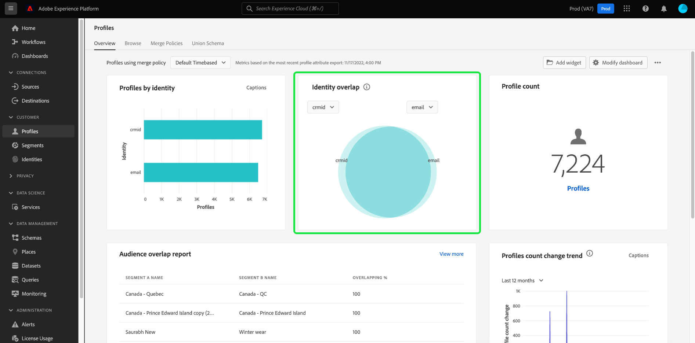

# [!UICONTROL Profile] Dashboard

Die Adobe Experience Platform-Benutzeroberfläche bietet ein Dashboard, über das Sie wichtige Informationen zu Ihrer [!DNL Real-time Customer Profile] Daten, wie sie in einer täglichen Momentaufnahme erfasst werden. In diesem Handbuch wird beschrieben, wie Sie auf die [!UICONTROL Profile] -Dashboard in der Benutzeroberfläche angezeigt und bietet Informationen zu den im Dashboard angezeigten Metriken.

Einen Überblick über alle Profilfunktionen in der Benutzeroberfläche der Experience Platform erhalten Sie im [Handbuch zur Benutzeroberfläche des Echtzeit-Kundenprofils](../../profile/ui/user-guide.md).

## Profil-Dashboard-Daten

Die [!UICONTROL Profile] Dashboard zeigt eine Momentaufnahme der Attributdaten (Datensatzdaten) an, die Ihr Unternehmen im Profilspeicher in der Experience Platform hat. Der Schnappschuss enthält keine Ereignisdaten (Zeitreihendaten).

Die Attributdaten im Snapshot zeigen die Daten exakt so an, wie sie zu dem Zeitpunkt angezeigt werden, zu dem die Momentaufnahme erstellt wurde. Mit anderen Worten, der Schnappschuss ist keine Annäherung oder Stichprobe der Daten, und das Profil-Dashboard wird nicht in Echtzeit aktualisiert.

>[!NOTE]
>
>Änderungen oder Aktualisierungen, die seit der Aufnahme des Schnappschusses an den Daten vorgenommen wurden, werden erst dann im Dashboard angezeigt, wenn der nächste Schnappschuss erstellt wurde.

## Die [!UICONTROL Profile] Dashboard

So navigieren Sie zum [!UICONTROL Profile] Dashboard in der Platform-Benutzeroberfläche auswählen **[!UICONTROL Profile]** Wählen Sie in der linken Leiste die **[!UICONTROL Übersicht]** zum Anzeigen des Dashboards.

>[!NOTE]
>
>Wenn Ihr Unternehmen neu bei Platform ist und noch keine aktiven Profildatensätze oder Zusammenführungsrichtlinien erstellt wurden, wird die [!UICONTROL Profile] Das Dashboard ist nicht sichtbar. Stattdessen wird die [!UICONTROL Übersicht] enthält Links und Dokumentation, die Ihnen bei den ersten Schritten mit dem Echtzeit-Kundenprofil helfen.

### Ändern der [!UICONTROL Profile] Dashboard

Sie können das Erscheinungsbild der [!UICONTROL Profile] Dashboard durch Auswahl von **[!UICONTROL Dashboard ändern]**. Dadurch können Sie Widgets aus dem Dashboard verschieben, hinzufügen und entfernen sowie auf die **[!UICONTROL Widget-Bibliothek]** , um verfügbare Widgets zu erkunden und benutzerdefinierte Widgets für Ihre Organisation zu erstellen.

Weitere Informationen finden Sie unter [Ändern von Dashboards](../customize/modify.md) und [Übersicht über die Widget-Bibliothek](../customize/widget-library.md) Dokumentation .

### Widgets hinzufügen {#add-widget}

Auswählen **[!UICONTROL Widget hinzufügen]** um zur Widget-Bibliothek zu navigieren und eine Liste der verfügbaren Widgets anzuzeigen, die Sie Ihrem Dashboard hinzufügen können.

In der Widget-Bibliothek können Sie die Auswahl von standardmäßigen und benutzerdefinierten Segment-Widgets durchsuchen. Informationen zum Hinzufügen von Widgets finden Sie in der Dokumentation zur Widget-Bibliothek zum [Widget hinzufügen](../customize/widget-library.md#add-widgets).

<!-- ## (Beta) Profile efficacy insights {#profile-efficacy-insights}

>[!IMPORTANT]
>
>The profile efficacy insight functionality is currently in beta and are not available to all users. The documentation and the functionality are subject to change.

The [!UICONTROL Efficacy] tab provides metrics on the quality and completeness of your profile data through the use of profile efficacy widgets. These widgets illustrate at a glance the composition of your profiles, trends in completeness over time, and assessments on the quality of your profile data.

See the [profile efficacy widgets section](#profile-efficacy-widgets) for more information on the widgets currently available.

The layout of this dashboard is also customizable by selecting [**[!UICONTROL Modify dashboard]**](../customize/modify.md) from the [!UICONTROL Overview] tab. -->

## Profile durchsuchen {#browse-profiles}

Die [!UICONTROL Durchsuchen] -Tab können Sie die schreibgeschützten Profile Ihrer Organisation durchsuchen und anzeigen. Von hier aus können Sie wichtige Informationen aus dem Profil bezüglich Voreinstellungen, vergangener Ereignisse, Interaktionen und Segmenten sehen

Weitere Informationen zu den in der Platform-Benutzeroberfläche bereitgestellten Funktionen zur Profilanzeige finden Sie in der Dokumentation unter [Durchsuchen von Profilen in Adobe Real-time Customer Data Platform](../../rtcdp/profile/profile-browse.md).

## Zusammenführungsrichtlinien {#merge-policies}

Die in der [!UICONTROL Profile] Dashboard basiert auf Zusammenführungsrichtlinien, die auf Ihre Echtzeit-Kundenprofildaten angewendet werden. Wenn Daten aus mehreren Quellen zusammengeführt werden, um das Kundenprofil zu erstellen, können die Daten widersprüchliche Werte enthalten. Beispielsweise kann ein Datensatz einen Kunden als &quot;einzeln&quot;auflisten, während ein anderer Datensatz den Kunden als &quot;verheiratet&quot;auflisten kann. Es ist der Auftrag der Zusammenführungsrichtlinie, zu bestimmen, welche Daten als Teil des Profils priorisiert und angezeigt werden sollen.

Weitere Informationen zu Zusammenführungsrichtlinien, einschließlich der Erstellung, Bearbeitung und Deklarierung einer standardmäßigen Zusammenführungsrichtlinie für Ihre Organisation, finden Sie im Abschnitt [Übersicht über Zusammenführungsrichtlinien](../../profile/merge-policies/overview.md).

Im Dashboard wird automatisch eine zu verwendende Zusammenführungsrichtlinie ausgewählt. Die angewendete Zusammenführungsrichtlinie kann über das Dropdown-Menü neben dem Namen der Zusammenführungsrichtlinie geändert werden.

>[!NOTE]
>
>Im Dropdown-Menü werden nur Zusammenführungsrichtlinien angezeigt, die `_xdm.context.profile` Schema. Wenn Ihr Unternehmen jedoch mehrere Zusammenführungsrichtlinien erstellt hat, müssen Sie möglicherweise einen Bildlauf durchführen, um die vollständige Liste der verfügbaren Zusammenführungsrichtlinien anzuzeigen.

## Vereinigungsschemas

Die [!UICONTROL Vereinigungsschema] Dashboard zeigt das Vereinigungsschema für eine bestimmte XDM-Klasse an. Durch Auswahl der **[!UICONTROL Klasse]** -Dropdown-Liste können Sie die Vereinigungsschemas für verschiedene XDM-Klassen anzeigen.

Vereinigungsschemas bestehen aus mehreren Schemas, die dieselbe Klasse haben und für ein Profil aktiviert wurden. Sie ermöglichen es Ihnen, in einer einzigen Ansicht eine Zusammenführung aller Felder zu sehen, die in jedem Schema enthalten sind, das dieselbe Klasse aufweist.

Weitere Informationen finden Sie im Handbuch zur Benutzeroberfläche des Vereinigungsschemas . [Anzeigen von Vereinigungsschemas in der Platform-Benutzeroberfläche](../../profile/ui/union-schema.md#view-union-schemas).

## Widgets und Metriken

Das Dashboard besteht aus Widgets, die schreibgeschützte Metriken sind und wichtige Informationen zu Ihren Profildaten enthalten.

Datum und Uhrzeit der letzten Momentaufnahme werden oben im [!UICONTROL Übersicht] neben dem Dropdown-Menü &quot;Zusammenführungsrichtlinie&quot;. Alle Widget-Daten sind ab diesem Datum und dieser Uhrzeit korrekt. Der Zeitstempel der Momentaufnahme wird in UTC bereitgestellt. Es befindet sich nicht in der Zeitzone des einzelnen Benutzers oder der Organisation.

## Standard-Widgets {#standard-widgets}

Adobe bietet mehrere Standard-Widgets, mit denen Sie verschiedene Metriken im Zusammenhang mit Ihren Profildaten visualisieren können. Sie können auch benutzerdefinierte Widgets erstellen, die für Ihre Organisation freigegeben werden, indem Sie die [!UICONTROL Widget-Bibliothek]. Um mehr über das Erstellen benutzerdefinierter Widgets zu erfahren, lesen Sie zunächst den Abschnitt [Übersicht über die Widget-Bibliothek](../customize/widget-library.md).

Um mehr über die einzelnen verfügbaren Standard-Widgets zu erfahren, wählen Sie den Namen eines Widgets aus der folgenden Liste aus:

* [[!UICONTROL Anzahl der Profile]](#profile-count)
* [[!UICONTROL Trend der Profilanzahl]](#profile-count-trend)
* [[!UICONTROL Änderung der Profilanzahl]](#profile-count-change)
* [[!UICONTROL Trend zur Änderung der Anzahl der Profile]](#profiles-count-change-trend)
* [[!UICONTROL Änderung der Anzahl der Profile nach Identität]](#profiles-count-change-trend-by-identity)
* [[!UICONTROL Profile nach Identität]](#profiles-by-identity)
* [[!UICONTROL Identitätsüberschneidung]](#identity-overlap)
* [[!UICONTROL Einzelne Identitätsprofile]](#single-identity-profiles)
* [[!UICONTROL Einzelne Identitätsprofile nach Identität]](#single-identity-profiles-by-identity)
* [[!UICONTROL Nicht segmentierte Profile]](#unsegmented-profiles)
* [[!UICONTROL Trend zu nicht segmentierten Profilen]](#unsegmented-profiles-trend)
* [[!UICONTROL Nicht segmentierte Profile nach Identität]](#unsegmented-profiles-by-identity)
* [[!UICONTROL Zielgruppen]](#audiences)
* [[!UICONTROL Zielgruppen, die einem Zielstatus zugeordnet sind]](#audiences-mapped-to-destination-status)
* [[!UICONTROL Zielgruppengröße]](#audiences-size)
* [[!UICONTROL Zielgruppenüberschneidung nach Zusammenführungsrichtlinie]](#audience-overlap-by-merge-policy)
* [[!UICONTROL Bericht &quot;Zielgruppenüberschneidung&quot;]](#audience-overlap-report)

### [!UICONTROL Anzahl der Profile] {#profile-count}

>[!CONTEXTUALHELP]
>id="platform_dashboards_profiles_profilecount"
>title="Anzahl der Profile"
>abstract="Dieses Widget zeigt die Gesamtzahl der zusammengeführten Profile im Profilspeicher zum Zeitpunkt der Momentaufnahme an. Die Zahl hängt von der ausgewählten Zusammenführungsrichtlinie ab, die auf Ihre Profildaten angewendet wird."

Die **[!UICONTROL Profilanzahl]** Widget zeigt die Gesamtzahl der zusammengeführten Profile im Profilspeicher zum Zeitpunkt der Momentaufnahme an. Diese Zahl ist das Ergebnis der ausgewählten Zusammenführungsrichtlinie, die auf Ihre Profildaten angewendet wird, um Profilfragmente zu einem einzelnen Profil für jede Person zusammenzuführen.

Siehe [Abschnitt zu Zusammenführungsrichtlinien weiter oben in diesem Dokument](#merge-policies) , um mehr zu erfahren.

>[!NOTE]
>
>Die [!UICONTROL Profilanzahl] Das Widget kann eine andere Zahl anzeigen als die in der [!UICONTROL Durchsuchen] im [!UICONTROL Profile] aus mehreren Gründen. Der häufigste Grund dafür ist, dass die [!UICONTROL Durchsuchen] -Registerkarte gibt die Gesamtzahl der zusammengeführten Profile basierend auf der standardmäßigen Zusammenführungsrichtlinie Ihres Unternehmens an, während die Variable [!UICONTROL Profilanzahl] -Widget verweist auf die Gesamtzahl der zusammengeführten Profile basierend auf der Zusammenführungsrichtlinie, die Sie im Dashboard angezeigt haben.
>
>Ein weiterer häufiger Grund sind die Unterschiede zwischen der Zeit, zu der der Dashboard-Schnappschuss erstellt wird, und der Zeit, zu der der Beispielauftrag für die [!UICONTROL Durchsuchen] Registerkarte. Sie können sehen, wann die [!UICONTROL Profilanzahl] Widget wurde zuletzt aktualisiert, indem der Zeitstempel im Widget betrachtet wurde und um mehr darüber zu erfahren, wie der Beispielauftrag im [!UICONTROL Durchsuchen] Registerkarte, siehe [Abschnitt zur Profilanzahl im Handbuch zur Benutzeroberfläche des Echtzeit-Kundenprofils](https://experienceleague.adobe.com/docs/experience-platform/profile/ui/user-guide.html?lang=en#profile-count).

### [!UICONTROL Trend der Profilanzahl] {#profile-count-trend}

Die [!UICONTROL Trend zur Profilanzahl] Widget verwendet ein Kantengraph, um den Trend der Gesamtanzahl der im System enthaltenen Profile im Zeitverlauf zu veranschaulichen. Diese Gesamtzahl enthält alle Profile, die seit der letzten täglichen Momentaufnahme in das System importiert wurden. Die Daten können über einen Zeitraum von 30 Tagen, 90 Tagen und 12 Monaten visualisiert werden. Der Zeitraum wird aus einem Dropdown-Menü im Widget ausgewählt.

### [!UICONTROL Änderung der Profilanzahl] {#profile-count-change}

>[!CONTEXTUALHELP]
>id="platform_dashboards_profiles_profilescountchange"
>title="Änderung der Profilanzahl"
>abstract="Dieses Widget zeigt die Gesamtzahl der zusammengeführten Profile an **hinzugefügt** zum Profilspeicher zum Zeitpunkt der letzten Momentaufnahme. Die Zahl hängt von der ausgewählten Zusammenführungsrichtlinie ab, die auf Ihre Profildaten angewendet wird."

Die **[!UICONTROL Änderung der Profilanzahl]** -Widget zeigt die Anzahl der zusammengeführten Profile an, die seit der vorherigen Momentaufnahme zum Profilspeicher hinzugefügt wurden. Diese Zahl ist das Ergebnis der ausgewählten Zusammenführungsrichtlinie, die auf Ihre Profildaten angewendet wird, um Profilfragmente zu einem einzelnen Profil für jede Person zusammenzuführen. Mit der Dropdown-Auswahl können Sie die Anzahl der Profile anzeigen, die in den letzten 30 Tagen, 90 Tagen oder 12 Monaten hinzugefügt wurden.

>[!NOTE]
>
>Die [!UICONTROL Änderung der Profilanzahl] Widget spiegelt die Anzahl der hinzugefügten Profile wider **after** die anfängliche Profilaufnahme und die Einrichtung des Profilspeichers. Mit anderen Worten: Wenn Ihr Unternehmen den Profilspeicher eingerichtet hat und 4.000.000 an Tag 1 aufgenommen hat, wäre das Dashboard innerhalb von 24 Stunden verfügbar, jedoch würde die [!UICONTROL Änderung der Profilanzahl] -Widget auf 0 gesetzt. Dies geschieht, um eine Spitze zu vermeiden, die mit der anfänglichen Aufnahme von Profilen in das System verbunden ist. In den nächsten 30 Tagen nimmt Ihr Unternehmen weitere 1.000.000 Profile in den Profilspeicher auf. Nachdem der nächste Schnappschuss erstellt wurde, wird die [!UICONTROL Änderung der Profilanzahl] würde das Widget insgesamt 1.000.000 Profile anzeigen, während die [!UICONTROL Profilanzahl] -Widget würde insgesamt 5.000.000 Profile anzeigen.

### [!UICONTROL Trend zur Änderung der Anzahl der Profile] {#profiles-count-change-trend}

>[!CONTEXTUALHELP]
>id="platform_dashboards_profiles_profilesaddedtrend"
>title="Trend zur Änderung der Anzahl der Profile"
>abstract="Dieses Widget zeigt die Anzahl der zusammengeführten Profile an, die in den letzten 30 Tagen, 90 Tagen oder 12 Monaten täglich zum Profilspeicher hinzugefügt wurden. Die Zahl hängt auch von der ausgewählten Zusammenführungsrichtlinie ab, die auf Ihre Profildaten angewendet wird."

Die **[!UICONTROL Trend zur Änderung der Anzahl der Profile]** Widget zeigt die Gesamtanzahl der zusammengeführten Profile an, die in den letzten 30 Tagen, 90 Tagen oder 12 Monaten täglich zum Profilspeicher hinzugefügt wurden. Diese Zahl wird jeden Tag aktualisiert, wenn die Momentaufnahme erstellt wird. Wenn Sie also Profile in Platform aufnehmen möchten, wird die Anzahl der Profile erst angezeigt, wenn die nächste Momentaufnahme erfolgt. Die Anzahl der hinzugefügten Profile ist das Ergebnis der ausgewählten Zusammenführungsrichtlinie, die auf Ihre Profildaten angewendet wird, um Profilfragmente zusammenzuführen und so für jede Person ein Profil zu erstellen.

Siehe [Abschnitt zu Zusammenführungsrichtlinien weiter oben in diesem Dokument](#merge-policies) , um mehr zu erfahren.

Die **[!UICONTROL Trend zur Änderung der Anzahl der Profile]** -Widget zeigt oben rechts im Widget die Schaltfläche &quot;Untertitel&quot;an. Auswählen **[!UICONTROL Untertitel]** , um das Dialogfeld mit den automatischen Beschriftungen zu öffnen.

Ein Modell für maschinelles Lernen generiert automatisch Untertitel zur Beschreibung der wichtigsten Trends und Ereignisse, indem es die Grafik und die Daten analysiert. Anmerkungen werden dem Diagramm basierend auf den Beschriftungen hinzugefügt. Wählen Sie eine Beschriftung aus, um sich auf die zugehörige Anmerkung zu konzentrieren.

### [!UICONTROL Änderung der Anzahl der Profile nach Identität] {#profiles-count-change-trend-by-identity}

<!-- This widget uses a line graph to illustrate the change in number of profiles filtered by a chosen source identity and merge policy. -->

Dieses Widget filtert die Profilanzahl anhand einer ausgewählten Quell-Identitäts- und Zusammenführungsrichtlinie und veranschaulicht dann die Änderung der Anzahl für verschiedene Zeiträume mithilfe eines Liniendiagramms. Die Zusammenführungsrichtlinie wird oben auf der Seite im Dropdown-Menü Übersicht ausgewählt. Die Quellidentität und der Zeitraum werden aus den Widget-Dropdown-Menüs ausgewählt. Der Trend kann über einen Zeitraum von 30 Tagen, 90 Tagen und 12 Monaten visualisiert werden.

Dieses Widget unterstützt Sie bei der Verwaltung Ihrer Zielaktivierungsanforderungen, indem es das Wachstumsmuster der Profile demonstriert, die nach einer erforderlichen Identität gefiltert wurden.

### [!UICONTROL Profile nach Identität] {#profiles-by-identity}

>[!CONTEXTUALHELP]
>id="platform_dashboards_profiles_profilesbyidentity"
>title="Profile nach Identität"
>abstract="Dieses Widget zeigt die Aufschlüsselung aller zusammengeführten Profile im Profilspeicher nach Identitäten an."

Die **[!UICONTROL Profile nach Identität]** -Widget zeigt die Aufschlüsselung der Identitäten über alle zusammengeführten Profile in Ihrem Profilspeicher an. Die Gesamtzahl der Profile nach Identität (d. h. das Addieren der für jeden Namespace angezeigten Werte) kann höher sein als die Gesamtzahl der zusammengeführten Profile, da einem Profil mehrere Namespaces zugeordnet sein können. Wenn beispielsweise ein Kunde mit Ihrer Marke auf mehr als einem Kanal interagiert, werden diesem einzelnen Kunden mehrere Namespaces zugeordnet.

Siehe [Abschnitt zu Zusammenführungsrichtlinien weiter oben in diesem Dokument](#merge-policies) , um mehr zu erfahren.

Auswählen **[!UICONTROL Untertitel]** , um das Dialogfeld mit den automatischen Beschriftungen zu öffnen.

Ein maschinelles Lernmodell generiert automatisch Dateneinblicke, indem es die Gesamtverteilung und die Schlüsseldimensionen der Daten analysiert.

Weitere Informationen zu Identitäten finden Sie unter [Dokumentation zu Adobe Experience Platform Identity Service](../../identity-service/home.md).

### [!UICONTROL Identitätsüberschneidung] {#identity-overlap}

>[!CONTEXTUALHELP]
>id="platform_dashboards_profiles_identityoverlap"
>title="Identitätsüberschneidung"
>abstract="Dieses Widget verwendet ein Venn-Diagramm, um die Überschneidung von Profilen in Ihrem Profilspeicher anzuzeigen, die die beiden ausgewählten Identitäten enthalten."

Die **[!UICONTROL Identitätsüberschneidung]** Widget verwendet ein Venn-Diagramm oder ein Set-Diagramm, um die Überschneidung von Profilen in Ihrem Profilspeicher anzuzeigen, die die beiden ausgewählten Identitäten enthalten.

Verwenden Sie die Widget-Dropdown-Menüs, um die Identitäten auszuwählen, die Sie vergleichen möchten. Kreise zeigen die relative Gesamtzahl der Profile an, die jede Identität enthalten. Die Anzahl der Profile, die beide Identitäten enthalten, wird durch die Größe der Überschneidung zwischen den Kreisen dargestellt. Wenn ein Kunde mit Ihrer Marke auf mehr als einem Kanal interagiert, werden diesem einzelnen Kunden mehrere Identitäten zugeordnet. Daher ist es wahrscheinlich, dass Ihr Unternehmen über mehrere Profile verfügt, die Fragmente aus mehr als einer Identität enthalten.

Weitere Informationen zu Profilfragmenten finden Sie im Abschnitt unter [Profilfragmente im Vergleich zu zusammengeführten Profilen](https://experienceleague.adobe.com/docs/experience-platform/profile/home.html?lang=en#profile-fragments-vs-merged-profiles) in der Übersicht über das Echtzeit-Kundenprofil .

Weitere Informationen zu Identitäten finden Sie unter [Dokumentation zu Adobe Experience Platform Identity Service](../../identity-service/home.md).

### [!UICONTROL Einzelne Identitätsprofile] {#single-identity-profiles}

>[!CONTEXTUALHELP]
>id="platform_dashboards_profiles_singleidentityprofiles"
>title="Einzelne Identitätsprofile"
>abstract="Dieses Widget enthält die Profile Ihrer Organisation, die nur über einen ID-Typ verfügen, der ihre Identität erstellt. Dieser ID-Typ kann entweder eine E-Mail oder eine ECID sein."

Die [!UICONTROL Einzelne Identitätsprofile] -Widget stellt die Anzahl der Profile Ihres Unternehmens bereit, die nur über einen ID-Typ verfügen, der ihre Identität erstellt. Dieser ID-Typ kann entweder eine E-Mail oder eine ECID sein. Die Anzahl der Profile wird aus den Daten der letzten Momentaufnahme generiert.

### [!UICONTROL Einzelne Identitätsprofile nach Identität] {#single-identity-profiles-by-identity}

Dieses Widget verwendet ein Balkendiagramm, um die Gesamtanzahl der Profile zu veranschaulichen, die mit nur einer eindeutigen Kennung gekennzeichnet sind. Das Widget unterstützt bis zu fünf der am häufigsten vorkommenden Identitäten.

Bewegen Sie den Mauszeiger über einzelne Balken, um ein Dialogfeld mit der Gesamtanzahl der Profile für eine Identität anzuzeigen.

### [!UICONTROL Nicht segmentierte Profile] {#unsegmented-profiles}

>[!CONTEXTUALHELP]
>id="platform_dashboards_profiles_unsegmentedprofiles"
>title="Nicht segmentierte Profile"
>abstract="Dieses Widget stellt die Gesamtanzahl aller Profile bereit, die keinem Segment zugeordnet sind, und bietet die Möglichkeit zur Profilaktivierung in Ihrer gesamten Organisation."

Die [!UICONTROL Nicht segmentierte Profile] -Widget stellt die Gesamtanzahl aller Profile bereit, die an kein Segment angehängt sind. Der generierte Wert gibt die zum Zeitpunkt der letzten Momentaufnahme korrekte Anzahl an und zeigt, wie viele Profile in Ihrem gesamten Unternehmen aktiviert werden können. Sie zeigt auch die Möglichkeit an, Profile auszuschließen, die keinen angemessenen ROI bieten.

### [!UICONTROL Trend zu nicht segmentierten Profilen] {#unsegmented-profiles-trend}

>[!CONTEXTUALHELP]
>id="platform_dashboards_profiles_unsegmentedprofilestrend"
>title="Trend zu nicht segmentierten Profilen"
>abstract="Dieses Widget bietet eine grafische Darstellung der Anzahl der Profile, die in einem bestimmten Zeitraum nicht mit einem Segment verbunden sind. Der Trend der Profile, die keinem Segment zugeordnet sind, kann über einen Zeitraum von 30 Tagen, 90 Tagen und 12 Monaten visualisiert werden."

Die [!UICONTROL Trend für nicht segmentierte Profile] -Widget bietet eine Liniendiagrammdarstellung für die Anzahl der Profile, die in einem bestimmten Zeitraum nicht an ein Segment angehängt sind. Der Trend der Profile, die keinem Segment zugeordnet sind, kann über einen Zeitraum von 30 Tagen, 90 Tagen und 12 Monaten visualisiert werden. Der Zeitraum wird aus einem Dropdown-Menü im Widget ausgewählt. Die Anzahl der Profile wird auf der Y-Achse und der Zeit auf der X-Achse angezeigt.

### [!UICONTROL Nicht segmentierte Profile nach Identität] {#unsegmented-profiles-by-identity}

>[!CONTEXTUALHELP]
>id="platform_dashboards_profiles_unsegmentedprofilesbyidentity"
>title="Nicht segmentierte Profile nach Identität"
>abstract="Dieses Widget kategorisiert die Gesamtzahl der nicht segmentierten Profile anhand ihrer eindeutigen Kennung."

Die [!UICONTROL Nicht segmentierte Profile nach Identität] Widget kategorisiert die Gesamtzahl der nicht segmentierten Profile anhand ihrer eindeutigen Kennung. Die Daten werden in einem Balkendiagramm visualisiert, um einen einfachen Vergleich zu ermöglichen.

### [!UICONTROL Zielgruppen] {#audiences}

Dieses Widget enthält die Gesamtzahl der Segmente, die entsprechend der ausgewählten Zusammenführungsrichtlinie, die auf Ihre Profildaten angewendet wird, aktiviert werden können.

Auswählen **[!UICONTROL Zielgruppen]** , um zur [!UICONTROL Segmente] Dashboard [!UICONTROL Durchsuchen] Registerkarte. Von dort aus können Sie eine Liste aller Segmentdefinitionen für Ihr Unternehmen sehen.

<!-- https://jira.corp.adobe.com/browse/PLAT-115291 -->

<!-- * [[!UICONTROL Audiences change trend]](#audiences-change-trend) -->
<!-- ### [!UICONTROL Audiences change trend] {#audiences-change-trend}

This line graph widget visualizes the change in the total number of audiences each day, trending over time. The change in the number of audiences is dependent on the selected merge policy being applied to your profile data. The period of analysis is selected from the widget dropdown menu. The bar chart can be visualized over 30 days, 90 days, and 12-month periods.  

The visualization allows you to monitor the overall health of audiences within Adobe Experience Platform by understanding trends in the growth or decline of the total number of audiences. -->

<!--  -->

### [!UICONTROL Bericht &quot;Zielgruppenüberschneidung&quot;] {#audience-overlap-report}

Dieses Widget enthält eine tabellarische Darstellung der Daten zur Zielgruppenüberschneidung aus allen verfügbaren Segmenten, die nach Zusammenführungsrichtlinien gefiltert wurden. Eine Liste mit fünf Zielgruppen, die von den Prozentsätzen der höchsten bis zur niedrigsten Überschneidung sortiert sind, wird für die Zusammenführungsrichtlinie bereitgestellt, die oben im Bildschirm im Dropdown-Menü ausgewählt wird. Die beiden analysierten Segmente werden im [!UICONTROL SEGMENT A NAME] und [!UICONTROL SEGMENT B NAME] Spalten. Die prozentuale Überschneidung wird in der dritten Spalte genau auf zwölf Dezimalstellen angegeben.

Der Bericht zur Zielgruppenüberschneidung hilft Ihnen beim Erstellen neuer Hochleistungssegmente. Durch die Beobachtung hoher prozentualer Überschneidungen können Sie Zielgruppen unterdrücken und das Senden derselben Zielgruppe an verschiedene Ziele verhindern. Sie helfen Ihnen auch dabei, versteckte Einblicke zu identifizieren, die bei einer besseren Segmentierung hilfreich sein könnten. Eine geringe prozentuale Überschneidung hilft, eindeutige Profile zu finden, die verfolgt werden sollen.

Auswählen **[!UICONTROL Mehr anzeigen]** , um ein Vollbilddialogfeld zu öffnen, das mehr Zielgruppendaten enthält, die sich überschneiden.

Die [!UICONTROL Bericht &quot;Zielgruppenüberschneidung&quot;] angezeigt. Dieses Dialogfeld kann bis zu 50 Zeilen mit Analysen zur Zielgruppenüberschneidung enthalten, die in sechs Spalten unterteilt sind. Wählen Sie das Einstellungssymbol (), um Spalten aus der Tabelle zu entfernen oder hinzuzufügen.

>[!NOTE]
>
>Wählen Sie die **[!UICONTROL Überlappung]** Spaltenüberschrift verwenden, um die Rangfolge der Ergebnisse zwischen der höchsten und der niedrigsten bzw. der niedrigsten der höchsten zu ändern.

Um den gesamten Bericht im PDF-Format herunterzuladen, wählen Sie das Optionsmenü (**`...`**) gefolgt von **[!UICONTROL Download]**.

Wählen Sie eine Zeile aus dem Bericht aus, um ein Venn-Diagramm der Überschneidungsanalyse zu öffnen. Bewegen Sie den Mauszeiger über einen Abschnitt des Venn-Diagramms, um die Profilanzahl in einem Dialogfeld anzuzeigen.

Auswählen **[!UICONTROL Schließen]** , um zur [!UICONTROL Profile] Dashboard.

### [!UICONTROL Zielgruppen, die einem Zielstatus zugeordnet sind] {#audiences-mapped-to-destination-status}

Die [!UICONTROL Zielgruppen, die dem Zielstatus zugeordnet sind] -Widget zeigt die Gesamtanzahl der zugeordneten und nicht zugeordneten Zielgruppen in einer einzelnen Metrik an und verwendet ein doppeltes Diagramm, um den proportionalen Unterschied zwischen den Summen zu veranschaulichen. Die berechneten Zahlen hängen von der gewählten Zusammenführungsrichtlinie ab.

Einzelne Zählungen für zugeordnete oder nicht zugeordnete Zielgruppen werden in einem Dialogfeld angezeigt, wenn der Cursor den Mauszeiger über den entsprechenden Abschnitt des Ringdiagramms bewegt.

### [!UICONTROL Zielgruppengröße] {#audiences-size}

Die [!UICONTROL Zielgruppengröße] Widget bietet eine zweispaltige Tabelle, die bis zu 20 Segmente und die Gesamtzahl der in jedem Segment enthaltenen Zielgruppen auflistet. Die Liste wird in Abhängigkeit von der Gesamtzahl der Zielgruppen von hoch zu niedrig geordnet. Die Gesamtzahl der Zielgruppengrößen hängt von der angewendeten Zusammenführungsrichtlinie ab.

Um umfassende Informationen zu einem Segment anzuzeigen, wählen Sie einen Segmentnamen aus der bereitgestellten Liste aus, um zur [!UICONTROL Segmente] [!UICONTROL Detail] Seite. Außerdem durch Auswahl von **[!UICONTROL Alle Segmente anzeigen]** Sie können am Ende des Widgets zur [!UICONTROL Segmente] [!UICONTROL Durchsuchen] um ein vorhandenes Segment zu finden.

Weitere Informationen zu finden Sie in der Dokumentation . [[!UICONTROL Segmente] [!UICONTROL  Durchsuchen] tab](https://experienceleague.adobe.com/docs/experience-platform/segmentation/ui/overview.html#browse).

### [!UICONTROL Zielgruppenüberschneidung nach Zusammenführungsrichtlinie] {#audience-overlap-by-merge-policy}

Dieses Widget verwendet ein Venn-Diagramm, um die Überschneidung zweier ausgewählter Segmente anzuzeigen. Die Zusammenführungsrichtlinie wird oben auf der Seite aus dem Dropdown-Menü Übersicht ausgewählt und die Segmente für die Analyse werden aus zwei Dropdown-Menüs im Widget ausgewählt. Die Gesamtzahl der in der entsprechenden Segmentdefinition enthaltenen Profile kann durch Bewegen des Mauszeigers über einen Kreis oder die Schnittmenge angezeigt werden.

Da das Widget den visuellen Crossover von Segmentdefinitionen anzeigt, können Sie Ihre Segmentierungsstrategie optimieren, indem Sie die Ähnlichkeiten zwischen Ihren Segmentdefinitionen untersuchen.

<!-- ## (Beta) Profile efficacy widgets {#profile-efficacy-widgets}

>[!IMPORTANT]
>
>The profile efficacy widgets are currently in Beta and are not available to all users. The documentation and the functionality are subject to change.

Adobe provides multiple widgets to assess the completeness of the ingested profiles available for your data analysis. Each of the profile efficacy widgets can be filtered by the merge policy. To change the merge policy filter, select the[!UICONTROL Profiles using merge policy] dropdown and choose the appropriate policy from the available list.

To learn more about each of the profile efficacy widgets, select the name of a widget from the following list:

* [[!UICONTROL Attribute quality assessment]](#attributes-quality-assessment)
* [[!UICONTROL Profiles by completeness]](#profiles-by-completeness)
* [[!UICONTROL Profiles completeness trend]](#profiles-completeness-trend)

### (Beta) [!UICONTROL Attributes quality assessment] {#attributes-quality-assessment}

>[!CONTEXTUALHELP]
>id="platform_dashboards_profiles_attributesqualityassessment"
>title="Attributes quality assessment"
>abstract="This widget shows the completeness and cardinality of all profiles according to their attributes. Each row describes one attribute. The **Profiles** column provides the number of profiles that have this attribute and are filled with non-null values. The **Completeness** percentage is determined by the total number of profiles that have this attribute and are filled with non-null values divided by the total number of non-empty values in the profiles for that attribute. **Cardinality** provides the total number of unique non-null values of this attribute across all attributes."

The [!UICONTROL Attribute quality assessment] widget shows the completeness and cardinality of all profiles according to their attributes. The data is accurate to the last processing date. This information is presented as a table with four columns where each row in the table represents a single attribute.

| Column  | Description  |
|---|---|
| Attribute  | The name of the attribute.  |
| Profiles  | The number of profiles that have this attribute and are filled with non-null values.  |
| Completeness  | This percentage is determined by the total number of profiles that have this attribute and are filled with non-null values. The number is calculated by dividing the total number of profiles by the total number of non-empty values in the profiles for that attribute.  |
| Cardinality  | The total number of **unique** non-null values of this attribute. It is measured across all profiles. |

### (Beta) [!UICONTROL Profiles by completeness] {#profiles-by-completeness}

>[!CONTEXTUALHELP]
>id="platform_dashboards_profiles_profilesbycompleteness"
>title="Profiles by completeness"
>abstract="The donut chart displays the percentage of profile attributes that are filled with non-null values among all observed attributes. It illustrates the proportion of profiles that are of high, medium, or low completeness. High completeness profiles have more than 70% of their attributes filled. Medium completeness profiles have between 30% and 70% of their attributes filled. Low completeness profiles have less than 30% of their attributes filled."

The [!UICONTROL Profiles by completeness] widget creates a donut chart of profile completeness since the last processing date. The completeness of a profile is measured by the percentage of attributes that are filled with non-null values among all observed attributes.

This widget shows the proportion of profiles that are of high, medium, or low completeness. By default, there are three levels of completeness configured: 

* High completeness: Profiles have more than 70% of their attributes filled. 
* Medium completeness: Profiles have between 30% and 70% of their attributes filled. 
* Low completeness: Profiles have less than 30% of their attributes filled. 

### (Beta) [!UICONTROL Profiles completeness trend] {#profiles-completeness-trend}

>[!CONTEXTUALHELP]
>id="platform_dashboards_profiles_profilescompletenesstrend"
>title="Profiles completeness trend"
>abstract="This widget creates a stacked area chart to depict the trend of profile completeness over time. Completeness is measured by the percentage of attributes that are filled with non-null values among all observed attributes."

This widget creates a stacked area chart to depict the trend of profile completeness over time. Completeness is measured by the percentage of attributes filled with non-null values among all observed attributes. It categorizes the profile completeness as high, medium, or low completeness since the last processing date.

The x-axis represents time, the y-axis represents the number of profiles, and the colors represent the three levels of profile completeness. 

The three levels of completeness are:

* High completeness: Profiles have more than 70% of attributes filled. 
* Medium completeness: Profiles have less than 70% and more than 30% of attributes filled. 
* Low completeness: Profiles have less than 30% of attributes filled.

 -->

## Nächste Schritte

Durch Befolgen dieses Dokuments sollten Sie jetzt in der Lage sein, das Profil-Dashboard zu finden und die in den verfügbaren Widgets angezeigten Metriken zu verstehen. Weitere Informationen zum Arbeiten mit [!DNL Profile] Daten in der Experience Platform-Benutzeroberfläche, siehe [Handbuch zur Benutzeroberfläche des Echtzeit-Kundenprofils](../../profile/ui/user-guide.md).
