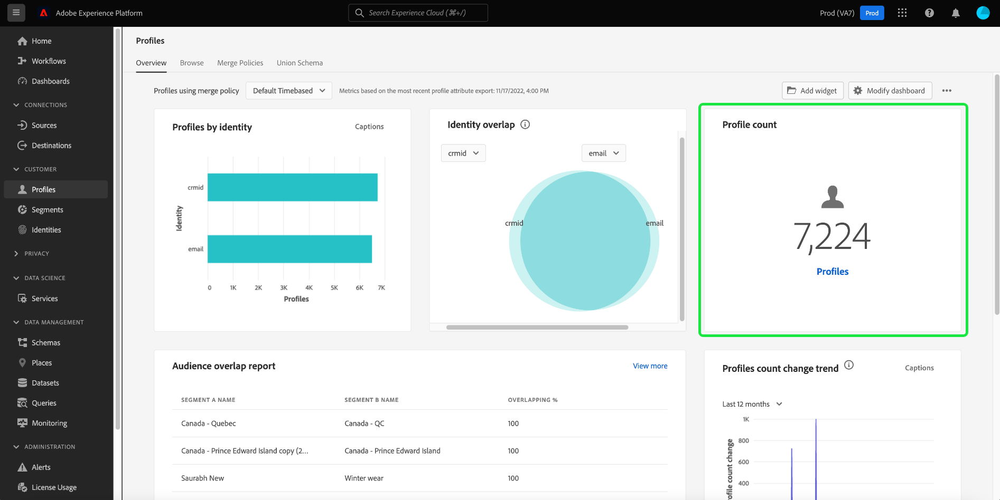

# [!UICONTROL Profile] Dashboard

Die Adobe Experience Platform-Benutzeroberfläche bietet ein Dashboard, über das Sie wichtige Informationen zu Ihrer [!DNL Real-time Customer Profile] Daten, wie sie in einer täglichen Momentaufnahme erfasst werden. In diesem Handbuch wird beschrieben, wie Sie auf die [!UICONTROL Profile] -Dashboard in der Benutzeroberfläche angezeigt und bietet Informationen zu den im Dashboard angezeigten Metriken.

Einen Überblick über alle Profilfunktionen in der Benutzeroberfläche der Experience Platform erhalten Sie im [Handbuch zur Benutzeroberfläche des Echtzeit-Kundenprofils](../../profile/ui/user-guide.md).

## Profil-Dashboard-Daten

Die [!UICONTROL Profile] Dashboard zeigt eine Momentaufnahme der Attributdaten (Datensatzdaten) an, die Ihr Unternehmen im Profilspeicher in der Experience Platform hat. Der Schnappschuss enthält keine Ereignisdaten (Zeitreihendaten).

Die Attributdaten im Snapshot zeigen die Daten exakt so an, wie sie zu dem Zeitpunkt angezeigt werden, zu dem die Momentaufnahme erstellt wurde. Mit anderen Worten, der Schnappschuss ist keine Annäherung oder Stichprobe der Daten, und das Profil-Dashboard wird nicht in Echtzeit aktualisiert.

>[!NOTE]
>
>Änderungen oder Aktualisierungen, die seit der Aufnahme des Schnappschusses an den Daten vorgenommen wurden, werden erst dann im Dashboard angezeigt, wenn der nächste Schnappschuss erstellt wurde.

## Die [!UICONTROL Profile] Dashboard

So navigieren Sie zum [!UICONTROL Profile] Dashboard in der Platform-Benutzeroberfläche auswählen **[!UICONTROL Profile]** Wählen Sie in der linken Leiste die **[!UICONTROL Übersicht]** zum Anzeigen des Dashboards.

>[!NOTE]
>
>Wenn Ihr Unternehmen neu bei Platform ist und noch keine aktiven Profildatensätze oder Zusammenführungsrichtlinien erstellt wurden, wird die [!UICONTROL Profile] Das Dashboard ist nicht sichtbar. Stattdessen wird die [!UICONTROL Übersicht] enthält Links und Dokumentation, die Ihnen bei den ersten Schritten mit dem Echtzeit-Kundenprofil helfen.

### Ändern der [!UICONTROL Profile] Dashboard

Sie können das Erscheinungsbild der [!UICONTROL Profile] Dashboard durch Auswahl von **[!UICONTROL Dashboard ändern]**. Dadurch können Sie Widgets aus dem Dashboard verschieben, hinzufügen und entfernen sowie auf die **[!UICONTROL Widget-Bibliothek]** , um verfügbare Widgets zu erkunden und benutzerdefinierte Widgets für Ihre Organisation zu erstellen.

Weitere Informationen finden Sie unter [Ändern von Dashboards](../customize/modify.md) und [Übersicht über Widget-Bibliotheken](../customize/widget-library.md) Dokumentation .

## Zusammenführungsrichtlinien {#merge-policies}

Die in der [!UICONTROL Profile] Dashboards basieren auf Zusammenführungsrichtlinien, die auf Ihre Echtzeit-Kundenprofildaten angewendet werden. Wenn Daten aus mehreren Quellen zusammengeführt werden, um das Kundenprofil zu erstellen, können die Daten widersprüchliche Werte enthalten (z. B. kann ein Datensatz einen Kunden als &quot;einzeln&quot;auflisten, während ein anderer Datensatz den Kunden als &quot;verheiratet&quot;auflisten kann). Es ist der Auftrag der Zusammenführungsrichtlinie, zu bestimmen, welche Daten als Teil des Profils priorisiert und angezeigt werden sollen.

Weitere Informationen zu Zusammenführungsrichtlinien, einschließlich der Erstellung, Bearbeitung und Deklarierung einer standardmäßigen Zusammenführungsrichtlinie für Ihre Organisation, finden Sie im Abschnitt [Übersicht über Zusammenführungsrichtlinien](../../profile/merge-policies/overview.md).

Das Dashboard wählt automatisch eine anzuzeigende Zusammenführungsrichtlinie aus, Sie können jedoch die ausgewählte Zusammenführungsrichtlinie über das Dropdown-Menü ändern. Um eine andere Zusammenführungsrichtlinie auszuwählen, wählen Sie das Dropdown-Menü neben dem Namen der Zusammenführungsrichtlinie und dann die Zusammenführungsrichtlinie aus, die Sie anzeigen möchten.

>[!NOTE]
>
>Im Dropdown-Menü werden nur Zusammenführungsrichtlinien angezeigt, die sich auf die Klasse &quot;XDM Individual Profile&quot;beziehen. Wenn Ihr Unternehmen jedoch mehrere Zusammenführungsrichtlinien erstellt hat, müssen Sie möglicherweise einen Bildlauf durchführen, um die vollständige Liste der verfügbaren Zusammenführungsrichtlinien anzuzeigen.

## Widgets und Metriken

Das Dashboard besteht aus Widgets, die schreibgeschützte Metriken sind und wichtige Informationen zu Ihren Profildaten enthalten.

Das Datum und die Uhrzeit der letzten Aktualisierung eines Widgets zeigen an, wann die letzte Momentaufnahme der Daten erstellt wurde. Datum und Uhrzeit der Momentaufnahme werden in UTC angegeben. Es befindet sich nicht in der Zeitzone des einzelnen Benutzers oder der IMS-Organisation.

## Standard-Widgets

Adobe bietet mehrere Standard-Widgets, mit denen Sie verschiedene Metriken im Zusammenhang mit Ihren Profildaten visualisieren können. Sie können auch benutzerdefinierte Widgets erstellen, die für Ihre Organisation freigegeben werden, indem Sie die [!UICONTROL Widget-Bibliothek]. Um mehr über das Erstellen benutzerdefinierter Widgets zu erfahren, lesen Sie zunächst den Abschnitt [Übersicht über Widget-Bibliotheken](../customize/widget-library.md).

Um mehr über die einzelnen verfügbaren Standard-Widgets zu erfahren, wählen Sie den Namen eines Widgets aus der folgenden Liste aus:

* [[!UICONTROL Anzahl der Profile]](#profile-count)
* [[!UICONTROL Hinzugefügte Profile]](#profiles-added)
* [[!UICONTROL Trend der Profilanzahl]](#profiles-count-trend)
* [[!UICONTROL Profile nach Identität]](#profiles-by-identity)
* [[!UICONTROL Identitätsüberschneidung]](#identity-overlap)

### [!UICONTROL Anzahl der Profile] {#profile-count}

Die **[!UICONTROL Profilanzahl]** Widget zeigt die Gesamtzahl der zusammengeführten Profile im Profilspeicher zum Zeitpunkt der Momentaufnahme an. Diese Zahl ist das Ergebnis der ausgewählten Zusammenführungsrichtlinie, die auf Ihre Profildaten angewendet wird, um Profilfragmente zu einem einzelnen Profil für jede Person zusammenzuführen.

Siehe [Abschnitt zu Zusammenführungsrichtlinien weiter oben in diesem Dokument](#merge-policies) , um mehr zu erfahren.

>[!NOTE]
>
>Die [!UICONTROL Profilanzahl] Das Widget kann eine andere Zahl anzeigen als die in der [!UICONTROL Durchsuchen] im [!UICONTROL Profile] aus mehreren Gründen. Der häufigste Grund dafür ist, dass die [!UICONTROL Durchsuchen] -Registerkarte gibt die Gesamtzahl der zusammengeführten Profile basierend auf der standardmäßigen Zusammenführungsrichtlinie Ihres Unternehmens an, während die Variable [!UICONTROL Profilanzahl] -Widget verweist auf die Gesamtzahl der zusammengeführten Profile basierend auf der Zusammenführungsrichtlinie, die Sie im Dashboard angezeigt haben.
>
>Ein weiterer häufiger Grund sind die Unterschiede zwischen der Zeit, zu der der Dashboard-Schnappschuss erstellt wird, und der Zeit, zu der der Beispielauftrag für die [!UICONTROL Durchsuchen] Registerkarte. Sie können sehen, wann die [!UICONTROL Profilanzahl] Widget wurde zuletzt aktualisiert, indem der Zeitstempel im Widget betrachtet wurde und um mehr darüber zu erfahren, wie der Beispielauftrag im [!UICONTROL Durchsuchen] Registerkarte, siehe [Abschnitt zur Profilanzahl im Handbuch zur Benutzeroberfläche des Echtzeit-Kundenprofils](https://experienceleague.adobe.com/docs/experience-platform/profile/ui/user-guide.html?lang=en#profile-count).

### [!UICONTROL Hinzugefügte Profile] {#profiles-added}

Die **[!UICONTROL Hinzugefügte Profile]** -Widget zeigt die Gesamtzahl der zusammengeführten Profile an, die zum Profilspeicher hinzugefügt wurden, und zwar ab dem letzten abgerufenen Schnappschuss. Diese Zahl ist das Ergebnis der ausgewählten Zusammenführungsrichtlinie, die auf Ihre Profildaten angewendet wird, um Profilfragmente zu einem einzelnen Profil für jede Person zusammenzuführen. Mit der Dropdown-Auswahl können Sie die Profile anzeigen, die in den letzten 30 Tagen, 90 Tagen oder 12 Monaten hinzugefügt wurden.

>[!NOTE]
>
>Die [!UICONTROL Hinzugefügte Profile] -Widget gibt die Anzahl der Profile an, die hinzugefügt werden, nachdem der Profilspeicher eingerichtet und Profile erfasst wurden. Mit anderen Worten: Wenn Ihr Unternehmen den Profilspeicher eingerichtet hat und 4.000.000 an Tag 1 aufgenommen hat, wäre das Dashboard innerhalb von 24 Stunden verfügbar, jedoch würde die [!UICONTROL Hinzugefügte Profile] -Widget auf 0 gesetzt. Dies geschieht, um eine Spitze zu vermeiden, die mit der anfänglichen Aufnahme von Profilen in das System verbunden ist. In den nächsten 30 Tagen nimmt Ihr Unternehmen weitere 1.000.000 Profile in den Profilspeicher auf. Nachdem der nächste Schnappschuss erstellt wurde, wird die [!UICONTROL Hinzugefügte Profile] würde das Widget insgesamt 1.000.000 Profile anzeigen, während die [!UICONTROL Profilanzahl] -Widget würde insgesamt 5.000.000 Profile anzeigen.

### [!UICONTROL Trend der Profilanzahl] {#profiles-count-trend}

Die **[!UICONTROL Trend der Profilanzahl]** Widget zeigt die Gesamtanzahl der zusammengeführten Profile an, die in den letzten 30 Tagen, 90 Tagen oder 12 Monaten täglich zum Profilspeicher hinzugefügt wurden. Diese Zahl wird jeden Tag aktualisiert, wenn die Momentaufnahme erstellt wird. Wenn Sie also Profile in Platform aufnehmen möchten, wird die Anzahl der Profile erst angezeigt, wenn die nächste Momentaufnahme erfolgt. Die Anzahl der hinzugefügten Profile ist das Ergebnis der ausgewählten Zusammenführungsrichtlinie, die auf Ihre Profildaten angewendet wird, um Profilfragmente zusammenzuführen und so für jede Person ein Profil zu erstellen.

Siehe [Abschnitt zu Zusammenführungsrichtlinien weiter oben in diesem Dokument](#merge-policies) , um mehr zu erfahren.

Die **[!UICONTROL Trend zur Profilanzahl]** -Widget zeigt oben rechts im Widget die Schaltfläche &quot;Untertitel&quot;an. Auswählen **[!UICONTROL Untertitel]** , um das Dialogfeld mit den automatischen Beschriftungen zu öffnen.

Ein Modell für maschinelles Lernen generiert automatisch Untertitel zur Beschreibung der wichtigsten Trends und Ereignisse, indem es die Grafik und die Daten analysiert.

### [!UICONTROL Profile nach Identität] {#profiles-by-identity}

Die **[!UICONTROL Profile nach Identität]** -Widget zeigt die Aufschlüsselung der Identitäten über alle zusammengeführten Profile in Ihrem Profilspeicher an. Die Gesamtzahl der Profile nach Identität (d. h. das Addieren der für jeden Namespace angezeigten Werte) kann höher sein als die Gesamtzahl der zusammengeführten Profile, da einem Profil mehrere Namespaces zugeordnet sein können. Wenn beispielsweise ein Kunde mit Ihrer Marke auf mehr als einem Kanal interagiert, werden diesem einzelnen Kunden mehrere Namespaces zugeordnet.

Siehe [Abschnitt zu Zusammenführungsrichtlinien weiter oben in diesem Dokument](#merge-policies) , um mehr zu erfahren.

Weitere Informationen zu Identitäten finden Sie unter [Dokumentation zu Adobe Experience Platform Identity Service](../../identity-service/home.md).

### [!UICONTROL Identitätsüberschneidung] {#identity-overlap}

Die **[!UICONTROL Identitätsüberschneidung]** -Widget zeigt ein Venn-Diagramm oder ein Set-Diagramm an, das die Überschneidung von Profilen in Ihrem Profilspeicher mit mehreren Identitäten anzeigt.

Nachdem Sie die zu vergleichenden Identitäten mithilfe der Dropdown-Menüs im Widget ausgewählt haben, werden Kreise angezeigt, die die relative Größe jeder Identität anzeigen. Die Anzahl der Profile, die beide Namespaces enthalten, wird durch die Größe der Überschneidung zwischen den Kreisen dargestellt. Wenn ein Kunde mit Ihrer Marke auf mehr als einem Kanal interagiert, werden diesem einzelnen Kunden mehrere Identitäten zugeordnet. Daher ist es wahrscheinlich, dass Ihr Unternehmen über mehrere Profile verfügt, die Fragmente aus mehr als einer Identität enthalten.

Weitere Informationen zu Profilfragmenten finden Sie im Abschnitt unter [Profilfragmente im Vergleich zu zusammengeführten Profilen](https://experienceleague.adobe.com/docs/experience-platform/profile/home.html?lang=en#profile-fragments-vs-merged-profiles) in der Übersicht über das Echtzeit-Kundenprofil .

Weitere Informationen zu Identitäten finden Sie unter [Dokumentation zu Adobe Experience Platform Identity Service](../../identity-service/home.md).

## Nächste Schritte

Durch Befolgen dieses Dokuments sollten Sie jetzt in der Lage sein, das Profil-Dashboard zu finden und die in den verfügbaren Widgets angezeigten Metriken zu verstehen. Weitere Informationen zum Arbeiten mit [!DNL Profile] Daten in der Experience Platform-Benutzeroberfläche, siehe [Handbuch zur Benutzeroberfläche des Echtzeit-Kundenprofils](../../profile/ui/user-guide.md).
