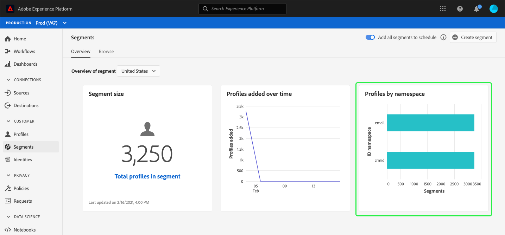

# (Beta) Dashboard Segmente {#segment-dashboard}

>[!IMPORTANT]
>
>Die in diesem Dokument beschriebene Dashboard-Funktion befindet sich derzeit in der Beta-Version und steht nicht allen Benutzern zur Verfügung. Die Dokumentation und Funktionalität können sich ändern.

Die Adobe Experience Platform-Benutzeroberfläche (UI) bietet ein Dashboard, mit dem Sie wichtige Informationen zu Ihren Segmenten, wie sie in einem täglichen Schnappschuss erfasst werden, Ansichten durchführen können. In diesem Handbuch wird beschrieben, wie Sie auf das Segmentsteuerungs-Dashboard in der Benutzeroberfläche zugreifen und mit ihm arbeiten, und es werden weitere Informationen zu den im Dashboard angezeigten Visualisierungen bereitgestellt.

Einen Überblick über alle Adobe Experience Platform-Segmentierungsdienstfunktionen in der Plattform-Benutzeroberfläche finden Sie im Handbuch [Segmentierungsdienst-Benutzeroberfläche](../../segmentation/ui/overview.md).

## Segmentdaten Dashboard

Das Dashboard segment zeigt eine Momentaufnahme der Attributdaten (Datensatzdaten) an, die Ihr Unternehmen im in der Experience Platform befindlichen Profil-Store hat. Der Schnappschuss enthält keine Ereignis- (Zeitreihendaten).

Die Attributdaten im Schnappschuss zeigen die Daten exakt so an, wie sie zu dem Zeitpunkt angezeigt werden, zu dem der Schnappschuss erstellt wurde. Das heißt, der Schnappschuss ist keine Näherung oder Stichprobe der Daten und das Segmentelement wird nicht in Echtzeit aktualisiert.

>[!NOTE]
>
>Änderungen oder Aktualisierungen, die seit der Erstellung des Schnappschusses an den Daten vorgenommen wurden, werden erst dann im Dashboard angezeigt, wenn der nächste Schnappschuss erstellt wurde.

## Segmentanalyse - Dashboard

Um zum Segmentelement in der Plattform-Benutzeroberfläche zu navigieren, wählen Sie in der linken Leiste **[!UICONTROL Segmente]** aus und klicken Sie dann auf die Registerkarte **[!UICONTROL Übersicht]**, um das Dashboard anzuzeigen.

### Segment auswählen

Das Dashboard wählt automatisch ein anzuzeigendes Segment aus, Sie können das angezeigte Segment jedoch über das Dropdown-Menü ändern. Um ein anderes Segment auszuwählen, wählen Sie die Dropdown-Liste neben dem Segmentnamen aus und wählen Sie dann das Segment aus, das Ansicht werden soll.

>[!NOTE]
>
>Das Dropdown-Menü zeigt alle Segmente an, die Ihre Organisation bisher erstellt hat. Dies kann bedeuten, dass Sie einen Bildlauf durchführen müssen, um die vollständige Liste der verfügbaren Segmente Ansicht.

### Widgets und Metriken

Das Segmentsegment-Dashboard besteht aus Widgets, bei denen es sich um schreibgeschützte Metriken handelt, die wichtige Informationen zu Ihrem ausgewählten Segment enthalten. Das Datum und die Uhrzeit der letzten Aktualisierung im Widget werden angezeigt, wenn der letzte Schnappschuss der Daten aufgenommen wurde.

## Verfügbare Widgets

Experience Platform bietet mehrere Widgets, mit denen Sie verschiedene Metriken zu Ihrem Segment visualisieren können. Wählen Sie unten den Namen eines Widget aus, um weitere Informationen zu erhalten:

* [[!UICONTROL Segmentgröße]](#segment-size)
* [[!UICONTROL Im Zeitverlauf hinzugefügte Profil]](#profiles-added-over-time)
* [[!UICONTROL Profile nach Namensraum]](#profiles-by-namespace)

### [!UICONTROL Segmentgröße] {#segment-size}

Das Widget **[!UICONTROL Segmentgröße]** zeigt die Gesamtanzahl der zusammengeführten Profil im ausgewählten Segment zum Zeitpunkt des Snapshots an. Diese Anzahl ist das Ergebnis der Anwendung der Segmentzusammenführungs-Richtlinie auf Ihre Profil-Daten, um Profil-Fragmente zu einem einzigen Profil für jede einzelne Segmentperson zusammenzuführen.

Weitere Informationen zu Fragmenten und zusammengeführten Profilen erhalten Sie zunächst im [Überblick über das Echtzeit-Profil des Kunden](../../profile/home.md).

### [!UICONTROL Im Zeitverlauf hinzugefügte Profil] {#profiles-added-over-time}

Das Widget **[!UICONTROL Im Zeitverlauf hinzugefügte Profil]** enthält Informationen zur Gesamtanzahl der Profil im Segment, die während des täglichen Schnappschusses für die letzten 30 Tage erfasst wurden. Dieses Widget zeigt an, wie sich die Segmentgröße über einen Zeitraum von 30 Tagen verändert hat, wenn neue Profil für das Segment qualifiziert sind oder es verlassen.

Weitere Informationen zur Segmentauswertung und zur Qualifizierung und zum Ausstieg von Profilen finden Sie in der [Segmentierungsdienstdokumentation](../../segmentation/home.md).

### [!UICONTROL Profile nach Namensraum] {#profiles-by-namespace}

Das Widget **[!UICONTROL Profil nach Namensraum]** zeigt die Aufschlüsselung der Namensraum für alle zusammengeführten Profil im ausgewählten Segment an. Die Gesamtanzahl der Profil nach Identitäts-Namensraum ([!UICONTROL ID-Namensraum] im Widget) kann höher sein als die Gesamtanzahl der Profil im Segment, da ein Profil mehrere Namensraum damit verknüpft sein könnte. Mit anderen Worten, wenn die für jeden Namensraum angezeigten Werte addiert werden, kann dies mehr als die Gesamtzahl der Profil im Segment ausmachen, da bei Interaktion eines Kunden mit Ihrer Marke auf mehr als einem Kanal mehrere Namensraum mit diesem Kunden verbunden sein können.

Weitere Informationen zu Identitäts-Namensräumen finden Sie in der [Adobe Experience Platform Identity Service-Dokumentation](../../identity-service/home.md).

## Nächste Schritte

Indem Sie diesem Dokument folgen, sollten Sie nun in der Lage sein, das Segmentsegment zu suchen und ein Dashboard zur Ansicht auszuwählen. Sie sollten auch die Metriken verstehen, die in den verfügbaren Widgets angezeigt werden. Weitere Informationen zum Arbeiten mit Segmenten in der Benutzeroberfläche der Experience Platform finden Sie im Handbuch [Segmentierungsdienst-Benutzeroberfläche](../../segmentation/ui/overview.md).
