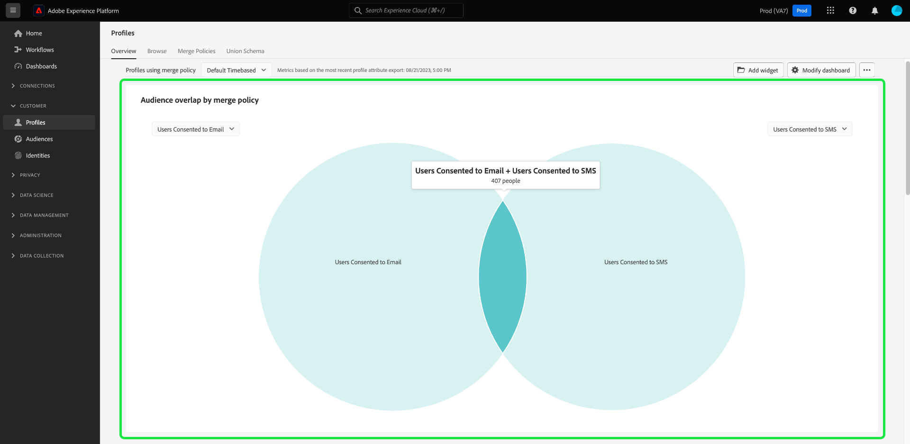

# Einverständnisanalyse und -verfolgung

In der heutigen Marketinglandschaft müssen Sie die Voreinstellungen bezüglich der Kundenzustimmung verstehen und berücksichtigen. Adobe Real-time Customer Data Platform bietet Marketingexperten die Möglichkeit, die Zustimmung von Kunden zu analysieren, um Vertrauen zu schaffen, Datenschutzbestimmungen einzuhalten und personalisiertere Erlebnisse bereitzustellen.

In diesem Dokument wird beschrieben, wie Sie ein Einwilligungs-Dashboard für verschiedene Marketing-Anwendungsfälle für Real-Time CDP-Daten erstellen. Insbesondere wird beschrieben, wie Sie eine Zielgruppe mit den entsprechenden Attributen für Ihre Geschäftsanforderungen erstellen und dann mithilfe von vorkonfigurierten Widgets in der Adobe Experience Platform-Benutzeroberfläche Einblicke gewinnen. Eine alternative Methode zum Erstellen Ihres eigenen benutzerdefinierten Widgets mit der benutzerdefinierten Dashboards-Funktion wird ebenfalls vorgestellt.

## Anwendungsfälle {#use-cases}

Die in diesem Handbuch behandelten Anwendungsfälle sind Zustimmungstrends und Zustimmungsüberschneidungen.

- **Zustimmungstrends** verfolgt, wie sich die Benutzereinwilligung im Laufe der Zeit entwickelt hat. Die Analyse von Änderungen der Zustimmungsvoreinstellungen hilft Marketern bei der Planung und Ausführung von Kampagnen, die sich an diese Änderungen der Benutzerpräferenz anpassen. So können Sie beispielsweise zielgerichtete Bildungskampagnen, Transparenz- und Vertrauenskampagnen oder Anreizkampagnen durchführen, um die Auswahl der Zustimmung zu fördern. Sie können auch Kampagnen korrelieren, die sich negativ auf die Zustimmung ausgewirkt haben, um die Häufigkeit dieser Kampagnen proaktiv zu reduzieren.
- **Einverständnisüberschneidung** nutzt die Überschneidung zwischen den Zustimmungskanälen, um konsistente personalisierte Nachrichten auf mehreren Kanälen für Kunden bereitzustellen, die mehreren Kanälen zugestimmt haben. Marketingexperten können Ressourcen priorisieren und bestimmten Kanälen zuweisen, in denen ein höheres Maß an Zustimmung und personalisiertem Messaging bei Kunden ankommt und höhere Antwortraten generiert.

<!-- ## Build a consent dashboard {#build-a-consent-dashboard} -->

## Erstellen genehmigter Zielgruppen {#create-consent-audiences}

Um ein Zustimmungs-Dashboard zu erstellen, müssen Sie zunächst eine Audience aller Profile erstellen, die der Kontaktaufnahme zugestimmt haben. Um zum Real-time Customer Data Platform Segment Builder zu navigieren, wählen Sie **[!UICONTROL Zielgruppen]** im linken Navigationsbereich der Platform-Benutzeroberfläche. Im [!UICONTROL Kunde] des [!UICONTROL Zielgruppen] Dashboard, auswählen **[!UICONTROL Erstellen einer Zielgruppe]** oben rechts in der Ansicht, und **[!UICONTROL Regeln erstellen]**.

<!-- Update screenshot below to include Create audience -->s

![Die [!UICONTROL Zielgruppen] Dashboard mit [!UICONTROL Kunde], [!UICONTROL Zielgruppen], und [!UICONTROL Segment erstellen] hervorgehoben.](../images/insights-use-cases/consent-analysis/create-audience.png)

Segment Builder wird angezeigt. Wählen Sie als Nächstes **[!UICONTROL Individuelles XDM-Profil]** aus den verfügbaren Optionen. Weitere Informationen zu finden Sie in der Dokumentation . [Arbeitsfläche des Regel-Builders](../../segmentation/ui/segment-builder.md#rule-builder-canvas).

![Der Segment Builder mit der [!UICONTROL Individuelles XDM-Profil] -Attributordner hervorgehoben.](../images/insights-use-cases/consent-analysis/xdm-individual-profile.png)

Suchen Sie Ihre Zustimmungsattribute aus den verfügbaren Optionen. Auswählen **[!UICONTROL Einverständnis und Voreinstellungen]**.

>[!NOTE]
>
>Wenn Sie Ihre Benutzereinwilligung in einem anderen Attribut als der von Adobe empfohlenen Feldergruppe gespeichert haben, müssen Sie diese Attribute anstelle der unten aufgeführten Attribute auswählen.

Weitere Informationen finden Sie im [Handhabung der Zustimmung bei der Segmentierung](../../segmentation/consents.md#handling-consent-in-segmentation) Dokumentation.

![Der Segment Builder mit der [!UICONTROL Zustimmung und Voreinstellungen] -Attributordner hervorgehoben.](../images/insights-use-cases/consent-analysis/consent-and-preferences.png)

Die verschiedenen Zustimmungs- und Präferenzoptionen werden angezeigt. Da sich diese Demonstration auf die Einwilligung zur Kontaktaufnahme über verschiedene Marketing-Kanäle konzentriert, wählen Sie **[!UICONTROL Marketing-Voreinstellungen]**.

![Der Segment Builder mit der [!UICONTROL Marketing-Voreinstellungen] Ordner hervorgehoben.](../images/insights-use-cases/consent-analysis/marketing-preferences.png)

Die Liste der Marketing-Voreinstellungen wird angezeigt. Obwohl sich dieser Beispielanwendungsfall auf E-Mail-, SMS- und Aufrufe konzentriert, können Sie Einblicke für jede andere Kombination oder die Gesamtheit der Optionen erstellen. Führen Sie für jeden Kanal die folgenden Schritte aus, um eine Zielgruppe zu erstellen.

Um mit der Konfiguration einer Audience zu beginnen, wählen Sie **[!UICONTROL SMS empfangen]** / **[!UICONTROL E-Mail empfangen]** / **[!UICONTROL Aufrufe empfangen]**.

Die [!UICONTROL Abonnements] angezeigt. Wählen Sie aus den verfügbaren Optionen aus und ziehen Sie die **[!UICONTROL Auswahlwert]** zum mittleren Bereich hinzu und wählen Sie dann den gewünschten Wert aus der Dropdown-Liste aus. Wählen Sie in diesem Fall **Ja (Opt-in)**. Benennen Sie anschließend die Audience entsprechend Ihren geschäftlichen Anforderungen und geben Sie eine benutzerfreundliche Beschreibung an.

>[!NOTE]
>
>Die Anzahl der Zielgruppen, die Sie erstellen sollten, ist weich begrenzt. Weitere Informationen finden Sie im [Dokumentation zu SegmentierungsLimits](https://experienceleague.adobe.com/docs/experience-platform/profile/guardrails.html?lang=en#segmentation-guardrails).

![Die [!UICONTROL Auswahlwert] -Attribut mit dem [!UICONTROL Ja (Opt-in)] im Segment Builder hervorgehoben wurde. Der Name und die Beschreibung der Audience werden ebenfalls hervorgehoben.](../images/insights-use-cases/consent-analysis/choice-value.png)

Nachdem Sie die erforderlichen Zielgruppen erstellt haben, werden sie im Abschnitt [!UICONTROL Zielgruppen] [!UICONTROL Durchsuchen] Registerkarte.

>[!NOTE]
>
>Beim Erstellen einer Zielgruppe müssen Sie warten, bis der Batch-Segmentierungsauftrag abgeschlossen ist, bevor die Daten verfügbar sind, um mit der Erstellung Ihres Zustimmungs-Dashboards zu beginnen. Die Batch-Segmentierung beschreibt den Prozess des gleichzeitigen Übergangs aller Profildaten durch Ihre Segmentdefinitionen, um die entsprechenden Zielgruppen zu erstellen. Nach der Erstellung wird diese Audience gespeichert und zum Export und zur Verwendung gespeichert. Batch-Segmente werden automatisch alle 24 Stunden ausgewertet.

## Einblicke verbrauchen {#consume-insights}

Adobe hat verschiedene Einblicke erstellt, die Ihnen automatisch in den Dashboards Profile, Zielgruppen und Ziele zur Verfügung stehen. Jede von Ihnen erstellte Zielgruppe kann dann automatisch mit diesen vorkonfigurierten Einblicken verwendet werden. Eine Liste der in der Standard-Widget-Dokumentation verfügbaren Erkenntnisse finden Sie in der [Profile](../guides/profiles.md#standard-widgets), [Zielgruppen](../guides/audiences.md#standard-widgets), und [Ziele](../guides/destinations.md) Dashboards.

## Zielgruppenüberschneidung {#audience-overlap}

Um die Überschneidung zwischen zwei beliebigen Zielgruppen für die Zustimmung zu überprüfen, fügen Sie die [!UICONTROL Zielgruppenüberschneidung nach Zusammenführungsrichtlinie] in Ihr Profil-Dashboard ein und wählen Sie die gewünschten Audiences in den Dropdown-Menüs aus. Anweisungen zum Hinzufügen eines Widgets zu Ihrem Dashboard finden Sie in der Dokumentation . [*Zielgruppenüberschneidung nach Zusammenführungsrichtlinie*](../guides/profiles.md#audience-overlap-by-merge-policy) für weitere Informationen zu den Einblicken.

<!-- Image needs updating to night mode -->

Sie können die Überschneidung aller Zielgruppen anzeigen, für die Benutzer dem Empfang von Aufrufen für alle anderen Zielgruppen zugestimmt haben, mit dem Bericht Zielgruppenüberschneidung im Dashboard Zielgruppen . Um die Überschneidung von Einwilligungszielgruppen anzuzeigen, navigieren Sie zunächst zum [!UICONTROL Zielgruppen] [!UICONTROL Übersicht] Registerkarte. Dort können Sie die [!UICONTROL Bericht &quot;Zielgruppenüberschneidung&quot;] Widget zum Zielgruppen-Dashboard hinzufügen. Nachdem das Widget erstellt wurde, wählen Sie die **[!UICONTROL Benutzer akzeptiert Aufrufe]** -Zielgruppe aus dem Dropdown-Menü &quot;Zielgruppe&quot;am oberen Rand der Seite. Wählen Sie als Nächstes **[!UICONTROL Mehr anzeigen]** im Berichtwidget Zielgruppenüberschneidung bis zu 50 der oberen Überschneidungen und bis zu 50 der geringsten Überschneidungen im ausgewählten Segment.

<!-- Image needs updating to night mode -->

Das Berichtdialogfeld Zielgruppenüberschneidung wird erweitert und zeigt zusätzliche Daten zu Zielgruppenüberschneidungen an.

<!-- Image needs updating to night mode -->

## Trends der Zielgruppengröße {#audience-size-trends}

Wenn Sie eine einwilligungsbasierte Zielgruppe erstellen, werden automatisch Trends bis zu 12 Monate nach dem Datum der Erstellung der Zielgruppe erstellt. Um einen voll funktionsfähigen Trend Ihrer Kundenzustimmung zu erreichen, fügen Sie die folgenden Widgets zum [!UICONTROL Segmente] [!UICONTROL Übersicht] Seite. Diese Einblicke bieten eine leistungsstarke Möglichkeit, zu verfolgen, wie sich Ihre Einwilligung im Laufe der Zeit ändert. Sie korrelieren sogar mit allen parallel ausgeführten Kampagnen, die sich positiv oder negativ auf die Zustimmung auswirken könnten. Die für diese Widgets angebotenen Beschreibungen gelten für den Anwendungsfall der Zustimmung.

- [Zielgruppengrößentrend](../guides/audiences.md#audience-size-trend): Mit diesem Widget können Sie verfolgen, wie sich Ihre jeweilige Einwilligung im Laufe der Zeit verändert hat.
- [Trend zur Änderung der Zielgruppengröße](../guides/audiences.md#audience-size-change-trend): Dieses Widget verfolgt, wie sich Ihr Kundeneinverständnis täglich verändert hat. Wenn beispielsweise die Anzahl Ihrer Kundenzustimmung um 100.000 gesunken ist, können Sie sehen, wie diese Änderung täglich stattgefunden hat.
- [Trend zur Zielgruppengröße nach Identität](../guides/audiences.md#audience-size-trend-by-identity): Mit diesem Widget können Sie verfolgen, wie sich Ihr jeweiliges Einverständnis im Laufe der Zeit verändert hat, aber weiter nach einer bestimmten Identität wie einer E-Mail gefiltert werden.

<!-- Image needs updating to night mode -->

## Dashboard &quot;Zielgruppenübersicht&quot; {#audiences-overview-dashboard}

Nachdem Sie eine einwilligungsbezogene Zielgruppe erstellt haben, z. B. &quot;Benutzer mit Einverständnis für SMS&quot;, können Sie wichtige personalisierte Einverständnisinformationen zu Ihrer Zielgruppe anzeigen, indem Sie die entsprechenden Widgets zu Ihrem Dashboard Zielgruppenübersicht hinzufügen. Navigieren Sie zum [!UICONTROL Zielgruppen] [!UICONTROL Übersicht] und fügen Sie die ausgewählten Widgets aus der Widget-Bibliothek hinzu. Jedes Widget, das Ihrer Ansicht des Dashboards hinzugefügt wird, kann in der Größe angepasst und mithilfe der [!UICONTROL Dashboard ändern] Funktion. Ihre personalisierte Ansicht kann Einblicke wie den Trend im Zeitverlauf (bis zu 12 Monate), die Überschneidungen mit anderen Zielgruppen und die Identitätskomposition der Zielgruppe enthalten. Unten finden Sie eine Beispielansicht.

## Benutzerdefinierte Dashboards {#usr-defined-dashboards}

Sie können auch eigene Widgets mit benutzerdefinierten Dashboards erstellen. Durch die Erstellung Ihres eigenen Widgets können Sie den Typ des Widgets vollständig steuern und flexibel Filter hinzufügen und vieles mehr direkt in Adobe Real-Time CDP.

Wenn Sie z. B. mehrere Zustimmungszielgruppen im selben Diagramm als Trend verfolgen möchten, damit Sie im Laufe der Zeit sehen können, wie sich die einzelnen Zustimmungsvoreinstellungen verändert haben. Diese Art der Visualisierung ist mit benutzerdefinierten Dashboards in minimalen Schritten und einer einmaligen Einrichtung möglich. Wählen Sie zuerst **[!UICONTROL Dashboards]** in der linken Navigation. Die [!UICONTROL Dashboards] Arbeitsbereich angezeigt. Wählen Sie anschließend **[!UICONTROL Dashboard erstellen]**. Vollständige Anweisungen zum [Dashboard und benutzerdefiniertes Widget erstellen](../user-defined-dashboards.md) Weitere Informationen finden Sie im Handbuch zu benutzerdefinierten Dashboards.

Wenn Sie [Datenmodell auswählen](../user-defined-dashboards.md#select-data-model) Wählen Sie im Widget Composer `CDPInsights` gefolgt von **[!UICONTROL Nächste]**. Die [!UICONTROL Tabelle auswählen] angezeigt.

In der nächsten Ansicht wird eine Liste der verfügbaren Tabellen in der linken Leiste angezeigt. Wählen Sie die `adwh_fact_profile_by_segment_and_namespace_trendlines`.

Nachdem der Widget Composer mit Daten aus Ihrer ausgewählten Tabelle gefüllt wurde, führen Sie die folgenden Schritte aus:

- [Suche [!UICONTROL Attribute]](../user-defined-dashboards.md#add-filter-attributes) für `[!UICONTROL date]`, und verwenden Sie dann das Symbol + , um die `[!UICONTROL date]` auf die X-Achse aus dem Dropdown-Menü.
  
- Suche [!UICONTROL Attribute] für `[!UICONTROL count_of_profiles]`, und verwenden Sie dann das Symbol + , um die `[!UICONTROL count_of_profiles]` -Attribut der Y-Achse aus dem Dropdown-Menü zuordnen.
- Wählen Sie die `...` (Ellipsen) im [!UICONTROL Y-Achse] und wählen Sie anschließend die [!UICONTROL SUM] Aggregatfunktion aus dem Dropdown-Menü.
  
- Wählen Sie die [!UICONTROL Marken] Dropdown-Menü aus und ändern Sie den Diagrammtyp in [!UICONTROL Linie].
- Suche [!UICONTROL Attribute] für die `[!UICONTROL segment_name]`, und verwenden Sie dann das Symbol + , um die `segment_name` as a [!UICONTROL Filter] aus dem Dropdown-Menü aus. Die [!UICONTROL Filter: Segment_name] angezeigt. Wählen Sie die zuvor erstellten Zielgruppen aus, die sich auf die Zustimmung beziehen. Wählen Sie für dieses Beispiel **[!UICONTROL Benutzer, die Anrufen zugestimmt haben]**, **[!UICONTROL Benutzer, die SMS zugestimmt haben]**, und **[!UICONTROL Benutzer, die E-Mail zugestimmt haben]**, gefolgt von **[!UICONTROL Anwenden]**.
- Suche [!UICONTROL Attribute] für `[!UICONTROL segment_name]`und wählen Sie dann das Symbol + aus, das hinzugefügt werden soll `segment_name` as a [!UICONTROL Farbe] aus dem Dropdown-Menü aus.
- Öffnen [die [!UICONTROL Eigenschaften] panel](../user-defined-dashboards.md#widget-properties) und geeignete [!UICONTROL Widget-Titel] und [!UICONTROL Achsenbeschriftung].
  
- Auswählen **[!UICONTROL Speichern und schließen]** um Ihre Einstellungen zu bestätigen.

>[!TIP]
>
>Sie können nun das Widget in der gewünschten Größe und Position ändern, bevor Sie es speichern.

Die folgende Abbildung zeigt, wie Ihr fertig gestelltes Widget und andere potenzielle benutzerdefinierte Einblicke angezeigt werden. Weitere Informationen zu den Typen von Widgets, die erstellt werden können, finden Sie im Abschnitt [Datenmodelldokumentation](../cdp-insights-data-model.md).

<!-- The diagram shows straight lines due to a lack of data, however in your environment the trends will reflect the actual changes over time. -->

## Verfolgen von Zustimmungsrichtlinien {#consent-policies}

Die Zustimmungs-Dashboards, die Sie erstellen, erfassen **Verteilung von Einverständnisattributen und Präferenzattributen**.

>[!NOTE]
>
>Für Kunden von **Adobe Healthcare Shield** oder **Adobe Privacy &amp; Security Shield**, diesen Dashboards **nicht** spiegeln jegliche Verfolgung von Zustimmungsrichtlinien wider. Das verfügbare Tracking umfasst die Anzahl der erstellten, aktivierten Richtlinien und die Auswirkungen auf die Zielgruppenzugehörigkeit.

## Nächste Schritte

Durch Lesen dieses Dokuments haben Sie erfahren, wie Sie Dashboards erstellen, um mithilfe von Real-Time CDP-Einblicken einen umfassenden Überblick über Ihre Zustimmungsvoreinstellungen zu erhalten. Dieses Dokument zeigt, wie Real-Time CDP eine robuste Lösung für die datenschutzorientierte Landschaft von heute bietet, in der Erfassung, Segmentierung, Analyse und personalisierte Marketing-Kampagnen, die auf Einwilligungsdaten basieren, für Marketing-Experten von entscheidender Bedeutung sind.
