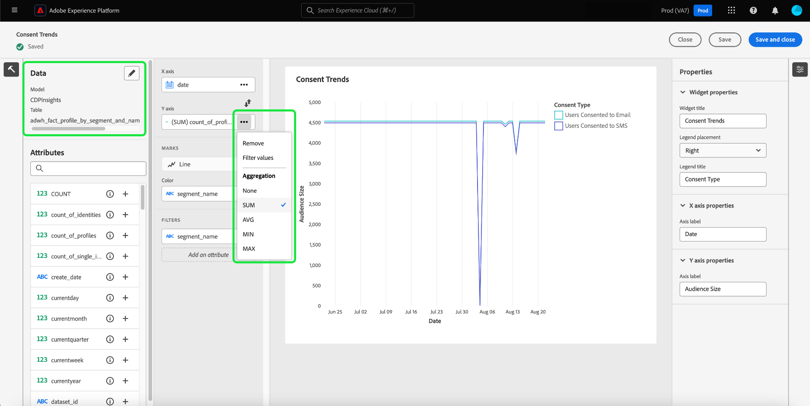

# Einverständnisanalyse und -verfolgung

In der heutigen Marketing-Landschaft müssen Sie die Voreinstellungen für das Kundeneinverständnis verstehen und respektieren. Adobe Real-Time Customer Data Platform bietet Marketing-Experten die Möglichkeit, das Einverständnis der Kunden zu analysieren, um Vertrauen aufzubauen, Datenschutzbestimmungen einzuhalten und personalisierte Erlebnisse bereitzustellen.

In diesem Dokument wird beschrieben, wie Sie ein Einverständnis-Dashboard für verschiedene Marketing-Anwendungsfälle für Real-Time CDP-Daten erstellen. Insbesondere wird beschrieben, wie Sie eine Zielgruppe mit den entsprechenden Attributen für Ihre Geschäftsanforderungen erstellen und diese Einblicke dann mithilfe vorkonfigurierter Widgets in der Adobe Experience Platform-Benutzeroberfläche nutzen können. Eine alternative Methode zum Erstellen eines eigenen benutzerdefinierten Widgets mit der benutzerdefinierten Dashboards-Funktion wird ebenfalls vorgestellt.

## Anwendungsfälle {#use-cases}

Die in diesem Handbuch behandelten Anwendungsfälle sind Einverständnistrends und Einverständnisüberschneidungen.

- **Einverständnis-Trend** verfolgt, wie sich das Einverständnis der Benutzer im Laufe der Zeit entwickelt hat. Die Analyse der Änderungen der Einverständnisvoreinstellungen hilft Marketing-Experten, Kampagnen zu planen und auszuführen, die sich an diese Änderungen der Benutzervoreinstellungen anpassen. Sie können beispielsweise gezielte Aufklärungskampagnen, Transparenz- und Vertrauenskampagnen oder Anreizkampagnen durchführen, um die Einwilligungsentscheidung zu fördern. Sie können auch Kampagnen korrelieren, die sich negativ auf das Einverständnis ausgewirkt haben könnten, um die Häufigkeit dieser Kampagnen proaktiv zu reduzieren.
- **Einverständnisüberschneidung** verwendet die Überschneidung zwischen Einverständniskanälen, um konsistentes personalisiertes Messaging auf mehreren Kanälen für Ihre Kundinnen und Kunden bereitzustellen, die mehreren Kanälen zugestimmt haben. Marketing-Experten können Ressourcen priorisieren und bestimmten Kanälen zuweisen, in denen ein höheres Maß an Einverständnis und personalisiertes Messaging bei Kunden Anklang finden und höhere Reaktionsraten erzeugen kann.

## Erstellen von einverstandenen Zielgruppen {#create-consent-audiences}

Um ein Einverständnis-Dashboard zu erstellen, müssen Sie zunächst eine Zielgruppe aus allen Profilen erstellen, die dem Kontakt zugestimmt haben. Um zum Segment Builder von Real-Time Customer Data Platform zu navigieren, klicken Sie im linken Navigationsbereich der Experience Platform-Benutzeroberfläche auf **[!UICONTROL Audiences]** . Wählen Sie oben rechts in der Ansicht auf der Registerkarte [!UICONTROL Customer] des [!UICONTROL Audiences]-Dashboards **[!UICONTROL Create audience]** und dann **[!UICONTROL Build rules]** aus.

![Das [!UICONTROL Audiences]-Dashboard mit hervorgehobenen [!UICONTROL Customer], [!UICONTROL Audiences] und [!UICONTROL Create segment].](../images/insights-use-cases/consent-analysis/create-audience.png)

Der Segment Builder wird angezeigt. Wählen Sie anschließend **[!UICONTROL XDM Individual Profile]** aus den verfügbaren Optionen aus. Weitere Informationen zur Arbeitsfläche des Regel[Builders finden Sie in der ](../../segmentation/ui/segment-builder.md#rule-builder-canvas).

![Der Segment Builder mit dem hervorgehobenen Ordner &quot;[!UICONTROL XDM Individual Profile]&quot;.](../images/insights-use-cases/consent-analysis/xdm-individual-profile.png)

Suchen Sie Ihre Einverständnisattribute in den verfügbaren Optionen. Wählen Sie **[!UICONTROL Consents and Preferences]** aus.

>[!NOTE]
>
>Wenn Sie Ihr Benutzereinverständnis in einem Attribut beibehalten haben, das sich von dem der von Adobe empfohlenen Feldergruppe unterscheidet, müssen Sie diese Attribute anstelle der unten aufgeführten auswählen.

Weitere Informationen finden Sie in der Dokumentation [Handhabung des Einverständnisses in der Segmentierung](../../segmentation/tutorials/consents.md#handling-consent-in-segmentation) .

![Der Segment Builder mit dem hervorgehobenen Ordner &quot;[!UICONTROL Consent and Preferences]&quot;.](../images/insights-use-cases/consent-analysis/consent-and-preferences.png)

Die verschiedenen Einverständnis- und Voreinstellungsoptionen werden angezeigt. Da sich diese Demonstration auf die Einwilligung zum Kontakt über verschiedene Marketing-Kanäle konzentriert, wählen Sie **[!UICONTROL Marketing Preferences]** aus.

![Der Segment Builder mit hervorgehobenem [!UICONTROL Marketing Preferences].](../images/insights-use-cases/consent-analysis/marketing-preferences.png)

Die Liste der Marketing-Voreinstellungen wird angezeigt. Obwohl sich dieses Anwendungsbeispiel auf E-Mail, SMS und Anrufe konzentriert, können Sie Einblicke für jede andere Kombination oder die Gesamtheit der Optionen erstellen. Führen Sie für jeden Kanal die folgenden Schritte aus, um eine Zielgruppe zu erstellen.

Um mit der Konfiguration einer Zielgruppe zu beginnen, wählen Sie **[!UICONTROL Receive SMS]** / **[!UICONTROL Receive email]** / **[!UICONTROL Receive calls]** aus.

Der Ordner [!UICONTROL Subscriptions] wird angezeigt. Wählen Sie aus den verfügbaren Optionen das Attribut **[!UICONTROL Choice Value]** aus, ziehen Sie es in den mittleren Bereich und wählen Sie dann den gewünschten Wert aus der Dropdown-Liste aus. Wählen Sie in diesem Fall **Ja (Opt-in)**. Benennen Sie anschließend die Zielgruppe entsprechend Ihren Geschäftsanforderungen und geben Sie eine benutzerfreundliche Beschreibung an.

>[!NOTE]
>
>Es gibt eine weiche Begrenzung für die Anzahl der Zielgruppen, die Sie erstellen sollten. Weitere Informationen finden Sie in der Dokumentation zu [Segmentierungsleitplanken](../../profile/guardrails.md#segmentation-guardrails).

![Das [!UICONTROL Choice Value]-Attribut mit hervorgehobenem [!UICONTROL Yes (opt-in)] in Segment Builder. Der Name und die Beschreibung der Zielgruppe sind ebenfalls hervorgehoben.](../images/insights-use-cases/consent-analysis/choice-value.png)

Nachdem Sie die erforderlichen Zielgruppen erstellt haben, werden sie auf der Registerkarte [!UICONTROL Audiences] [!UICONTROL Browse] aufgeführt.

>[!NOTE]
>
>Beim Erstellen einer Zielgruppe müssen Sie warten, bis der Batch-Segmentierungsvorgang abgeschlossen ist, bevor die Daten verfügbar sind, um mit der Erstellung Ihres Einverständnis-Dashboards zu beginnen. Die Batch-Segmentierung beschreibt den Prozess des gleichzeitigen Verschiebens aller Profildaten durch Ihre Segmentdefinitionen, um die entsprechenden Zielgruppen zu erstellen. Nach der Erstellung wird diese Zielgruppe gespeichert, sodass Sie sie exportieren und verwenden können. Batch-Segmente werden automatisch alle 24 Stunden ausgewertet.

## Insights nutzen {#consume-insights}

Adobe hat verschiedene Einblicke erstellt, die automatisch für Sie in den Dashboards „Profile“, „Zielgruppen“ und „Ziele“ verfügbar sind. Jede Zielgruppe, die Sie erstellen, kann dann automatisch mit diesen vorkonfigurierten Einblicken verwendet werden. In der Dokumentation zu Standard-Widgets finden Sie eine Liste der Einblicke, die in den Dashboards [Profile](../guides/profiles.md#standard-widgets), [Zielgruppen](../guides/audiences.md#standard-widgets) und [Ziele](../guides/destinations.md) verfügbar sind.

## Zielgruppenüberschneidung {#audience-overlap}

Um die Überschneidung zwischen zwei Einverständnis-Zielgruppen zu überprüfen, fügen Sie die [!UICONTROL Audience overlap by merge policy] zu Ihrem Profile-Dashboard hinzu und wählen Sie die gewünschten Zielgruppen in den Dropdown-Menüs aus. Weitere Informationen zur insight finden Sie in der Dokumentation zu Anweisungen zum Hinzufügen eines Widgets zu Ihrem Dashboard [*Zielgruppenüberschneidung nach Zusammenführungsrichtlinie*](../guides/profiles.md#audience-overlap-by-merge-policy) .

<!-- Image needs updating to night mode -->

Mit dem Bericht zur Zielgruppenüberschneidung im Zielgruppen-Dashboard können Sie die Überschneidung aller Zielgruppen anzeigen, bei denen Benutzende dem Empfang von Anrufen über alle anderen Zielgruppen hinweg zugestimmt haben. Um die Überschneidung der Zustimmungs-Zielgruppen anzuzeigen, gehen Sie zunächst zur Registerkarte [!UICONTROL Audiences]-[!UICONTROL Overview] . Dort können Sie das Widget &quot;[!UICONTROL Audience overlap report]&quot; zum Zielgruppen-Dashboard hinzufügen. Nachdem das Widget erstellt wurde, wählen Sie die **[!UICONTROL User consented to calls]** Zielgruppe aus dem Dropdown-Menü Übersicht der Zielgruppe oben auf der Seite aus. Wählen Sie als Nächstes **[!UICONTROL View more]** im Widget Bericht Zielgruppenüberschneidung aus, um bis zu 50 der oberen Überschneidungen und bis zu 50 der am wenigsten Überschneidungen im Hinblick auf das ausgewählte Segment anzuzeigen.

<!-- Image needs updating to night mode -->

Das Dialogfeld Bericht Zielgruppenüberschneidung wird erweitert, um zusätzliche Daten zur Zielgruppenüberschneidung anzuzeigen.

<!-- Image needs updating to night mode -->

## Zielgruppengrößen-Trends {#audience-size-trends}

Wenn Sie eine auf Einverständnis basierende Zielgruppe erstellen, wird sie automatisch bis zu 12 Monate nach dem Datum der Erstellung der Zielgruppe trendweise angezeigt. Um einen voll funktionsfähigen Trend für Ihr Kundeneinverständnis zu erhalten, fügen Sie die folgenden Widgets zur Seite [!UICONTROL Segments] [!UICONTROL Overview] hinzu. Diese Einblicke bieten eine leistungsstarke Möglichkeit zu verfolgen, wie sich Ihr Einverständnis im Laufe der Zeit verändert. Sie korrelieren sogar mit allen Kampagnen, die Sie parallel ausführen und die das Einverständnis positiv oder negativ beeinflussen können. Die für diese Widgets angebotenen Beschreibungen gelten für einen Anwendungsfall mit Einverständnis.

- [Trend der Zielgruppengröße](../guides/audiences.md#audience-size-trend): Dieses Widget bietet eine Möglichkeit, zu verfolgen, wie sich Ihr jeweiliges Einverständnis im Laufe der Zeit verändert hat.
- [Entwicklung der Zielgruppengröße](../guides/audiences.md#audience-size-change-trend): Dieses Widget verfolgt, wie sich das Einverständnis Ihrer Kunden täglich geändert hat. Wenn beispielsweise die Anzahl Ihrer Kundenzustimmung um 100.000 gesunken ist, können Sie sehen, wie diese Änderung täglich erfolgte.
- [Entwicklung der Zielgruppengröße nach Identität](../guides/audiences.md#audience-size-trend-by-identity): Mit diesem Widget können Sie verfolgen, wie sich Ihr jeweiliges Einverständnis im Laufe der Zeit verändert hat, aber weiter nach einer bestimmten Identität wie einer E-Mail gefiltert werden.

<!-- Image needs updating to night mode -->

## Dashboard für Zielgruppenübersicht {#audiences-overview-dashboard}

Nachdem Sie eine einverständnisbezogene Zielgruppe erstellt haben, z. B. „Einverständnisbenutzer zu SMS“, können Sie wichtige personalisierte Einverständnisinformationen zu Ihrer Zielgruppe anzeigen, indem Sie die entsprechenden Widgets zu Ihrem Zielgruppen-Übersichts-Dashboard hinzufügen. Navigieren Sie zum [!UICONTROL Audiences] [!UICONTROL Overview] und fügen Sie Ihre ausgewählten Widgets aus der Widget-Bibliothek hinzu. Jedes Widget, das zu Ihrer Ansicht des Dashboards hinzugefügt wird, kann mit der [!UICONTROL Modify dashboard]-Funktion in der Größe angepasst und verschoben werden. Ihre personalisierte Ansicht kann Einblicke enthalten, z. B. den Trend im Zeitverlauf (bis zu 12 Monate), die Überschneidungen mit anderen Zielgruppen und die Identitätszusammensetzung der Zielgruppe. Nachfolgend finden Sie eine Beispielansicht.

## Benutzerdefinierte Dashboards {#usr-defined-dashboards}

Sie können auch eigene Widgets mit benutzerdefinierten Dashboards erstellen. Wenn Sie Ihr eigenes Widget erstellen, haben Sie die vollständige Kontrolle über den Typ des Widgets sowie die Möglichkeit, Filter und vieles mehr direkt in Adobe Real-Time CDP hinzuzufügen.

Beispiel: Sie möchten mehrere Einverständnis-Zielgruppen im selben Diagramm im Trend anzeigen, sodass Sie im Laufe der Zeit sehen können, wie sich Ihre Einverständnisvoreinstellungen geändert haben. Diese Art der Visualisierung ist mit benutzerdefinierten Dashboards in minimalen Schritten und einer einmaligen Einrichtung möglich. Wählen Sie zunächst **[!UICONTROL Dashboards]** in der linken Navigationsleiste aus. Der [!UICONTROL Dashboards] Arbeitsbereich wird angezeigt. Wählen Sie dann **[!UICONTROL Create dashboard]** aus. Vollständige Anweisungen zum [ (Erstellen eines Dashboards und eines benutzerdefinierten ](../standard-dashboards.md)) finden Sie im Handbuch zu benutzerdefinierten Dashboards .

Wenn Sie [Ihr Datenmodell auswählen](../standard-dashboards.md#select-data-model) wählen Sie im Widget-Composer `CDPInsights` gefolgt von **[!UICONTROL Next]** aus. Das Dialogfeld [!UICONTROL Select table] wird angezeigt.

Die nächste Ansicht zeigt eine Liste der verfügbaren Tabellen in der linken Leiste an. Wählen Sie die `adwh_fact_profile_by_segment_and_namespace_trendlines`.

Nachdem der Widget-Composer mit Daten aus der ausgewählten Tabelle gefüllt wurde, führen Sie die folgenden Schritte aus:

- [Suchen Sie [!UICONTROL Attributes]](../standard-dashboards.md#add-filter-attributes) nach `[!UICONTROL date]` und verwenden Sie dann das Symbol + , um der X-Achse aus dem Dropdown-Menü das Attribut `[!UICONTROL date]` hinzuzufügen.
  
- Suchen Sie [!UICONTROL Attributes] nach `[!UICONTROL count_of_profiles]` und verwenden Sie dann das Symbol + , um der Y-Achse aus dem Dropdown-Menü das Attribut `[!UICONTROL count_of_profiles]` hinzuzufügen.
- Wählen Sie im Feld `...` das Symbol [!UICONTROL Y-axis] (Ellipsen) und dann im Dropdown-Menü die Funktion Aggregat [!UICONTROL SUM] aus.
  
- Wählen Sie das Dropdown-Menü [!UICONTROL Marks] aus und ändern Sie den Diagrammtyp in [!UICONTROL Line].
- Suchen Sie [!UICONTROL Attributes] nach dem `[!UICONTROL segment_name]` und verwenden Sie dann das Symbol + , um die `segment_name` als [!UICONTROL Filter] aus dem Dropdown-Menü hinzuzufügen. Das Dialogfeld [!UICONTROL Filter: Segment_name] wird angezeigt. Wählen Sie die zuvor erstellten Zielgruppen aus, die sich auf das Einverständnis beziehen. Wählen Sie für dieses Beispiel **[!UICONTROL Users Consented to Calls]**, **[!UICONTROL Users Consented to SMS]** und **[!UICONTROL Users Consented to Email]** und dann **[!UICONTROL Apply]** aus.
- Suchen Sie [!UICONTROL Attributes] nach `[!UICONTROL segment_name]` und wählen Sie dann im Dropdown-Menü das Symbol + aus, um `segment_name` als [!UICONTROL Color] hinzuzufügen.
- Öffnen Sie [das [!UICONTROL Properties] Panel](../standard-dashboards.md#widget-properties) und stellen Sie eine entsprechende [!UICONTROL Widget title] und [!UICONTROL Axis label] bereit.
  
- Wählen Sie **[!UICONTROL Save and close]** aus, um Ihre Einstellungen zu bestätigen.

>[!TIP]
>
>Sie können jetzt die Größe des Widgets ändern oder es in die gewünschte Größe und Position verschieben, bevor Sie das Dashboard speichern.

Die folgende Abbildung zeigt, wie Ihr fertiges Widget angezeigt wird, und bietet weitere potenzielle benutzerdefinierte Einblicke. Weitere Informationen zu den Arten von Widgets, die erstellt werden können, finden Sie in der [Datenmodelldokumentation](../data-models/cdp-insights-data-model-b2c.md).

<!-- The diagram shows straight lines due to a lack of data, however in your environment the trends will reflect the actual changes over time. -->

## Einverständnisrichtlinien verfolgen {#consent-policies}

Die von Ihnen erstellten Einverständnis-Dashboards erfassen **nur die Verteilung der Einverständnis- und Präferenzattribute**.

>[!NOTE]
>
>Für Kundinnen und Kunden von **Adobe Healthcare Shield** oder **Adobe Privacy &amp; Security Shield** spiegeln diese Dashboards **keine)** Verfolgung von Einverständnisrichtlinien wider. Das verfügbare Tracking umfasst die Anzahl der erstellten, aktivierten Richtlinien und die Auswirkungen auf die Zielgruppenzugehörigkeit.

## Nächste Schritte

Durch das Lesen dieses Dokuments haben Sie gelernt, wie Sie mithilfe von Real-Time CDP Insights Dashboards für eine umfassende Ansicht Ihrer Voreinstellungen für das Kundeneinverständnis erstellen können. In diesem Dokument wird gezeigt, wie Real-Time CDP eine robuste Lösung für die heutige datenschutzorientierte Landschaft bietet, in der die Erfassung, Segmentierung, Analyse und personalisierte Marketing-Kampagnen, die auf Einverständnisdaten basieren, für Marketing-Experten entscheidend sind.
