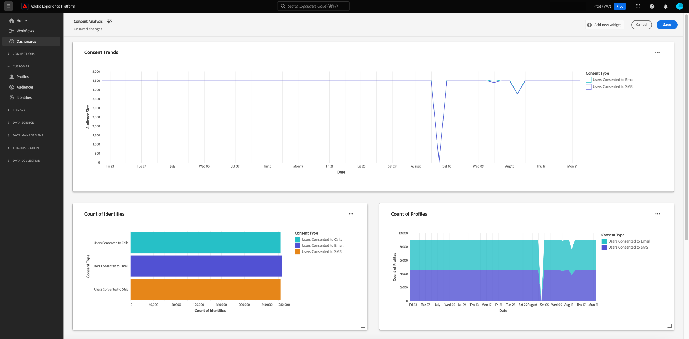

# Einverständnisanalyse und -verfolgung

In der heutigen Marketinglandschaft müssen Sie die Voreinstellungen bezüglich der Kundenzustimmung verstehen und berücksichtigen. Adobe Real-time Customer Data Platform bietet Marketingexperten die Möglichkeit, die Zustimmung von Kunden zu analysieren, um Vertrauen zu schaffen, Datenschutzbestimmungen einzuhalten und personalisiertere Erlebnisse bereitzustellen.

In diesem Dokument wird beschrieben, wie Sie ein Einwilligungs-Dashboard für verschiedene Marketing-Anwendungsfälle für Real-Time CDP-Daten erstellen. Insbesondere wird beschrieben, wie Sie eine Zielgruppe mit den entsprechenden Attributen für Ihre Geschäftsanforderungen erstellen und dann mithilfe von vorkonfigurierten Widgets in der Adobe Experience Platform-Benutzeroberfläche Einblicke gewinnen. Eine alternative Methode zum Erstellen Ihres eigenen benutzerdefinierten Widgets mit der benutzerdefinierten Dashboards-Funktion wird ebenfalls vorgestellt.

## Anwendungsfälle {#use-cases}

Die in diesem Handbuch behandelten Anwendungsfälle sind Zustimmungstrends und Zustimmungsüberschneidungen.

- **Trendansicht der Zustimmung** verfolgt, wie sich die Benutzerzustimmung im Laufe der Zeit entwickelt hat. Die Analyse von Änderungen der Zustimmungsvoreinstellungen hilft Marketern bei der Planung und Ausführung von Kampagnen, die sich an diese Änderungen der Benutzerpräferenz anpassen. So können Sie beispielsweise zielgerichtete Bildungskampagnen, Transparenz- und Vertrauenskampagnen oder Anreizkampagnen durchführen, um die Auswahl der Zustimmung zu fördern. Sie können auch Kampagnen korrelieren, die sich negativ auf die Zustimmung ausgewirkt haben, um die Häufigkeit dieser Kampagnen proaktiv zu reduzieren.
- **Überlappung der Einverständniserklärungen** nutzt die Überschneidung zwischen Einwilligungskanälen, um konsistente personalisierte Nachrichten auf mehreren Kanälen für Kunden bereitzustellen, die mehreren Kanälen zugestimmt haben. Marketingexperten können Ressourcen priorisieren und bestimmten Kanälen zuweisen, in denen ein höheres Maß an Zustimmung und personalisiertem Messaging bei Kunden ankommt und höhere Antwortraten generiert.

## Erstellen genehmigter Zielgruppen {#create-consent-audiences}

Um ein Zustimmungs-Dashboard zu erstellen, müssen Sie zunächst eine Audience aller Profile erstellen, die der Kontaktaufnahme zugestimmt haben. Um zum Real-time Customer Data Platform Segment Builder zu navigieren, wählen Sie im linken Navigationsbereich der Platform-Benutzeroberfläche die Option **[!UICONTROL Zielgruppen]** aus. Wählen Sie auf der Registerkarte [!UICONTROL Kunde] des Dashboards [!UICONTROL Zielgruppen] die Option **[!UICONTROL Zielgruppe erstellen]** oben rechts in der Ansicht und dann **[!UICONTROL Regeln erstellen]**.

![Das Dashboard [!UICONTROL Zielgruppen] mit dem Dashboard [!UICONTROL Kunde], [!UICONTROL Zielgruppen] und [!UICONTROL Segment erstellen] ist hervorgehoben.](../images/insights-use-cases/consent-analysis/create-audience.png)

Der Segment Builder wird angezeigt. Wählen Sie dann **[!UICONTROL XDM Individual Profile]** aus den verfügbaren Optionen aus. Weitere Informationen zur Arbeitsfläche [Regel-Builder](../../segmentation/ui/segment-builder.md#rule-builder-canvas) finden Sie in der Dokumentation .

![Der Segment Builder mit dem Attributordner [!UICONTROL XDM Individual Profile] , der hervorgehoben ist.](../images/insights-use-cases/consent-analysis/xdm-individual-profile.png)

Suchen Sie Ihre Zustimmungsattribute aus den verfügbaren Optionen. Wählen Sie **[!UICONTROL Zustimmungen und Voreinstellungen]** aus.

>[!NOTE]
>
>Wenn Sie Ihre Benutzereinwilligung in einem anderen Attribut als der von Adobe empfohlenen Feldergruppe gespeichert haben, müssen Sie diese Attribute anstelle der unten aufgeführten Attribute auswählen.

Weitere Informationen finden Sie in der Dokumentation zur [Handhabung der Zustimmung in der Segmentierung](../../segmentation/consents.md#handling-consent-in-segmentation) .

![Der Segmentaufbau mit dem Attributordner [!UICONTROL Einverständnis und Voreinstellungen] ist hervorgehoben.](../images/insights-use-cases/consent-analysis/consent-and-preferences.png)

Die verschiedenen Zustimmungs- und Präferenzoptionen werden angezeigt. Da sich diese Demonstration auf die Einwilligung zum Kontakt über verschiedene Marketing-Kanäle konzentriert, wählen Sie **[!UICONTROL Marketing-Voreinstellungen]** aus.

![Der Segment Builder mit dem Ordner [!UICONTROL Marketing-Voreinstellungen] ist hervorgehoben.](../images/insights-use-cases/consent-analysis/marketing-preferences.png)

Die Liste der Marketing-Voreinstellungen wird angezeigt. Obwohl sich dieser Beispielanwendungsfall auf E-Mail-, SMS- und Aufrufe konzentriert, können Sie Einblicke für jede andere Kombination oder die Gesamtheit der Optionen erstellen. Führen Sie für jeden Kanal die folgenden Schritte aus, um eine Zielgruppe zu erstellen.

Um mit der Konfiguration einer Audience zu beginnen, wählen Sie **[!UICONTROL SMS empfangen]** / **[!UICONTROL E-Mail empfangen]** / **[!UICONTROL Aufrufe empfangen]** aus.

Der Ordner [!UICONTROL Abonnements] wird angezeigt. Wählen Sie aus den verfügbaren Optionen das Attribut **[!UICONTROL Auswahlwert]** aus, ziehen Sie es in den mittleren Bereich und wählen Sie dann den gewünschten Wert aus der Dropdown-Liste aus. Wählen Sie in diesem Fall **Ja (Opt-in)** aus. Benennen Sie anschließend die Audience entsprechend Ihren geschäftlichen Anforderungen und geben Sie eine benutzerfreundliche Beschreibung an.

>[!NOTE]
>
>Die Anzahl der Zielgruppen, die Sie erstellen sollten, ist weich begrenzt. Weitere Informationen finden Sie in der Dokumentation zu den Limits für die [Segmentierung](../../profile/guardrails.md#segmentation-guardrails) .

![Das Attribut [!UICONTROL Auswahlwert] mit dem Wert [!UICONTROL Ja (Opt-in)] , der im Segment Builder hervorgehoben ist. Der Name und die Beschreibung der Zielgruppe werden ebenfalls hervorgehoben.](../images/insights-use-cases/consent-analysis/choice-value.png)

Nachdem Sie die erforderlichen Zielgruppen erstellt haben, werden sie auf der Registerkarte [!UICONTROL Zielgruppen] [!UICONTROL Durchsuchen] aufgelistet.

>[!NOTE]
>
>Beim Erstellen einer Zielgruppe müssen Sie warten, bis der Batch-Segmentierungsauftrag abgeschlossen ist, bevor die Daten verfügbar sind, um mit der Erstellung Ihres Zustimmungs-Dashboards zu beginnen. Die Batch-Segmentierung beschreibt den Prozess des gleichzeitigen Übergangs aller Profildaten durch Ihre Segmentdefinitionen, um die entsprechenden Zielgruppen zu erstellen. Nach der Erstellung wird diese Audience gespeichert und zum Export und zur Verwendung gespeichert. Batch-Segmente werden automatisch alle 24 Stunden ausgewertet.

## Einblicke verbrauchen {#consume-insights}

Adobe hat verschiedene Einblicke erstellt, die Ihnen automatisch in den Dashboards Profile, Zielgruppen und Ziele zur Verfügung stehen. Jede von Ihnen erstellte Zielgruppe kann dann automatisch mit diesen vorkonfigurierten Einblicken verwendet werden. Eine Liste der Einblicke, die in den Dashboards [Profile](../guides/profiles.md#standard-widgets), [Zielgruppen](../guides/audiences.md#standard-widgets) und [Ziele](../guides/destinations.md) verfügbar sind, finden Sie in der Dokumentation zum Standard-Widget .

## Zielgruppenüberschneidung {#audience-overlap}

Um die Überschneidung zwischen zwei Zielgruppen für die Zustimmung zu überprüfen, fügen Sie die [!UICONTROL Zielgruppenüberschneidung durch Zusammenführungsrichtlinie] zu Ihrem Profil-Dashboard hinzu und wählen Sie die gewünschten Zielgruppen in den Dropdown-Menüs aus. Weitere Informationen zu den Einblicken finden Sie in der Dokumentation für Anweisungen zum Hinzufügen eines Widgets zu Ihrem Dashboard zur [*Zielgruppenüberschneidung nach Zusammenführungsrichtlinie*](../guides/profiles.md#audience-overlap-by-merge-policy) .

<!-- Image needs updating to night mode -->

Sie können die Überschneidung aller Zielgruppen anzeigen, für die Benutzer dem Empfang von Aufrufen für alle anderen Zielgruppen zugestimmt haben, mit dem Bericht Zielgruppenüberschneidung im Dashboard Zielgruppen . Um die Überschneidung von Zustimmungszielgruppen anzuzeigen, navigieren Sie zunächst zur Registerkarte [!UICONTROL Zielgruppen] [!UICONTROL Überblick] . Von dort können Sie das Widget [!UICONTROL Zielgruppenüberschneidungsbericht] zum Zielgruppen-Dashboard hinzufügen. Nachdem das Widget erstellt wurde, wählen Sie im Dropdown-Menü Übersicht der Zielgruppe oben auf der Seite die Option **[!UICONTROL Benutzer mit Zustimmung zu Aufrufen]** aus. Wählen Sie als Nächstes **[!UICONTROL Mehr anzeigen]** im Berichtwidget &quot;Zielgruppenüberschneidung&quot;, um bis zu 50 der oberen Überschneidungen und bis zu 50 der geringsten Überschneidungen mit dem ausgewählten Segment anzuzeigen.

<!-- Image needs updating to night mode -->

Das Berichtdialogfeld Zielgruppenüberschneidung wird erweitert und zeigt zusätzliche Daten zu Zielgruppenüberschneidungen an.

<!-- Image needs updating to night mode -->

## Trends der Zielgruppengröße {#audience-size-trends}

Wenn Sie eine einwilligungsbasierte Zielgruppe erstellen, werden automatisch Trends bis zu 12 Monate nach dem Datum der Erstellung der Zielgruppe erstellt. Um einen voll funktionsfähigen Trend Ihrer Kundenzustimmung zu erreichen, fügen Sie die folgenden Widgets zur Seite [!UICONTROL Segmente] [!UICONTROL Überblick] hinzu. Diese Einblicke bieten eine leistungsstarke Möglichkeit, zu verfolgen, wie sich Ihre Einwilligung im Laufe der Zeit ändert. Sie korrelieren sogar mit allen parallel ausgeführten Kampagnen, die sich positiv oder negativ auf die Zustimmung auswirken könnten. Die für diese Widgets angebotenen Beschreibungen gelten für den Anwendungsfall der Zustimmung.

- [Trend zur Zielgruppengröße](../guides/audiences.md#audience-size-trend): Dieses Widget bietet eine Möglichkeit zu verfolgen, wie sich Ihre jeweilige Zustimmung im Laufe der Zeit geändert hat.
- [Trend zur Änderung der Zielgruppengröße](../guides/audiences.md#audience-size-change-trend): Dieses Widget verfolgt, wie sich Ihre Kundenzustimmung täglich verändert hat. Wenn beispielsweise die Anzahl Ihrer Kundenzustimmung um 100.000 gesunken ist, können Sie sehen, wie diese Änderung täglich stattgefunden hat.
- [Trend zur Zielgruppengröße nach Identität](../guides/audiences.md#audience-size-trend-by-identity): Mit diesem Widget können Sie verfolgen, wie sich Ihre jeweilige Einwilligung im Laufe der Zeit geändert hat, aber weiter nach einer bestimmten Identität wie einer E-Mail gefiltert werden.

<!-- Image needs updating to night mode -->

## Dashboard &quot;Zielgruppenübersicht&quot; {#audiences-overview-dashboard}

Nachdem Sie eine einwilligungsbezogene Zielgruppe erstellt haben, z. B. &quot;Benutzer mit Einverständnis für SMS&quot;, können Sie wichtige personalisierte Einverständnisinformationen zu Ihrer Zielgruppe anzeigen, indem Sie die entsprechenden Widgets zu Ihrem Dashboard Zielgruppenübersicht hinzufügen. Navigieren Sie zu [!UICONTROL Zielgruppen] [!UICONTROL Überblick] und fügen Sie Ihre ausgewählten Widgets aus der Widget-Bibliothek hinzu. Jedes Widget, das Ihrer Ansicht des Dashboards hinzugefügt wird, kann mithilfe der Funktion [!UICONTROL Dashboard ändern] in der Größe angepasst und verschoben werden. Ihre personalisierte Ansicht kann Einblicke wie den Trend im Zeitverlauf (bis zu 12 Monate), die Überschneidungen mit anderen Zielgruppen und die Identitätskomposition der Zielgruppe enthalten. Unten finden Sie eine Beispielansicht.

## Benutzerdefinierte Dashboards {#usr-defined-dashboards}

Sie können auch eigene Widgets mit benutzerdefinierten Dashboards erstellen. Durch die Erstellung Ihres eigenen Widgets können Sie den Typ des Widgets vollständig steuern und flexibel Filter hinzufügen und vieles mehr direkt in Adobe Real-Time CDP.

Wenn Sie z. B. mehrere Zustimmungszielgruppen im selben Diagramm als Trend verfolgen möchten, damit Sie im Laufe der Zeit sehen können, wie sich die einzelnen Zustimmungsvoreinstellungen verändert haben. Diese Art der Visualisierung ist mit benutzerdefinierten Dashboards in minimalen Schritten und einer einmaligen Einrichtung möglich. Wählen Sie zunächst **[!UICONTROL Dashboards]** im linken Navigationsbereich aus. Der Arbeitsbereich [!UICONTROL Dashboards] wird angezeigt. Wählen Sie dann **[!UICONTROL Dashboard erstellen]** aus. Umfassende Anweisungen zum Erstellen von [Dashboards und benutzerdefinierten Widgets](../user-defined-dashboards.md) finden Sie im Handbuch zu benutzerdefinierten Dashboards.

Wenn Sie [Ihr Datenmodell](../user-defined-dashboards.md#select-data-model) im Widget Composer auswählen, wählen Sie `CDPInsights` gefolgt von **[!UICONTROL Weiter]**. Das Dialogfeld [!UICONTROL Tabelle auswählen] wird angezeigt.

In der nächsten Ansicht wird eine Liste der verfügbaren Tabellen in der linken Leiste angezeigt. Wählen Sie die `adwh_fact_profile_by_segment_and_namespace_trendlines`.

Nachdem der Widget Composer mit Daten aus Ihrer ausgewählten Tabelle gefüllt wurde, führen Sie die folgenden Schritte aus:

- [Suchen Sie [!UICONTROL Attribute]](../user-defined-dashboards.md#add-filter-attributes) nach `[!UICONTROL date]` und verwenden Sie dann das Symbol + , um das Attribut `[!UICONTROL date]` zur X-Achse aus dem Dropdown-Menü hinzuzufügen.
  
- Suchen Sie [!UICONTROL Attribute] nach `[!UICONTROL count_of_profiles]` und verwenden Sie dann das Symbol + , um das Attribut `[!UICONTROL count_of_profiles]` zur Y-Achse aus dem Dropdown-Menü hinzuzufügen.
- Wählen Sie im Feld [!UICONTROL Y-Achse] das Symbol `...` (mit Auslassungspunkten) und dann im Dropdown-Menü die Aggregatfunktion [!UICONTROL SUM] aus.
  
- Wählen Sie das Dropdown-Menü [!UICONTROL Markierungen] aus und ändern Sie den Diagrammtyp in [!UICONTROL Linie].
- Suchen Sie [!UICONTROL Attribute] nach dem Wert `[!UICONTROL segment_name]` und verwenden Sie dann das Symbol + , um den Wert `segment_name` als einen [!UICONTROL Filter] aus dem Dropdown-Menü hinzuzufügen. Das Dialogfeld [!UICONTROL Filter: Segment_name] wird angezeigt. Wählen Sie die zuvor erstellten Zielgruppen aus, die sich auf die Zustimmung beziehen. Wählen Sie für dieses Beispiel **[!UICONTROL Benutzer, die Anrufen zugestimmt haben]**, **[!UICONTROL Benutzer, die SMS zugestimmt haben]** und **[!UICONTROL Benutzer, die E-Mail zugestimmt haben]**, gefolgt von **[!UICONTROL Anwenden]**.
- Suchen Sie [!UICONTROL Attribute] nach `[!UICONTROL segment_name]` und wählen Sie dann das Symbol + aus, um `segment_name` als [!UICONTROL Farbe] aus dem Dropdown-Menü hinzuzufügen.
- Öffnen Sie [das Bedienfeld [!UICONTROL Eigenschaften]](../user-defined-dashboards.md#widget-properties) und geben Sie einen entsprechenden [!UICONTROL Widget-Titel] und eine [!UICONTROL Achsenbeschriftung] ein.
  
- Wählen Sie **[!UICONTROL Speichern und schließen]** aus, um Ihre Einstellungen zu bestätigen.

>[!TIP]
>
>Sie können nun das Widget in der gewünschten Größe und Position ändern, bevor Sie es speichern.

Die folgende Abbildung zeigt, wie Ihr fertig gestelltes Widget und andere potenzielle benutzerdefinierte Einblicke angezeigt werden. Weitere Informationen zu den Typen von Widgets, die erstellt werden können, finden Sie in der [Dokumentation zum Datenmodell](../data-models/cdp-insights-data-model-b2c.md).

<!-- The diagram shows straight lines due to a lack of data, however in your environment the trends will reflect the actual changes over time. -->

## Verfolgen von Zustimmungsrichtlinien {#consent-policies}

Die Einwilligungs-Dashboards, die Sie erstellen, erfassen nur die **Verteilung der Einwilligung und der Präferenzattribute**.

>[!NOTE]
>
>Für Kunden von **Adobe Healthcare Shield** oder **Adobe Privacy &amp; Security Shield** spiegeln diese Dashboards **keine** Nachverfolgung von Zustimmungsrichtlinien wider. Das verfügbare Tracking umfasst die Anzahl der erstellten, aktivierten Richtlinien und die Auswirkungen auf die Zielgruppenzugehörigkeit.

## Nächste Schritte

Durch Lesen dieses Dokuments haben Sie erfahren, wie Sie Dashboards erstellen, um mithilfe von Real-Time CDP-Einblicken einen umfassenden Überblick über Ihre Zustimmungsvoreinstellungen zu erhalten. Dieses Dokument zeigt, wie Real-Time CDP eine robuste Lösung für die datenschutzorientierte Landschaft von heute bietet, in der Erfassung, Segmentierung, Analyse und personalisierte Marketing-Kampagnen, die auf Einwilligungsdaten basieren, für Marketing-Experten von entscheidender Bedeutung sind.
