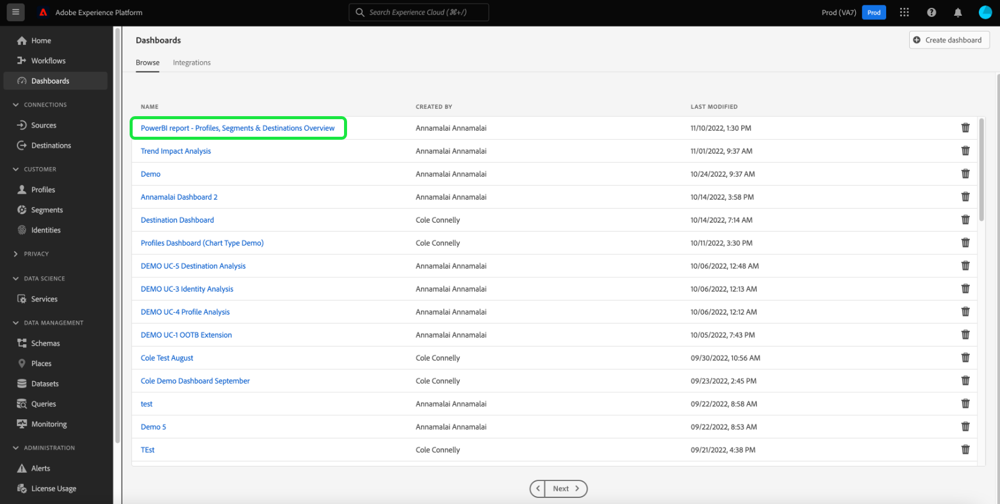

# Power BI-Berichtsvorlagen für Dashboards

Mit der Berichtsvorlagenfunktion von Power BI können Sie ansprechende Berichte erstellen, die mit Daten aus Adobe Experience Platform gefüllt sind. Der optimierte Installationsprozess installiert automatisch Standard-Widgets für Echtzeit-Kundenprofil, Segmentierung und Ziele. Die Installation verbindet Power BI auch mit Ihren Datenmodellen, sodass Sie Ihre Berichtsvorlagen einfach anpassen und erweitern können. Diese Berichte können für Ihre gesamte Organisation freigegeben werden, ohne dass die Empfänger Anmeldeinformationen für Ihre Organisation in Platform benötigen.

In diesem Dokument erfahren Sie, wie Sie Adobe Experience Platform mit der Power BI-Anwendung verbinden und mithilfe von Berichtsvorlagen wichtige, aus Platform-Daten gewonnene Einblicke mit externen Benutzern teilen können.

## Erste Schritte

Bevor Sie mit diesem Tutorial fortfahren, sollten Sie über gute Kenntnisse zu [Schemakomposition](../../xdm/schema/composition.md) in Experience Platform und wie Attribute im Echtzeit-Kundenprofil über das [Vereinigungsschema](../../xdm/schema/composition.md#union).

Um die Power BI-Anwendungsintegration installieren zu können, müssen die Benutzer zunächst die folgenden Platform-Berechtigungen erhalten haben:

- Verwalten von Abfragen
- Verwalten von Sandboxes

Informationen zum Zuweisen dieser Berechtigungen finden Sie in der Dokumentation zur [Zugriffskontrolle](../../access-control/home.md).

Außerdem benötigen Sie ein Power BI-Konto, um diesem Tutorial zu folgen. Um ein Konto zu erstellen, gehen Sie auf die [Power BI-Homepage](https://powerbi.microsoft.com/de-de/) und folgen Sie dem Anmeldeprozess. Benutzer dieses Power BI-Kontos müssen auch in ihren Power BI-Einstellungen **Arbeitsbereich erstellen** aktivieren. Diese Einstellung befindet sich in den Mandanteneinstellungen des Power BI-Admin-Portals. Wenn Ihr Konto von Ihrem Mandanten oder Arbeitgeber bereitgestellt wird, wenden Sie sich an Ihren jeweiligen Administrator, um diese Einstellung zu aktivieren.

>[!NOTE]
>
>Damit die Registerkarte Dashboards im linken Navigationsbereich der Platform-Benutzeroberfläche angezeigt wird und die Dashboard-Lagerbestandsansicht sichtbar ist, müssen Sie als Teil Ihrer Platform-Lizenz Zugriff auf eines der Profil-, Segment- oder Ziel-Dashboards haben.

## Installieren der Power BI-Anwendungsintegration

Wählen Sie in der Platform-Benutzeroberfläche im linken Navigationsbereich **[!UICONTROL Dashboards]** aus, um den [!UICONTROL Dashboards]-Arbeitsbereich zu öffnen. Die Registerkarte [!UICONTROL Durchsuchen] zeigt eine Liste der derzeit verfügbaren Dashboard-Ansichten an. Weitere Informationen zum Anzeigen verfügbarer Dashboards finden Sie unter [Inventardokumentation](../inventory.md).

Wählen Sie als Nächstes die Registerkarte **[!UICONTROL Integrationen]** aus. Die Seite der Power BI-Anwendungsintegration wird angezeigt. Wählen Sie nun **[!UICONTROL Installieren]** aus, um die Installation zu starten.

>[!NOTE]
>
>Die Schaltfläche [!UICONTROL Installieren] ist deaktiviert, es sei denn, Sie verfügen sowohl über die Berechtigung „Verwalten von Query Service“ als auch „Verwalten von Sandboxes“.

### Zugangsdaten angeben

Der erste Schritt im Installationsprozess besteht darin, nicht ablaufende Zugangsdaten für die Power BI-Anwendungsintegration bereitzustellen. Es gibt zwei Möglichkeiten, diese bereitzustellen: [[!UICONTROL Erstellen neuer Zugangsdaten]](#create-new-credentials) oder [[!UICONTROL Verwenden vorhandener Anmeldeinformationen]](#use-existing-credentials). Wählen Sie den entsprechenden Umschalter aus, um fortzufahren.

#### Erstellen neuer Zugangsdaten {#create-new-credentials}

Beim Generieren neuer Zugangsdaten gibt es zwei erforderliche Felder: [!UICONTROL Name] und [!UICONTROL Zugewiesen an]. Das Feld [!UICONTROL Zugewiesen an] bezieht sich auf die mit Ihrem Power BI-Konto verknüpfte E-Mail-Adresse.

>[!IMPORTANT]
>
>Zum Erstellen von nicht ablaufenden Zugangsdaten müssen Ihnen bestimmte Berechtigungen und Rollen zugewiesen sein. Die erforderlichen Berechtigungen sind „Verwalten von Sandboxes“ und „Verwalten der Integration von Query Service“. Die erforderlichen Rollen sind „Adobe Experience Platform-Admin“ und „Entwickler“. Informationen zum Zuweisen dieser Berechtigungen finden Sie in der Dokumentation über die [Zugriffskontrolle](../../access-control/home.md).

Weiterführende Informationen zum Generieren von nicht ablaufenden Zugangsdaten für Query Service finden Sie im [Handbuch zu nicht ablaufenden Zugangsdaten](../../query-service/ui/credentials.md#non-expiring-credentials).

Nachdem das erste Mal nicht ablaufende Zugangsdaten generiert wurden, wird eine JSON-Datei auf den Computer heruntergeladen. Diese JSON-Datei kann dann für andere Benutzer als Zugangsdaten zum Abschließen des Installationsprozesses freigegeben werden.

#### Verwenden vorhandener Zugangsdaten {#use-existing-credentials}

Eine JSON-Zugangsdaten-Datei kann auch zur Validierung hochgeladen werden. Diese JSON-Dateien, die nicht ablaufende Zugangsdaten enthalten, werden auf den lokalen Computer heruntergeladen, der bei der Erstellung nicht ablaufender Zugangsdaten verwendet wird.

>[!IMPORTANT]
>
>Um vorhandene, nicht ablaufende Zugangsdaten zu verwenden, müssen dem Benutzer bereits Zugangsdaten zugewiesen worden sein. Wenn dem Benutzer keine Zugangsdaten zugewiesen wurden und er keinen neuen mithilfe von Adobe Admin Console erstellen kann, dann kann der Benutzer nicht mit dem Installationsprozess fortfahren.

Wählen Sie **[!UICONTROL Datei für Zugangsdaten hochladen]** und dann im angezeigten Dialogfeld die entsprechende JSON-Datei aus, die hochgeladen werden soll.

Nachdem Sie die nicht ablaufenden Zugangsdaten angegeben haben, werden sie automatisch von Platform überprüft. Nach erfolgreicher Überprüfung wird eine Bestätigungsmeldung angezeigt. Wählen Sie **[!UICONTROL Nächste]** aus, um die Einverständniserklärung für das Power BI-Programm zu lesen.

### Einverständnis bereitstellen

Die Einverständnisanzeige erscheint. Wählen Sie **[!UICONTROL Einverständniserklärung überprüfen]** aus, um ein neues Fenster zu öffnen. Dort sind die erforderlichen Berechtigungen aufgeführt, die Power BI benötigt, um gemäß den Nutzungsbedingungen und der Datenschutzerklärung Zugriff auf Ihre Daten zu erhalten und diese zu verwenden.

Wählen Sie **[!UICONTROL Akzeptieren]** aus, um Power BI Zugriff auf Ihre Platform-Daten und deren Verwendung zu gewähren.

>[!NOTE]
>
>Wenn Sie den Installationsprozess zu einem beliebigen Zeitpunkt beenden, bevor Sie Ihr Einverständnis erteilen, wird die Power BI-Anwendungsintegration nicht im Dashboard-Inventar installiert.

Nachdem Sie Ihr Einverständnis gegeben haben, wird die Berichtsvorlage automatisch im Rahmen des Installationsprozesses in die Power BI-Umgebung installiert. Power BI verwendet dann die nicht ablaufenden Zugangsdaten, um auf Platform zuzugreifen, alle SQL-Abfragen nacheinander auszuführen und die Berichtsvorlage mit den zurückgegebenen Daten zu füllen.

Wählen Sie **[!UICONTROL Beenden]** aus, um zum Dashboard-Inventar zurückzukehren.

Nachdem die Power BI-Berichtsvorlage installiert wurde, wird sie in der Liste der verfügbaren Dashboards in der Registerkarte [!UICONTROL Durchsuchen] angezeigt. Wählen Sie **[!UICONTROL Power BI]** aus der Liste aus, um zur Power BI-Umgebung zu gehen.

>[!IMPORTANT]
>
>Die Power BI-Administratoren müssen sicherstellen, dass die Benutzer über die entsprechenden Zugangsberechtigungen verfügen, um diese Dashboards in der Power BI-Umgebung sehen zu können.

## Power BI-Arbeitsbereich

Nach der Anmeldung im [Power BI-Arbeitsbereich](https://dxt.powerbi.com) stehen Berichtsvorlagen für jeden Service zur Verfügung, auf den Sie Zugriff haben. Die Berichtsvorlagen enthalten **nur dann** die Dashboards für Profile, Segmente und Ziele, wenn sie über die entsprechenden Ansichtsberechtigungen verfügen.

Die Standard-Widgets der Profile, Segmente und Ziele sind standardmäßig in den Power BI-Vorlagenberichten verfügbar.

>[!NOTE]
>
>Die Bearbeitungsberechtigungen für ein Dashboard müssen aktiviert sein, damit dieses Dashboard in der Power BI-Umgebung installiert werden kann.

Nachdem ein Dashboard in Power BI installiert wurde, werden Berichtsvorlagen standardmäßig allen Benutzern angezeigt. Wenn Sie den Zugriff auf Berichtsvorlagen beschränken möchten, deaktivieren Sie den Zugriff für die betreffenden Benutzer in der Power BI-Umgebung.

## Power BI-Berichtsvorlage anpassen

Mithilfe benutzerdefinierter Widgets können Sie Ihrem Datenmodell benutzerdefinierte Attribute hinzufügen, um die von Power BI bereitgestellten Berichtsvorlagen anzureichern.

>[!NOTE]
>
>Die Attribute, die Sie für benutzerdefinierte Widgets verwenden können, hängen davon ab, was im Vereinigungsschema verfügbar ist. Informationen darüber, wie Sie für Ihre benutzerdefinierten Widgets Vereinigungsschemas anzeigen und analysieren können, finden Sie im [Handbuch für die Vereinigungsschema-UI](../../profile/ui/union-schema.md).

### Erstellen eines benutzerdefinierten Widgets

Benutzerdefinierte Widgets werden mithilfe der Widget-Bibliothek erstellt. Allgemeine Informationen zu der Funktion finden Sie unter [Übersicht über die Widget-Bibliothek](../customize/widget-library.md). Eine spezifische Anleitung erhalten Sie unter [Anleitung zum Erstellen eines benutzerdefinierten Widgets](../customize/custom-widgets.md).

>[!IMPORTANT]
>
>Neu erstellte benutzerdefinierte Widgets werden **nicht** automatisch zwischen Adobe Experience Platform-Dashboards und den Power BI-Berichtsvorlagen synchronisiert. Alle benutzerdefinierten Widgets, die in der Platform-Benutzeroberfläche erstellt werden, müssen in der Power BI-Umgebung manuell neu erstellt werden.

### Benutzerdefiniertes Widget in der Power BI-Umgebung neu erstellen

Sobald Ihr Dashboard über die in den benutzerdefinierten Widgets enthaltenen Metriken und Attribute verfügt, können Sie die in der Power BI-Umgebung angezeigte Berichtsvorlage ändern. In der [Power BI-Dokumentation](https://docs.microsoft.com/de-de/power-bi/) finden Sie weitere Informationen darüber, wie ein Bericht über die jeweilige Benutzeroberfläche bearbeitet werden kann.

## Löschen der Power BI-Anwendungsintegration

Um das Dashboard zu löschen, gehen Sie zum Dashboard-Inventar und wählen Sie das Löschsymbol () neben dem Dashboard-Namen.

>[!NOTE]
>
>Nur der Benutzer, der das Power BI-Dashboard installiert hat, kann die Integration aus der Platform-Benutzeroberfläche löschen.

Ein Bestätigungs-Pop-over wird angezeigt. Wählen Sie **[!UICONTROL Löschen]** aus, um den Vorgang zu bestätigen.

>[!IMPORTANT]
>
>Durch das Löschen des Power BI-Dashboards aus der Platform-Benutzeroberfläche werden **nicht** die in Ihrer Power BI-Umgebung verfügbaren Berichtsvorlagen gelöscht. Wenn Sie die in den Power BI-Berichtsvorlagen enthaltenen Informationen vollständig löschen möchten, müssen Sie sich bei Ihrem Power BI-Konto anmelden und die Berichtsvorlagen aus dieser Umgebung löschen. Nach dem Löschen kann ein Benutzer mithilfe der oben beschriebenen Installationsanweisungen das Power BI-Dashboard neu installieren.

## Nächste Schritte

Mithilfe dieses Dokuments erhalten Sie ein besseres Verständnis dafür, wie Power BI-Berichtsvorlagen in Platform integriert werden können, um ansprechende, aus Ihren Profil-, Segment- oder Ziel-Dashboards gewonnene Einblicke für andere freizugeben. Weitere Information über das Anpassen Ihrer Dashboards finden Sie unter [Übersicht über die Dashboard-Anpassung](../customize/overview.md).
