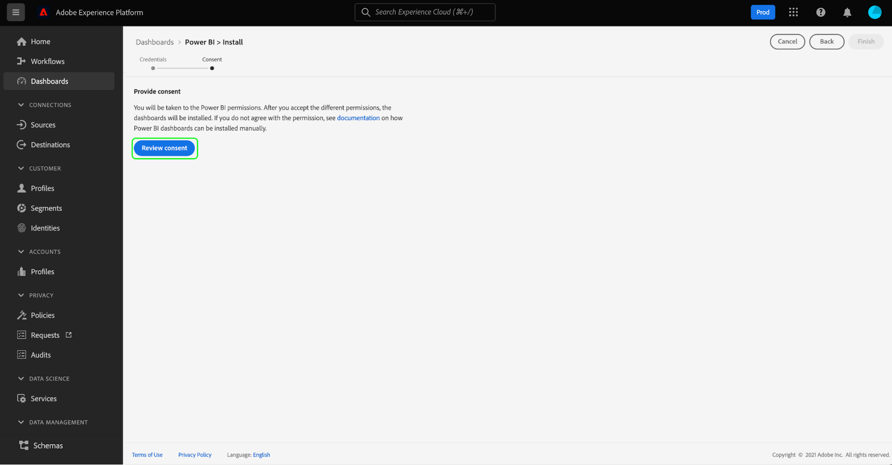

# Power BI-Berichtsvorlagen für Dashboards

Mit der Berichtsvorlagenfunktion Power BI können Sie ansprechende Berichte erstellen, die mit Daten aus Adobe Experience Platform gefüllt sind. Der optimierte Installationsprozess installiert automatisch Standard-Widgets für Echtzeit-Kundenprofil, Segmentierung und Ziele. Die Installation verbindet Power BI auch mit Ihren Datenmodellen, sodass Sie Ihre Berichtsvorlagen einfach anpassen und erweitern können. Diese Berichte können für Ihr gesamtes Unternehmen freigegeben werden, ohne dass die Empfänger Anmeldeinformationen für Ihre IMS-Organisation in Platform benötigen.

In diesem Dokument erfahren Sie, wie Sie Adobe Experience Platform mit der Power BI-Anwendung verbinden und mithilfe von Berichtsvorlagen wichtige Platform-Dateneinblicke mit externen Benutzern teilen.

## Erste Schritte

Bevor Sie mit diesem Tutorial fortfahren, sollten Sie über gute Kenntnisse zu [Schemakomposition](../../xdm/schema/composition.md) in Experience Platform und wie Attribute im Echtzeit-Kundenprofil über das [Vereinigungsschema](../../xdm/schema/composition.md#union).

Um die Integration der Power BI-Anwendung zu installieren, müssen Benutzer zunächst über die folgenden Plattformberechtigungen verfügen:

- Verwalten von Abfragen
- Verwalten von Sandboxes

Informationen zum Zuweisen dieser Berechtigungen finden Sie in der [Zugriffskontrolle](../../access-control/home.md) Dokumentation.

Sie müssen auch über ein Power BI-Konto verfügen, um diesem Tutorial zu folgen. Um ein Konto zu erstellen, navigieren Sie zum [Power BI homepage](https://powerbi.microsoft.com/en-us/) und folgen Sie dem Anmeldeprozess. Benutzer dieses Power BI-Kontos müssen auch die **Arbeitsbereich erstellen** in ihren Power BI-Einstellungen festlegen. Diese Einstellung befindet sich in den Mandanteneinstellungen des Power BI-Admin-Portals. Wenn Ihr Konto von Ihrem Mandanten oder Arbeitgeber bereitgestellt wird, wenden Sie sich an Ihren jeweiligen Administrator, um diese Einstellung zu aktivieren.

>[!NOTE]
>
>Damit die Registerkarte Dashboards im linken Navigationsbereich der Platform-Benutzeroberfläche angezeigt wird und die Dashboard-Lagerbestandsansicht sichtbar ist, müssen Sie als Teil Ihrer Platform-Lizenz Zugriff auf eines der Profil-, Segment- oder Ziel-Dashboards haben.

## Installieren der Power BI-Anwendungsintegration

Wählen Sie in der Platform-Benutzeroberfläche die Option **[!UICONTROL Dashboards]** im linken Navigationsbereich, um die [!UICONTROL Dashboards] Arbeitsbereich. Die [!UICONTROL Durchsuchen] zeigt eine Liste der derzeit verfügbaren Dashboard-Ansichten an. Weitere Informationen zum Anzeigen verfügbarer Dashboards finden Sie unter [Inventardokumentation](../inventory.md).

Wählen Sie als Nächstes die **[!UICONTROL Integrationen]** Registerkarte. Die Seite zur Power BI-Anwendungsintegration wird angezeigt. Wählen Sie von hier aus **[!UICONTROL Installieren]** um die Installation zu starten.

>[!NOTE]
>
>Die [!UICONTROL Installieren] -Schaltfläche deaktiviert ist, es sei denn, Sie verfügen über die Berechtigungen &quot;Query Service Manager&quot;und &quot;Sandboxes verwalten&quot;.

### Anmeldedaten angeben

Der erste Schritt im Installationsprozess besteht darin, nicht ablaufende Anmeldeinformationen für die Power BI-Anwendungsintegration bereitzustellen. Es stehen zwei Optionen zur Verfügung: [[!UICONTROL Erstellen neuer Anmeldeinformationen]](#create-new-credentials) oder [[!UICONTROL Vorhandene Anmeldeinformationen verwenden]](#use-existing-credentials). Wählen Sie den entsprechenden Umschalter aus, um fortzufahren.

#### Erstellen neuer Anmeldeinformationen {#create-new-credentials}

Beim Generieren neuer Anmeldedaten sind zwei Felder erforderlich: [!UICONTROL Name] und [!UICONTROL Zugeordnet zu]. Die [!UICONTROL Zugeordnet zu] -Feld bezieht sich auf die mit Ihrem Power BI-Konto verknüpfte E-Mail-Adresse.

>[!IMPORTANT]
>
>Zum Erstellen von nicht ablaufenden Berechtigungen müssen Ihnen bestimmte Berechtigungen und Rollen zugewiesen sein. Die erforderlichen Berechtigungen sind &quot;Sandboxes verwalten&quot;und &quot;Integration von Query Service verwalten&quot;. Die erforderlichen Rollen sind Adobe Experience Platform-Admin- und Entwicklerrollen. Informationen zum Zuweisen dieser Berechtigungen finden Sie in der [Zugriffskontrolle](../../access-control/home.md) Dokumentation.

Weiterführende Informationen zum Generieren von nicht ablaufenden Query Service-Anmeldedaten finden Sie im Abschnitt [Handbuch zu nicht ablaufenden Anmeldedaten](../../query-service/ui/credentials.md#non-expiring-credentials).

Nachdem Sie zum ersten Mal nicht ablaufende Anmeldeinformationen generiert haben, wird eine JSON-Datei auf diesen Computer heruntergeladen. Diese JSON-Datei kann dann für andere Benutzer als Anmeldeinformationen freigegeben werden, um den Installationsprozess abzuschließen.

#### Vorhandene Anmeldeinformationen verwenden {#use-existing-credentials}

Eine JSON-Berechtigungsdatei kann auch hochgeladen werden, um die Validierung zu bestehen. Diese JSON-Dateien mit den nicht ablaufenden Anmeldewerten werden auf den lokalen Computer heruntergeladen, der verwendet wird, wenn eine nicht ablaufende Berechtigung erstellt wird.

>[!IMPORTANT]
>
>Um eine vorhandene, nicht ablaufende Berechtigung zu verwenden, muss dem Benutzer bereits eine Berechtigung zugewiesen worden sein. Wenn dem Benutzer keine Berechtigung zugewiesen wurde und er keine neue Berechtigung mit Adobe Admin Console erstellen kann, kann der Benutzer nicht mit dem Installationsprozess fortfahren.

Auswählen **[!UICONTROL Berechtigungsdatei hochladen]** und wählen Sie dann die entsprechende JSON-Datei aus, die im angezeigten Dialogfeld hochgeladen werden soll.

Nachdem Sie die nicht ablaufenden Anmeldeinformationen angegeben haben, werden sie automatisch von Platform validiert. Nach erfolgreicher Überprüfung wird eine Bestätigungsmeldung angezeigt. Auswählen **[!UICONTROL Nächste]** Überprüfung der Zustimmungsvereinbarung für den Antrag auf Power BI.

### Einverständnis bereitstellen

Die Einverständnisanzeige wird angezeigt. Auswählen **[!UICONTROL Einverständniserklärung überprüfen]** , um ein neues Fenster zu öffnen, in dem die erforderlichen Berechtigungen für den Zugriff auf und die Verwendung Ihrer Daten gemäß den Nutzungsbedingungen und der Datenschutzerklärung aufgeführt sind.

Auswählen **[!UICONTROL Accept]** um Powern BI Zugriff auf Ihre Platform-Daten und deren Verwendung zu gewähren.

>[!NOTE]
>
>Wenn Sie den Installationsprozess zu einem beliebigen Zeitpunkt beenden, bevor Sie die Zustimmung erteilen, wird die Power BI-Anwendungsintegration nicht im Dashboards-Inventar installiert.

Nach der Zustimmung wird die Berichtsvorlage automatisch im Rahmen des Installationsprozesses in der Power BI-Umgebung installiert. Power BI verwendet dann die nicht ablaufenden Anmeldeinformationen, um auf Platform zuzugreifen, alle SQL-Abfragen nacheinander auszuführen und die Berichtsvorlage mit den zurückgegebenen Daten zu füllen.

Auswählen **[!UICONTROL Beenden]** , um zum Dashboard-Inventar zurückzukehren.

Nachdem die Power BI-Berichtsvorlage installiert wurde, wird sie in der Liste der verfügbaren Dashboards unter [!UICONTROL Durchsuchen] Registerkarte. Auswählen **[!UICONTROL Power BI]** aus der Liste, um zur Power BI-Umgebung zu navigieren.

>[!IMPORTANT]
>
>Power BI-Administratoren müssen sicherstellen, dass die Benutzer über die entsprechenden Zugriffsberechtigungen verfügen, um diese Dashboards in der Power BI-Umgebung anzeigen zu können.

## Power BI-Arbeitsbereich

Nach der Anmeldung bei [Power BI-Arbeitsbereich](https://dxt.powerbi.com), stehen Berichtsvorlagen für jeden Dienst zur Verfügung, auf den Sie Zugriff haben. Die Berichtsvorlagen umfassen die Dashboards für Profile, Segmente und Ziele **only** , wenn sie über die entsprechenden Ansichtsberechtigungen verfügen.

Die Standard-Widgets aus Powern BI, Segmenten und Zielen sind standardmäßig in den Vorlagenberichten verfügbar.

>[!NOTE]
>
>Sie müssen die Bearbeitungsberechtigungen für ein bestimmtes Dashboard aktivieren, damit dieses Dashboard in der Power BI-Umgebung installiert werden kann.

Nachdem ein Dashboard im Power BI installiert wurde, werden Berichtsvorlagen standardmäßig allen Benutzern angezeigt. Wenn Sie den Zugriff auf Berichtvorlagen beschränken möchten, deaktivieren Sie den Zugriff für die betreffenden Power BI in der Umgebung.

## Berichtsvorlage für Power BI anpassen

Mithilfe benutzerdefinierter Widgets können Sie Ihrem Datenmodell benutzerdefinierte Attribute hinzufügen, um die von Power BI bereitgestellten Berichtsvorlagen anzureichern.

>[!NOTE]
>
>Die Attribute, die Sie für benutzerdefinierte Widgets verwenden können, hängen davon ab, was im Vereinigungsschema verfügbar ist. Informationen zum Anzeigen und Erkunden von Vereinigungsschemas zum Nutzen Ihrer benutzerdefinierten Widgets finden Sie in der [UI-Handbuch für Vereinigungsschema](../../profile/ui/union-schema.md).

### Erstellen eines benutzerdefinierten Widgets

Benutzerdefinierte Widgets werden über die Widget-Bibliothek erstellt. Siehe [Übersicht über die Widget-Bibliothek](../customize/widget-library.md) für eine Einführung in die Funktion und die [Tutorial zum Erstellen eines benutzerdefinierten Widgets](../customize/custom-widgets.md) für spezifische Anweisungen.

>[!IMPORTANT]
>
>Neu erstellte benutzerdefinierte Widgets sind **not** automatisch zwischen Adobe Experience Platform-Dashboards und den Power BI-Berichtvorlagen synchronisiert werden. Alle benutzerdefinierten Widgets, die in der Platform-Benutzeroberfläche erstellt werden, müssen in der Power BI-Umgebung manuell neu erstellt werden.

### Benutzerdefiniertes Widget in der Power BI-Umgebung neu erstellen

Sobald Ihr Dashboard über die entsprechenden Metriken und Attribute in benutzerdefinierten Widgets verfügt, können Sie die in der Power BI-Umgebung angezeigte Berichtsvorlage ändern. Siehe [Power BI-Dokumentation](https://docs.microsoft.com/de-de/power-bi/) für Informationen zur Bearbeitung eines Berichts über die zugehörige Benutzeroberfläche.

## Power BI-Anwendungsintegration löschen

Um das Dashboard zu löschen, navigieren Sie zum Dashboard-Inventar und wählen Sie das Löschsymbol () neben dem Dashboard-Namen.

>[!NOTE]
>
>Nur der Benutzer, der das Power BI-Dashboard installiert hat, kann die Integration aus der Platform-Benutzeroberfläche löschen.

Ein Bestätigungs-Popup wird angezeigt. Auswählen **[!UICONTROL Löschen]** , um den Vorgang zu bestätigen.

>[!IMPORTANT]
>
>Das Löschen des Power BI-Dashboards über die Platform-Benutzeroberfläche **not** Löschen Sie die in Ihrer Power BI-Umgebung verfügbaren Berichtvorlagen. Wenn Sie die in den Berichtvorlagen des Power BI enthaltenen Informationen vollständig löschen möchten, müssen Sie sich bei Ihrem Power BI-Konto anmelden und die Berichtvorlagen aus dieser Umgebung löschen. Nach dem Löschen kann ein Benutzer das Power BI-Dashboard neu installieren, indem er die oben beschriebenen Installationsanweisungen befolgt.

## Nächste Schritte

Durch Lesen dieses Dokuments können Sie besser verstehen, wie Power BI-Berichtsvorlagen in Platform integriert werden können, um ansprechende Dateneinblicke aus Ihren Profil-, Segment- oder Ziel-Dashboards freizugeben. Siehe [Übersicht über die Dashboard-Anpassung](../customize/overview.md) , um mehr über das Anpassen Ihrer Dashboards zu erfahren.
