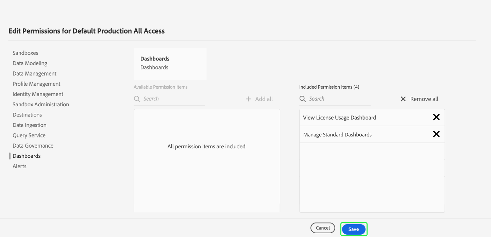

# Zugriffsberechtigungen für Dashboards

Damit Benutzer Dashboards anzeigen, bearbeiten und aktualisieren können, müssen Sie zunächst Berechtigungen aktivieren. In Adobe Experience Platform wird die Zugriffskontrolle über die Adobe Admin Console bereitgestellt. Diese Funktion nutzt Produktprofile in [!DNL Admin Console], um Anwender mit Berechtigungen und Sandboxes zu verknüpfen.

In diesem Dokument erfahren Sie, wie Sie in Admin Console Zugriff auf bestimmte Dashboard-Berechtigungen gewähren. Ausführliche Informationen zum Abrufen und Zuweisen von Zugriffsberechtigungen finden Sie in der [Übersicht zur Zugriffskontrolle](../access-control/home.md).

>[!NOTE]
>
>Zum Konfigurieren der Zugriffssteuerung für [!DNL Experience Platform] müssen Sie Administratorrechte für ein Unternehmen haben, das über eine [!DNL Experience Platform]-Produktintegration verfügt. Weitere Informationen zu [Administratorrollen](https://helpx.adobe.com/de/enterprise/using/admin-roles.html) finden Sie im Adobe Help Center-Artikel.

## Verfügbare Berechtigungen {#available-permissions}

Es gibt zwei Hauptberechtigungen, die für den Zugriff auf Dashboards in Experience Platform erforderlich sind. Diese Berechtigungen sind:

* **Anzeigen des Dashboards zur Lizenznutzung**: Diese Berechtigung ermöglicht Benutzern schreibgeschützten Zugriff auf das Dashboard zur Lizenzverwendung in der Experience Platform-Benutzeroberfläche.
* **Standard-Dashboards verwalten**: Mit dieser Berechtigung können Benutzer benutzerdefinierte Attribute hinzufügen, die sich noch nicht im Data Warehouse befinden.

Die folgenden Schritte zeigen Ihnen, wie Sie diese Berechtigungen mithilfe von Admin Console hinzufügen.

## Wählen Sie „Produktprofile“. 

Um Benutzern Zugriff auf Dashboards in Experience Platform zu gewähren, melden Sie sich zunächst bei [Adobe Admin Console](https://adminconsole.adobe.com) an und wählen Sie **Products** aus der oberen Navigationsleiste aus.

Wählen Sie **Adobe Experience Platform** aus dem Dropdown-Menü Experience Cloud im linken Navigationsbereich oder aus den unter *Alle Produkte und Dienste* aufgelisteten Karten. Wählen Sie auf der Adobe Experience Platform-Produktseite das Produktprofil aus, dem Sie die Dashboard-Berechtigungen hinzufügen möchten, oder wählen Sie **Neues Profil** aus, um ein neues Produktprofil zu erstellen.

Das ausgewählte Produktprofil wird geöffnet und zeigt die mit diesem Produktprofil verknüpften Benutzer an. Um die Berechtigungen für das Produktprofil zu verwalten, wählen Sie **Berechtigungen** aus.

## Berechtigungen hinzufügen/bearbeiten

Auf der Registerkarte **Berechtigungen** werden alle verfügbaren Berechtigungen für das Produktprofil angezeigt. Suchen Sie die Zeile **Dashboards** und beachten Sie, dass derzeit &quot;0 von 2 enthalten&quot;steht. Das bedeutet, dass für das Produktprofil keine Dashboard-Berechtigungen aktiviert sind.

Um die Dashboard-Berechtigungen zu bearbeiten, wählen Sie **Bearbeiten** in der Dashboard-Zeile aus.

Das Dialogfeld **Berechtigungen bearbeiten** wird geöffnet und zeigt verfügbare Berechtigungselemente und eingeschlossene Berechtigungselemente an. Sie können das Pluszeichen (`+`) neben der Berechtigung zum Hinzufügen auswählen oder **+ Alle hinzufügen** auswählen, um alle Berechtigungen gleichzeitig hinzuzufügen.

Beschreibungen der Berechtigungen finden Sie im Abschnitt [Verfügbare Berechtigungen](#available-permissions) weiter oben in diesem Dokument.

>[!NOTE]
>
>Sie müssen nicht alle Berechtigungen für alle Benutzer aktivieren. Abhängig von der Struktur Ihres Unternehmens möchten Sie möglicherweise separate Produktprofile für bestimmte Benutzer erstellen und eingeschränkten Zugriff gewähren (z. B. schreibgeschützt).

Nachdem die Berechtigungen hinzugefügt wurden, wählen Sie **Speichern** aus, um zum Produktprofil zurückzukehren.

Wenn Sie zum Produktprofil zurückkehren, können Sie überprüfen, ob die Berechtigungen hinzugefügt wurden, indem Sie bestätigen, dass die Zeile **Dashboards** die Zeile „2 von 2 enthalten“ anzeigt.

## Nächste Schritte

Nachdem Sie den Dashboards Zugriffsberechtigungen hinzugefügt haben, können Benutzer in Ihrem Unternehmen Dashboards in der Experience Platform-Benutzeroberfläche anzeigen und andere Aktionen ausführen, die auf den von Ihnen zugewiesenen Berechtigungen basieren.
