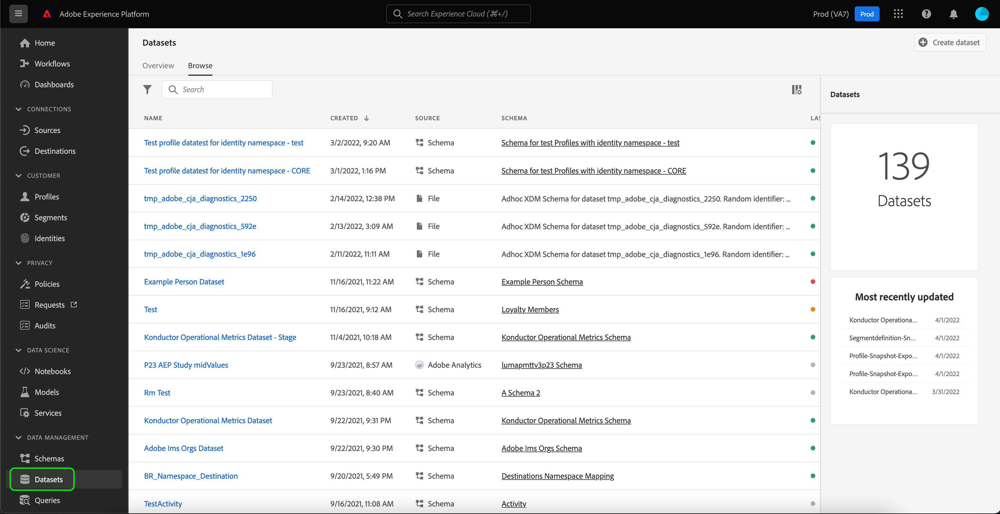
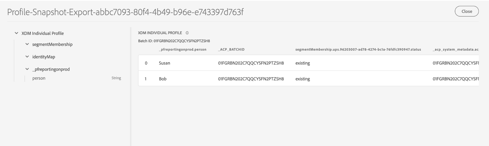

# Dashboard-Datensätze mithilfe von analysieren, überprüfen und verarbeiten [!DNL Query Service]

Adobe Experience Platform bietet wichtige Informationen zu den Profil-, Segment- und Zieldaten Ihres Unternehmens über Dashboards, die in der Experience Platform-Benutzeroberfläche verfügbar sind. Sie können dann Adobe Experience Platform verwenden [!DNL Query Service] die Rohdatensätze zu untersuchen, zu überprüfen und zu verarbeiten, die diese Dashboards im Data Lake unterstützen.

## Erste Schritte mit [!DNL Query Service]

Adobe Experience Platform [!DNL Query Service] unterstützt Marketingexperten dabei, Einblicke aus ihren Daten zu gewinnen, indem die Verwendung von Standard-SQL zur Abfrage von Daten im Data Lake ermöglicht wird. [!DNL Query Service] bietet eine Benutzeroberfläche und eine API, die verwendet werden kann, um einen beliebigen Datensatz in den Data Lake einzubinden und die Abfrageergebnisse als neue Datensätze zu erfassen, die für die Berichterstellung, das maschinelle Lernen oder die Aufnahme in das Echtzeit-Kundenprofil verwendet werden können.

Weitere Informationen finden Sie unter [!DNL Query Service] und seiner Rolle innerhalb der Experience Platform, lesen Sie bitte zunächst die [[!DNL Query Service] Übersicht](../query-service/home.md).

## Zugreifen auf verfügbare Datensätze

Sie können [!DNL Query Service] zum Abfragen von Rohdatensätzen für Profil-, Segment- und Ziel-Dashboards. Um Ihre verfügbaren Datensätze anzuzeigen, wählen Sie in der Experience Platform-Benutzeroberfläche die Option **Datensätze** im linken Navigationsbereich, um das Dashboard &quot;Datensätze&quot;zu öffnen. Das Dashboard listet alle verfügbaren Datensätze für Ihre Organisation auf. Details werden für jeden aufgelisteten Datensatz angezeigt, einschließlich seines Namens, des Schemas, dem der Datensatz entspricht, und des Status des letzten Erfassungslaufs.



### Systemgenerierte Datensätze

>[!IMPORTANT]
>
>Systemgenerierte Datensätze werden standardmäßig ausgeblendet. Standardmäßig wird die [!UICONTROL Durchsuchen] zeigt nur Datensätze an, in die Sie Daten aufgenommen haben.

Um systemgenerierte Datensätze anzuzeigen, wählen Sie das Filtersymbol () links neben der Suchleiste.


Es wird eine Seitenleiste mit zwei Umschaltern angezeigt: [!UICONTROL Im Profil enthalten] und [!UICONTROL Anzeigen von Systemdatensätzen]. Umschalten zwischen [!UICONTROL Anzeigen von Systemdatensätzen] , um systemgenerierte Datensätze in die Browser-Liste der Datensätze aufzunehmen.


### Profilattributdatensätze

Profil-Dashboard-Einblicke sind mit Zusammenführungsrichtlinien verknüpft, die von Ihrer Organisation definiert wurden. Für jede aktive Zusammenführungsrichtlinie steht im Data Lake ein Datensatz mit Profilattributen zur Verfügung.

Die Namenskonvention für diese Datensätze lautet **Profil-Schnappschuss-Export**, gefolgt von einem systemgenerierten zufälligen alphanumerischen Wert. Beispiel: `Profile-Snapshot-Export-abbc7093-80f4-4b49-b96e-e743397d763f`.

Um das vollständige Schema jedes Profilschnappschuss-Exportdatensatzes zu verstehen, können Sie eine Vorschau anzeigen und die Datensätze [unter Verwendung des Datensatz-Viewers](../catalog/datasets/user-guide.md) in der Experience Platform-Benutzeroberfläche erkunden.



#### Zuordnen von Profilattribut-Datensätzen zu Zusammenführungsrichtlinien-IDs

Der alphanumerische Wert, der jedem systemgenerierten Profilattributdatensatz zugewiesen wird, ist eine zufällige Zeichenfolge, die einer Zusammenführungsrichtlinien-ID einer der von Ihrer Organisation erstellten Zusammenführungsrichtlinien zugeordnet ist. Die Zuordnung jeder Zusammenführungsrichtlinien-ID zu der zugehörigen Datensatz-Zeichenfolge des Profilattributs wird im Datensatz `adwh_dim_merge_policies` beibehalten.

Der Datensatz `adwh_dim_merge_policies` enthält die folgenden Felder:

* `merge_policy_name`
* `merge_policy_id`
* `merge_policy`
* `dataset_id`

Dieser Datensatz kann mithilfe der Benutzeroberfläche des Abfrage-Editors in Experience Platform untersucht werden. Weitere Informationen zur Verwendung des Abfrage-Editors finden Sie im [Handbuch zur Benutzeroberfläche des Abfrage-Editors](../query-service/ui/user-guide.md).

### Datensatz für Segmentmetadaten

Im Data Lake ist ein Segment-Metadaten-Datensatz verfügbar, der Metadaten für die einzelnen Segmente Ihres Unternehmens enthält.

Die Namenskonvention für diesen Datensatz lautet **Segmentdefinition-Schnappschuss-Export**, gefolgt von einem alphanumerischen Wert. Beispiel: `Segmentdefinition-Snapshot-Export-acf28952-2b6c-47ed-8f7f-016ac3c6b4e7`

Um das vollständige Schema jedes Segmentdefinitions-Schnappschuss-Exportdatensatzes zu verstehen, können Sie eine Vorschau anzeigen und die Datensätze [unter Verwendung des Datensatz-Viewers](../catalog/datasets/user-guide.md) in der Experience Platform-Benutzeroberfläche erkunden.


### Ziel-Metadaten-Datensatz

Die Metadaten für alle aktivierten Ziele Ihres Unternehmens sind als Rohdatensatz im Data Lake verfügbar.

Die Namenskonvention dieses Datensatzes lautet **DIM_Destination**.

Um das vollständige Schema des DIM-Zieldatensatzes zu verstehen, können Sie eine Vorschau anzeigen und den Datensatz [unter Verwendung des Datensatz-Viewers](../catalog/datasets/user-guide.md) in der Experience Platform-Benutzeroberfläche erkunden.


## (Beta) Insight-Berichte für die Kundendatenplattform (CDP)

>[!IMPORTANT]
>
>Die Funktion &quot;CDP Insights Data Models&quot;befindet sich in der Beta-Phase. Die Funktionen und Dokumentation können sich ändern.

Die Funktion CDP Insights Data Models legt die SQL offen, die die Einblicke für verschiedene Profil-, Ziel- und Segmentierungs-Widgets ermöglicht. Sie können diese SQl-Abfragevorlagen anpassen, um CDP-Berichte für Ihre Marketing- und KPI-Anwendungsfälle zu erstellen.

Die CDP-Berichterstellung bietet Einblicke in Ihre Profildaten und deren Beziehung zu Segmenten und Zielen. Detaillierte Informationen dazu finden Sie in der Dokumentation zum CDP Insights-Datenmodell . [die CDP Insights-Datenmodelle auf Ihre jeweiligen KPI-Anwendungsfälle anwenden](./cdp-insights-data-model.md).

## Beispielabfragen

Die folgenden Beispielabfragen enthalten Beispiel-SQL, das in [!DNL Query Service] , um die Rohdatensätze zu untersuchen, zu überprüfen und zu verarbeiten, die Ihre Dashboards unterstützen.

### Anzahl der Profile nach Identität

Dieser Profileinblick bietet eine Aufschlüsselung der Identitäten über alle zusammengeführten Profile im Datensatz hinweg.

>[!NOTE]
>
>Die Gesamtzahl der Profile nach Identität (d. h. das Addieren der für jeden Namespace angezeigten Werte) kann höher sein als die Gesamtzahl der zusammengeführten Profile, da einem Profil mehrere Namespaces zugeordnet sein können. Wenn beispielsweise ein Kunde mit Ihrer Marke auf mehr als einem Kanal interagiert, werden diesem einzelnen Kunden mehrere Namespaces zugeordnet.

**Abfrage**

```sql
Select
        Key namespace,
        count(1) count_of_profiles
     from
        (
           Select
               explode(identitymap)
           from
              Profile-Snapshot-Export-abbc7093-80f4-4b49-b96e-e743397d763f
        )
     group by
        namespace;
```

### Anzahl der Profile nach Segment

Dieser Zielgruppeneinblick liefert die Gesamtanzahl der zusammengeführten Profile innerhalb jedes Segments im Datensatz. Diese Zahl ist das Ergebnis der Anwendung der Segmentzusammenführungsrichtlinie auf Ihre Profildaten, um Profilfragmente zu einem einzigen Profil für jede Person im Segment zusammenzuführen.

```sql
Select          
        concat_ws('-', key, source_namespace) segment_id,
        count(1) count_of_profiles
      from
        (
            Select
              Upper(key) as source_namespace,
              explode(value)
            from
              (
                  Select
                    explode(Segmentmembership)
                  from
                    Profile-Snapshot-Export-abbc7093-80f4-4b49-b96e-e743397d763f
              )
        )
      group by
      segment_id
```

## Nächste Schritte

Durch Lesen dieses Handbuchs können Sie jetzt [!DNL Query Service] , um mehrere Abfragen durchzuführen, um die Rohdatensätze zu untersuchen und zu verarbeiten, mit denen Ihre Profil-, Segment- und Ziel-Dashboards bereitgestellt werden.

Um mehr über diese Dashboards und die darin verfügbaren Metriken zu erfahren, treffen Sie bitte eine entsprechende Auswahl aus der Liste der verfügbaren Dashboards in der Dokumentationsnavigation.
