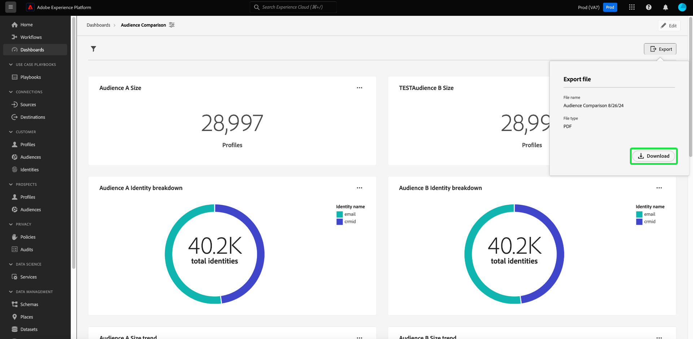

# Export PDF {#export-pdf}

Nachdem Sie eine [benutzerdefinierte insight](./overview.md) mit [Query Pro-Modus](./overview.md#query-pro-mode) erstellt haben, können Sie Ihre Diagrammdaten im PDF-Format exportieren. Diese Aktion wird über die benutzerdefinierte Dashboard-Übersicht ausgeführt.

Wählen Sie im Arbeitsbereich Dashboards ein benutzerdefiniertes Dashboard aus dem Inventar, das auf der Registerkarte [!UICONTROL Durchsuchen] aufgeführt ist.

Ihr benutzerdefiniertes Dashboard wird angezeigt. Wählen Sie als Nächstes **[!UICONTROL Exportieren]** oben rechts in der Benutzeroberfläche aus.

>[!NOTE]
>
>Exporte, die nur Visualisierungen enthalten, erfordern nicht die Berechtigung [!UICONTROL Exportieren von Dashboard-]). Weitere Informationen finden [[!UICONTROL  in der ]Weitere Informationen](./view-more.md#export).

Das **[!UICONTROL Datei exportieren]** Dialogfeld wird angezeigt. Wählen Sie abschließend **[!UICONTROL Herunterladen]**

Die PDF-Vorschau wird angezeigt. Wählen Sie **[!UICONTROL Speichern]** aus, um den Vorgang abzuschließen.

