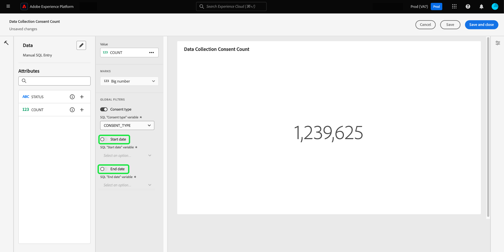

# Erstellen eines Datumsfilters {#create-date-filter}

Um Ihre Insights nach Datum zu filtern, müssen Sie Parameter zu Ihren SQL-Abfragen hinzufügen, die Datumsbeschränkungen akzeptieren können. Dies erfolgt im Rahmen des Workflows zur Erstellung von Insights im Abfragemodus. Weitere Informationen [&#x200B; Eingabe von SQL für Ihre &#x200B;](../overview.md#query-pro-mode) finden Sie in der Dokumentation zum Query Pro-Modus .

Abfrageparameter ermöglichen es Ihnen, mit dynamischen Daten zu arbeiten, da sie als Platzhalter für die Werte dienen, die Sie zur Ausführungszeit hinzufügen. Diese Platzhalterwerte können über die Benutzeroberfläche aktualisiert werden und ermöglichen es weniger technischen Benutzenden, die Einblicke basierend auf Datumsbereichen zu aktualisieren.

Wenn Sie mit Abfrageparametern nicht vertraut sind, lesen Sie die Dokumentation zu [Anleitungen zur Implementierung parametrisierter Abfragen](../../../query-service/ui/parameterized-queries.md).

## Anwenden eines Datumsfilters auf Ihr Dashboard {#apply-date-filter}

Um einen Datumsfilter anzuwenden, wählen Sie **[!UICONTROL Filter hinzufügen]** und dann **[!UICONTROL Datumsfilter]** aus dem Dropdown-Menü Ihrer Dashboard-Ansicht aus.


Ihnen werden die folgenden Datumsfilteroptionen angezeigt.

| Filter | Beschreibung |
| --- | --- |
| Kein benutzerdefiniertes Datum | Wählen Sie ein oder mehrere benutzerdefinierte Datumswerte aus mehreren voreingestellten Werten aus. |
| Benutzerdefinierter Datumsbereich | Wählen Sie ein oder mehrere benutzerdefinierte Datumswerte aus mehreren voreingestellten Werten aus oder geben Sie einen benutzerdefinierten Datumsbereich an. |
| Benutzerdefiniertes Datum | Wählen Sie aus den voreingestellten Werten oder geben Sie das Startdatum für Ihr Dashboard an. |


### Erstellen eines benutzerdefinierten Datumsfilters

Um einen vordefinierten Datumsfilter anzuwenden, wählen Sie **[!UICONTROL Kein benutzerdefiniertes Datum]** und dann die vordefinierten Datumsoptionen aus, die Sie einbeziehen möchten. Wählen Sie abschließend im Dropdown-Menü den standardmäßigen Datumsbereich aus und klicken Sie dann auf **[!UICONTROL Speichern]**.


Sie kehren zum Dashboard zurück, das den zuvor ausgewählten Standarddatumsbereich anzeigt. Wählen Sie im Dropdown-Menü einen anderen voreingestellten Datumsbereich aus.


### Erstellen eines benutzerdefinierten Datumsbereichsfilters

Um einen benutzerdefinierten Datumsbereichsfilter anzuwenden, wählen Sie **[!UICONTROL Benutzerdefinierter Datumsbereich]** und dann die vordefinierten Datumsoptionen aus, die Sie einbeziehen möchten. Wählen Sie abschließend **[!UICONTROL Benutzerdefiniert]**, um den standardmäßigen Datumsbereich festzulegen. Verwenden Sie den Kalender, um einen Datumsbereich anzugeben, und wählen Sie dann **[!UICONTROL Speichern]** aus.

>[!NOTE]
>
>Es müssen keine vordefinierten Datumsoptionen ausgewählt werden.


Sie gelangen zurück zum Dashboard, das den zuvor angegebenen benutzerdefinierten Datenbereich anzeigt. Wählen Sie im Dropdown-Menü einen anderen voreingestellten Datumsbereich aus.


### Erstellen eines benutzerdefinierten Datumsfilters

Um einen benutzerdefinierten Datumsfilter anzuwenden, wählen Sie **[!UICONTROL Benutzerdefiniertes Datum]** und die vordefinierten Datumsoptionen aus, die Sie einbeziehen möchten. Wählen Sie abschließend **[!UICONTROL Benutzerdefiniert]** und verwenden Sie dann den Kalender, um ein Startdatum auszuwählen. Wählen Sie abschließend **[!UICONTROL Speichern]** aus.

>[!NOTE]
>
>Es müssen keine vordefinierten Datumsoptionen ausgewählt werden.


Sie gelangen zurück zum Dashboard, das die zuvor angegebenen benutzerdefinierten Daten anzeigt. Wählen Sie im Dropdown-Menü ein anderes Datum aus.


## Löschen eines Datumsfilters {#delete-date-filter}

Um Ihren Datumsfilter zu entfernen, klicken Sie auf das Symbol Filter löschen .


## SQL bearbeiten, um Datumsabfrageparameter einzuschließen {#include-date-parameters}

Stellen Sie als Nächstes sicher, dass Ihre SQL Abfrageparameter enthält, um einen Datumsbereich zuzulassen. Wenn Sie noch keine Abfrageparameter in Ihre SQL integriert haben, bearbeiten Sie Ihre Insights, um diese Parameter aufzunehmen. In der Dokumentation finden Sie Anweisungen zum [&#x200B; (Bearbeiten eines Insights](../overview.md#edit).

>[!TIP]
>
>Es wird empfohlen, Ihrer SQL-Anweisung in jedem Diagramm, für das Sie Datumsfilter aktivieren möchten, `$START_DATE`- und `$END_DATE` hinzuzufügen.

>[!NOTE]
>
>Datumsfilter unterstützen keine Zeitbeschränkungen. Der Filter gilt nur für Datumsbereiche. Wenn Sie also innerhalb eines Zeitraums von 24 Stunden mehrere Berichte haben, können Sie nicht zwischen verschiedenen Stunden innerhalb desselben Tages unterscheiden. Aus diesem Grund wird empfohlen, die Zeitkomponente als Datum umzuwandeln.

Wenn das zu analysierende Datenmodell oder die zu analysierenden Tabellen eine Zeitkomponente aufweisen, können Sie Ihre Daten nach Datum gruppieren und diese Datumsfilter dann anwenden.

Die folgende SQL-Beispielanweisung zeigt, wie Sie `$START_DATE`- und `$END_DATE` einbinden und verwendet `cast`, um die Zeitkomponente als Datum einzurahmen.

```sql
SELECT Sum(personalization_consent_count) AS Personalization,
       Sum(datacollection_consent_count)  AS Datacollection,
       Sum(datasharing_consent_count)     AS Datasharing
FROM   fact_daily_consent_aggregates f
       INNER JOIN dim_consent_valued
               ON f.consent_value_id = d.consent_value_id
WHERE  f.date BETWEEN Upper(Coalesce(Cast('$START_DATE' AS date), '')) AND Upper
                      (
                             Coalesce(Cast('$END_DATE' AS date), ''))
       AND ( ( Upper(Coalesce($consent_value_filter, '')) IN ( '', 'NULL' ) )
              OR ( f.consent_value_id IN ( $consent_value_filter ) ) )
LIMIT  0; 
```

Im folgenden Screenshot werden die in der SQL-Anweisung enthaltenen Datumsbeschränkungen und die Schlüsselwertpaare der Abfrageparameter hervorgehoben.

>[!NOTE]
>
>Wenn Sie Ihre Anweisung im Abfragemodus erstellen, müssen Sie Beispielwerte für jeden Parameter angeben, um die SQL-Anweisung auszuführen und das Diagramm zu erstellen. Die Beispielwerte, die Sie beim Erstellen Ihrer Anweisung angeben, werden durch die tatsächlichen Werte ersetzt, die Sie für den Datums- (oder globalen) Filter zur Laufzeit auswählen.

![Das Dialogfeld [!UICONTROL SQL eingeben] mit den hervorgehobenen Datumsparametern in SQL.](../../images/sql-insights-query-pro-mode/sql-date-parameters.png)

## Aktivieren von Datumsparametern in jeder Einsicht {#enable-date-parameters}

Nachdem Sie die entsprechenden Parameter in die SQL Ihrer Insights integriert haben, sind die Variablen `Start_date` und `End_date` jetzt als Umschalter im Widget-Composer verfügbar. Weitere Informationen [&#x200B; Bearbeiten eines Insights finden Sie &#x200B;](../overview.md#populate-widget) Abschnitt „Abfrage pro-Modus-Widget-Population“.

Wählen Sie im Widget-Composer die Option Umschalter aus, um die `Start_date`- und `End_date` zu aktivieren.



Wählen Sie anschließend die entsprechenden Abfrageparameter aus den Dropdown-Menüs aus.


Wählen Sie abschließend **[!UICONTROL Speichern und schließen]** aus, um zu Ihrem Dashboard zurückzukehren. Datumsfilter sind jetzt für alle Insights mit Start- und Enddatumsparametern aktiviert.
