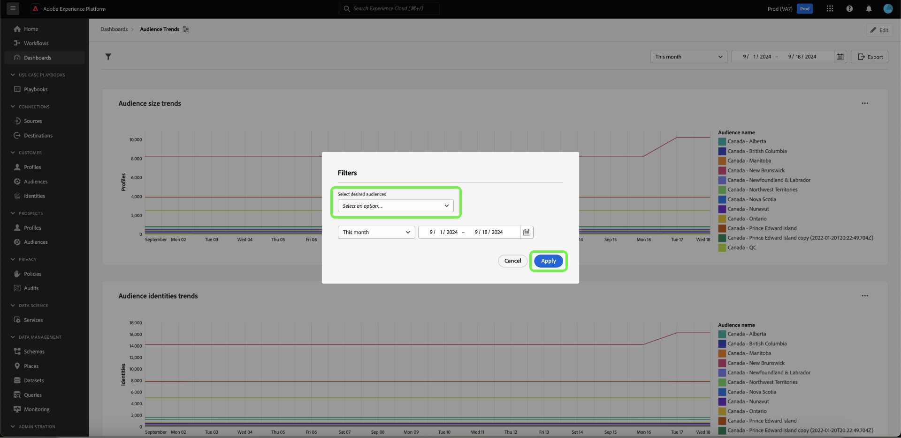

# Globalen Filter erstellen {#create-global-filter}

Um einen globalen Filter zu erstellen, wählen Sie zunächst **[!UICONTROL Filter hinzufügen]** in Ihrer Dashboard-Ansicht und dann **[!UICONTROL Globaler Filter]** aus dem Dropdown-Menü aus.

>[!IMPORTANT]
>
>Stellen Sie sicher, dass Sie Ihre globalen Filter allen Diagrammen zuordnen. Dies ist kein automatischer Prozess. Um einen globalen Filter zu verwenden, müssen Sie einen [Abfrageparameter](../../../query-service/ui/parameterized-queries.md) in die SQL Ihres Diagramms aufnehmen, [Globalen Filter aktivieren](#enable-global-filter) im Widget-Composer einfügen und [einen Laufzeitwert auswählen](#select-global-filter) für den Parameter im Dialogfeld Globaler Filter auswählen. Informationen zum Bearbeiten Ihrer SQL, wenn Sie einen Abfrageparameter integrieren müssen, finden Sie im Handbuch zu Query Pro .

Mit benutzerdefinierten globalen Filtern können Sie die von Ihrer SQL bereitgestellten Einblicke schnell ändern.

Das [!UICONTROL Erstellen eines globalen Filters] wird geöffnet. Das Erstellen eines globalen Filters folgt dem gleichen Prozess wie das Erstellen eines insight mit SQL. Wählen Sie zunächst eine abzufragende Datenbank (Insights-Datenmodell) aus, geben Sie dann Ihre benutzerdefinierte SQL im Abfrage-Editor ein und wählen Sie schließlich das Symbol „Ausführen“ ().

>[!IMPORTANT]
>
>Beim Erstellen eines globalen Filters müssen Sie eine ID und einen Wert angeben. Anhand der Beispielwerte können Sie die SQL-Anweisung ausführen und das Diagramm erstellen. Beachten Sie, dass die Beispielwerte, die Sie beim Erstellen Ihrer Anweisung angeben, durch die tatsächlichen Werte ersetzt werden, die Sie zur Laufzeit für den Datums- oder globalen Filter auswählen.

Nach erfolgreichem Ausführen der Abfrage zeigt die Registerkarte Ergebnisse die Ergebnisse an. Klicken Sie auf **[!UICONTROL Weiter]**.

>[!NOTE]
>
>Die Abfrageergebnisse sind standardmäßig auf 100 Zeilen beschränkt. Um weitere Zeilen zurückzugeben, fügen Sie Ihrer SQL-Abfrage eine LIMIT-Klausel mit der gewünschten Zeilenanzahl hinzu. Um alle Zeilen abzurufen und das standardmäßige Limit zu entfernen, verwenden Sie LIMIT 0 in Ihrer Abfrage.

![Das [!UICONTROL Dialogfeld „Globalen Filter erstellen] mit dem Dropdown-Menü „Datensatz“, dem Symbol „Ausführen“ und der hervorgehobenen Option „Weiter“.](../../images/sql-insights-query-pro-mode/global-filter.png)

Im letzten Schritt des Workflows für die Erstellung globaler Filter müssen Sie einen Titel für Ihren Filter hinzufügen. Fügen Sie dem Textfeld **[!UICONTROL Filterbezeichnung]** eine Bezeichnung hinzu und wählen Sie einen Filtertyp aus dem Dropdown-Feld aus.

>[!NOTE]
>
>Derzeit wird nur [!UICONTROL  Filtertyp ]Kombinationsfeld) unterstützt.

Wählen Sie abschließend **[!UICONTROL Auswählen]** aus, um zur Dashboard-Ansicht zurückzukehren.

![Das [!UICONTROL Dialogfeld „Globalen Filter erstellen] mit hervorgehobener Texteingabe „Auswählen“ und „Filterbezeichnung“.](../../images/sql-insights-query-pro-mode/global-filter-label.png)

## Aktivieren des globalen Filters für jede insight {#enable-global-filter}

>[!TIP]
>
>Aktivieren Sie die globalen Filter in jedem von Ihnen erstellten Diagramm. Dadurch wird sichergestellt, dass die Werte, die Sie als globalen Filter auswählen, in allen Ihren Diagrammen widergespiegelt werden.

Nachdem Sie Ihren globalen Filter für Ihr Dashboard erstellt haben, wird der Umschalter für diesen globalen Filter als Teil des Widget-Composers verfügbar.

>[!IMPORTANT]
>
>Stellen Sie sicher, dass der globale Filterparameter in der SQL der einzelnen insight enthalten ist.

## Globalen Filter auswählen {#select-global-filter}

Um das Dialogfeld [!UICONTROL Filter] zu öffnen, das alle benutzerdefinierten Filter auflistet, wählen Sie das Filtersymbol () auf der linken Seite Ihres Dashboards aus. Wählen Sie als Nächstes eine Option aus dem Dropdown-Menü Ihres globalen Filters aus, um die Auswirkungen auf Ihr Dashboard Insights anzuwenden, und wählen Sie dann **[!UICONTROL Anwenden]**.

## Globalen Filter löschen {#clear-global-filter}

Um alle benutzerdefinierten globalen Filter zu löschen, wählen Sie **[!UICONTROL Alle löschen]** im Dialogfeld [!UICONTROL Filter] aus.

