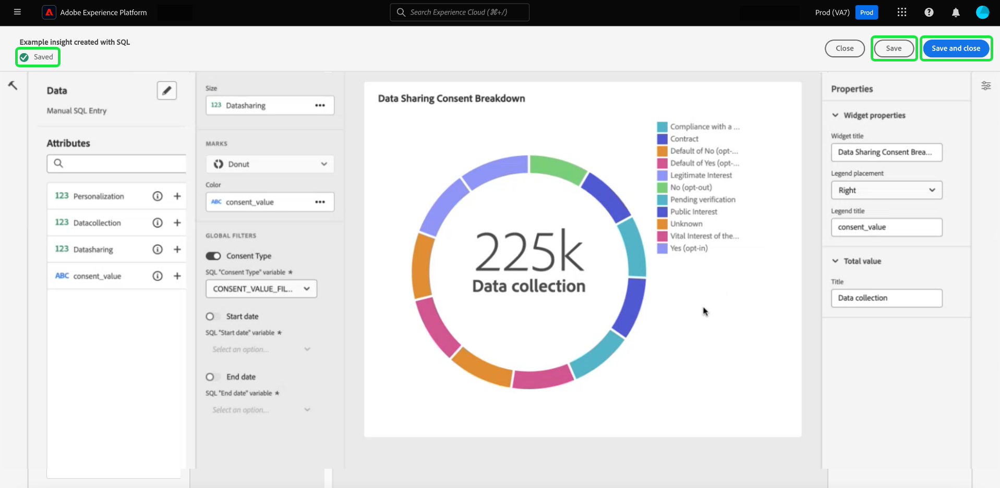

# SQL Insights für erweiterte App-Berichte

Verwenden Sie benutzerdefinierte SQL-Abfragen, um Einblicke aus verschiedenen strukturierten Datensätzen effektiv zu extrahieren. Technische Mitarbeiter können den Abfragepro-Modus verwenden, um komplexe Analysen mit SQL durchzuführen und diese Analyse dann über Diagramme in Ihrem benutzerdefinierten Dashboard für nicht technische Benutzer freizugeben oder in CSV-Dateien zu exportieren. Diese Methode der Insight-Erstellung eignet sich gut für Tabellen mit klaren Beziehungen und ermöglicht eine stärkere Anpassung innerhalb Ihrer Einblicke und Filter, die für Nischenanwendungsfälle geeignet sind.

>[!IMPORTANT]
>
>Der Pro-Modus für Abfragen steht nur Benutzern zur Verfügung, die die [Data Distiller SKU](../../query-service/data-distiller/overview.md) erworben haben.

Um Einblicke aus SQL zu generieren, müssen Sie zunächst ein Dashboard erstellen.

## Benutzerdefiniertes Dashboard erstellen {#create-custom-dashboard}

Um ein benutzerdefiniertes Dashboard zu erstellen, wählen Sie im linken Navigationsbereich die Option **[!UICONTROL Dashboards]** aus, um den Arbeitsbereich &quot;Dashboards&quot;zu öffnen. Wählen Sie dann **[!UICONTROL Dashboard erstellen]** aus.

Das Dialogfeld **[!UICONTROL Dashboard erstellen]** wird angezeigt. Es gibt zwei Optionen, aus denen Sie Ihre Dashboard-Erstellungsmethode auswählen können. Um Ihre Einblicke zu erstellen, können Sie entweder ein vorhandenes Datenmodell mit dem Designmodus [[!UICONTROL Geführter Entwurf]](../standard-dashboards.md) oder Ihre eigene SQL mit dem Pro-Modus [!UICONTROL Abfrage] verwenden.

<!-- Maybe reference Guided design mode in other places on UDD doc. -->

Die Verwendung eines vorhandenen Datenmodells bietet die Vorteile eines strukturierten, effizienten und skalierbaren Frameworks, das auf Ihre spezifischen Geschäftsanforderungen zugeschnitten ist. Informationen zum [Erstellen von Einblicken aus einem vorhandenen Datenmodell](../standard-dashboards.md#create-widget) finden Sie im Handbuch zum benutzerdefinierten Dashboard.

Insights, die aus SQL-Abfragen generiert werden, bieten deutlich mehr Flexibilität und Anpassung. Technische Mitarbeiter können den Abfragepro-Modus verwenden, um eine komplexe Analyse von SQL durchzuführen und diese Analyse dann über diese Dashboard-Funktion für nicht technische Benutzer freizugeben. Wählen Sie **[!UICONTROL promode abfragen]** gefolgt von **[!UICONTROL save]**.

>[!NOTE]
>
>Nachdem Sie eine Auswahl getroffen haben, können Sie diese Auswahl in diesem Dashboard nicht mehr ändern. Stattdessen müssen Sie ein neues Dashboard mit einer anderen Dashboard-Erstellungsmethode erstellen.

![ Das Dialogfeld [!UICONTROL Dashboard erstellen] mit Abfrage pro -Modus und Speichern hervorgehoben.](../images/sql-insights-query-pro-mode/query-pro-mode.png)

## Übersicht über den Pro-Modus in Abfragen {#query-pro-mode}

Query pro mode ist ein auf SQL Editor basierender Workflow, der Sie durch den Prozess der Generierung von Einblicken mit benutzerdefinierten SQL-Abfragen in der Adobe Experience Platform-Benutzeroberfläche führt. Bevor Sie mit benutzerdefinierten SQL-Abfragen Einblicke generieren können, müssen Sie zunächst ein Dashboard erstellen.

## SQL erstellen {#compose-sql}

Nachdem Sie sich dafür entschieden haben, ein Dashboard mit Query Pro-Modus zu erstellen, wird das Dialogfeld **[!UICONTROL SQL eingeben]** angezeigt. Wählen Sie eine Datenbank (Insight-Datenmodell) aus, die aus dem Dropdown-Menü abgefragt werden soll, und geben Sie eine geeignete Abfrage für Ihren Datensatz im Abfragepro-Editor ein.

>[!NOTE]
>
>Der Pro-Modus &quot;Abfrage&quot;steht nur Benutzern zur Verfügung, die die Data Distiller-SKU erworben haben. Der Designmodus [[!UICONTROL Geführter Entwurf]](../standard-dashboards.md) steht allen Benutzern zur Verfügung, um Einblicke aus einem vorhandenen Datenmodell zu erstellen.

Informationen zu den Benutzeroberflächen-Elementen finden Sie im [Benutzerhandbuch zum Abfrage-Editor](../../query-service/ui/user-guide.md#query-authoring) .

![Das Dialogfeld [!UICONTROL SQL eingeben] mit dem Dropdown-Menü &quot;Datensatz&quot;und dem Ausführungssymbol wird hervorgehoben. Das Dialogfeld enthält eine ausgefüllte SQL-Abfrage und die Registerkarte &quot;Abfrageparameter&quot;wird angezeigt.](../images/sql-insights-query-pro-mode/enter-sql-database-dropdown.png)

### Abfrageparameter {#query-parameters}

Um [global](./filters/global-filter.md) oder [Datumsfilter](./filters/date-filter.md) einzubeziehen, muss Ihre Abfrage **** Abfrageparameter verwenden. Beim Erstellen Ihrer Anweisung im Abfragepro-Modus müssen Sie Beispielwerte angeben, wenn Ihre Abfrage Abfrageparameter verwendet. Mit den Beispielwerten können Sie die SQL-Anweisung ausführen und das Diagramm erstellen. Beachten Sie, dass die Beispielwerte, die Sie beim Erstellen Ihrer Anweisung angeben, durch die tatsächlichen Werte ersetzt werden, die Sie für den Datums- oder globalen Filter zur Laufzeit auswählen.

>[!IMPORTANT]
>
>Wenn Sie einen globalen Filter verwenden möchten, müssen Sie einen Abfrageparameter in Ihrer SQL platzieren und diesen Abfrageparameter dann mit dem globalen Filter im Widget Composer verknüpfen. Im folgenden Screenshot wird `CONSENT_VALUE_FILTER` in der SQL als Abfrageparameter für einen globalen Filter verwendet. Weitere Informationen dazu finden Sie in der Dokumentation zu [globalen Filtern](./filters/global-filter.md#enable-global-filter) .

Um Ihre Abfrage auszuführen, wählen Sie das Ausführungssymbol (). Der Abfrage-Editor zeigt die Registerkarte Ergebnisse an. Wählen Sie als Nächstes **[!UICONTROL Auswählen]** aus, um die Konfiguration zu bestätigen und den Widget Composer zu öffnen.

>[!TIP]
>
>Wenn Ihre Abfrage Abfrageparameter verwendet, führen Sie die Abfrage einmal aus, um alle verwendeten Abfrageparameterschlüssel vorab auszufüllen. Die Abfrage schlägt fehl, aber die Benutzeroberfläche zeigt automatisch die Registerkarte Abfrageparameter an und listet alle enthaltenen Schlüssel auf. Fügen Sie die entsprechenden Werte für Ihre Schlüssel hinzu.

![Das Dialogfeld [!UICONTROL SQL eingeben] mit SQL-Eingabe, die Registerkarte &quot;Ergebnisse&quot;wird angezeigt und die Option &quot;Auswählen&quot;wurde hervorgehoben.](../images/sql-insights-query-pro-mode/enter-sql-select.png)

## Widget befüllen {#populate-widget}

Der Widget Composer wird jetzt mit den Spalten aus der ausgeführten SQL gefüllt. Der Typ des Dashboards wird oben links angezeigt, in diesem Fall ist er [!UICONTROL Manueller SQL-Eintrag]. Wählen Sie das Stiftsymbol (), um die SQL an jedem Punkt zu bearbeiten.

>[!TIP]
>
>Die verfügbaren Attribute sind Spalten, die aus der ausgeführten SQL entnommen werden.

Verwenden Sie zum Erstellen Ihres Widgets die in der Spalte [!UICONTROL Attribute] aufgelisteten Attribute. Sie können die Suchleiste verwenden, um nach Attributen zu suchen oder in der Liste einen Bildlauf durchzuführen.

### Attribute hinzufügen {#add-attributes}

Um Ihrem Widget ein Attribut hinzuzufügen, wählen Sie das Pluszeichen () neben einem Attributnamen. Im angezeigten Dropdown-Menü können Sie der Grafik aus den von Ihrer SQL bestimmten Optionen ein Attribut hinzufügen. Verschiedene Diagrammtypen haben unterschiedliche Optionen, z. B. ein Dropdown-Menü für die X- und Y-Achse.

In diesem Ringdiagramm-Beispiel sind die Optionen Größe und Farbe. Farbe unterteilt die Ringdiagrammergebnisse und die Größe ist die tatsächlich verwendete Metrik. Fügen Sie dem Feld [!UICONTROL Farbe] ein Attribut hinzu, um die Ergebnisse basierend auf ihrer Zusammensetzung in verschiedene Farben zu unterteilen.

>[!TIP]
>
>Wählen Sie das Pfeilsymbol nach oben und unten (), um die Anordnung der X- und Y-Achse in Balken- oder Liniendiagrammen zu ändern.

Um den Diagrammtyp oder das Diagramm Ihres Widgets zu ändern, wählen Sie aus den verfügbaren Optionen der Dropdown-Liste [!UICONTROL Markierungen] aus. Zu den Optionen gehören [!UICONTROL Linie], [!UICONTROL Donut], [!UICONTROL Big number] und [!UICONTROL Balken]. Nach der Auswahl wird eine Vorschau-Visualisierung der aktuellen Einstellungen Ihres Widgets generiert.

## Erweiterte Tabellenattribute {#advanced-attributes}

Um eine automatische Sortierungsfunktion für alle oder alle Spalten in Ihren Tabellen anzuwenden, wählen Sie **[!UICONTROL Bearbeiten]** aus, um das gesamte Dashboard zu bearbeiten.

Wählen Sie die Auslassungszeichen (`...`) im Tabellendiagramm aus, dem Sie eine Spaltensortierung hinzufügen möchten, und wählen Sie dann **[!UICONTROL Bearbeiten]** aus.

Um die Sortierung für eine Spalte zu aktivieren, aktivieren Sie die Kontrollkästchen **[!UICONTROL Sortable]** .

Wählen Sie das Eigenschaftensymbol () in der rechten Leiste, um den Bereich [!UICONTROL Eigenschaften] zu öffnen. Wählen Sie im Bereich **[!UICONTROL Eigenschaften]** die Spalte **[!UICONTROL Standardsortierung]** aus der Dropdown-Liste aus und wählen Sie dann mithilfe der Dropdown-Liste die Sortierrichtung **[!UICONTROL 5} aus.]** Wählen Sie abschließend **[!UICONTROL Speichern und schließen]**.

Weitere Informationen zur Verwendung der Sortierungs-, Größenänderungs- und Paginierungsfunktionen finden Sie unter [Mehr anzeigen](./view-more.md).

## Widget-Eigenschaften {#properties}

Wählen Sie das Eigenschaftensymbol () in der rechten Leiste, um den Eigenschaftenbereich zu öffnen. Geben Sie im Bereich [!UICONTROL Eigenschaften] im Textfeld **[!UICONTROL Widget-Titel]** einen Namen für das Widget ein. Sie können auch verschiedene Aspekte Ihres Diagramms umbenennen.

>[!NOTE]
>
>Die in der Seitenleiste der Eigenschaften verfügbaren spezifischen Felder hängen vom bearbeiteten Diagrammtyp ab.

## Widget speichern {#save-widget}

Durch das Speichern im Widget Composer wird das Widget lokal in Ihrem Dashboard gespeichert. Wenn Sie Ihre Arbeit speichern und später fortsetzen möchten, wählen Sie **[!UICONTROL Speichern]**. Ein Häkchen-Symbol unter dem Widget-Namen zeigt an, dass das Widget gespeichert wurde. Wenn Sie mit Ihrem Widget zufrieden sind, wählen Sie alternativ **[!UICONTROL Speichern und schließen]** , um das Widget allen anderen Benutzern mit Zugriff auf Ihr Dashboard zur Verfügung zu stellen. Wählen Sie Abbrechen aus, um Ihre Arbeit abzubrechen und zu Ihrem benutzerdefinierten Dashboard zurückzukehren.

## Dashboard und Diagramme bearbeiten {#edit}

Wählen Sie **[!UICONTROL Bearbeiten]** aus, um Ihr gesamtes Dashboard oder Ihre Einblicke zu bearbeiten. Im Bearbeitungsmodus können Sie die Größe von Widgets ändern, SQL bearbeiten oder globale und zeitliche Filter erstellen und anwenden. Diese Filter beschränken die in Ihren Dashboard-Widgets angezeigten Daten. Auf diese Weise können Sie Ihre Einblicke schnell für verschiedene Anwendungsfälle aktualisieren und anpassen.

Wählen Sie **[!UICONTROL Filter hinzufügen]** aus, um einen [[!UICONTROL Datumsfilter]](#create-date-filter) oder einen [[!UICONTROL globalen Filter]](#create-global-filter) zu erstellen. Nach der Erstellung sind alle globalen Filter und Datumsfilter in [dem Filtersymbol](#select-global-filter) () Ihres Dashboards.

## Insight bearbeiten, duplizieren oder löschen

Anweisungen zum [Bearbeiten, Duplizieren oder Löschen eines vorhandenen Widgets](../standard-dashboards.md#duplicate) finden Sie im Handbuch zu benutzerdefiniertem Dashboard .

## Nächste Schritte

Nach dem Lesen dieses Dokuments wissen Sie jetzt, wie Sie SQL-Abfragen in die Adobe Experience Platform-Benutzeroberfläche schreiben, um Diagramme für Ihre benutzerdefinierten Dashboards zu generieren. Als Nächstes sollten Sie lernen, wie Sie Journey-Daten weiter anreichern können, indem Sie [einen Datumsfilter erstellen](./filters/date-filter.md) oder [ einen globalen Filter erstellen](./filters/global-filter.md).

Sie können auch mehr über andere benutzerdefinierte Insights-Funktionen erfahren, darunter [die verschiedenen Anzeigeoptionen für SQL-analysierte Daten](./view-more.md) oder [die Anzeige der SQL hinter Ihren benutzerdefinierten Einblicken](./view-sql.md).
