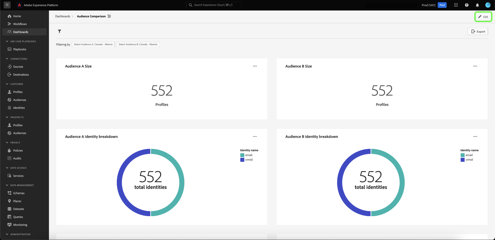
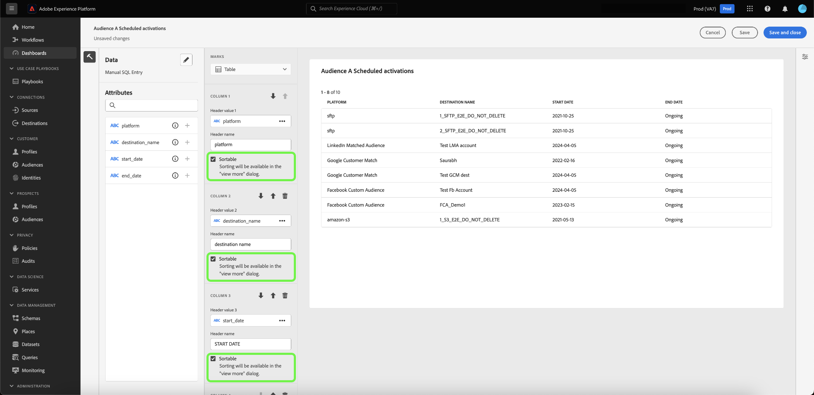

# SQL Insights für erweiterte App-Berichte

Verwenden Sie benutzerdefinierte SQL-Abfragen, um effektiv Einblicke aus verschiedenen strukturierten Datensätzen zu extrahieren. Technische Mitarbeiter können den Abfragemodus verwenden, um komplexe Analysen mit SQL durchzuführen und diese Analyse dann über Diagramme in Ihrem benutzerdefinierten Dashboard oder CSV-Dateien für nicht-technische Benutzer freizugeben. Diese Methode der Erstellung von Einblicken ist gut für Tabellen mit klaren Beziehungen geeignet und ermöglicht einen größeren Grad der Anpassung in Ihren Einblicken und Filtern, die für Nischenanwendungsfälle geeignet sind.

>[!IMPORTANT]
>
>Der Query Pro-Modus ist nur für Benutzer verfügbar, die die [Data Distiller SKU) ](../../query-service/data-distiller/overview.md) haben.

Um Insights aus SQL zu generieren, müssen Sie zunächst ein Dashboard erstellen.

## Erstellen eines benutzerdefinierten Dashboards {#create-custom-dashboard}

Um ein benutzerdefiniertes Dashboard zu erstellen, wählen Sie **[!UICONTROL Dashboards]** aus dem linken Navigationsbereich aus, um den Dashboard-Arbeitsbereich zu öffnen. Wählen Sie anschließend **[!UICONTROL Dashboard erstellen]** aus.

Das **[!UICONTROL Dashboard erstellen]** wird angezeigt. Es gibt zwei Optionen, aus denen Sie Ihre Methode zur Dashboard-Erstellung auswählen können. Um Ihre Einblicke zu erstellen, können Sie entweder ein vorhandenes Datenmodell mit dem [[!UICONTROL Geführte Design-Modus]](../standard-dashboards.md) oder Ihre eigene SQL mit dem [!UICONTROL Query pro-Modus] verwenden.

<!-- Maybe reference Guided design mode in other places on UDD doc. -->

Die Verwendung eines vorhandenen Datenmodells bietet die Vorteile eines strukturierten, effizienten und skalierbaren Frameworks, das auf Ihre spezifischen Geschäftsanforderungen zugeschnitten ist. Informationen zum [ (Erstellen von Einblicken aus einem vorhandenen Datenmodell](../standard-dashboards.md#create-widget) finden Sie im Handbuch zum benutzerdefinierten Dashboard .

Erkenntnisse, die aus SQL-Abfragen generiert werden, bieten eine viel größere Flexibilität und Anpassung. Technische Mitarbeiter können den Abfragemodus verwenden, um komplexe Analysen zu SQL durchzuführen und diese Analyse dann über diese Dashboard-Funktion für nicht-technische Benutzer freizugeben. Wählen **[!UICONTROL Query pro-Modus]** gefolgt von **[!UICONTROL Speichern]** aus.

>[!NOTE]
>
>Nachdem Sie eine Auswahl getroffen haben, können Sie diese Auswahl in diesem Dashboard nicht mehr ändern. Stattdessen müssen Sie ein neues Dashboard mit einer anderen Methode zur Dashboard-Erstellung erstellen.

![Das Dialogfeld [!UICONTROL Dashboard erstellen] mit Hervorhebung von Query Pro-Modus und Speichern.](../images/sql-insights-query-pro-mode/query-pro-mode.png)

## Query Pro-Modus - Übersicht {#query-pro-mode}

Query Pro-Modus ist ein SQL-Editor-basierter Workflow, der Sie durch den Prozess der Generierung von Insights mit benutzerdefinierten SQL-Abfragen in der Adobe Experience Platform-Benutzeroberfläche führt. Bevor Sie Insights mit benutzerdefinierten SQL-Abfragen generieren können, müssen Sie zunächst ein Dashboard erstellen.

## SQL erstellen {#compose-sql}

Nachdem Sie sich entschieden haben, ein Dashboard mit Query Pro-Modus zu erstellen, wird das **[!UICONTROL SQL eingeben]**-Dialogfeld angezeigt. Wählen Sie aus dem Dropdown-Menü eine Datenbank (Insights-Datenmodell) aus, die Sie abfragen möchten, und geben Sie im Abfrage-Editor eine geeignete Abfrage für Ihren Datensatz ein.

>[!NOTE]
>
>Der Pro-Modus „Abfrage“ ist nur für Benutzende verfügbar, die die Data Distiller SKU erworben haben. Der [[!UICONTROL Geführte Design-Modus]](../standard-dashboards.md) steht allen Benutzern zur Verfügung, um Einblicke aus einem vorhandenen Datenmodell zu erstellen.

Weitere Informationen [ Benutzeroberflächenelemente finden Sie ](../../query-service/ui/user-guide.md#query-authoring) Benutzerhandbuch zum Abfrage-Editor .

![Das Dialogfeld [!UICONTROL SQL eingeben] mit hervorgehobenem Dropdown-Menü „Datensatz“ und dem Symbol „Ausführen“. Das Dialogfeld enthält eine ausgefüllte SQL-Abfrage und die Registerkarte „Abfrageparameter“ wird angezeigt.](../images/sql-insights-query-pro-mode/enter-sql-database-dropdown.png)

### Abfrageparameter {#query-parameters}

Um [globale](./filters/global-filter.md) oder [Datumsfilter einzuschließen](./filters/date-filter.md) muss **Abfrage**. Wenn Sie Ihre Anweisung im Abfragemodus erstellen, müssen Sie Beispielwerte angeben, wenn Ihre Abfrage Abfrageparameter verwendet. Anhand der Beispielwerte können Sie die SQL-Anweisung ausführen und das Diagramm erstellen. Beachten Sie, dass die Beispielwerte, die Sie beim Erstellen Ihrer Anweisung angeben, durch die tatsächlichen Werte ersetzt werden, die Sie zur Laufzeit für den Datums- oder globalen Filter auswählen.

>[!IMPORTANT]
>
>Wenn Sie einen globalen Filter verwenden möchten, müssen Sie einen Abfrageparameter in Ihrer SQL platzieren und diesen Abfrageparameter dann mit dem globalen Filter im Widget-Composer verknüpfen. Im folgenden Screenshot wird `CONSENT_VALUE_FILTER` in SQL als Abfrageparameter für einen globalen Filter verwendet. Weitere Informationen dazu finden [ in ](./filters/global-filter.md#enable-global-filter) Dokumentation zum globalen Filter .

Um Ihre Abfrage auszuführen, wählen Sie das Symbol „Ausführen“ (). Der Abfrage-Editor zeigt die Registerkarte Ergebnisse an. Bestätigen Sie als Nächstes Ihre Konfiguration und öffnen Sie den Widget-Composer, indem Sie **[!UICONTROL Auswählen]** auswählen.

>[!TIP]
>
>Wenn Ihre Abfrage Abfrageparameter verwendet, führen Sie die Abfrage einmal aus, um alle verwendeten Abfrageparameterschlüssel vorauszufüllen. Die Abfrage schlägt fehl, aber die Benutzeroberfläche zeigt automatisch die Registerkarte Abfrageparameter an und listet alle enthaltenen Schlüssel auf. Fügen Sie die entsprechenden Werte für Ihre Schlüssel hinzu.

![Das Dialogfeld [!UICONTROL SQL eingeben] mit SQL-Eingabe, die Registerkarte „Ergebnisse“ wird angezeigt, und „Auswählen“ ist hervorgehoben.](../images/sql-insights-query-pro-mode/enter-sql-select.png)

## Widget befüllen {#populate-widget}

Der Widget-Composer wird jetzt mit den Spalten aus der ausgeführten SQL gefüllt. Der Typ des Dashboards wird oben links angezeigt, in diesem Fall ist es [!UICONTROL Manuelle SQL-Eingabe]. Wählen Sie das Stiftsymbol (), um die SQL jederzeit zu bearbeiten.

>[!TIP]
>
>Die verfügbaren Attribute sind Spalten, die aus der ausgeführten SQL übernommen werden.

Um Ihr Widget zu erstellen, verwenden Sie die in der Spalte [!UICONTROL Attribute] aufgelisteten Attribute. Sie können die Suchleiste verwenden, um nach Attributen zu suchen oder durch die Liste zu scrollen.

### Attribute hinzufügen {#add-attributes}

Um ein Attribut zu Ihrem Widget hinzuzufügen, wählen Sie das Pluszeichen () neben einem Attributnamen. Im angezeigten Dropdown-Menü können Sie dem Diagramm aus den von Ihrer SQL bestimmten Optionen ein Attribut hinzufügen. Verschiedene Diagrammtypen haben unterschiedliche Optionen, z. B. eine Dropdown-Liste für die X- und Y-Achse.

In diesem Beispiel für ein Ringdiagramm sind die Optionen Größe und Farbe. Farbe schlüsselt die Ergebnisse des Ringdiagramms auf und die Größe ist die tatsächlich verwendete Metrik. Fügen Sie dem Feld [!UICONTROL Farbe] ein Attribut hinzu, um die Ergebnisse basierend auf ihrer Komposition dieses Attributs in verschiedene Farben aufzuteilen.

>[!TIP]
>
>Wählen Sie die Pfeile nach oben und unten aus ), um die Anordnung der X- und Y-Achse auf Balken- oder Liniendiagrammen zu ändern.

Um den Typ des Diagramms oder Diagramms Ihres Widgets zu ändern, wählen Sie aus den verfügbaren Optionen der Dropdown-Liste [!UICONTROL Markierungen] aus. Die Optionen umfassen [!UICONTROL Linie], [!UICONTROL Ringdiagramm], [!UICONTROL Große &#x200B;] und [!UICONTROL Balken]. Nach der Auswahl wird eine Vorschauvisualisierung der aktuellen Einstellungen Ihres Widgets generiert.

## Erweiterte Tabellenattribute {#advanced-attributes}

Um automatische Sortierfunktionen auf eine oder alle Spalten in Ihren Tabellen anzuwenden, wählen Sie **[!UICONTROL Bearbeiten]** aus, um das gesamte Dashboard zu bearbeiten.

Klicken Sie auf die Auslassungszeichen (`...`) im Tabellendiagramm, dem Sie eine Spaltensortierung hinzufügen möchten, und klicken Sie dann auf **[!UICONTROL Bearbeiten]**.

Um die Sortierung für eine beliebige Spalte zu aktivieren, aktivieren Sie die Kontrollkästchen **[!UICONTROL sortierbar]**.

Wählen Sie das Eigenschaftensymbol () in der rechten Leiste aus, um das Bedienfeld [!UICONTROL Eigenschaften] zu öffnen. Wählen Sie im Bedienfeld **[!UICONTROL Eigenschaften]** mithilfe der Dropdown-Liste die Spalte **[!UICONTROL Standardsortierung]** und wählen Sie dann mithilfe der Dropdown-Liste die **[!UICONTROL Sortierrichtung]** aus. Wählen Sie abschließend **[!UICONTROL Speichern und schließen]** aus.

Weitere Informationen zur Verwendung der Funktionen zum Sortieren, Ändern der Spaltengröße und zur Paginierung finden Sie unter [Weitere Informationen](./view-more.md).

## Widget-Eigenschaften {#properties}

Wählen Sie das Eigenschaftensymbol () in der rechten Leiste aus, um den Bereich „Eigenschaften“ zu öffnen. Geben Sie [!UICONTROL &#x200B; Bedienfeld &#x200B;]Eigenschaften“ einen Namen für das Widget in das Textfeld **[!UICONTROL Widget-Titel]** ein. Sie können auch verschiedene Aspekte Ihres Diagramms umbenennen.

>[!NOTE]
>
>Die in der Seitenleiste „Eigenschaften“ verfügbaren spezifischen Felder variieren je nach dem Diagrammtyp, den Sie bearbeiten.

## Widget speichern {#save-widget}

Beim Speichern im Widget Composer wird das Widget lokal im Dashboard gespeichert. Wenn Sie Ihre Arbeit speichern und später fortsetzen möchten, wählen Sie **[!UICONTROL Speichern]**. Ein Häkchen unter dem Widget-Namen zeigt an, dass das Widget gespeichert wurde. Wenn Sie mit Ihrem Widget zufrieden sind, können Sie alternativ auf **[!UICONTROL Speichern und schließen]** klicken, um das Widget für alle anderen Benutzer mit Zugriff auf Ihr Dashboard verfügbar zu machen. Wählen Sie Abbrechen aus, um Ihre Arbeit abzubrechen und zu Ihrem benutzerdefinierten Dashboard zurückzukehren.

## Dashboard und Diagramme bearbeiten {#edit}

Wählen Sie **[!UICONTROL Bearbeiten]** aus, um Ihr gesamtes Dashboard oder eines Ihrer Insights zu bearbeiten. Im Bearbeitungsmodus können Sie die Größe von Widgets ändern, Ihre SQL bearbeiten oder globale und zeitliche Filter erstellen und anwenden. Diese Filter schränken die Daten ein, die in Ihren Dashboard-Widgets angezeigt werden. Dies ist eine praktische Methode, um Ihre Insights schnell zu aktualisieren und für verschiedene Anwendungsfälle zu optimieren.

Wählen Sie **[!UICONTROL Filter hinzufügen]** aus, um entweder einen [[!UICONTROL Datumsfilter]](#create-date-filter) oder einen [[!UICONTROL globalen Filter]](#create-global-filter) zu erstellen. Nach der Erstellung sind alle globalen Filter und Datumsfilter über das [Filtersymbol](#select-global-filter) verfügbar () Ihres Dashboards aus.

## Bearbeiten, Duplizieren oder Löschen eines Insights

Anweisungen zum Bearbeiten, Duplizieren oder Löschen eines vorhandenen Widgets [ Sie im Handbuch zum benutzerdefinierten Dashboard ](../standard-dashboards.md#duplicate).

## Nächste Schritte

Nach dem Lesen dieses Dokuments wissen Sie jetzt, wie Sie SQL-Abfragen in der Adobe Experience Platform-Benutzeroberfläche schreiben, um Diagramme für Ihre benutzerdefinierten Dashboards zu generieren. Als Nächstes sollten Sie lernen, wie Sie Ihre Daten durch [Erstellen eines Datumsfilters](./filters/date-filter.md) oder [Erstellen eines globalen Filters](./filters/global-filter.md) weiter anreichern können.

Sie können auch mehr über andere Custom Insights-Funktionen erfahren, darunter [die verschiedenen Anzeigeoptionen für Ihre SQL-analysierten Daten](./view-more.md) oder wie Sie [ SQL hinter Ihren benutzerdefinierten Insights ](./view-sql.md).
