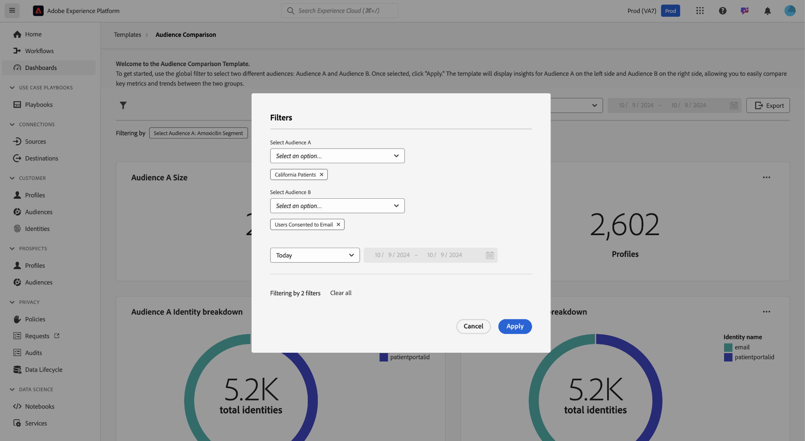

# Zielgruppenvergleich

Das Dashboard [!UICONTROL Zielgruppenvergleich] vergleicht und vergleicht wichtige Zielgruppenmetriken nebeneinander in einer Ansicht. Von diesem Dashboard aus können Sie eine Vielzahl von Aktionen durchführen, um zwei Zielgruppengruppen zu vergleichen und Schlüsselmetriken zwischen ihnen zu analysieren. Anschließend können Sie datengestützte Entscheidungen zur Zielgruppensegmentierung und Zielgruppenbestimmungsstrategien treffen.

## Festlegen von Zielgruppenvergleichen {#set-audience-comparisons}

Um aussagekräftigere Einblicke und Vergleiche zu ermöglichen, verwenden Sie die Systemfilter, um die Zielgruppensegmente und den Zeitrahmen, den Sie analysieren möchten, genau anzusprechen. Wählen Sie das Filtersymbol (), um zwei verschiedene Zielgruppen auszuwählen ([!UICONTROL Zielgruppe A] und [!UICONTROL Zielgruppe B]) und bestimmte Parameter für den Vergleich festzulegen.

Das [!UICONTROL Filter]-Dialogfeld wird angezeigt. Um die erste zu analysierende Audience auszuwählen, wählen Sie die Dropdown-Liste **[!UICONTROL Audience A]**. In diesem Beispiel wurde `California Patients` als Zielgruppe A ausgewählt. Diese Zielgruppe wird auf der linken Seite des Vergleichs angezeigt, sobald der Filter angewendet wird.

Wählen Sie als Nächstes eine zweite Zielgruppe aus dem Dropdown-Menü [!UICONTROL Zielgruppe B auswählen] aus **[!UICONTROL die mit Zielgruppe A]** verglichen werden soll. In diesem Bild wurde [!UICONTROL Benutzer stimmten E-] zu) als [!UICONTROL Audience B] ausgewählt. Diese Zielgruppe wird auf der rechten Seite des Dashboards [!UICONTROL Zielgruppenvergleich] angezeigt, sobald der Filter angewendet wird.

### Anpassen von Datumsbereichen {#adjust-date-ranges}

Sie können Ihre Daten auch nach bestimmten Zeiträumen filtern, um zu sehen, wie diese Zielgruppen funktionieren, oder um sich über einen benutzerdefinierten Datumsbereich zu ändern. Um einen Zeitraum zum Filtern der Zielgruppendaten nach einem bestimmten Zeitraum festzulegen, wählen Sie das Start- und Enddatum aus den Kalenderfeldern aus.

Das Dialogfeld gibt auch an, wie viele Filter angewendet werden (im Screenshot unten werden zwei Filter verwendet: Audience A und Audience B und heute als Datumsbereich). Um alle angewendeten Filter zu entfernen, wählen Sie **[!UICONTROL Alle löschen]** aus.

Nachdem Sie die Zielgruppen und den Datumsbereich festgelegt haben, wählen Sie **[!UICONTROL Anwenden]** aus, um das Dashboard [!UICONTROL Zielgruppenvergleich] zu aktualisieren.

Das Dashboard zeigt nun für jede Zielgruppe die Vergleichsdiagramme nebeneinander an.

## Verfügbare Zielgruppen-Vergleichsdiagramme {#available-charts}

<!-- Potentially could expand this section to include images of each widget.  -->

Das Dashboard bietet mehrere Diagramme, um Einblicke zu vergleichen:

- [[!UICONTROL Zielgruppengröße]](../../guides/audiences.md#audience-size): Verfolgen Sie auf einfache Weise die Größe jeder Zielgruppe basierend auf der Anzahl der darin enthaltenen Profile. Diese Metrik hilft Ihnen, den Umfang der beiden Zielgruppen zu verstehen, die Sie vergleichen.
- [!UICONTROL Aufschlüsselung der Zielgruppenidentität]: Ein Tortendiagramm liefert eine Aufschlüsselung der relativen Komposition von Identitäten innerhalb jeder Zielgruppe. Sie können die Anzahl der Identitäten insgesamt anzeigen und untersuchen, wie verschiedene Kennungen (wie E-Mail oder CRM-ID) zu dieser Gesamtzahl beitragen. Dieses Diagramm hilft Ihnen, die Komposition jeder Zielgruppe basierend auf Identitätstypen zu verstehen. Bewegen Sie den Mauszeiger über einen Abschnitt des Tortendiagramms, um eine genaue Anzahl von Identitäten anzuzeigen.
- [[!UICONTROL Entwicklung der Zielgruppengröße]](../../guides/audiences.md#audience-size-trend): Dieses Diagramm stellt die Größentrends im Zeitverlauf für die ausgewählte Zielgruppe dar. Verwenden Sie diese Diagramme, um zu visualisieren, wie sich die Größe der einzelnen Zielgruppen über einen ausgewählten Zeitraum hinweg geändert hat, wobei Spitzen und Tiefpunkte Perioden des Wachstums oder der Verringerung der Anzahl der Profile angeben.
- [[!UICONTROL Entwicklung der Zielgruppengröße]](../../guides/audiences.md#audience-size-change-trend): Dieses Diagramm zeigt die Größenänderungstrends für die ausgewählte Zielgruppe an. Er visualisiert, wie stark die Zielgruppengröße im Laufe der Zeit zugenommen oder abgenommen hat, und ermöglicht es Ihnen, signifikante Verschiebungen oder Trends in der Zielgruppenpopulation zu identifizieren.

>[!NOTE]
>
>Die Diagramme [!UICONTROL Entwicklung der Zielgruppengröße] und [!UICONTROL Entwicklung der Zielgruppengröße] helfen Ihnen, sowohl die absolute Größe als auch die Größenschwankungen zwischen zwei Zielgruppen über einen bestimmten Zeitraum zu verfolgen und zu vergleichen. Diese Informationen erleichtern das Verständnis von Mustern und Faktoren, die Zielgruppenänderungen beeinflussen.

## Exportieren von Einblicken {#export-insights}

Nachdem Sie Filter angewendet und die Zielgruppen analysiert haben, können Sie die Daten für weitere Offline-Analyse- oder Berichtszwecke exportieren. Um Ihre Einblicke zu exportieren **[!UICONTROL wählen Sie]** Exportieren) oben rechts in der Tabelle aus. Das Dialogfeld PDF drucken wird angezeigt. In diesem Dialogfeld können Sie die in der Tabelle angezeigten Daten als PDF speichern oder drucken.

Wählen Sie **[!UICONTROL Vorlagen]** aus, um zur Übersicht [!UICONTROL Vorlage] zurückzukehren.

## Nächste Schritte

Nach dem Lesen dieses Dokuments haben Sie gelernt, wie Sie Schlüsselmetriken zwischen verschiedenen Zielgruppengruppen mithilfe des Dashboards **Zielgruppenvergleich“**. Um Ihre Zielgruppensegmentierung und Zielgruppenbestimmungsstrategien weiter zu verbessern, sollten Sie andere Data Distiller-Vorlagen erkunden, die zusätzliche Einblicke bieten. Weitere Informationen zur weiteren Verbesserung Ihrer Entscheidungsfindung und zur Optimierung Ihrer Interaktionen finden Sie in , [Audience-](./identity-overlaps.md)Identitätsüberschneidungen und [Erweiterte ](./overlaps.md)-Überschneidungen) in den Benutzeroberflächen-Handbüchern.
