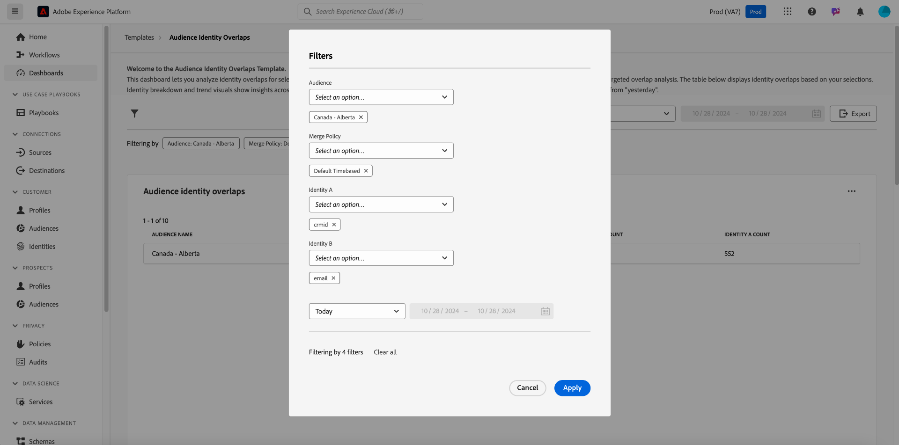

# Zielgruppen-Identitätsüberschneidungen

Analyse von Identitätsüberschneidungen für ausgewählte Zielgruppen mit dem Dashboard [!UICONTROL Zielgruppenidentitätsüberschneidungen] . Sie können Einblicke in die Beziehung verschiedener Identitäten innerhalb einer Zielgruppe untereinander verwenden, um Stitching-Strategien zu optimieren, Redundanz zu reduzieren und die Genauigkeit der Kundensegmentierung zu verbessern. Entwickeln Sie effektive Targeting-Strategien und optimieren Sie Kundeninteraktionen mit einem besseren Verständnis der Überschneidung zwischen Identitätstypen.

## Filtern von Zielgruppen {#filter-audiences}

Verwenden Sie benutzerdefinierte Filter für die gezielte Analyse bestimmter Zielgruppen und Identitätstypen, um sicherzustellen, dass die angezeigten Daten mit Ihren Analysezielen übereinstimmen. Um Ihre Analyse zu starten, wählen Sie das Filtersymbol ().

Das Dialogfeld **[!UICONTROL Filter]** wird angezeigt. Wählen Sie in dieser Ansicht die globalen Filter aus, um Ihre Zielgruppe, Zusammenführungsrichtlinie und die Identitäten zum Vergleich zu konfigurieren. Wählen Sie Ihre Analyseeinstellungen aus dem Dropdown-Menü der einzelnen Abschnitte aus.

1. Wählen Sie eine **[!UICONTROL Zielgruppe]**: Wählen Sie das Zielgruppensegment aus, das Sie analysieren möchten (z. B. **Kanada - Alberta**).
2. Legen Sie eine **[!UICONTROL Zusammenführungsrichtlinie]** fest: Definieren Sie die Zusammenführungsrichtlinie, die bestimmt, wie Identitäten über die ausgewählte Zielgruppe hinweg kombiniert werden (im Beispiel-Screenshot ist die Richtlinie **Standardzeit für die Dauer basiert** ausgewählt).
3. Wählen Sie zum Vergleich eine **[!UICONTROL Identität A]** und eine **[!UICONTROL Identität B]** aus: Wählen Sie die beiden zu vergleichenden Identitätstypen aus. Im Beispiel wird **Identität A** als &quot;crmId&quot;und **Identität B** als &quot;E-Mail&quot;ausgewählt.
4. **Datumsbereich festlegen**: Wählen Sie einen vordefinierten Bereich wie &quot;Heute&quot;aus oder legen Sie das Start- und Enddatum manuell mithilfe der Kalenderfelder fest.

>[!TIP]
>
>Um alle Ihre benutzerdefinierten globalen Filter zu löschen, wählen Sie **[!UICONTROL Alle löschen]** aus dem Dialogfeld [!UICONTROL Filter] aus. Um einen einzelnen Filter zu entfernen, wählen Sie &quot;[!UICONTROL X]&quot;rechts neben dem Filternamen aus.

Wählen Sie nach Auswahl der Filter **[!UICONTROL Anwenden]** aus, um das Dashboard zu aktualisieren.

## Verfügbare Dashboard-Erkenntnisse {#available-insights}

Das Dashboard **Überschneidungen bei der Zielgruppenidentität** enthält verschiedene Visualisierungen und tabellarische Daten, die Ihnen helfen, Identitätsüberschneidungen und Trends innerhalb Ihrer Zielgruppe zu verstehen.

### Zielgruppen-Identitätsüberschneidungen {#overlaps-table}

Die Tabelle **[!UICONTROL Audience Identity Oververlaps]** enthält Identitätsüberschneidungen basierend auf Ihren ausgewählten Filtern. Verwenden Sie diese Informationen, um die Überschneidung zwischen verschiedenen Identitätstypen zu bewerten und zu verstehen, wie effektiv Identitäten gelöst werden. In der folgenden Tabelle werden die einzelnen Spalten detailliert beschrieben:

| Spaltenname | Beschreibung |
|-----------------|-------------------------------|
| **[!UICONTROL Zielgruppenname]** | Der Name der analysierten Audience. In dieser Spalte wird angegeben, welches Zielgruppensegment überprüft wird, um sicherzustellen, dass sich die Einblicke auf die gewünschte Zielgruppe konzentrieren. |
| **[!UICONTROL Identität A]** und **[!UICONTROL Identität B]** | Die zu vergleichenden Identitäten (z. B. `crmId` und `email`). Wenn Sie wissen, welche Identitätstypen verglichen werden, können Sie erkennen, welche Strategien zur Identitätsauflösung zur Zielgruppenüberschneidung beitragen und diese Beziehungen optimieren. |
| **[!UICONTROL Überlagerungsanzahl]** | Die Anzahl der Profile, in denen beide Identitäten vorhanden sind. Diese Metrik bietet Einblicke in das Ausmaß der Identitätsüberlappung innerhalb der Zielgruppe. Diese Informationen sind entscheidend für die Beurteilung, wie effektiv mehrere Identitäten in einheitliche Profile aufgelöst werden, was wiederum Targeting- und Personalisierungsstrategien verbessern kann. |
| **[!UICONTROL Identität eines Zählers]** | Die Gesamtzahl der Profile in der ausgewählten Zielgruppe, die **Identität A** enthalten. Verwenden Sie diese Informationen, um die Verbreitung des primären Identitätstyps innerhalb der Zielgruppe zu verstehen und seine Rolle in der Überschneidungsanalyse zu bewerten. |

### Identitätsaufschlüsselung {#identity-breakdown}

Das Diagramm **[!UICONTROL Identitätsaufschlüsselung]** zeigt die relative Zusammensetzung der Identitäten innerhalb der ausgewählten Zielgruppe. Die X-Achse stellt die Gesamtzahl der Identitäten innerhalb der ausgewählten Zielgruppe dar, während die Y-Achse den zu analysierenden Zielgruppennamen darstellt. Verwenden Sie diese Visualisierung, um die Verbreitung jedes Identitätstyps zu verstehen und die Auswirkungen Ihrer Identitätsverwaltungsstrategie zu bewerten. Das Diagramm unterscheidet zwischen Identitätstypen anhand unterschiedlicher Farben. So erhalten Sie einen schnellen Überblick darüber, wie Identitäten über Ihre Zielgruppe verteilt sind.

>[!TIP]
>
>Bewegen Sie den Mauszeiger über die Spalten, um die Anzahl der Profile für jeden Identitätstyp anzuzeigen.

### Trends bei der Zielgruppenidentität {#audience-identity-trends}

Das Diagramm **[!UICONTROL Identitätstrends für Zielgruppen]** bietet Einblicke in die Veränderung der Gesamtanzahl der Identitäten im Laufe der Zeit. Die X-Achse stellt den zu analysierenden Datumsbereich dar, während die Y-Achse die Gesamtzahl der Identitäten nach Zielgruppe darstellt. Verwenden Sie diese Metrik, um Identitätswachstum zu verfolgen, die Stabilität zu bewerten und die Effektivität laufender Identitätsmanagementbemühungen zu messen.

>[!TIP]
>
>Bewegen Sie den Mauszeiger über ein Datum in der Grafik, um die Gesamtzahl der Identitäten für die Zielgruppe an einem bestimmten Datum anzuzeigen.

## Exportieren von Insights {#export-insights}

Nach der Analyse von Identitätsüberschneidungen können Sie die Daten für die Offline-Analyse oder die Berichterstellung exportieren. Um Ihre Daten zu exportieren, wählen Sie oben rechts in der Tabelle **[!UICONTROL Exportieren]** aus. Das Dialogfeld zum Drucken der PDF wird angezeigt, in dem Sie die visualisierten Daten als PDF speichern oder drucken können.

Das Dashboard **Audience Identity Oververlaps** bietet wichtige Einblicke in die Schnittmenge verschiedener Identitäten zwischen Ihren ausgewählten Zielgruppen. Mithilfe dieser Einblicke können Sie die Strategien zur Identitätszuordnung verfeinern, die Redundanz reduzieren und sicherstellen, dass Ihre Zielgruppensegmentierung genauer und effektiver ist.

## Nächste Schritte

Nach dem Lesen dieses Dokuments haben Sie gelernt, wie Sie mithilfe des Dashboards **Zielgruppenidentitätsüberschneidungen** wertvolle Einblicke in Identitätsüberschneidungen für ausgewählte Zielgruppen gewinnen können. Um Ihr Verständnis der Zielgruppensegmentierung und des Identitätsmanagements weiter zu vertiefen, sollten Sie andere Data Distiller-Vorlagen nutzen, die umfassende Einblicke bieten. Weitere Informationen zur weiteren Verbesserung Ihrer Targeting- und Interaktionsstrategien finden Sie in den Handbüchern [Audience-Trends](./trends.md), [Zielgruppenvergleich](./comparison.md) und [Erweiterte Zielgruppenüberschneidungen](./overlaps.md) .

