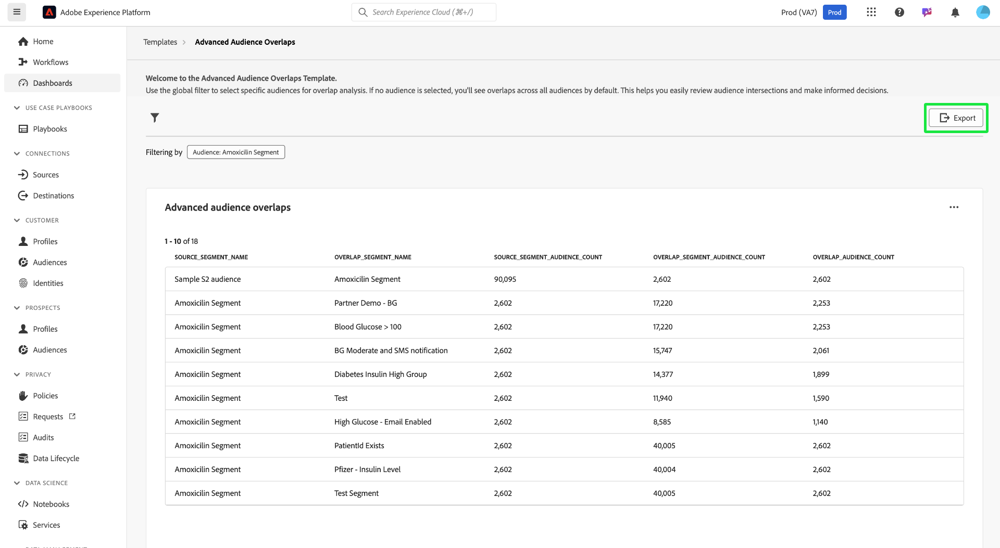

# Erweiterte Zielgruppenüberschneidungen

Gewinnen Sie wertvolle Einblicke zur Optimierung Ihrer Zielgruppensegmentierung und Zielgruppenbestimmungsstrategien, indem Sie analysieren, wie verschiedene Zielgruppensegmente sich mit dem Dashboard [!UICONTROL Erweiterte Zielgruppenüberschneidungen] überschneiden. Untersuchen Sie die tabellarischen Metriken, um Überschneidungen zu identifizieren, die Segmentierung zu verfeinern und redundantes Messaging zu reduzieren. Letztendlich können Sie diese Einblicke nutzen, um zielgerichtetere Kampagnen und effizientere Marketing-Maßnahmen zu erstellen. In diesem Dashboard können Sie Zielgruppenüberschneidungen überprüfen, Filter anwenden und detaillierte Überschneidungsanalysen durchführen, um datengesteuerte Entscheidungen zu treffen und die Interaktionsergebnisse zu verbessern.

## Audiences filtern {#filter-audiences}

Um bestimmte Zielgruppen für die Überschneidungsanalyse zu filtern, wählen Sie das Filtersymbol (), um das Dialogfeld [!UICONTROL Filter] zu öffnen. Von hier aus können Sie Zielgruppen zur Überschneidungsvorlage hinzufügen oder daraus entfernen, um Ihre Analyse zu verfeinern.

Das [!UICONTROL Filter] wird angezeigt. Um eine Zielgruppe für die Überschneidungsanalyse auszuwählen, wählen Sie einen Zielgruppennamen aus dem Dropdown-Menü **[!UICONTROL Zielgruppe]** aus. Der Name der Zielgruppe, die Sie hinzufügen, wird mit einem Tag unterhalb der Dropdown-Liste angezeigt. Nach dem Hinzufügen können Sie das „X“ anhand des Namens auswählen, um sie zu entfernen. Um alle angewendeten Filter zu entfernen, wählen Sie **[!UICONTROL Alle löschen]** aus.

## Angewendete Filter {#applied-filters}

Sobald ein Filter angewendet wird ([!UICONTROL Amoxicilin-Segment] im Screenshot-Beispiel), werden die angezeigten Zielgruppendaten eingegrenzt. Alle zusätzlichen Zielgruppen, die Sie hinzufügen möchten, werden neben dem Tag [!UICONTROL Filtern nach] über dem Diagramm [!UICONTROL Erweiterte Zielgruppenüberschneidungen] angezeigt.

## Tabelle mit erweiterten Zielgruppenüberschneidungen {#advanced-audience-overlaps-table}

Im Hauptabschnitt des Dashboards wird die Tabelle [!UICONTROL Erweiterte Zielgruppenüberschneidungen] angezeigt, die einen detaillierten Vergleich der Zielgruppenüberschneidungen zwischen verschiedenen Segmenten bietet. Die Tabellenspalten lauten wie folgt:

| Spaltenname | Beschreibung |
|------------------------------------|----------------------------------------------------------------------------------------------|
| **[!UICONTROL Source_SEGMENT_NAME]** | Die ursprünglich analysierte Zielgruppe (z. B. „Amoxicilin-Segment„). |
| **[!UICONTROL overlap_segment_name]** | Die Zielgruppe, deren Überschneidungen verglichen werden (z. B. „Blutzucker > 100„). |
| **[!UICONTROL Source_Segment_Audience_Count]** | Die Gesamtzahl der Profile der Quell-Zielgruppe. |
| **[!UICONTROL overlap_segment_audience_count]** | Die Größe der sich überschneidenden Zielgruppe, die je nach Überschneidung variiert. |
| **[!UICONTROL overlap_audience_count]** | Die Größe der tatsächlichen, sich überschneidenden Zielgruppe zwischen der Quell- und der Überschneidungs-Zielgruppe. |

{style="table-layout:auto"}

## Exportieren von Einblicken {#export-insights}

Nachdem Sie die Zielgruppen gefiltert und analysiert haben, können Sie die Daten für weitere Offline-Analyse- oder Berichtszwecke exportieren. Um Ihre Einblicke zu exportieren **[!UICONTROL wählen Sie]** Exportieren) oben rechts in der Tabelle aus. Das Dialogfeld PDF drucken wird angezeigt, sodass Sie die Daten als PDF speichern oder drucken können.

Um zur Übersicht über [!UICONTROL Vorlage] zurückzukehren, wählen Sie **[!UICONTROL Vorlagen]** aus.

## Nächste Schritte

Nach dem Lesen dieses Dokuments haben Sie gelernt, wie Sie Zielgruppenüberschneidungen analysieren und datengesteuerte Entscheidungen mithilfe des Dashboards **[!UICONTROL Erweiterte Zielgruppenüberschneidungen“]**. Um Ihre Zielgruppensegmentierung und Zielgruppenbestimmungsstrategien weiter zu optimieren, sollten Sie andere Data Distiller-Vorlagen erkunden, die wertvolle Einblicke bieten. Weitere Informationen zur weiteren Verbesserung Ihrer Zielgruppeninteraktion und zur Segmentierung finden Sie [&#x200B; Benutzeroberflächen-Handbücher &#x200B;](./trends.md)Zielgruppentrends[&#x200B; „Zielgruppenvergleich](./comparison.md) und [Zielgruppenidentitätsüberschneidungen](./identity-overlaps.md).
