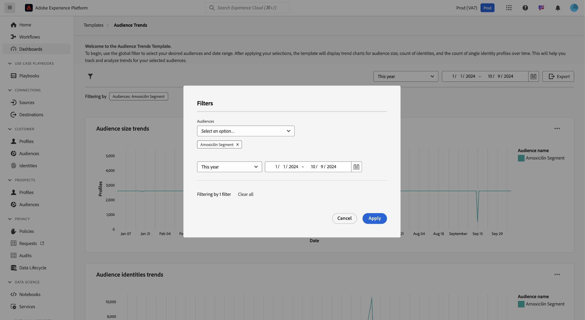
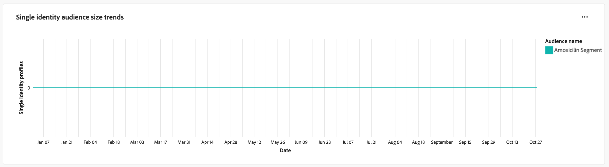

# Zielgruppen-Trends

Analysieren Sie mit Visualisierungen der wichtigsten Zielgruppenmetriken im Dashboard „Zielgruppentrends[!UICONTROL , wie sich Ihre Zielgruppen im &#x200B;] ändern. Dieses Dashboard hilft Ihnen, Trends wie das Zielgruppenwachstum, die Anzahl der Identitäten und die Anzahl der einzelnen Identitätsprofile zu verfolgen, und ermöglicht Ihnen datengesteuerte Entscheidungen. Durch die Analyse dieser Metriken können Marketing-Fachleute die Zielgruppenbestimmungsstrategien optimieren, die Interaktion mit Zielgruppen verbessern und ihre Segmentierungsbemühungen verfeinern, um effektivere Kampagnen zu ermöglichen.

## Audiences filtern {#filter-audiences}

Um mit der Analyse zu beginnen, verwenden Sie den globalen Filter, um die spezifischen Zielgruppen und den Datumsbereich auszuwählen, die Sie analysieren möchten. Wählen Sie das Filtersymbol (), um das Dialogfeld **[!UICONTROL Filter]** zu öffnen, in dem Sie:

1. **Zielgruppe auswählen**: Wählen Sie die Zielgruppe aus, die Sie analysieren möchten (im Beispiel-Screenshot wurde die Zielgruppe **Amoxicillin** ausgewählt).
1. **Datumsbereich festlegen**: Wählen Sie einen vordefinierten Bereich aus dem Dropdown-Menü aus oder wählen Sie das Start- und Enddatum manuell mithilfe der Kalenderfelder aus.

Wählen Sie nach dem Festlegen der Filter **[!UICONTROL Anwenden]** aus, um das Dashboard zu aktualisieren. Ihre ausgewählten Filter werden angewendet und fokussierte Einblicke auf ausgewählte Zielgruppen in einem bestimmten Zeitraum werden angezeigt. Ihre benutzerdefinierten Filter stellen sicher, dass die Daten für Ihre Analyseziele relevant sind.

## Diagramme mit den verfügbaren Zielgruppen-Trends {#available-charts}

Es gibt drei Hauptdiagramme, die Ihnen dabei helfen, Zielgruppenmetriken im Zeitverlauf zu verstehen. Für jedes Diagramm können Sie oben rechts die Auslassungszeichen (`...`) und dann [!UICONTROL Weitere anzeigen] auswählen, um entweder eine tabellarische Form der Ergebnisse anzuzeigen oder die Daten als CSV-Datei herunterzuladen, um sie in einer Tabelle anzuzeigen. Weitere Informationen finden Sie im [Handbuch „Weitere Informationen anzeigen](../view-more.md).

>[!TIP]
>
>Sie können den Mauszeiger über ein bestimmtes Datum in einem beliebigen Diagramm bewegen, um die Anzahl der einzelnen Profile in einem Dialogfeld anzuzeigen.

### Trends der Zielgruppengröße {#audience-size-trends}

Das Diagramm **[!UICONTROL Entwicklung der Zielgruppengröße]** zeigt die Anzahl der Profile innerhalb der ausgewählten Zielgruppe im Zeitverlauf an. Dies hilft bei der Verfolgung des Zielgruppenwachstums oder der Zielgruppenreduktion. Sie können dieses Diagramm verwenden, um die Effektivität der Interaktion zu überwachen und Änderungen der Zielgruppengröße zu verstehen.

### Trends bei Zielgruppenidentitäten {#audience-identities-trends}

Das Diagramm **[!UICONTROL Trends bei Zielgruppenidentitäten]** bietet Einblicke in die Gesamtzahl der Identitäten innerhalb des Zielgruppensegments. Verwenden Sie dieses Diagramm, um zu verstehen, wie eindeutige Identitäten zur Gesamtgröße der Zielgruppe beitragen. Es bietet einen Hinweis auf die Stabilität und Interaktion der Zielgruppe.

### Trends bei der Größe einer einzelnen Identität {#single-identity-audience-size-trends}

Das Diagramm **[!UICONTROL Entwicklung der Zielgruppengröße für eine einzelne Identität]** zeigt die Anzahl der Zielgruppenmitglieder mit nur einer Identität. Diese Metrik ist nützlich, um die Zusammensetzung Ihrer Zielgruppe zu verstehen, insbesondere im Hinblick auf die Eindeutigkeit der Identität, und hilft, die Effektivität der Maßnahmen zur Identitätszuordnung zu messen.

## Exportieren von Einblicken {#export-insights}

Nach der Analyse der Metriken und der Anwendung relevanter Filter können Sie die Daten für weitere Offline-Analyse- oder Berichtszwecke exportieren. Wählen Sie dazu **[!UICONTROL Exportieren]** oben rechts in der Tabelle aus. Das Dialogfeld PDF drucken wird angezeigt. In diesem Dialogfeld können Sie die visualisierten Daten als PDF speichern oder drucken.

## Nächste Schritte

Nach dem Lesen dieses Dokuments haben Sie gelernt, wie Sie über das Dashboard „Zielgruppentrends **wertvolle Einblicke in** Zielgruppenverhalten im Zeitverlauf erhalten. Weitere Informationen zu anderen Data Distiller-Vorlagen, die Ihnen dabei helfen können, fundierte Entscheidungen zu treffen, die Segmentierung zu optimieren und Interaktionsstrategien zu verbessern, finden Sie in den Handbüchern [Zielgruppenvergleich](./comparison.md), [Zielgruppenidentitätsüberschneidungen](./identity-overlaps.md) und [Erweiterte Zielgruppenüberschneidungen](./overlaps.md).
