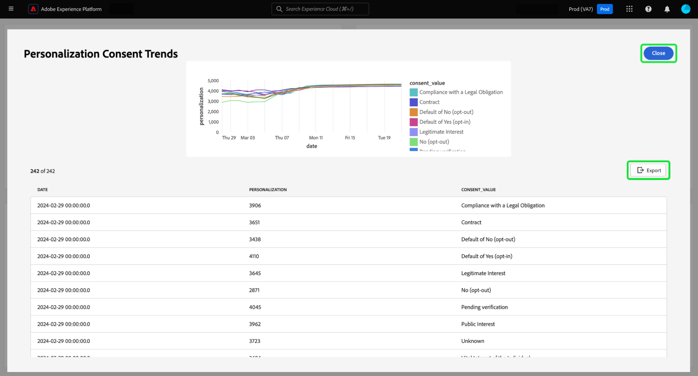
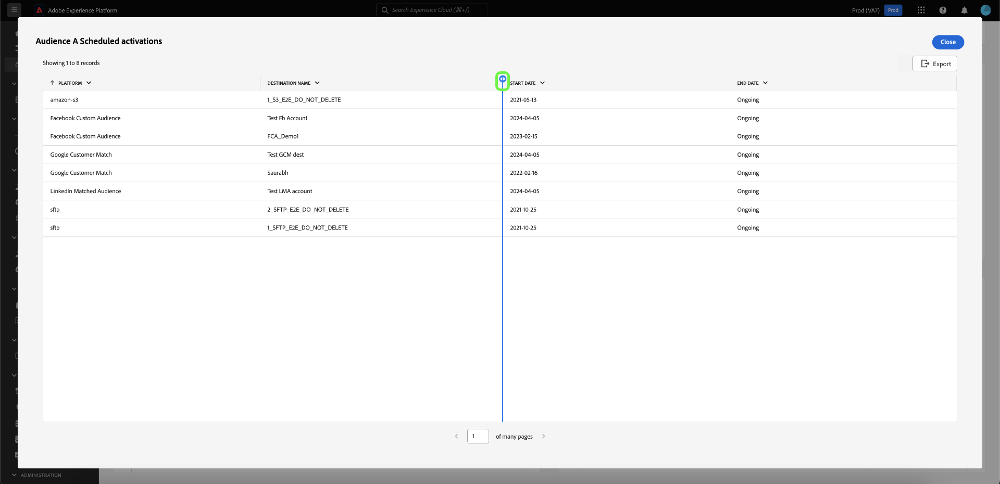

# Mehr anzeigen {#view-more}

Nachdem Sie eine [benutzerdefinierte insight](./overview.md) mit [Query Pro-Modus](./overview.md#query-pro-mode) erstellt haben, können Sie die Diagrammdaten in verschiedenen Formaten anzeigen. Sie können entweder eine tabellarische Form der Ergebnisse anzeigen oder die Daten im CSV-Format oder per E-Mail exportieren.

## Tabellarische Ergebnisse {#tabulated-results}

Für jedes Diagramm, das mithilfe des Abfrage-Pro-Modus über SQL erstellt wurde, können Sie die tabellarischen Ergebnisse Ihrer Analyse in der Experience Platform-Benutzeroberfläche anzeigen.

Wählen Sie im benutzerdefinierten Dashboard die Auslassungszeichen (`...`) eines beliebigen Widgets aus, um auf die Optionen [!UICONTROL Mehr anzeigen] und [!UICONTROL SQL anzeigen] zuzugreifen.

## Exportieren {#export}

Exportieren Sie im **[!UICONTROL „Mehr anzeigen]** die Tabellendaten, indem Sie entweder eine CSV-Datei direkt herunterladen oder einen Link zu Ihrer E-Mail senden, um sie später sicher herunterzuladen.

>[!IMPORTANT]
>
>Um auf die Exportoptionen zuzugreifen, muss Ihnen Ihr Administrator die Berechtigung **[!UICONTROL Export-Dashboard-Daten]** erteilen. Wenn die Schaltfläche [!UICONTROL Exportieren] ausgegraut ist, wenden Sie sich an Ihren Administrator. Weitere Informationen zu Dashboard[Berechtigungen finden Sie ](../../access-control/home.md) „Zugriffssteuerung - Übersicht“.

>[!NOTE]
>
>Exporte, die nur Visualisierungen enthalten, erfordern nicht die Berechtigung [!UICONTROL Exportieren von Dashboard-]). Exportieren Sie beispielsweise verarbeitete Daten aus Ihren [benutzerdefinierten Dashboard-Insights im PDF-](./export-pdf.md)) oder aus [Platform UI-Dashboard-Insights](../download.md).

### CSV herunterladen {#download-csv}

Wählen [!UICONTROL  Dialogfeld „Mehr anzeigen] die Option **[!UICONTROL Exportieren]** und dann **[!UICONTROL CSV herunterladen]** aus, um die Diagrammdaten im CSV-Format herunterzuladen.

>[!NOTE]
>
>Der CSV-Download ist auf die ersten 500 Datensätze beschränkt.

### Als E-Mail senden {#send-as-email}

Um mehr als 500 Datensätze zu exportieren, wählen Sie **[!UICONTROL Exportieren]** und **[!UICONTROL Als E-Mail senden]** im Dialogfeld [!UICONTROL Datei exportieren] aus. Mit dieser Option wird ein Downloadlink sicher an Ihre Adobe-E-Mail-Adresse gesendet. Der Name und die registrierte Adobe-E-Mail-Adresse des Empfängers werden im Abschnitt [!UICONTROL Empfänger] des Dialogfelds angezeigt.

Nachdem Sie [!UICONTROL Als E-Mail senden] ausgewählt haben, generiert Adobe einen Bericht und sendet eine E-Mail an Ihre registrierte Adobe-Adresse. Die E-Mail enthält einen sicheren Download-Link, für den eine Authentifizierung über Experience Platform erforderlich ist.

>[!NOTE]
>
>Sie müssen den Bericht innerhalb von 24 Stunden nach der Link-Generierung herunterladen. Danach läuft die Datei ab.

Zum Schutz Ihrer Daten hostet Adobe exportierte Dateien sicher, anstatt sie als Anhänge zu senden. Für den Zugriff ist eine Authentifizierung über die Experience Platform-Benutzeroberfläche erforderlich, und Adobe überprüft, ob die Datei nur vom vorgesehenen Empfänger heruntergeladen wird.

Diese Methode ermöglicht den Export von **bis zu 10.000 Datensätzen** und gewährleistet den sicheren Zugriff auf vertrauliche Daten.

## Nach Spalte sortieren {#sort-column}

Beim Anzeigen von tabellarischen Ergebnissen können Sie die Sortierfunktion verwenden, um in auf- oder absteigender Reihenfolge nach Spalten zu sortieren. Wählen Sie im benutzerdefinierten Dashboard die Auslassungszeichen (`...`) einer beliebigen Tabelle aus, um auf die Option [!UICONTROL Mehr anzeigen] zuzugreifen.

Sie können Spalten sortieren, indem Sie das Dropdown-Menü neben dem Spaltennamen auswählen und dann auf **[!UICONTROL Aufsteigend sortieren]** oder **[!UICONTROL Absteigend sortieren]** klicken.

>[!NOTE]
>
>Die [!UICONTROL Aufsteigend sortieren] und [!UICONTROL Absteigend sortieren] werden nur für Spalten angezeigt, die mit [Sortierfunktion](./overview.md#advanced-attributes) konfiguriert wurden.

## Spaltengröße ändern {#resize-column}

Sie können die Größe von Spalten in tabellarischen Ergebnissen ändern, um die Lesbarkeit der Daten zu verbessern. Wählen Sie im benutzerdefinierten Dashboard die Auslassungszeichen (`...`) für Ihre Tabelle aus, um auf die Option [!UICONTROL Mehr anzeigen] zuzugreifen. Verwenden Sie das Dropdown-Menü neben dem Spaltennamen, um die Größe zu ändern, und wählen Sie dann **[!UICONTROL Spaltengröße ändern]**.

Wählen Sie den Schieberegler aus und ziehen Sie ihn nach links oder rechts, um die Spaltengröße nach Bedarf anzupassen.

## Tabellen-Paginierung {#table-pagination}

Die Tabellen werden automatisch mit der Funktion [!UICONTROL Mehr anzeigen] paginiert, sodass Sie Ihre SQL-Abfragen nicht mehr manuell ändern müssen. Mit dieser Funktion wird sichergestellt, dass Ihre Daten in einem besser verwaltbaren Format angezeigt werden, was die Navigation durch große Datensätze erleichtert.

Pro Seite können bis zu 500 Datensätze angezeigt werden. Um durch die Datensätze zu navigieren, verwenden Sie die ]****[!UICONTROL >am unteren Rand der Seite.

## Nächste Schritte

Nach dem Lesen dieses Dokuments wissen Sie jetzt, wie Sie tabellarische Ergebnisse aus der SQL-Analyse Ihres benutzerdefinierten Diagramms anzeigen und diese Daten sicher exportieren können. Im Dokument SQL anzeigen erfahren Sie, wie Sie [SQL hinter Ihren benutzerdefinierten Einblicken anzeigen](./view-sql.md).

Außerdem erfahren Sie mit dem Handbuch [ Design-Modus , wie Sie Diagramme aus vorhandenen Datenmodellen in der Adobe Experience Platform-Benutzeroberfläche ](../standard-dashboards.md).
