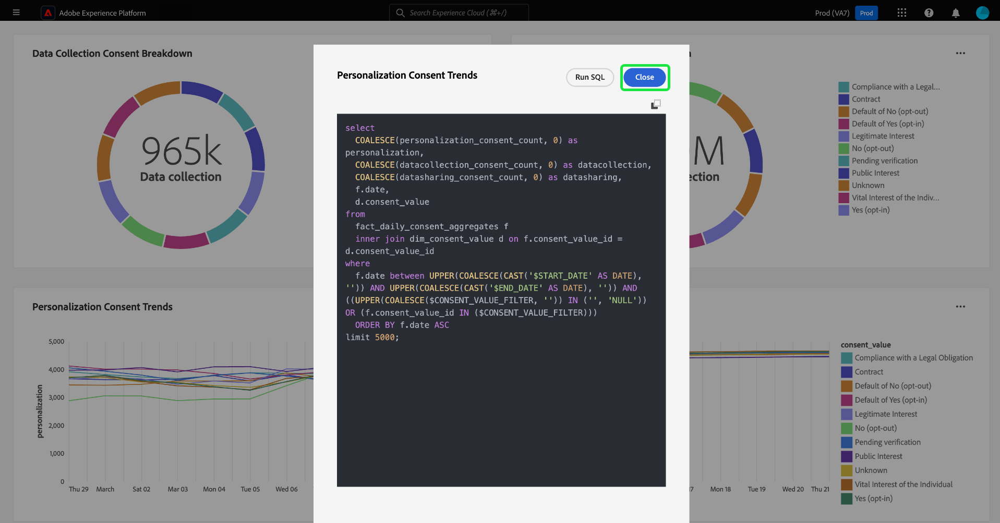

# SQL anzeigen {#view-sql}

Nachdem Sie mit dem [pro-Modus](./overview.md#query-pro-mode) eine [benutzerdefinierte Einsicht](./overview.md) erstellt haben, können Sie den SQL-Code anzeigen, der Ihre Diagramme mit der Funktion „SQL anzeigen“ füllt.

Wählen Sie im benutzerdefinierten Dashboard die Auslassungszeichen (`...`) eines beliebigen Widgets aus, um auf die Optionen [!UICONTROL Mehr anzeigen] und [!UICONTROL SQL anzeigen] zuzugreifen.

Um die SQL hinter Ihren benutzerdefinierten Einblicken anzuzeigen, wählen Sie die Option **[!UICONTROL SQL anzeigen]** aus. Das Dialogfeld wird mit dem Namen der Einsicht benannt. In dieser Ansicht können Sie die SQL in Ihre Zwischenablage kopieren, um sie als Grundlage für die zukünftige Diagrammerstellung im Abfragemodus zu verwenden, oder die SQL direkt im Abfrage-Editor öffnen. Wählen Sie **[!UICONTROL SQL ausführen]**, um die Abfrage im Abfrage-Editor zu öffnen.

Wählen Sie **[!UICONTROL Schließen]** aus, um das Dialogfeld zu schließen.

## Nächste Schritte

Nach dem Lesen dieses Dokuments wissen Sie jetzt, wie Sie die SQL hinter Ihren benutzerdefinierten Einblicken anzeigen können. Im Dokument Weitere Informationen erfahren Sie, wie Sie [Ihr benutzerdefiniertes Diagramm mit den tabellarischen Ergebnissen Ihrer SQL-Analyse vergleichen](./view-more.md).

Außerdem erfahren Sie mit dem Handbuch [ Design-Modus , wie Sie Diagramme aus vorhandenen Datenmodellen in der Adobe Experience Platform-Benutzeroberfläche ](../standard-dashboards.md).
