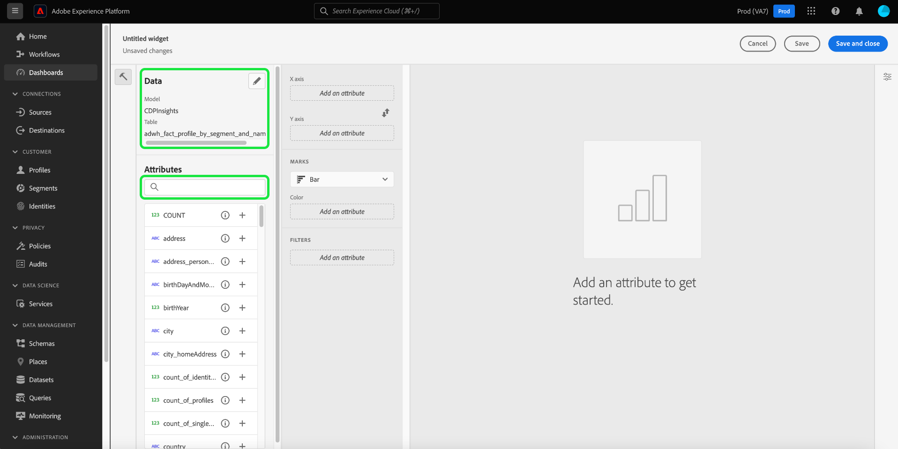
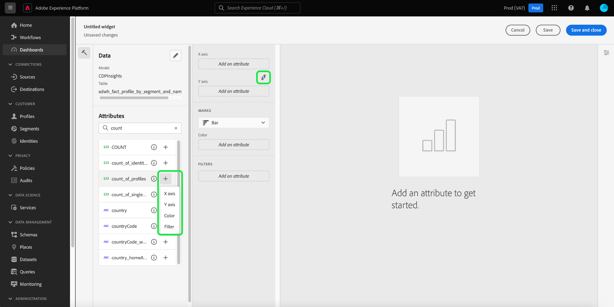
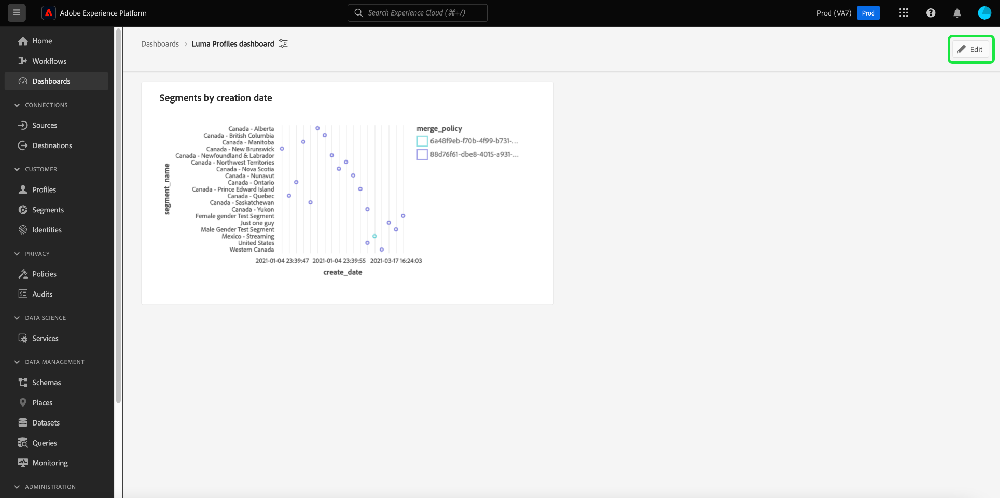
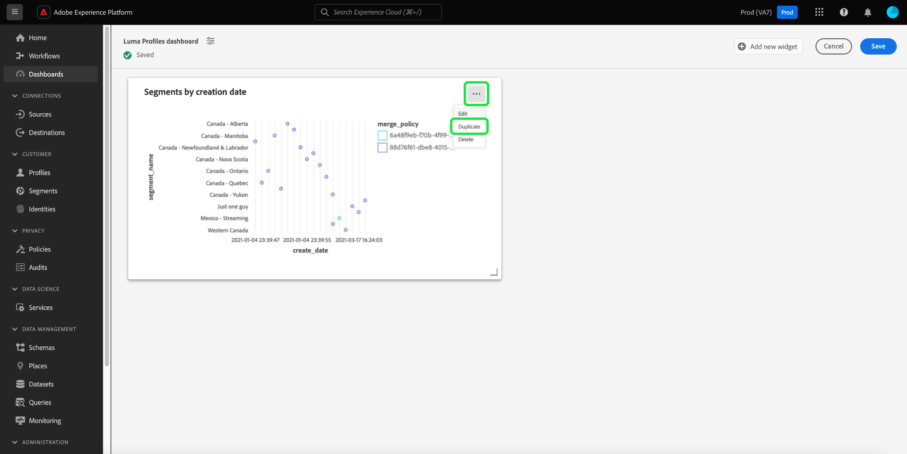

# Standard-Dashboards

Verwenden Sie Adobe Experience Platform-Dashboards, um Einblicke zu beschleunigen und die Visualisierung über die Dashboards-Funktion anzupassen. Mit dieser Funktion können Sie benutzerdefinierte Dashboards erstellen und verwalten, in denen Sie benutzerspezifische Widgets erstellen, hinzufügen und bearbeiten können, um wichtige Metriken für Ihr Unternehmen zu visualisieren.

<!-- Getting started / permissions section commented out for Beta. This will be necessary after GA only

## Getting started

To view dashboards in Adobe Experience Platform you must have the appropriate permissions enabled. Please read the [dashboards permissions documentation](./permissions.md#available-permissions) to learn how to grant users the ability to view, edit, and update Experience Platform dashboards using Adobe Admin Console. If you do not have administrator privileges for your organization, contact your product administrator to obtain the required permissions. -->

## Benutzerdefiniertes Dashboard erstellen

Um ein benutzerdefiniertes Dashboard zu erstellen, navigieren Sie zunächst zum Dashboard-Inventar. Wählen Sie **[!UICONTROL Dashboards]** aus dem linken Navigationsbereich der Platform-Benutzeroberfläche gefolgt von **[!UICONTROL Dashboard erstellen]**.

Bevor Sie ein benutzerdefiniertes Dashboard hinzufügen, ist der Dashboards-Bestand leer und zeigt &quot;Keine Dashboards gefunden&quot;an. Nachricht. Nach der Erstellung werden all Ihre Dashboards im Dashboard-Inventar aufgelistet.

<!-- >[!NOTE]
>
>To edit an existing dashboard, select the dashboard name from the inventory list followed by the pencil icon ()
>{width="100" zoomable="yes"} -->

Das Dialogfeld [!UICONTROL Dashboard erstellen] wird angezeigt. Geben Sie einen benutzerfreundlichen, beschreibenden Namen für die Sammlung von Widgets ein, die Sie erstellen möchten, und wählen Sie **[!UICONTROL Speichern]** aus.

Benutzer, die die Data Distiller-SKU erworben haben, können benutzerdefinierte SQL-Abfragen verwenden, um ihre Einblicke zu erstellen. Anweisungen zu diesem Workflow finden Sie in der [Übersicht über den Abfragepro-Modus](./sql-insights-query-pro-mode/overview.md) .

Das neu erstellte leere Dashboard wird mit Ihrem Namen in der oberen linken Ecke der Ansicht angezeigt.

## Erstellen eines Widgets {#create-widget}

>[!CONTEXTUALHELP]
>id="platform_dashboards_udd_maxwidgets"
>title="Maximale Anzahl an Widgets"
>abstract="Dashboard-Service unterstützt bis zu zehn Widgets. Nachdem Sie zehn Widgets zu Ihrem Dashboard hinzugefügt haben, wird die Option [!UICONTROL Neues Widget hinzufügen] deaktiviert und ausgegraut."

Wählen Sie in der neuen Dashboard-Ansicht **[!UICONTROL Neues Widget hinzufügen]** aus, um den Erstellungsprozess für das Widget zu starten.

>[!IMPORTANT]
>
>Jedes Dashboard unterstützt bis zu zehn Widgets. Nachdem Sie zehn Widgets zu Ihrem Dashboard hinzugefügt haben, wird die Option [!UICONTROL Neues Widget hinzufügen] deaktiviert und ausgegraut.

### Widget Composer

Der Arbeitsbereich des Widget Composers wird angezeigt. Wählen Sie als Nächstes **[!UICONTROL Daten auswählen]** aus, um das Datenmodell auszuwählen, aus dem Sie Ihren Widgets Attribute hinzufügen möchten.

#### Datenmodell auswählen {#select-data-model}

Das Dialogfeld [!UICONTROL Datenmodell auswählen] wird angezeigt. Wählen Sie in der linken Spalte ein Datenmodell aus, um eine Vorschauliste aller verfügbaren Tabellen anzuzeigen. Das vorkonfigurierte Datenmodell für Real-time Customer Data Platform trägt den Namen [!UICONTROL CDPInsights].

>[!TIP]
>
>Wählen Sie das Informationssymbol (), um den vollständigen Namen des Datenmodells anzuzeigen, wenn es für die Anzeige in der Datenleiste zu lang ist.

Die Vorschauliste enthält Details zu den im Datenmodell enthaltenen Tabellen. Die nachstehende Tabelle enthält Beschreibungen der Spaltenfelder und ihrer potenziellen Werte.

| Spaltenfeld | Beschreibung |
|---|---|
| [!UICONTROL Titel] | Der Name der Tabelle. |
| [!UICONTROL Tabellentyp] | Der Typ der Tabelle. Mögliche Typen sind: `fact`, `dimension` und `none`. |
| [!UICONTROL Records] | Die Anzahl der der ausgewählten Tabelle zugeordneten Datensätze. |
| [!UICONTROL Suchvorgänge] | Die Anzahl der Tabellen, die mit der ausgewählten Tabelle verbunden sind. |
| [!UICONTROL Attribute] | Die Anzahl der Attribute für die ausgewählte Tabelle. |

Wählen Sie **[!UICONTROL Weiter]** aus, um Ihre Auswahl des Datenmodells zu bestätigen. In der nächsten Ansicht wird eine Liste der verfügbaren Tabellen in der linken Leiste angezeigt. Wählen Sie eine Tabelle aus, um eine umfassende Aufschlüsselung der in der ausgewählten Tabelle enthaltenen Daten anzuzeigen.

### Widget befüllen {#populate-widget}

Das Bedienfeld [!UICONTROL Vorschau] enthält Registerkarten für [!UICONTROL Beispieldatensätze] und [!UICONTROL Attribute]. Der Tab [!UICONTROL Beispieldatensätze] bietet eine Teilmenge der Datensätze aus der ausgewählten Tabelle in einer tabellarischen Ansicht. Die Registerkarte [!UICONTROL Attribute] enthält den Attributnamen, den Datentyp und die Quelltabelle für jedes Attribut, das mit der ausgewählten Tabelle verknüpft ist.

Wählen Sie eine Tabelle aus der Liste in der linken Leiste aus, um Daten für Ihr Widget bereitzustellen, und wählen Sie **[!UICONTROL Auswählen]** aus, um zum Widget Composer zurückzukehren.

Der Widget Composer enthält jetzt Daten aus Ihrer ausgewählten Tabelle.

Das Datenmodell und die aktuell ausgewählte Tabelle werden oben in der linken Leiste angezeigt und die zum Erstellen des Widgets verfügbaren Attribute werden in der Spalte [!UICONTROL Attribute] aufgeführt. Sie können die Suchleiste verwenden, um nach Attributen zu suchen, anstatt in der Liste zu scrollen, oder das ausgewählte Datenmodell ändern, indem Sie das Stiftsymbol () in der linken Leiste.

#### Hinzufügen und Filtern von Attributen {#add-and-filter-attributes}

Wählen Sie das Symbol zum Hinzufügen aus () neben einem Attributnamen, um Ihrem Widget ein Attribut hinzuzufügen. Über das angezeigte Dropdown-Menü können Sie ein Attribut als X-Achse, Y-Achse, Farbe oder Filter für Ihr Widget hinzufügen. Mit dem Attribut [!UICONTROL Farbe] können Sie die Ergebnisse der X- und Y-Achsenmarkierungen anhand der Farbe unterscheiden. Dies geschieht durch die Aufteilung der Ergebnisse in verschiedene Farben basierend auf ihrer Zusammensetzung eines dritten Attributs.

>[!TIP]
>
>Wenn Sie die Anordnung der X- und Y-Achse spiegeln möchten, wählen Sie das Pfeilsymbol nach oben und unten (), um ihre Anordnung zu wechseln.

Um den Diagrammtyp Ihres Widgets zu ändern, wählen Sie das Dropdown-Menü [!UICONTROL Markierungen] aus und wählen Sie aus den verfügbaren Optionen aus. Zu den Optionen gehören Balken, Punkte, Zecken, Linien oder Bereiche. Nach der Auswahl wird eine Vorschau-Visualisierung der aktuellen Einstellungen Ihres Widgets generiert.

Durch Hinzufügen eines Attributs als Filter können Sie auswählen, welche Werte aus dem Widget ein- oder ausgeschlossen werden sollen. Nachdem Sie einen Filter aus der Attributliste hinzugefügt haben, wird das Dialogfeld [!UICONTROL Filter] angezeigt, in dem Sie Werte mithilfe ihres Kontrollkästchens auswählen oder deren Auswahl aufheben können.

#### Filtern von historischen Daten {#filter-historical-data}

Um historische Daten aus den von Ihrem Widget generierten Einblicken herauszufiltern, fügen Sie das Attribut `date_key` als Filter hinzu und wählen Sie **[!UICONTROL Letztes Datum]** gefolgt von **[!UICONTROL Anwenden]** aus. Dieser Filter stellt sicher, dass die Daten, die zum Ableiten von Einblicken verwendet werden, aus dem neuesten Systemabbild übernommen werden.

![Das Dialogfeld [!UICONTROL Filter: date_key] mit dem Hinweis [!UICONTROL Letztes Datum] und [!UICONTROL Anwenden] wurde hervorgehoben.](./images/standard-dashboards/recent-date.png)

Alternativ können Sie einen benutzerdefinierten Zeitraum erstellen, nach dem Ihre Daten gefiltert werden sollen. Wählen Sie **[!UICONTROL Datum auswählen]** aus, um das Dialogfeld um eine Liste der verfügbaren Daten zu erweitern. Verwenden Sie das Kontrollkästchen **[!UICONTROL Alle auswählen]** , um alle verfügbaren Optionen zu aktivieren oder zu deaktivieren, oder aktivieren Sie das Kontrollkästchen für jeden Tag einzeln. Wählen Sie abschließend **[!UICONTROL Anwenden]** aus, um Ihre Auswahl zu bestätigen.

>[!NOTE]
>
>Wenn das Attribut `date_key` bereits als Filter hinzugefügt wurde, wählen Sie die Auslassungszeichen gefolgt von **[!UICONTROL Bearbeiten]** aus den Dropdown-Optionen aus, um den Filterzeitraum zu ändern.

![Das Dialogfeld [!UICONTROL Filter: date_key] mit den einzelnen Tag-Kontrollkästchen, sowohl aktiviert als auch deaktiviert.](./images/standard-dashboards/select-dates.png)

### Widget-Eigenschaften

Wählen Sie das Eigenschaftensymbol () in der rechten Leiste, um den Eigenschaftenbereich zu öffnen. Geben Sie im Bereich [!UICONTROL Eigenschaften] im Textfeld [!UICONTROL Widget-Titel] einen Namen für das Widget ein.

Über das Bedienfeld &quot;Widget-Eigenschaften&quot;können Sie verschiedene Aspekte Ihres Widgets bearbeiten. Sie haben die vollständige Kontrolle, um den Speicherort der Widget-Legende zu bearbeiten. Um die Legende zu verschieben, wählen Sie das Dropdown-Menü [!UICONTROL Legendenplatzierung] aus und wählen Sie Ihre gewünschte Position aus der Liste der verfügbaren Optionen aus. Sie können auch die mit der Legende verknüpfte Beschriftung und die X- oder Y-Achse umbenennen, indem Sie einen neuen Namen in das Textfeld [!UICONTROL Legendentitel] bzw. in das Textfeld [!UICONTROL Achsenbeschriftung] eingeben.

#### Widget speichern {#save-widget}

Durch das Speichern im Widget Composer wird das Widget lokal in Ihrem Dashboard gespeichert. Wenn Sie Ihre Arbeit speichern und zu einem späteren Zeitpunkt fortsetzen möchten, wählen Sie **[!UICONTROL Speichern]**. Ein Häkchen-Symbol unter dem Widget-Namen zeigt an, dass das Widget gespeichert wurde. Wenn Sie mit Ihrem Widget zufrieden sind, wählen Sie alternativ **[!UICONTROL Speichern und schließen]** , um das Widget allen anderen Benutzern mit Zugriff auf Ihr Dashboard zur Verfügung zu stellen. Wählen Sie **[!UICONTROL Abbrechen]** aus, um Ihre Arbeit abzubrechen und zu Ihrem benutzerdefinierten Dashboard zurückzukehren.

>[!TIP]
>
>Wählen Sie das Eigenschaftensymbol () neben dem Dashboard-Namen, um Details zur Erstellung anzuzeigen. Sie können den Namen Ihres Dashboards im angezeigten Dialogfeld ändern.

Widgets können in diesem Arbeitsbereich neu angeordnet und in der Größe angepasst werden. Wählen Sie **[!UICONTROL Speichern]** aus, um den Dashboard-Namen und das konfigurierte Layout beizubehalten.

Um sicherzustellen, dass jede Abfrage für ein Adobe Real-time Customer Data Platform Insights-Dashboard über genügend Ressourcen verfügt, um effizient auszuführen, verfolgt die API die Ressourcennutzung, indem sie jeder Abfrage Gleichzeitigkeitsfenster zuweist. Das System kann bis zu vier gleichzeitige Abfragen verarbeiten. Daher stehen vier gleichzeitige Abfrageplätze jederzeit zur Verfügung. Abfragen werden basierend auf gleichzeitigen Slots in eine Warteschlange gestellt und dann in der Warteschlange gewartet, bis genügend gleichzeitige Slots verfügbar sind.

### Widget bearbeiten, duplizieren oder löschen {#duplicate}

Nachdem Sie ein Widget erstellt haben, können Sie ganze Widgets bearbeiten, duplizieren oder aus Ihrem benutzerdefinierten Dashboard löschen.

>[!TIP]
>
>Um zwischen vorhandenen benutzerdefinierten Dashboards zu wechseln, wählen Sie in der linken Navigationsleiste Dashboards aus und wählen Sie dann den Dashboard-Namen aus der Inventarliste aus.

Wählen Sie das Stiftsymbol () oben rechts im benutzerdefinierten Dashboard, um in den Bearbeitungsmodus zu wechseln.

Wählen Sie dann die Auslassungszeichen oben rechts im Widget aus, das Sie bearbeiten, kopieren oder löschen möchten. Wählen Sie die entsprechende Aktion aus dem Dropdown-Menü aus.

>[!NOTE]
>
>Mit der Duplizierung können Sie die Attribute eines Insight anpassen, um ein eindeutiges Widget zu erstellen, ohne von Grund auf neu beginnen zu müssen. Wenn Sie ein Widget duplizieren, wird es in Ihrem benutzerdefinierten Dashboard angezeigt. Anschließend können Sie die Auslassungszeichen Ihres neuen Widgets und anschließend die Auslassungspunkte **[!UICONTROL Bearbeiten]** auswählen, um Ihre Einblicke anzupassen.

## Nächste Schritte und zusätzliche Ressourcen

Durch Lesen dieses Dokuments können Sie besser verstehen, wie Sie ein benutzerdefiniertes Dashboard erstellen und benutzerdefinierte Widgets für dieses Dashboard erstellen, bearbeiten und aktualisieren.

Informationen zu den verfügbaren vorkonfigurierten Metriken und Visualisierungen für die Dashboards [Profile](./guides/profiles.md#standard-widgets), [Segmente](./guides/audiences.md#standard-widgets) und [Ziele](./guides/destinations.md#standard-widgets) finden Sie in der Liste der Standard-Widgets in der entsprechenden Dokumentation.

Sehen Sie sich das folgende Video an, um Ihr Verständnis von Dashboards im Experience Platform zu verbessern:

>[!VIDEO](https://video.tv.adobe.com/v/3409637?quality=12&learn=on)
