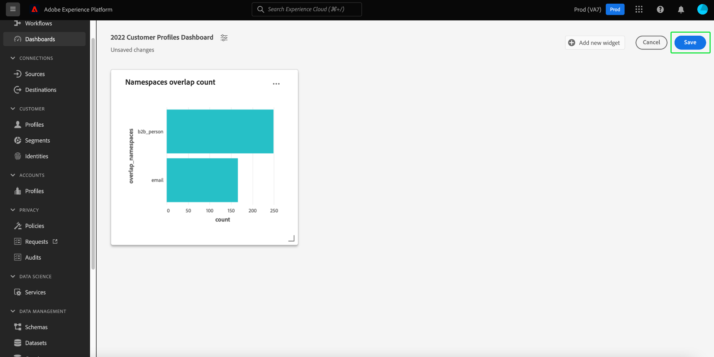

# Benutzerdefinierte Dashboards (Beta)

>[!IMPORTANT]
>
>Die benutzerdefinierte Dashboards-Funktion befindet sich in der Beta-Phase. Die Funktionen und Dokumentation können sich ändern.

Adobe Experience Platform-Dashboards helfen Ihnen, Einblicke zu beschleunigen und die Visualisierung über die benutzerdefinierte Dashboards-Funktion anzupassen. Mit dieser Funktion können Sie benutzerdefinierte Dashboards erstellen und verwalten, in denen Sie benutzerspezifische Widgets erstellen, hinzufügen und bearbeiten können, um für Ihr Unternehmen relevante Schlüsselmetriken zu visualisieren.

## Erste Schritte

Um Dashboards in Adobe Experience Platform anzeigen zu können, müssen Sie über die entsprechenden Berechtigungen verfügen. Bitte lesen Sie die [Dokumentation zu Dashboards-Berechtigungen](./permissions.md#available-permissions) Hier erfahren Sie, wie Sie Benutzern die Möglichkeit geben, Experience Platformen-Dashboards mit Adobe Admin Console anzuzeigen, zu bearbeiten und zu aktualisieren. Wenn Sie keine Administratorberechtigungen für Ihr Unternehmen haben, wenden Sie sich an Ihren Produktadministrator, um die erforderlichen Berechtigungen zu erhalten.

## Benutzerdefinierte Dashboards erstellen

Um ein benutzerdefiniertes Dashboard zu erstellen, navigieren Sie zunächst zum Dashboard-Inventar. Auswählen **[!UICONTROL Dashboards]** aus der linken Navigation der Platform-Benutzeroberfläche gefolgt von **[!UICONTROL Dashboard erstellen]**.

Weitere Informationen zu den verfügbaren vorkonfigurierten Dashboards finden Sie unter [Übersicht über das Dashboard-Inventar](./inventory.md).

>[!NOTE]
>
>Durch Hinzufügen eines benutzerdefinierten Dashboards wird die Liste der vorkonfigurierten Dashboards aus dem Dashboard-Inventar entfernt. Stattdessen umfasst das Dashboard-Inventar ausschließlich benutzerdefinierte Dashboards.

Die [!UICONTROL Dashboard erstellen] angezeigt. Geben Sie einen benutzerfreundlichen, beschreibenden Namen für die Sammlung von Widgets ein, die Sie erstellen möchten, und wählen Sie **[!UICONTROL Speichern]**.

Das neu erstellte leere Dashboard wird mit Ihrem Namen in der oberen linken Ecke der Ansicht angezeigt.

## Widget erstellen

Wählen Sie in der neuen Dashboard-Ansicht **[!UICONTROL Neues Widget hinzufügen]** , um den Erstellungsprozess für Widgets zu starten.

### Widget Composer

Der Arbeitsbereich des Widget Composers wird angezeigt. Wählen Sie als Nächstes **[!UICONTROL Daten auswählen]** , um das Datenmodell auszuwählen, aus dem Sie Ihren Widgets Attribute hinzufügen möchten.

Die [!UICONTROL Daten auswählen] angezeigt. Wählen Sie in der linken Spalte ein Datenmodell aus, um eine Vorschauliste aller verfügbaren Tabellen anzuzeigen.

>[!NOTE]
>
>Benutzerdefinierte Dashboards unterstützen derzeit nur das Profildatenmodell. Weitere Optionen werden unterstützt.

Die Vorschauliste enthält Details zu den im Datenmodell enthaltenen Tabellen. Die nachstehende Tabelle enthält Beschreibungen der Spaltenfelder und ihrer potenziellen Werte.

| Spaltenfeld | Beschreibung |
|---|---|
| [!UICONTROL Titel] | Der Name der Tabelle. |
| [!UICONTROL Tabellenart] | Der Typ der Tabelle. Mögliche Typen sind: `fact`, `dimension`und `none`. |
| [!UICONTROL Suchen] | Die Anzahl der Tabellen, die mit der ausgewählten Tabelle verbunden sind. |

Auswählen **[!UICONTROL Nächste]** zur Bestätigung Ihrer Wahl des Datenmodells. In der nächsten Ansicht wird eine Liste der verfügbaren Tabellen in der linken Leiste angezeigt. Wählen Sie eine Tabelle aus, um eine umfassende Aufschlüsselung der in der ausgewählten Tabelle enthaltenen Daten anzuzeigen.

Die [!UICONTROL Vorschau] Bereich enthält Registerkarten für [!UICONTROL Beispieldatensätze] und [!UICONTROL Attribute].Die [!UICONTROL Beispieldatensätze] bietet eine Teilmenge der Datensätze aus der ausgewählten Tabelle in einer tabellarischen Ansicht. Die [!UICONTROL Attribute] tab stellt den Attributnamen, den Datentyp und die Quelltabelle für jedes Attribut bereit, das mit der ausgewählten Tabelle verknüpft ist.

Wählen Sie eine Tabelle aus der Liste in der linken Leiste aus, um Daten für Ihr Widget bereitzustellen, und wählen Sie [!UICONTROL Auswählen] , um zum Widget Composer zurückzukehren.

Der Widget Composer enthält jetzt Daten aus Ihrer ausgewählten Tabelle.

Das Datenmodell und die aktuell ausgewählte Tabelle werden oben in der linken Leiste angezeigt und die zum Erstellen Ihres Widgets verfügbaren Attribute werden in der Spalte &quot;Attribute&quot;aufgeführt.

>[!TIP]
>
>Sie können das ausgewählte Datenmodell ändern, indem Sie das Stiftsymbol () in der linken Leiste.

Wählen Sie die Auslassungszeichen (`...`) neben einem Attributnamen, um ein Attribut zur X- oder Y-Achse hinzuzufügen.

Wählen Sie als Nächstes den Diagrammtyp aus der [!UICONTROL Marken] Dropdown-Liste, um eine Vorschau der aktuellen Einstellungen Ihres Widgets zu erzeugen. Im [!UICONTROL Eigenschaften] auf der rechten Seite des Bildschirms einen Namen für das Widget in der [!UICONTROL Widget title] Textfeld.

Wenn Sie mit Ihrem Widget zufrieden sind, wählen Sie **[!UICONTROL Speichern]**. Ein Häkchen-Symbol unter dem Widget-Namen zeigt an, dass das Widget gespeichert wurde.

>[!NOTE]
>
>Durch das Speichern im Widget Composer wird das Widget lokal in Ihrem Dashboard gespeichert. Wenn Sie den Dashboard-Editor beenden, ohne das Dashboard zu speichern, wird das Widget nicht im Dashboard gespeichert.

Auswählen **[!UICONTROL Abbrechen]** , um zu Ihrem benutzerdefinierten Dashboard zurückzukehren.

>[!TIP]
>
>Wählen Sie das Einstellungssymbol neben dem Dashboard-Namen aus, um Details zur Erstellung anzuzeigen. Sie können den Namen Ihres Dashboards im angezeigten Dialogfeld ändern.

Widgets können in diesem Arbeitsbereich neu angeordnet und in der Größe angepasst werden. Auswählen **[!UICONTROL Speichern]** um Ihren Dashboard-Namen und Ihr konfiguriertes Layout beizubehalten.

## Nächste Schritte

Durch Lesen dieses Dokuments können Sie besser verstehen, wie Sie ein benutzerdefiniertes Dashboard erstellen und benutzerdefinierte Widgets für dieses Dashboard erstellen, bearbeiten und aktualisieren.

So ermitteln Sie die verfügbaren vorkonfigurierten Metriken und Visualisierungen für die [profiles](./guides/profiles.md#standard-widgets), [Segmente](./guides/segments.md#standard-widgets)und [Ziele](./guides/destinations.md#standard-widgets) -Dashboards finden Sie in der entsprechenden Dokumentation eine Liste der Standard-Widgets.

