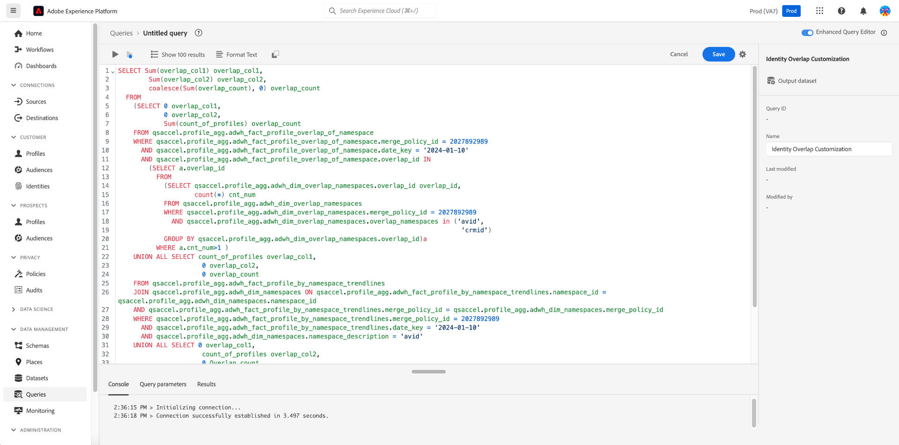

# Insight SQL anzeigen

Verwenden Sie die Funktion [!UICONTROL SQL anzeigen], um die SQL hinter Ihrem Profil, Ihrer Audience, Ihrem Ziel und Ihren benutzerdefinierten Einblicken anzuzeigen und die Abfrage bei Bedarf über den Abfrage-Editor auszuführen. Nutzen Sie die Inspiration aus dem SQL-Code von über 40 vorhandenen Einblicken, um neue Abfragen zu erstellen, die basierend auf Ihren Geschäftsanforderungen eindeutige Einblicke aus Experience Platform-Daten gewinnen.

## Navigieren zur Dashboard-Übersicht {#navigate-to-overview}

Um das ausgewählte Dashboard zu öffnen, wählen Sie entweder **[!UICONTROL Profile]**, **[!UICONTROL Zielgruppen]** oder **[!UICONTROL Ziele]** aus der linken Navigationsleiste aus. Wählen Sie als Nächstes **[!UICONTROL Überblick]** auf den Registerkartenoptionen aus, wenn der Arbeitsbereich nicht automatisch angezeigt wird.

Wählen Sie alternativ **[!UICONTROL Dashboards]** im linken Navigationsbereich aus, gefolgt vom Namen des benutzerdefinierten Dashboards. Die Übersicht über Ihr benutzerdefiniertes Dashboard wird angezeigt.

![Die Experience Platform-Benutzeroberfläche mit [!UICONTROL Profilen], [!UICONTROL Zielgruppen], [!UICONTROL Ziele] und [!UICONTROL Dashboards] hervorgehoben.](./images/view-sql/dashboard-navigation.png)

## SQL-Umschalter anzeigen {#toggle}

In der Übersicht der Profil-, Zielgruppen-, Ziel- und benutzerdefinierten Dashboards ist ein Umschalter verfügbar, um die Funktion zu aktivieren oder zu deaktivieren.

>[!NOTE]
>
>Wenn Sie den Umschalter [!UICONTROL SQL anzeigen] aktivieren, können Sie globale Filter und Filter auf Widget-Ebene erst ändern, wenn Sie die Funktion deaktivieren.

![Der Umschalter [!UICONTROL SQL anzeigen] ist hervorgehoben.](./images/view-sql/view-sql-toggle.png)

Aktivieren Sie den Umschalter, um [!UICONTROL SQL anzeigen] Text auf jeder einzelnen insight anzuzeigen.

![Eine insight mit hervorgehobener [!UICONTROL SQL anzeigen].](./images/view-sql/insight-view-sql.png)

Wählen Sie **[!UICONTROL SQL anzeigen]**, um ein Dialogfeld zu öffnen, das die SQL des Widgets enthält.

## SQL-Dialog {#sql-dialog}

Es wird ein Dialogfeld angezeigt, das den Titel der insight und die SQL enthält, die sie generiert.

>[!TIP]
>
>Sie können die gesamte SQL-Anweisung in die Zwischenablage kopieren, indem Sie das Kopiersymbol () oben rechts im Dialogfeld.

Wählen Sie **[!UICONTROL SQL ausführen]**, um den Abfrage-Editor zu öffnen, in dem die Abfrage vorausgefüllt ist.

![Ein insight-Dialogfeld mit hervorgehobenem [!UICONTROL SQL ausführen].](./images/view-sql/run-sql.png)

## Vorhandene SQL bearbeiten {#edit-sql}

Der Abfrage-Editor wird angezeigt. Sie können jetzt die Anweisung bearbeiten und Ihre Platform-Daten auf eine Weise abfragen, die Ihren Reporting-Anforderungen besser entspricht. Speichern Sie die neue Abfragevorlage unter einem geeigneten Namen.

## Nächste Schritte

Nach dem Lesen dieses Dokuments wissen Sie jetzt, wie Sie in den Standard-Dashboards oder einem benutzerdefinierten Dashboard für jede insight auf die SQL zugreifen können. Wenn Sie dies noch nicht getan haben, sollten Sie das [Real-Time Customer Data Platform Insights-Datenmodell-Dokument lesen](./data-models/cdp-insights-data-model-b2c.md). Dieses Dokument enthält Einblicke in die Anpassung von SQL-Vorlagen für Real-Time CDP-Berichte, die auf Ihre Marketing- und KPI-Anforderungen zugeschnitten sind.
