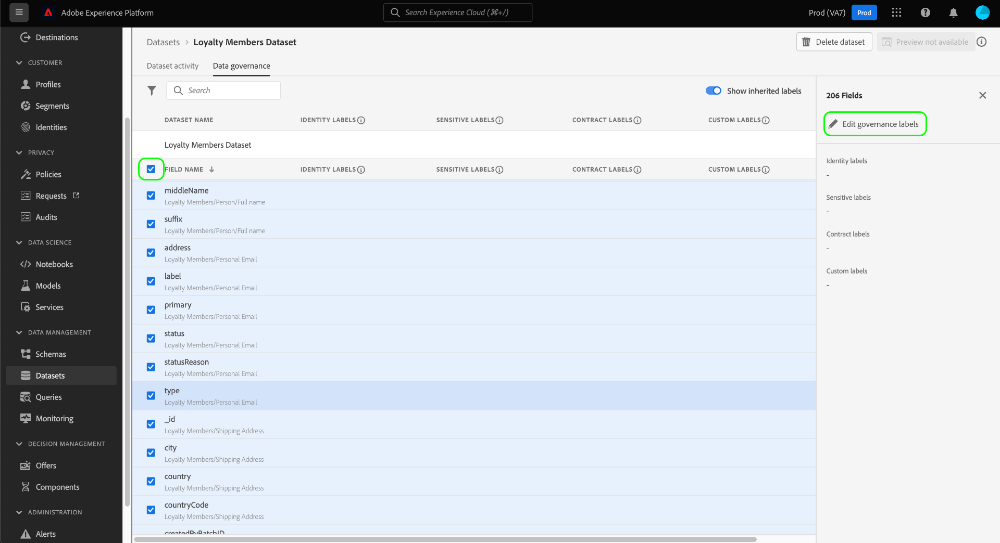
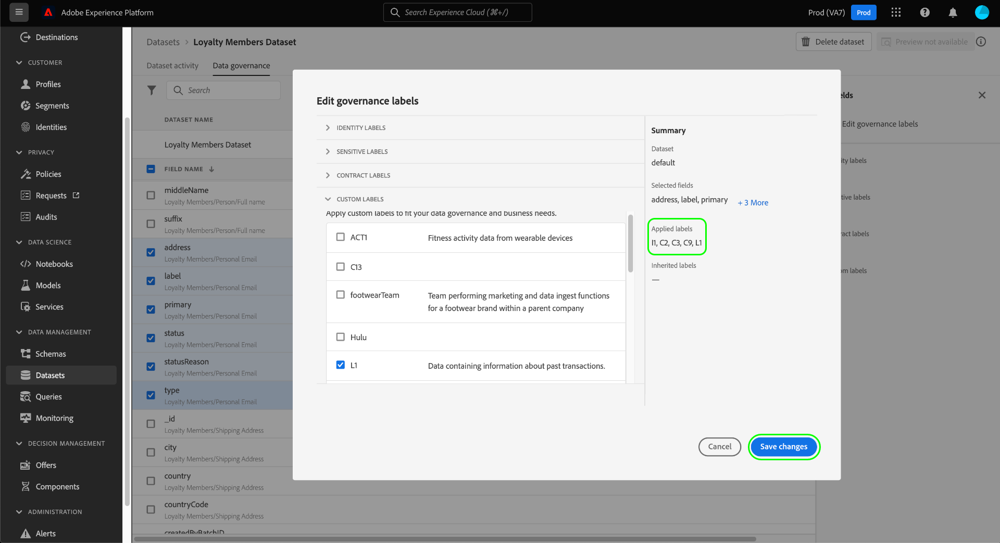

# Data Governance - End-to-End-Handbuch

Um zu steuern, welche Marketing-Aktionen für bestimmte Datensätze und Felder in Adobe Experience Platform durchgeführt werden können, müssen Sie Folgendes einrichten:

1. [Anwenden von Beschriftungen](#labels) auf die Datensätze und Felder, deren Nutzung Sie beschränken möchten.
1. [Data Governance-Richtlinien konfigurieren und aktivieren](#policy) bestimmt, welche Arten von gekennzeichneten Daten für bestimmte Marketing-Aktionen verwendet werden können.
1. [Anwenden von Marketing-Aktionen auf Ihre Ziele](#destinations) , um anzugeben, welche Richtlinien für an diese Ziele gesendete Daten gelten.

Nachdem Sie die Konfiguration Ihrer Bezeichnungen, Richtlinien und Marketing-Aktionen abgeschlossen haben, können Sie [Testen der Richtliniendurchsetzung](#test) um sicherzustellen, dass sie erwartungsgemäß funktioniert.

Dieses Handbuch führt Sie durch den gesamten Prozess der Konfiguration und Durchsetzung einer Data Governance-Richtlinie in der Platform-Benutzeroberfläche. Weitere Informationen zu den in diesem Handbuch verwendeten Funktionen finden Sie in der Übersichtsdokumentation zu den folgenden Themen:

* [Adobe Experience Platform Data Governance](./home.md)
* [Datennutzungsbezeichnungen](./labels/overview.md)
* [Datennutzungsrichtlinien](./policies/overview.md)
* [Durchsetzung von Richtlinien](./enforcement/overview.md)

## Anwenden von Beschriftungen {#labels}

Wenn es einen bestimmten Datensatz gibt, für den Sie Datennutzungsbeschränkungen erzwingen möchten, können Sie [Anwenden von Bezeichnungen direkt auf diesen Datensatz](#dataset-labels) oder bestimmte Felder in diesem Datensatz.

Alternativ können Sie [Anwenden von Bezeichnungen auf ein Schema](#schema-labels) sodass alle auf diesem Schema basierenden Datensätze dieselben Bezeichnungen übernehmen.

>[!NOTE]
>
>Weitere Informationen zu den verschiedenen Datennutzungsbezeichnungen und deren Verwendungszweck finden Sie in der [Referenz zu Datennutzungsbezeichnungen](./labels/reference.md). Wenn die verfügbaren Kernbezeichnungen nicht alle Ihrer gewünschten Anwendungsfälle abdecken, können Sie [eigene benutzerdefinierte Beschriftungen definieren](./labels/user-guide.md#manage-custom-labels) sowie

### Anwenden von Kennzeichnungen auf einen Datensatz {#dataset-labels}

Auswählen **[!UICONTROL Datensätze]** Wählen Sie im linken Navigationsbereich den Namen des Datensatzes aus, auf den Sie Beschriftungen anwenden möchten. Sie können optional das Suchfeld verwenden, um die Liste der angezeigten Datensätze einzugrenzen.

Die Detailansicht für den Datensatz wird angezeigt. Wählen Sie die **[!UICONTROL Data Governance]** um eine Liste der Felder des Datensatzes und aller Bezeichnungen anzuzeigen, die bereits auf sie angewendet wurden. Aktivieren Sie die Kontrollkästchen neben den Feldern, denen Sie Beschriftungen hinzufügen möchten, und wählen Sie dann **[!UICONTROL Bearbeiten von Governance-Titeln]** in der rechten Leiste.

>[!NOTE]
>
>Wenn Sie dem gesamten Datensatz Bezeichnungen hinzufügen möchten, aktivieren Sie das Kontrollkästchen neben **[!UICONTROL Feldname]** Alle Felder vor der Auswahl markieren **[!UICONTROL Bearbeiten von Governance-Titeln]**.
>
>

Wählen Sie im nächsten Dialogfeld die Beschriftungen aus, die Sie auf die zuvor ausgewählten Datensatzfelder anwenden möchten. Wenn Sie fertig sind, wählen Sie **[!UICONTROL Änderungen speichern]**.

Gehen Sie wie oben beschrieben vor, um bei Bedarf Beschriftungen auf verschiedene Felder (oder Datensätze) anzuwenden. Wenn Sie fertig sind, können Sie mit dem nächsten Schritt von [Data Governance-Richtlinien aktivieren](#policy).

### Anwenden von Bezeichnungen auf ein Schema {#schema-labels}

Auswählen **[!UICONTROL Schemas]** Wählen Sie im linken Navigationsbereich das Schema aus, dem Sie Beschriftungen hinzufügen möchten.

>[!TIP]
>
>Wenn Sie nicht sicher sind, welches Schema für einen bestimmten Datensatz gilt, wählen Sie **[!UICONTROL Datensätze]** im linken Navigationsbereich und wählen Sie dann den Link unter dem **[!UICONTROL Schema]** Spalte für den gewünschten Datensatz. Wählen Sie den Schemanamen im Popover aus, der angezeigt wird, um das Schema im Schema Editor zu öffnen.
>
>

Die Struktur des Schemas wird im Schema-Editor angezeigt. Wählen Sie von hier aus die **[!UICONTROL Bezeichnungen]** um eine Listenansicht der Schemafelder und der bereits auf sie angewendeten Bezeichnungen anzuzeigen. Aktivieren Sie die Kontrollkästchen neben den Feldern, denen Sie Beschriftungen hinzufügen möchten, und wählen Sie dann **[!UICONTROL Bearbeiten von Governance-Titeln]** in der rechten Leiste.

>[!NOTE]
>
>Wenn Sie allen Feldern im Schema Beschriftungen hinzufügen möchten, wählen Sie das Stiftsymbol in der oberen Zeile aus.
>
>

Wählen Sie im nächsten Dialogfeld die Beschriftungen aus, die Sie auf die zuvor ausgewählten Schemafelder anwenden möchten. Klicken Sie abschließend auf **[!UICONTROL Speichern]**.

Gehen Sie wie oben beschrieben vor, um bei Bedarf Beschriftungen für verschiedene Felder (oder Schemas) anzuwenden. Wenn Sie fertig sind, können Sie mit dem nächsten Schritt von [Data Governance-Richtlinien aktivieren](#policy).

## Data Governance-Richtlinien aktivieren {#policy}

Nachdem Sie Ihre Schemas und/oder Datensätze mit Bezeichnungen versehen haben, können Sie Data Governance-Richtlinien erstellen, die die Marketing-Aktionen einschränken, für die bestimmte Bezeichnungen verwendet werden können.

Auswählen **[!UICONTROL Richtlinien]** im linken Navigationsbereich eine Liste der von Adobe definierten Core-Richtlinien sowie aller zuvor von Ihrem Unternehmen erstellten benutzerdefinierten Richtlinien anzeigen.

Jede Kernbeschriftung verfügt über eine zugehörige Kernrichtlinie, die bei Aktivierung die entsprechenden Aktivierungseinschränkungen für alle Daten erzwingt, die diese Beschriftung enthalten. Um eine Kernrichtlinie zu aktivieren, wählen Sie sie aus der Liste aus und wählen Sie dann die **[!UICONTROL Richtlinienstatus]** Umschalten auf **[!UICONTROL Aktiviert]**.

Wenn die verfügbaren Core-Richtlinien nicht alle Ihre Anwendungsfälle abdecken (z. B. wenn Sie benutzerdefinierte Beschriftungen verwenden, die Sie unter Ihrem Unternehmen definiert haben), können Sie stattdessen eine benutzerdefinierte Richtlinie definieren. Aus dem **[!UICONTROL Richtlinien]** Arbeitsbereich, wählen Sie **[!UICONTROL Richtlinie erstellen]**.

![Bild, das die [!UICONTROL Richtlinie erstellen] Schaltfläche, die in der Benutzeroberfläche ausgewählt wird](./images/e2e/create-policy.png)

Es wird ein Popup angezeigt, in dem Sie aufgefordert werden, den zu erstellenden Richtlinientyp auszuwählen. Auswählen **[!UICONTROL Data Governance-Politik]**, wählen Sie **[!UICONTROL Weiter]**.

![Bild, das die [!UICONTROL Data Governance-Politik] Auswahl der Option](./images/e2e/governance-policy.png)

Geben Sie im nächsten Bildschirm eine **[!UICONTROL Name]** und optional **[!UICONTROL Beschreibung]** für die Richtlinie. Wählen Sie in der folgenden Tabelle die Beschriftungen aus, nach denen diese Richtlinie geprüft werden soll. Mit anderen Worten: Dies sind die Bezeichnungen, die die Richtlinie verhindert, für die Marketing-Aktion(n) verwendet wird, die Sie im nächsten Schritt angeben.

Wenn Sie mehrere Beschriftungen auswählen, können Sie mithilfe der Optionen in der rechten Leiste bestimmen, ob alle Beschriftungen vorhanden sein müssen, damit die Richtlinie Nutzungsbeschränkungen erzwingt oder ob nur eine der Beschriftungen vorhanden sein muss. Wenn Sie fertig sind, klicken Sie auf die Schaltfläche **[!UICONTROL Weiter]**.

Wählen Sie im nächsten Bildschirm die Marketing-Aktionen aus, für die diese Richtlinie die Verwendung der zuvor ausgewählten Bezeichnungen einschränkt. Klicken Sie auf **[!UICONTROL Weiter]**, um fortzufahren.

Der letzte Bildschirm zeigt eine Zusammenfassung der Details der Richtlinie und der Aktionen, die darauf beschränkt sind, für welche Beschriftungen sie gelten. Auswählen **[!UICONTROL Beenden]** , um die Richtlinie zu erstellen.

Die Richtlinie wird erstellt, aber auf [!UICONTROL Behinderte] Standardmäßig. Wählen Sie die Richtlinie aus der Liste aus und legen Sie die **[!UICONTROL Richtlinienstatus]** Umschalten auf **[!UICONTROL Aktiviert]** , um die Richtlinie zu aktivieren.

Führen Sie die oben beschriebenen Schritte aus, um die erforderlichen Richtlinien zu erstellen und zu aktivieren, bevor Sie mit dem nächsten Schritt fortfahren.

## Marketing-Aktionen für Ziele verwalten {#destinations}

Damit Ihre aktivierten Richtlinien genau bestimmen können, welche Daten für ein Ziel aktiviert werden können, müssen Sie diesem Ziel bestimmte Marketing-Aktionen zuweisen.

Angenommen, eine aktivierte Richtlinie verhindert Daten, die eine `C2` Beschriftung für die Marketing-Aktion &quot;[!UICONTROL Export in Dritte]&quot;. Beim Aktivieren von Daten für ein Ziel überprüft die Richtlinie, welche Marketing-Aktionen auf dem Ziel vorhanden sind. Wenn[!UICONTROL Export in Dritte]&quot;vorhanden ist, um Daten mit einer `C2` -Beschriftung zu einer Richtlinienverletzung führt. Wenn[!UICONTROL Export in Dritte]&quot;nicht vorhanden ist, wird die Richtlinie nicht für das Ziel erzwungen und Daten mit `C2` Etiketten können frei aktiviert werden.

Wann [Verbinden eines Ziels in der Benutzeroberfläche](../destinations/ui/connect-destination.md), die **[!UICONTROL Governance]** -Schritt im Workflow können Sie die Marketing-Aktionen auswählen, die für dieses Ziel gelten und letztendlich bestimmen, welche Data Governance-Richtlinien für das Ziel durchgesetzt werden.

## Durchsetzung von Testrichtlinien {#test}

Nachdem Sie Ihre Daten gekennzeichnet, Richtlinien zur Data Governance aktiviert und Ihren Zielen Marketing-Aktionen zugewiesen haben, können Sie testen, ob Ihre Richtlinien erwartungsgemäß durchgesetzt werden.

Wenn Sie die Einstellungen korrekt einrichten und versuchen, durch Ihre Richtlinien eingeschränkte Daten zu aktivieren, wird die Aktivierung automatisch verweigert und es wird eine Richtlinienverletzungsmeldung angezeigt, in der detaillierte Informationen zur Datenherkunft darüber enthalten sind, was die Verletzung verursacht hat.

Siehe Dokument unter [automatische Richtliniendurchsetzung](./enforcement/auto-enforcement.md) für Details zur Interpretation von Nachrichten zu Richtlinienverletzungen.

## Nächste Schritte

In diesem Handbuch wurden die erforderlichen Schritte zum Konfigurieren und Durchsetzen von Data Governance-Richtlinien in Ihren Aktivierungs-Workflows beschrieben. Weitere Informationen zu den in diesem Handbuch verwendeten Data Governance-Komponenten finden Sie in der folgenden Dokumentation:

* [Datennutzungsbezeichnungen](./labels/overview.md)
* [Datennutzungsrichtlinien](./policies/overview.md)
* [Durchsetzung von Richtlinien](./enforcement/overview.md)
