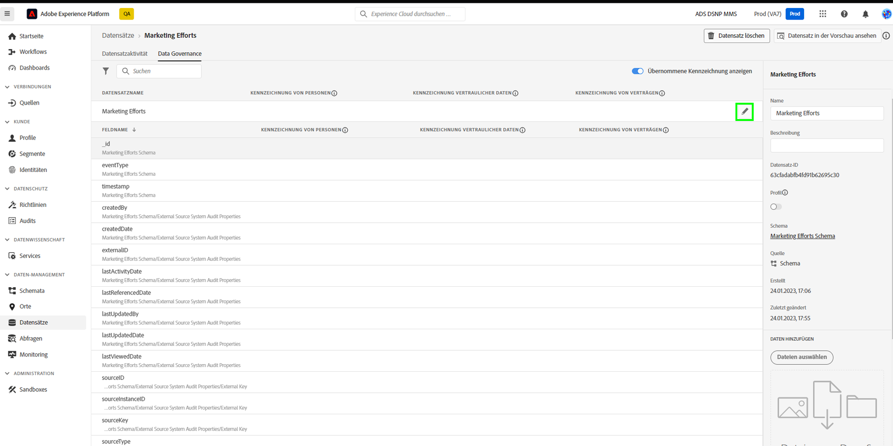
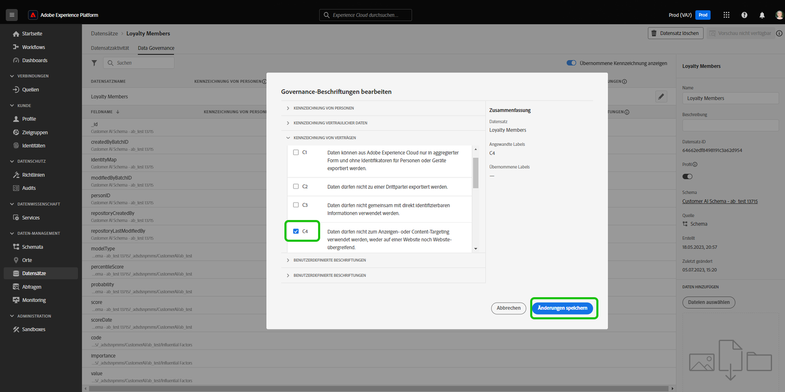
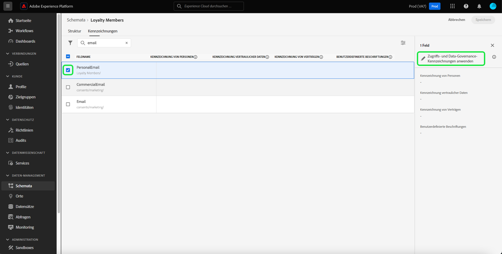
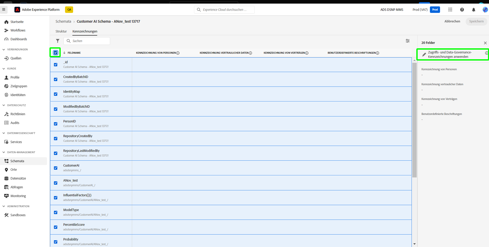
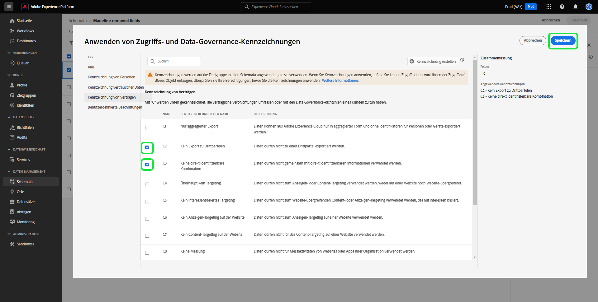
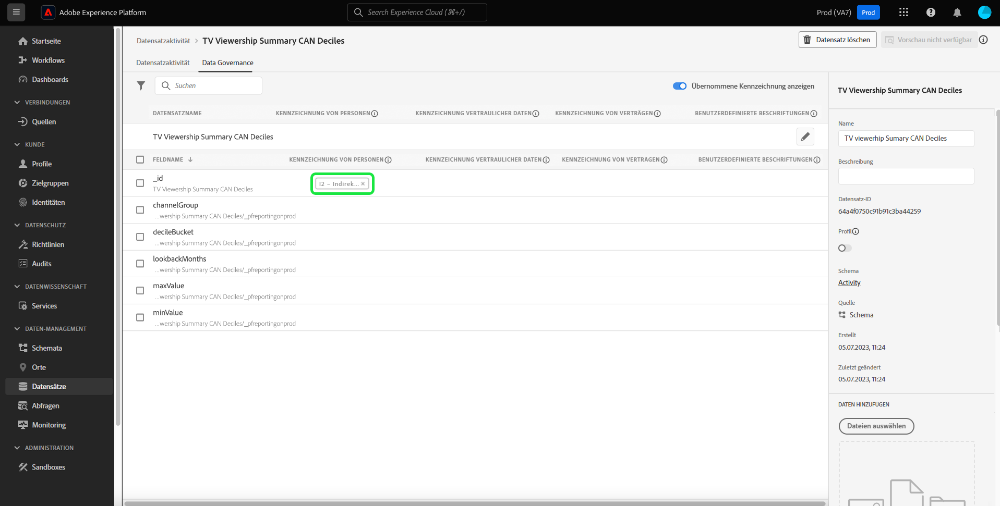
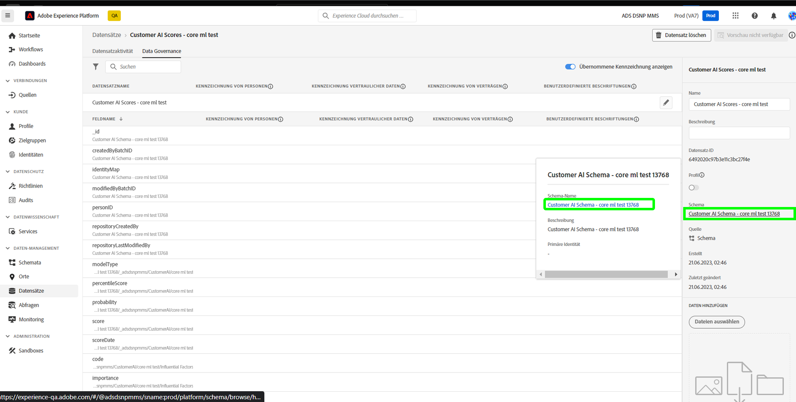

# Data Governance – End-to-End-Handbuch

Um zu steuern, welche Marketing-Aktionen für bestimmte Datensätze und Felder in Adobe Experience Platform durchgeführt werden können, müssen Sie Folgendes einrichten:

1. [Anwenden von Beschriftungen](#labels) zu den Schemafeldern oder ganzen Datensätzen, deren Verwendung Sie beschränken möchten.
1. [Konfigurieren und aktivieren Sie Data-Governance-Richtlinien](#policy), die festlegen, welche Arten von gekennzeichneten Daten für bestimmte Marketing-Aktionen verwendet werden können.
1. [Wenden Sie Marketing-Aktionen auf Ihre Ziele an](#destinations), um anzugeben, welche Richtlinien für Daten gelten, die an diese Ziele gesendet werden.

Sobald Sie die Konfiguration Ihrer Kennzeichnungen, Governance-Richtlinien und Marketing-Aktionen abgeschlossen haben, können Sie die [Durchsetzung Ihrer Richtlinien testen](#test), um sicherzustellen, dass sie wie erwartet funktionieren.

Dieses Handbuch führt Sie durch den gesamten Prozess der Konfiguration und Durchsetzung einer Data-Governance-Richtlinie in der Platform-Benutzeroberfläche. Weitere Informationen zu den in diesem Handbuch verwendeten Funktionen finden Sie in der Übersichtsdokumentation zu den folgenden Themen:

* [Data Governance in Adobe Experience Platform](./home.md)
* [Datennutzungskennzeichnungen](./labels/overview.md)
* [Datennutzungsrichtlinien](./policies/overview.md)
* [Durchsetzung von Richtlinien](./enforcement/overview.md)

>[!NOTE]
>
>In diesem Handbuch wird beschrieben, wie Sie Richtlinien für die Verwendung oder Aktivierung von Daten in Experience Platform einrichten und durchsetzen. Wenn Sie den **Zugriff** auf die Daten selbst für bestimmte Platform-Benutzende innerhalb Ihrer Organisation einschränken möchten, lesen Sie stattdessen das End-to-End-Handbuch zur [attributbasierten Zugriffssteuerung](../access-control/abac/end-to-end-guide.md). Die attributbasierte Zugriffssteuerung verwendet ebenfalls Beschriftungen und Kennzeichnungen, allerdings für einen anderen Anwendungsfall als Data Governance.

## Anwenden von Kennzeichnungen {#labels}

>[!IMPORTANT]
>
>Beschriftungen können nicht mehr auf einzelne Felder auf Datensatzebene angewendet werden. Dieser Workflow wird nicht mehr für die Anwendung von Bezeichnungen auf Schemaebene unterstützt. Sie können jedoch weiterhin einen ganzen Datensatz beschriften. Alle Bezeichnungen, die zuvor auf einzelne Datensatzfelder angewendet wurden, werden bis zum 31. Mai 2024 weiterhin über die Platform-Benutzeroberfläche unterstützt. Um sicherzustellen, dass Ihre Bezeichnungen über alle Schemas hinweg konsistent sind, müssen alle Bezeichnungen, die zuvor auf Datensatzebene an Felder angehängt wurden, von Ihnen im Laufe des kommenden Jahres auf Schemaebene migriert werden. Siehe Abschnitt zu [Migration zuvor angewendeter Bezeichnungen](#migrate-labels) für Anweisungen dazu.

Sie können [Anwenden von Bezeichnungen auf ein Schema](#schema-labels) sodass alle auf diesem Schema basierenden Datensätze dieselben Bezeichnungen übernehmen. Auf diese Weise können Sie die Bezeichnungen für Data Governance, Einwilligung und Zugriffskontrolle an einem Ort verwalten. Durch das Erzwingen von Datennutzungsbeschränkungen auf Schemaebene wird der Effekt auf alle Datensätze nachgelagert, die auf diesem Schema basieren. Auf Schemafeldebene angewendete Beschriftungen unterstützen Anwendungsfälle von Data Governance und können im Arbeitsbereich &quot;Datensätze&quot;gefunden werden [!UICONTROL Data Governance] Registerkarte unter [!UICONTROL Feldname] als schreibgeschützte Beschriftungen.

Wenn es einen bestimmten Datensatz gibt, für den Sie Einschränkungen bei der Datennutzung durchsetzen möchten, können Sie [Kennzeichnungen direkt auf diesen Datensatz anwenden](#dataset-labels) oder auf bestimmte Felder innerhalb dieses Datensatzes.

Alternativ können Sie [für ein Schema Kennzeichnungen anwenden](#schema-labels), sodass alle Datensätze, die auf diesem Schema basieren, dieselben Beschriftung übernehmen.

>[!NOTE]
>
>Weitere Informationen zu den verschiedenen Datennutzungskennzeichnungen und deren Verwendungszweck finden Sie in der [Referenz zu Datennutzungskennzeichnungen](./labels/reference.md). Wenn die verfügbaren Kernkennzeichnungen nicht alle Ihre gewünschten Anwendungsfälle abdecken, können Sie auch [Ihre eigenen benutzerdefinierten Kennzeichnungen definieren](./labels/user-guide.md#manage-custom-labels).

### Anwenden von Bezeichnungen auf einen ganzen Datensatz {#dataset-labels}

Wählen Sie in der linken Navigationsleiste **[!UICONTROL Datensätze]** und klicken Sie auf den Namen des Datensatzes, den Sie mit Kennzeichnungen versehen möchten. Sie können optional das Suchfeld verwenden, um die Liste der angezeigten Datensätze einzugrenzen.

Die Detailansicht für den Datensatz wird angezeigt. Wählen Sie die Registerkarte **[!UICONTROL Data Governance]**, um eine Liste der Felder des Datensatzes und der ihnen bereits zugewiesenen Kennzeichnungen anzuzeigen. Wählen Sie das Stiftsymbol aus, um die Bezeichnungen der Datensätze zu bearbeiten.

Die [!UICONTROL Bearbeiten von Governance-Titeln] angezeigt. Wählen Sie die entsprechende Governance-Bezeichnung aus und wählen Sie **[!UICONTROL Speichern]**.

### Anwenden von Kennzeichnungen auf ein Schema {#schema-labels}

Wählen Sie **[!UICONTROL Schema]** in der linken Navigationsleiste und klicken Sie dann in der Liste auf das Schema, dem Sie Kennzeichnungen hinzufügen möchten.

>[!TIP]
>
>Wenn Sie nicht sicher sind, welches Schema für einen bestimmten Datensatz gilt, wählen Sie in der linken Navigationsleiste **[!UICONTROL Datensätze]** und klicken dann auf den Link unter der Spalte **[!UICONTROL Schema]** für den gewünschten Datensatz. Wählen Sie den Namen des Schemas in dem Popup, das erscheint, um das Schema im Schema-Editor zu öffnen.
>
>

Die Struktur des Schemas wird im Schema-Editor angezeigt. Wählen Sie von hier aus die Registerkarte **[!UICONTROL Kennzeichnungen]**, um eine Listenansicht der Felder des Schemas und der ihnen bereits zugewiesenen Kennzeichnungen anzuzeigen. Aktivieren Sie die Kontrollkästchen neben den Feldern, denen Sie Beschriftungen hinzufügen möchten, und wählen Sie dann **[!UICONTROL Anwenden von Zugriffs- und Data Governance-Beschriftungen]** in der rechten Leiste.

>[!NOTE]
>
>Wenn Sie allen Feldern im Schema Kennzeichnungen hinzufügen möchten, wählen Sie das Stiftsymbol in der oberen Zeile aus.
>
>

Die [!UICONTROL Anwenden von Zugriffs- und Data Governance-Beschriftungen] angezeigt. Wählen Sie die Beschriftungen aus, die Sie auf das ausgewählte Schemafeld anwenden möchten. Klicken Sie abschließend auf **[!UICONTROL Speichern]**.

Gehen Sie wie oben beschrieben vor, um bei Bedarf Kennzeichnungen für verschiedene Felder (oder Schemata) anzuwenden. Wenn Sie fertig sind, können Sie mit dem nächsten Schritt fortfahren, indem Sie die [Data-Governance-Richtlinien aktivieren](#policy). 

### Zuvor auf Datensatzebene angewendete Bezeichnungen migrieren {#migrate-labels}

Auswählen **[!UICONTROL Datensatz]** Wählen Sie im linken Navigationsbereich den Namen des Datensatzes aus, aus dem Sie Bezeichnungen migrieren möchten. Sie können optional das Suchfeld verwenden, um die Liste der angezeigten Datensätze einzugrenzen.

Die Detailansicht für den Datensatz wird angezeigt. Wählen Sie die Registerkarte **[!UICONTROL Data Governance]**, um eine Liste der Felder des Datensatzes und der ihnen bereits zugewiesenen Kennzeichnungen anzuzeigen. Wählen Sie das Abbrechen-Symbol neben einer Beschriftung aus, die Sie aus einem Feld entfernen möchten. Ein Bestätigungsdialogfeld wird angezeigt, wählen Sie [!UICONTROL Beschriftung entfernen] um Ihre Auswahl zu bestätigen.

Nachdem Sie die Beschriftung aus dem Datensatzfeld entfernt haben, navigieren Sie zum Schema-Editor, um die Beschriftung zum Schema hinzuzufügen. Anweisungen hierzu finden Sie im Abschnitt [Abschnitt zum Anwenden von Bezeichnungen auf ein Schema](#schema-labels).

>[!TIP]
>
>Sie können den Schemanamen in der rechten Leiste auswählen, gefolgt vom Link im Dialogfeld, der angezeigt wird, um zum entsprechenden Schema zu navigieren.
>

Nachdem Sie die erforderlichen Beschriftungen migriert haben, stellen Sie sicher, dass Sie über die richtigen [Data Governance-Richtlinien aktiviert](#policy).

## Aktivieren von Data-Governance-Richtlinien {#policy}

Nachdem Sie Ihren Schemata und/oder Datensätzen Kennzeichnungen zugewiesen haben, können Sie Data-Governance-Richtlinien erstellen, welche die Marketing-Aktionen einschränken, für die bestimmte Kennzeichnungen verwendet werden können.

Wählen Sie im linken Navigationsbereich die Option **[!UICONTROL Richtlinien]** aus, um eine Liste der von Adobe definierten Kernrichtlinien sowie der benutzerdefinierten Richtlinien anzuzeigen, die zuvor von Ihrer Organisation erstellt wurden.

Jede Kernkennzeichnung hat eine zugehörige Kernrichtlinie, die, wenn sie aktiviert ist, die entsprechenden Aktivierungsbeschränkungen für alle Daten durchsetzt, die diese Kennzeichnung enthalten. Um eine Kernrichtlinie zu aktivieren, wählen Sie sie aus der Liste aus und legen Sie dann den Umschalter **[!UICONTROL Richtlinienstatus]** auf **[!UICONTROL Aktiviert]** fest.

Wenn die verfügbaren Kernrichtlinien nicht alle Ihre Anwendungsfälle abdecken (z. B. wenn Sie benutzerdefinierte Kennzeichnungen verwenden, die Sie in Ihrer Organisation definiert haben), können Sie stattdessen eine benutzerdefinierte Richtlinie definieren. Wählen Sie im Arbeitsbereich **[!UICONTROL Richtlinien]** die Option **[!UICONTROL Richtlinie erstellen]** aus.

![Bild der Schaltfläche [!UICONTROL Richtlinie erstellen], die in der Benutzeroberfläche ausgewählt wurde](./images/e2e/create-policy.png)

Es erscheint ein Pop-up, in dem Sie aufgefordert werden, die Art der Richtlinie, die Sie erstellen möchten, auszuwählen. Wählen Sie **[!UICONTROL Data-Governance-Richtlinien]** aus und klicken Sie auf **[!UICONTROL Weiter]**.

![Bild, das die ausgewählte Option [!UICONTROL Data-Governance-Richtlinien] zeigt](./images/e2e/governance-policy.png)

Geben Sie auf dem nächsten Bildschirm einen **[!UICONTROL Namen]** und optional eine **[!UICONTROL Beschreibung]** für die Richtlinie ein. Wählen Sie in der folgenden Tabelle die Kennzeichnungen aus, auf die diese Richtlinie prüfen soll. Es handelt sich also um die Kennzeichnungen, deren Verwendung für die Marketing-Aktion(en), die Sie im nächsten Schritt festlegen, durch die Richtlinie verhindert wird.

Wenn Sie mehrere Kennzeichnungen auswählen, können Sie mit den Optionen in der rechten Leiste festlegen, ob alle Kennzeichnungen vorhanden sein müssen, damit die Richtlinie Nutzungsbeschränkungen durchsetzen kann, oder ob nur eine der Kennzeichnungen vorhanden sein muss. Wenn Sie fertig sind, klicken Sie auf die Schaltfläche **[!UICONTROL Weiter]**.

Wählen Sie auf dem nächsten Bildschirm die Marketing-Aktionen aus, für die diese Richtlinie die Verwendung der zuvor ausgewählten Beschriftungen einschränken soll. Klicken Sie auf **[!UICONTROL Weiter]**, um fortzufahren.

Der letzte Bildschirm zeigt eine Zusammenfassung der Details der Richtlinie und darüber, welche Aktionen sie für welche Kennzeichnungen einschränken wird. Klicken Sie auf **[!UICONTROL Beenden]**, um die Richtlinie zu erstellen.

Die Richtlinie wird erstellt, ist aber standardmäßig auf [!UICONTROL Deaktiviert] eingestellt. Wählen Sie die Richtlinie aus der Liste aus und legen Sie den Umschalter für den **[!UICONTROL Richtlinienstatus]** auf **[!UICONTROL Aktiviert]** fest, um die Richtlinie zu aktivieren.

Setzen Sie die obigen Schritte fort, um die von Ihnen benötigten Richtlinien zu erstellen und zu aktivieren, bevor Sie zum nächsten Schritt übergehen.

## Verwalten von Marketing-Aktionen für Ziele {#destinations}

Damit Ihre aktivierten Richtlinien genau bestimmen können, welche Daten für ein Ziel aktiviert werden können, müssen Sie diesem Ziel bestimmte Marketing-Aktionen zuweisen.

Ein Beispiel: Eine aktivierte Richtlinie verhindert, dass Daten, die eine Kennzeichnung `C2` enthalten, für die Marketing-Aktion „[!UICONTROL Export an Dritte]“ verwendet werden. Beim Aktivieren von Daten für ein Ziel überprüft die Richtlinie, welche Marketing-Aktionen für das Ziel vorhanden sind. Wenn „[!UICONTROL Export an Dritte]“ vorhanden ist, führt der Versuch, Daten mit einer Kennzeichnung `C2` zu aktivieren, zu einem Verstoß gegen die Richtlinie. Wenn „[!UICONTROL Export in Dritte]“ nicht vorhanden ist, wird die Richtlinie für das Ziel nicht erzwungen und Daten mit der Kennzeichnung `C2` können frei aktiviert werden.

Beim [Verbinden eines Ziels in der Benutzeroberfläche](../destinations/ui/connect-destination.md) ermöglicht Ihnen der Schritt **[!UICONTROL Governance]** im Workflow die Auswahl der Marketing-Aktionen, die für dieses Ziel gelten und die letztendlich bestimmen, welche Data-Governance-Richtlinien für das Ziel durchgesetzt werden.

## Durchsetzung von Testrichtlinien {#test}

Nachdem Sie Ihre Daten gekennzeichnet, Data-Governance-Richtlinien aktiviert und Ihren Zielen Marketing-Aktionen zugewiesen haben, können Sie testen, ob Ihre Richtlinien erwartungsgemäß durchgesetzt werden.

Wenn Sie alles richtig eingestellt haben, wird bei dem Versuch, Daten zu aktivieren, die durch Ihre Richtlinien eingeschränkt sind, die Aktivierung automatisch verweigert, und es wird eine Meldung über einen Richtlinienverstoß angezeigt, die detaillierte Informationen über die Datenherkunft enthält, die den Verstoß verursacht hat.

Siehe das Dokument [Automatische Richtliniendurchsetzung](./enforcement/auto-enforcement.md) für Details zur Interpretation von Meldungen über Richtlinienverletzungen.

## Nächste Schritte

Dieses Handbuch behandelt die erforderlichen Schritte zur Konfiguration und Durchsetzung von Data-Governance-Richtlinien in Ihren Aktivierungs-Workflows. Ausführlichere Informationen zu den Data-Governance-Komponenten, die in diesem Handbuch behandelt werden, finden Sie in der folgenden Dokumentation:

* [Datennutzungskennzeichnungen](./labels/overview.md)
* [Datennutzungsrichtlinien](./policies/overview.md)
* [Durchsetzung von Richtlinien](./enforcement/overview.md)
