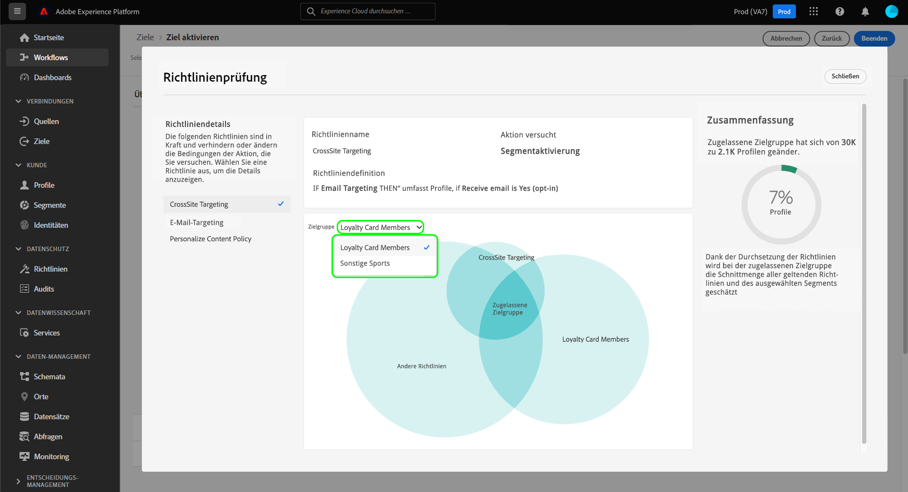

# Automatische Richtliniendurchsetzung

Datennutzungsbezeichnungen und -richtlinien sind für alle Adobe Experience Platform-Benutzer verfügbar. Definieren Sie Datennutzungsrichtlinien und wenden Sie Datennutzungsbezeichnungen an, um sicherzustellen, dass vertrauliche, identifizierbare oder vertragliche Daten genau verarbeitet werden. Diese Maßnahmen helfen Ihnen dabei, die Data Governance-Regeln Ihres Unternehmens hinsichtlich des Zugriffs, der Verarbeitung, der Speicherung und der Freigabe von Daten durchzusetzen.

Um Ihre Organisation vor potenziellen Risiken und Verbindlichkeiten zu schützen, erzwingt Platform automatisch Nutzungsrichtlinien, falls beim Aktivieren von Zielgruppen für Ziele Verstöße auftreten.

>[!IMPORTANT]
>
>Einverständnisrichtlinien und die automatische Durchsetzung von Einwilligungsrichtlinien sind nur für Unternehmen verfügbar, die **Adobe Healthcare Shield** oder **Adobe Privacy &amp; Security Shield**.

Dieses Dokument konzentriert sich auf die Durchsetzung von Richtlinien zu Data Governance und Einverständnis. Informationen zu Richtlinien für die Zugriffssteuerung finden Sie in der Dokumentation zur [attributbasierten Zugriffssteuerung](../../access-control/abac/overview.md).

## Voraussetzungen

Dieses Handbuch setzt Kenntnisse der verschiedenen Platform-Services voraus, die an der automatischen Durchsetzung beteiligt sind. Lesen Sie die folgende Dokumentation, um mehr zu erfahren, bevor Sie mit diesem Handbuch fortfahren:

* [Adobe Experience Platform Data Governance](../home.md): Das Framework, mit dem Platform die Einhaltung der Datennutzungskonformität durch die Verwendung von Beschriftungen und Richtlinien erzwingt.
* [Echtzeit-Kundenprofil](../../profile/home.md): Bietet ein einheitliches Echtzeit-Kundenprofil, das auf aggregierten Daten aus verschiedenen Quellen basiert.
* [Adobe Experience Platform-Segmentierungsdienst](../../segmentation/home.md): Die Segmentierungs-Engine, die in [!DNL Platform] verwendet wird, um Zielgruppen aus Ihren Kundenprofilen basierend auf Kundenverhalten und -attributen zu erstellen.
* [Ziele](../../destinations/home.md): Ziele sind vorgefertigte Integrationen mit häufig verwendeten Programmen, die die nahtlose Aktivierung von Daten von Platform aus für kanalübergreifende Marketing-Kampagnen, E-Mail-Kampagnen, zielgruppengerechte Werbung und mehr ermöglichen.

## Durchsetzungsfluss {#flow}

Das folgende Diagramm zeigt, wie die Richtliniendurchsetzung in den Datenfluss der Zielgruppenaktivierung integriert wird:

Wenn eine Zielgruppe zum ersten Mal aktiviert wird, prüft [!DNL Policy Service] anhand der folgenden Faktoren, ob einzuhaltende Richtlinien vorliegen:

* Die Datennutzungskennzeichnungen, die auf Felder und Datensätze innerhalb der zu aktivierenden Zielgruppen angewendet werden.
* Der Marketing-Zweck des Ziels.
* Die Profile, die der Zielgruppenaktivierung zugestimmt haben, basierend auf Ihren konfigurierten Einverständnisrichtlinien.

>[!NOTE]
>
>Wenn es Datennutzungskennzeichnungen gibt, die nur auf bestimmte Felder innerhalb eines Datensatzes angewendet wurden (und nicht auf den gesamten Datensatz), erfolgt die Durchsetzung dieser Kennzeichnungen auf Feldebene bei der Aktivierung nur unter folgenden Bedingungen:
>
>* Die Felder werden in der Zielgruppe verwendet.
>* Die Felder werden als voraussichtliche Attribute für das Ziel der Zielgruppe konfiguriert.

## Datenherkunft {#lineage}

Die Datenherkunft spielt eine zentrale Rolle bei der Durchsetzung von Richtlinien in Platform. Generell bezieht sich die Datenherkunft auf die Herkunft eines Datensatzes und darauf, was mit einem Datensatz mit der Zeit passiert (oder wo er sich bewegt).

Im Rahmen von Data Governance ermöglicht die Datenherkunft die Übertragung von Datennutzungskennzeichnungen von Schemata auf nachgeordnete Services, die diese Daten verwenden, beispielsweise auf Echtzeit-Kundenprofile und Ziele. Dies ermöglicht die Auswertung und Durchsetzung von Richtlinien an verschiedenen wichtigen Punkten auf dem Weg der Daten in Platform und bietet den Datennutzern einen Kontext darüber, warum eine Richtlinienverletzung aufgetreten ist.

In Experience Platform geht es bei der Durchsetzung der Richtlinien um folgende Herkunft:

1. Daten werden in Platform erfasst und in **Datensätzen** gespeichert.
1. Kundenprofile werden anhand dieser Datensätze identifiziert und erstellt, indem Datenfragmente gemäß der **Zusammenführungsrichtlinie** zusammengeführt werden.
1. Profilgruppen werden auf der Basis von gemeinsamen Attributen in **Zielgruppen** unterteilt.
1. Zielgruppen werden für nachgelagerte **Ziele** aktiviert.

Jeder Schritt in der oben genannten Timeline stellt eine Entität dar, die wie in der folgenden Tabelle dargestellt dazu beitragen kann, dass eine Richtlinie durchgesetzt wird:

| Datenherkunftsphase | Rolle bei der Richtliniendurchsetzung |
| --- | --- |
| Datensatz | Datensätze enthalten Datennutzungskennzeichnungen (angewendet auf Schemafeld- oder Datensatzebene), mit denen festgelegt wird, für welche Anwendungsfälle der komplette Datensatz oder bestimmte Felder verwendet werden können. Richtlinienverletzungen treten auf, wenn ein Datensatz oder ein Feld mit bestimmten Beschriftungen für einen Zweck verwendet wird, den eine Richtlinie einschränkt.  Alle von Ihren Kunden erfassten Einverständnisattribute werden ebenfalls in Datensätzen gespeichert. Wenn Sie Zugriff auf Einverständnisrichtlinien haben, werden alle Profile, die nicht den Einverständnisattributanforderungen Ihrer Richtlinien entsprechen, aus Zielgruppen ausgeschlossen, die für ein Ziel aktiviert sind. |
| Zusammenführungsrichtlinie | Zusammenführungsrichtlinien sind die Regeln, die Platform verwendet, um festzulegen, wie Daten beim Zusammenführen von Fragmenten aus mehreren Datensätzen priorisiert werden. Richtlinienverletzungen treten auf, wenn Ihre Zusammenführungsrichtlinien so konfiguriert sind, dass Datensätze mit eingeschränkten Beschriftungen für ein Ziel aktiviert werden. Weitere Informationen dazu finden Sie in der [merge policies overview](../../profile/merge-policies/overview.md). |
| Zielgruppe | Segmentierungsregeln definieren, welche Attribute aus den Kundenprofilen einbezogen werden sollen. Je nachdem, welche Felder eine Segmentdefinition enthalten, übernimmt die Zielgruppe alle angewendeten Nutzungsbeschriftungen für diese Felder. Richtlinienverletzungen treten je nach Marketing-Anwendungsfall auf, wenn Sie eine Zielgruppe aktivieren, deren übernommene Beschriftungen aufgrund der jeweiligen Richtlinien des Ziels eingeschränkt sind. |
| Ziel | Beim Einrichten eines Ziels kann eine Marketing-Aktion (manchmal auch als Marketing-Anwendungsfall bezeichnet) definiert werden. Dieser Anwendungsfall hängt von der in einer Richtlinie definierten Marketing-Aktion ab. Mit anderen Worten: Die Marketing-Aktion, die Sie für ein Ziel definieren, bestimmt, welche Datennutzungsrichtlinien und Einverständnisrichtlinien für dieses Ziel gelten.  Verstöße gegen Datennutzungsrichtlinien treten auf, wenn Sie eine Zielgruppe aktivieren, dessen Nutzungskennzeichnungen für die Marketing-Aktion des Ziels eingeschränkt sind.  (Beta) Wenn eine Zielgruppe aktiviert wird, werden alle Profile, die nicht die erforderlichen Einverständnisattribute für die Marketing-Aktion enthalten (gemäß der Definition in Ihren Einverständnisrichtlinien), aus der aktivierten Zielgruppe ausgeschlossen. |

>[!IMPORTANT]
>
>Bei einigen Datennutzungsrichtlinien sind möglicherweise zwei oder mehr Beschriftungen mit einer AND-Beziehung vorgegeben. Beispielsweise könnte eine Richtlinie eine Marketing-Aktion einschränken, wenn die Bezeichnungen `C1` UND `C2` beide vorhanden sind, diese Aktion jedoch nicht einschränken, wenn nur eine dieser Bezeichnungen vorhanden ist.
>
>Bei der automatischen Durchsetzung berücksichtigt das Data Governance-Framework die Aktivierung separater Zielgruppen für ein Ziel nicht als eine Kombination von Daten. Daher wird die Beispielrichtlinie `C1 AND C2` **NICHT** durchgesetzt, wenn diese Kennzeichnungen in getrennten Zielgruppen enthalten sind. Stattdessen wird diese Richtlinie nur durchgesetzt, wenn beide Kennzeichnungen bei Aktivierung in derselben Zielgruppe vorhanden sind.

Wenn Richtlinienverletzungen auftreten, bieten die in der Benutzeroberfläche angezeigten Meldungen nützliche Werkzeuge, um die Datenherkunft, die zur Verletzung beiträgt, zu untersuchen und so zur Lösung des Problems beizutragen. Weitere Informationen finden Sie im nächsten Abschnitt.

## Meldungen zur Richtliniendurchsetzung {#enforcement}

In den folgenden Abschnitten werden die verschiedenen Meldungen zur Richtliniendurchsetzung beschrieben, die in der Benutzeroberfläche von Platform angezeigt werden:

* [Verletzung von Datennutzungsrichtlinien](#data-usage-violation)
* [Auswertung der Einverständnisrichtlinie](#consent-policy-evaluation)

### Verletzung von Datennutzungsrichtlinien {#data-usage-violation}

Wenn ein Richtlinienverstoß beim Versuch auftritt, eine Zielgruppe zu aktivieren (oder [ein bereits aktivierte Zielgruppe zu bearbeiten](#policy-enforcement-for-activated-audiences)), wird die Aktion verhindert und in einem Pop-up angezeigt, dass gegen eine oder mehrere Richtlinien verstoßen wurde. Nachdem ein Verstoß ausgelöst wurde, wird die Schaltfläche **[!UICONTROL Speichern]** für die Entität, die Sie bearbeiten, deaktiviert, bis die entsprechenden Komponenten aktualisiert wurden und den Datennutzungsrichtlinien entsprechen.

Wählen Sie einen Richtlinienverstoß in der linken Spalte des Popups aus, um Details zu diesem Verstoß anzuzeigen.

Die Meldung zum Verstoß enthält eine Zusammenfassung der verletzten Richtlinie. Hierzu gehören die Bedingungen, die die Richtlinie gemäß Konfiguration überprüft, die spezifische Aktion, durch die der Verstoß ausgelöst wurde, sowie eine Liste möglicher Lösungen für das Problem.

Unter der Zusammenfassung der Verletzung wird ein Datenherkunftsdiagramm angezeigt, das Ihnen veranschaulicht, welche Datensätze, Zusammenführungsrichtlinien, Zielgruppen und Ziele an der Richtlinienverletzung beteiligt waren. Die Entität, die Sie aktuell ändern, wird im Diagramm hervorgehoben, sodass klar ist, welcher Punkt im Fluss die Verletzung verursacht. Sie können einen Entitätsnamen im Diagramm auswählen, um die Detailseite für die jeweilige Entität zu öffnen.

Sie können auch das Symbol **[!UICONTROL Filtern]** () verwenden, um die angezeigten Entitäten nach Kategorie zu filtern. Damit Daten angezeigt werden, müssen mindestens zwei Kategorien ausgewählt werden.

Wählen Sie **[!UICONTROL Listenansicht]** aus, um die Datenherkunft als Liste anzuzeigen. Um zum visuellen Diagramm zurückzukehren, wählen Sie **[!UICONTROL Pfadansicht]**.

### Auswertung der Einverständnisrichtlinie {#consent-policy-evaluation}

Beim Aktivieren einer Zielgruppe für ein Ziel können Sie sehen, wie Ihre [Einverständnisrichtlinien](../policies/user-guide.md#consent-policy) sich auf unterschiedliche Prozentsätze der Profile auswirken, die in der Aktivierung enthalten sind.

>[!NOTE]
>
>Einverständnisrichtlinien sind nur für Organisationen verfügbar, die Adobe Healthcare Shield oder Adobe Privacy &amp; Security Shield erworben haben.

#### Verbesserung der Einverständnisrichtlinie für bezahlte Medien {#consent-policy-enhancement}

Die Durchsetzung der Einverständnisrichtlinie für [Batch](../../destinations/destination-types.md#file-based)- und [Streaming](../../destinations/destination-types.md#streaming-destinations)-Ziele wurde verbessert, einschließlich der Aktivierung bezahlter Medien. Diese Verbesserung steht Kundinnen und Kunden des Privacy and Security Shield oder des Healthcare Shield zur Verfügung und entfernt proaktiv Profile aus Batch- und Streaming-Zielen, wenn sich der Einverständnisstatus ändert. Außerdem wird sichergestellt, dass Einverständnisänderungen sofort propagiert werden, sodass immer die richtige Zielgruppe angesprochen wird.

Diese Verbesserungen ermöglichen ein größeres Vertrauen in Ihre Marketing-Strategie, da Marketing-Fachleute nicht mehr gezwungen sind, ihrem Segmentausdruck manuell Einverständnisattribute hinzuzufügen. Dadurch wird sichergestellt, dass keine Profile versehentlich auf Marketing-Erlebnisse angesprochen werden, nachdem das Einverständnis widerrufen wurde oder das Profil nicht mehr für eine Einverständnisrichtlinie qualifiziert ist. Die Marketing-Einverständnisrichtlinien, die Regeln dafür festlegen, wie Einverständnis- oder Präferenzdaten über verschiedene Marketing-Workflows hinweg verwaltet werden sollen, werden jetzt in Aktivierungs-Workflows in nachgelagerten Lösungen automatisch durchgesetzt.

>[!NOTE]
>
>Es gibt keine Änderungen aufgrund dieser Verbesserung an der Benutzeroberfläche.

#### Auswertung vor der Aktivierung

Wenn Sie beim [Aktivieren eines Ziels](../../destinations/ui/activation-overview.md) den Schritt **[!UICONTROL Überprüfen]** erreicht haben, wählen Sie **[!UICONTROL Angewendete Richtlinien anzeigen]** aus.

Es wird ein Dialogfeld für die Richtlinienüberprüfung angezeigt, in dem Sie eine Vorschau der Auswirkungen Ihrer Einverständnisrichtlinien auf die einverstandene Zielgruppe der aktivierten Zielgruppen anzeigen können.

Das Dialogfeld zeigt die einverstandene Zielgruppe für jeweils eine Zielgruppe an. Um die Richtlinienauswertung für eine andere Zielgruppe anzuzeigen, wählen Sie im Dropdown-Menü über dem Diagramm eine aus der Liste aus.

Verwenden Sie die linke Leiste, um zwischen den geltenden Einverständnisrichtlinien für die ausgewählte Zielgruppe zu wechseln. Nicht ausgewählte Richtlinien werden im Abschnitt [!UICONTROL Sonstige Richtlinien] des Diagramms dargestellt.

Das Diagramm zeigt die Überschneidung zwischen drei Profilgruppen:

1. Profile, die für die ausgewählte Zielgruppe qualifiziert sind
1. Profile, die für die ausgewählte Einverständnisrichtlinie qualifiziert sind
1. Profile, die für die anderen geltenden Einwilligungsrichtlinien für die Zielgruppe infrage kommen (im Diagramm als „[!UICONTROL Sonstige Richtlinien]“ bezeichnet)

Die Profile, die für alle drei der oben genannten Gruppen qualifiziert sind, repräsentieren die einverstandene Zielgruppe, zusammengefasst in der rechten Leiste.

Bewegen Sie den Mauszeiger über eine der Zielgruppen im Diagramm, um die Anzahl der darin enthaltenen Profile anzuzeigen.

Die einverstandene Zielgruppe wird durch die zentrale Überschneidung des Diagramms dargestellt und kann wie die anderen Abschnitte hervorgehoben werden.

#### Flussausführung – Durchsetzung

Wenn Daten für ein Ziel aktiviert werden, wird in den Details zur Flussausführung die Anzahl der Identitäten angezeigt, die aufgrund aktiver Einverständnisrichtlinien ausgeschlossen wurden.

## Richtliniendurchsetzung für aktivierte Zielgruppen {#policy-enforcement-for-activated-audiences}

Die Richtliniendurchsetzung gilt auch für Zielgruppen, nachdem sie aktiviert wurden. Dadurch werden Änderungen an einer Zielgruppe oder ihrem Ziel eingeschränkt, die zu einem Richtlinienverstoß führen würden. Aufgrund der Funktionsweise der [Datenherkunft](#lineage) bei der Durchsetzung von Richtlinien können die folgenden Aktionen möglicherweise eine Verletzung auslösen:

* Aktualisieren von Datennutzungskennzeichnungen
* Ändern von Datensätzen für eine Zielgruppe
* Ändern von Zielgruppenprädikaten
* Ändern von Zielkonfigurationen

Wenn eine der oben genannten Aktionen einen Verstoß auslöst, wird verhindert, dass diese Aktion gespeichert wird, und eine Richtlinienverstoßmeldung wird angezeigt. Dadurch wird sichergestellt, dass Ihre aktivierten Zielgruppen nach dem Ändern weiterhin den Datennutzungskennzeichnungen entsprechen.

## Nächste Schritte

In diesem Dokument wurde erläutert, wie die automatische Durchsetzung der Richtlinien in Experience Platform funktioniert. Eine Anleitung zur programmgesteuerten Integration der Richtliniendurchsetzung in Ihre Programme mithilfe von API-Aufrufen finden Sie im Handbuch zur [API-basierten Durchsetzung](./api-enforcement.md).
