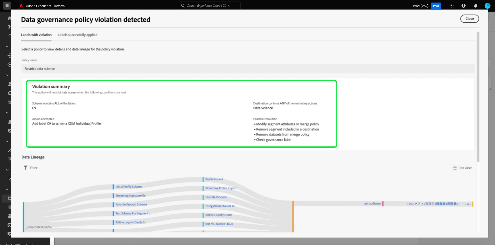

# Automatische Richtliniendurchsetzung

Nachdem Sie Daten gekennzeichnet und Nutzungsrichtlinien definiert haben, können Sie die Einhaltung von Datennutzungsrichtlinien erzwingen. Beim Aktivieren von Zielgruppensegmenten in Zielen setzt Adobe Experience Platform automatisch Nutzungsrichtlinien durch, falls Verstöße auftreten sollten.

## Voraussetzungen

Dieses Handbuch setzt Kenntnisse der verschiedenen Platform-Services voraus, die an der automatischen Durchsetzung beteiligt sind. Lesen Sie die folgende Dokumentation, um mehr zu erfahren, bevor Sie mit diesem Handbuch fortfahren:

* [Adobe Experience Platform Data Governance](../home.md): Das Framework, mit dem Platform die Einhaltung der Datennutzungskonformität durch die Verwendung von Beschriftungen und Richtlinien erzwingt.
* [Echtzeit-Kundenprofil](../../profile/home.md): Bietet ein einheitliches Echtzeit-Kundenprofil, das auf aggregierten Daten aus verschiedenen Quellen basiert.
* [Adobe Experience Platform Segmentation Service](../../segmentation/home.md): Die Segmentierungsmaschine, die in [!DNL Platform] verwendet wird, um Zielgruppensegmente aus Ihren Kundenprofilen basierend auf Kundenverhalten und -attributen zu erstellen.
* [Ziele](../../destinations/home.md): Ziele sind vorgefertigte Integrationen mit häufig verwendeten Programmen, die die nahtlose Aktivierung von Daten von Platform aus für kanalübergreifende Marketing-Kampagnen, E-Mail-Kampagnen, zielgruppengerechte Werbung und mehr ermöglichen.

## Durchsetzungsfluss {#flow}

Das folgende Diagramm zeigt, wie die Richtliniendurchsetzung in den Datenfluss der Segmentaktivierung integriert wird:

Wenn ein Segment zum ersten Mal aktiviert wird, [!DNL Policy Service] Prüfungen auf der Grundlage der folgenden Faktoren auf die anwendbaren Richtlinien:

* Die Datennutzungsbezeichnungen, die auf Felder und Datensätze innerhalb des zu aktivierenden Segments angewendet werden.
* Marketing-Zweck des Ziels.
* (Beta) Die Profile, die zugestimmt haben, in die Segmentaktivierung einbezogen zu werden, basierend auf Ihren konfigurierten Zustimmungsrichtlinien.

>[!NOTE]
>
>Wenn es Datennutzungsbeschriftungen gibt, die nur auf bestimmte Felder innerhalb eines Datensatzes angewendet wurden (und nicht auf den gesamten Datensatz), erfolgt die Durchsetzung dieser Beschriftungen auf Feldebene bei der Aktivierung nur unter folgenden Bedingungen:
>
>* Die Felder werden in der Segmentdefinition verwendet.
>* Die Felder werden als projizierte Attribute für das Ziel der Zielgruppe konfiguriert.

## Datenherkunft {#lineage}

Die Datenherkunft spielt eine zentrale Rolle bei der Durchsetzung von Richtlinien in Platform. Generell bezieht sich die Datenherkunft auf die Herkunft eines Datensatzes und darauf, was mit einem Datensatz mit der Zeit passiert (oder wo er sich bewegt).

Im Rahmen von Data Governance ermöglicht die Datenherkunft die Übertragung von Datennutzungskennzeichnungen von Datensätzen auf nachgelagerte Services, die diese Daten verwenden, beispielsweise auf Echtzeit-Kundenprofile und Ziele. Dies ermöglicht die Bewertung und Durchsetzung von Richtlinien an verschiedenen wichtigen Punkten auf dem Weg der Daten in Platform und bietet den Datennutzern einen Kontext darüber, warum eine Richtlinienverletzung aufgetreten ist.

In Experience Platform geht es bei der Durchsetzung der Richtlinien um folgende Herkunft:

1. Daten werden in Platform erfasst und in **Datensätzen** gespeichert.
1. Kundenprofile werden anhand dieser Datensätze identifiziert und erstellt, indem Datenfragmente gemäß der **Zusammenführungsrichtlinie** zusammengeführt werden.
1. Profilgruppen werden auf der Basis von gemeinsamen Attributen in **Segmente** unterteilt.
1. Segmente werden für nachgelagerte **Ziele** aktiviert.

Jede Phase in der obigen Zeitleiste stellt eine Entität dar, die zur Durchsetzung von Richtlinien beitragen kann, wie in der folgenden Tabelle dargestellt:

| Datenherkunftsphase | Rolle bei der Richtliniendurchsetzung |
| --- | --- |
| Datensatz | Datensätze enthalten Datennutzungsbeschriftungen (angewendet auf Datensatz- oder Feldebene), mit denen festgelegt wird, für welche Anwendungsfälle der gesamte Datensatz oder bestimmte Felder verwendet werden können. Richtlinienverletzungen treten auf, wenn ein Datensatz oder ein Feld mit bestimmten Beschriftungen für einen Zweck verwendet wird, den eine Richtlinie einschränkt.  Alle von Ihren Kunden erfassten Zustimmungsattribute werden ebenfalls in Datensätzen gespeichert. Wenn Sie Zugriff auf Zustimmungsrichtlinien haben (aktuell in der Beta-Version), werden alle Profile, die nicht den Zustimmungsattributanforderungen Ihrer Richtlinien entsprechen, aus Segmenten ausgeschlossen, die für ein Ziel aktiviert sind. |
| Zusammenführungsrichtlinie | Zusammenführungsrichtlinien sind die Regeln, die Platform verwendet, um festzulegen, wie Daten beim Zusammenführen von Fragmenten aus mehreren Datensätzen priorisiert werden. Richtlinienverletzungen treten auf, wenn Ihre Zusammenführungsrichtlinien so konfiguriert sind, dass Datensätze mit eingeschränkten Beschriftungen für ein Ziel aktiviert werden. Weitere Informationen dazu finden Sie in der [merge policies overview](../../profile/merge-policies/overview.md). |
| Segment | Segmentregeln definieren, welche Attribute aus den Kundenprofilen einbezogen werden sollen. Je nachdem, welche Felder eine Segmentdefinition enthält, übernimmt das Segment alle angewendeten Nutzungsbeschriftungen für diese Felder. Richtlinienverletzungen treten je nach Marketing-Anwendungsfall auf, wenn Sie ein Segment aktivieren, dessen übernommene Beschriftungen aufgrund der jeweiligen Richtlinien des Zielorts der Zielgruppe eingeschränkt sind. |
| Ziel | Beim Einrichten eines Ziels kann eine Marketing-Aktion (manchmal auch als Marketing-Anwendungsfall bezeichnet) definiert werden. Dieser Anwendungsfall korreliert mit einer Marketing-Aktion, wie in einer Richtlinie definiert. Mit anderen Worten: Die Marketing-Aktion, die Sie für ein Ziel definieren, bestimmt, welche Datennutzungsrichtlinien und Zustimmungsrichtlinien für dieses Ziel gelten.  Verstöße gegen Datennutzungsrichtlinien treten auf, wenn Sie ein Segment aktivieren, dessen Nutzungsbezeichnungen für die Marketing-Aktion des Zielziels eingeschränkt sind.  (Beta) Wenn ein Segment aktiviert wird, werden alle Profile, die nicht die erforderlichen Zustimmungsattribute für die Marketing-Aktion enthalten (wie durch Ihre Zustimmungsrichtlinien definiert), aus der aktivierten Zielgruppe ausgeschlossen. |

>[!IMPORTANT]
>
>Bei einigen Datennutzungsrichtlinien sind möglicherweise zwei oder mehr Beschriftungen mit einer UND-Beziehung vorgegeben. Beispielsweise könnte eine Richtlinie eine Marketing-Aktion einschränken, wenn die Bezeichnungen `C1` UND `C2` beide vorhanden sind, diese Aktion jedoch nicht einschränken, wenn nur eine dieser Bezeichnungen vorhanden ist.
>
>Bei der automatischen Durchsetzung berücksichtigt das Data Governance-Framework die Aktivierung separater Segmente für ein Ziel nicht als eine Kombination von Daten. Daher wird die Beispielrichtlinie `C1 AND C2` **NICHT** durchgesetzt, wenn diese Beschriftungen in separaten Segmenten enthalten sind. Stattdessen wird diese Richtlinie nur durchgesetzt, wenn beide Bezeichnungen bei Aktivierung im selben Segment vorhanden sind.

Wenn Richtlinienverletzungen auftreten, bieten die in der Benutzeroberfläche angezeigten Meldungen nützliche Werkzeuge, um die Datenherkunft, die zur Verletzung beiträgt, zu untersuchen und so zur Lösung des Problems beizutragen. Weitere Informationen finden Sie im nächsten Abschnitt.

## Nachrichten zur Richtliniendurchsetzung {#enforcement}

In den folgenden Abschnitten werden die verschiedenen Meldungen zur Richtliniendurchsetzung beschrieben, die in der Benutzeroberfläche von Platform angezeigt werden:

* [Verletzung von Datennutzungsrichtlinien](#data-usage-violation)
* [Beurteilung der Einwilligungsrichtlinie](#consent-policy-evaluation)

### Verletzung von Datennutzungsrichtlinien {#data-usage-violation}

Wenn ein Richtlinienverstoß beim Versuch auftritt, ein Segment zu aktivieren (oder [ein bereits aktiviertes Segment zu bearbeiten](#policy-enforcement-for-activated-segments)), wird die Aktion verhindert und in einem Popup angezeigt, dass gegen eine oder mehrere Richtlinien verstoßen wurden. Nachdem ein Verstoß ausgelöst wurde, wird die Schaltfläche **[!UICONTROL Speichern]** für die Entität, die Sie bearbeiten, deaktiviert, bis die entsprechenden Komponenten aktualisiert wurden und den Datennutzungsrichtlinien entsprechen.

Wählen Sie einen Richtlinienverstoß in der linken Spalte des Popups aus, um Details zu diesem Verstoß anzuzeigen.

Die Meldung zum Verstoß enthält eine Zusammenfassung der verletzten Richtlinie. Hierzu gehören die Bedingungen, die die Richtlinie gemäß Konfiguration überprüft, die spezifische Aktion, durch die der Verstoß ausgelöst wurde, sowie eine Liste möglicher Lösungen für das Problem.

Unter der Zusammenfassung der Verletzung wird ein Datenherkunftsdiagramm angezeigt, das Ihnen veranschaulicht, welche Datensätze, Zusammenführungsrichtlinien, Segmente und Ziele an der Richtlinienverletzung beteiligt sind bzw. waren. Die Entität, die Sie aktuell ändern, wird im Diagramm hervorgehoben, sodass klar ist, welcher Punkt im Fluss die Verletzung verursacht. Sie können einen Entitätsnamen im Diagramm auswählen, um die Detailseite für die jeweilige Entität zu öffnen.

Sie können auch das Symbol **[!UICONTROL Filtern]** () verwenden, um die angezeigten Entitäten nach Kategorie zu filtern. Damit Daten angezeigt werden, müssen mindestens zwei Kategorien ausgewählt werden.

Wählen Sie **[!UICONTROL Listenansicht]** aus, um die Datenherkunft als Liste anzuzeigen. Um zum visuellen Diagramm zurückzukehren, wählen Sie **[!UICONTROL Pfadansicht]**.

### Beurteilung der Einwilligungsrichtlinie {#consent-policy-evaluation}

>[!IMPORTANT]
>
>Einverständnisrichtlinien sind derzeit nur für Organisationen verfügbar, die Adobe Shield für das Gesundheitswesen erworben haben.

Wenn Sie [erstellte Zustimmungsrichtlinien](../policies/user-guide.md#consent-policy) und ein Segment für ein Ziel aktivieren, können Sie sehen, wie sich Ihre Zustimmungsrichtlinien auf den Prozentsatz der Profile auswirken, die in der Aktivierung enthalten sind.

#### Vor-Aktivierung-Evaluierung

Sobald Sie die **[!UICONTROL Überprüfen]** Schritt bei [Aktivieren eines Ziels](../../destinations/ui/activation-overview.md)auswählen **[!UICONTROL Angewandte Richtlinien anzeigen]**.

Es wird ein Dialogfeld mit einer Richtlinienüberprüfung angezeigt, in dem Sie eine Vorschau der Auswirkungen Ihrer Zustimmungsrichtlinien auf die einwilligte Zielgruppe der aktivierten Segmente anzeigen können.

Das Dialogfeld zeigt die einwilligte Zielgruppe für jeweils ein Segment an. Um die Richtlinienbewertung für ein anderes Segment anzuzeigen, wählen Sie im Dropdown-Menü über dem Diagramm ein Segment aus der Liste aus.

Verwenden Sie die linke Leiste, um zwischen den entsprechenden Zustimmungsrichtlinien für das ausgewählte Segment zu wechseln. Nicht ausgewählte Richtlinien werden im Abschnitt[!UICONTROL Sonstige Politikbereiche]&quot;.

Das Diagramm zeigt die Überschneidung zwischen drei Profilgruppen:

1. Profile, die für das ausgewählte Segment qualifiziert sind
1. Profile, die für die ausgewählte Zustimmungsrichtlinie qualifiziert sind
1. Profile, die für die anderen anwendbaren Zustimmungsrichtlinien für das Segment qualifiziert sind (als[!UICONTROL Sonstige Politikbereiche]&quot; in der Grafik)

Die Profile, die für alle drei der oben genannten Gruppen qualifiziert sind, repräsentieren die einwilligte Zielgruppe für das ausgewählte Segment, zusammengefasst in der rechten Leiste.

Bewegen Sie den Mauszeiger über eine der Zielgruppen im Diagramm, um die Anzahl der darin enthaltenen Profile anzuzeigen.

Die einwilligte Zielgruppe wird durch die zentrale Überschneidung des Diagramms dargestellt und kann wie die anderen Abschnitte hervorgehoben werden.

#### Flussausführung - Durchsetzung

Wenn Daten für ein Ziel aktiviert werden, zeigen die Details zur Flussausführung die Anzahl der Identitäten an, die aufgrund aktiver Zustimmungsrichtlinien ausgeschlossen wurden.

## Richtliniendurchsetzung für aktivierte Segmente {#policy-enforcement-for-activated-segments}

Die Richtliniendurchsetzung gilt auch für Segmente, nachdem sie aktiviert wurden. Dadurch werden Änderungen an einem Segment oder seinem Ziel eingeschränkt, die zu einem Richtlinienverstoß führen würden. Aufgrund der Funktionsweise der [Datenherkunft](#lineage) bei der Durchsetzung von Richtlinien können die folgenden Aktionen möglicherweise eine Verletzung auslösen:

* Aktualisieren von Datennutzungsbezeichnungen
* Ändern von Datensätzen für ein Segment
* Ändern von Segmenteigenschaften
* Ändern von Zielkonfigurationen

Wenn eine der oben genannten Aktionen einen Verstoß auslöst, wird verhindert, dass diese Aktion gespeichert wird, und eine Richtlinienverstoßmeldung wird angezeigt. Dadurch wird sichergestellt, dass Ihre aktivierten Segmente nach dem Ändern weiterhin den Datennutzungsrichtlinien entsprechen.

## Nächste Schritte

In diesem Dokument wurde erläutert, wie die automatische Durchsetzung der Richtlinien in Experience Platform funktioniert. Eine Anleitung zur programmgesteuerten Integration der Richtliniendurchsetzung in Ihre Programme mithilfe von API-Aufrufen finden Sie im Handbuch zur [API-basierten Durchsetzung](./api-enforcement.md).
