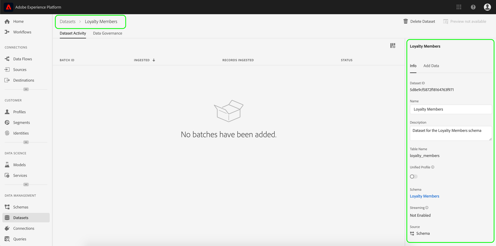
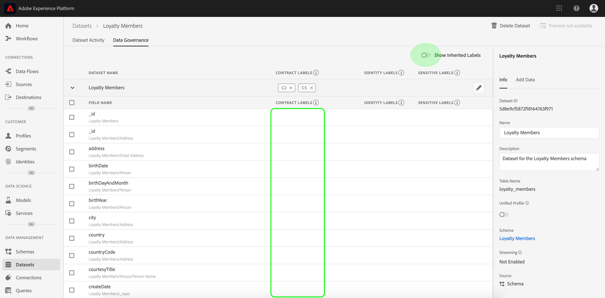

# Benutzerhandbuch zur Datenverwendung

Dieses Benutzerhandbuch beschreibt die Schritte zum Arbeiten mit Datenverwendungsbeschriftungen (auch als DULE-Beschriftungen bezeichnet) in der Benutzeroberfläche von Experience Platform. Bevor Sie den Leitfaden verwenden, lesen Sie bitte die Übersicht über die [Datenverwaltung](../home.md) , um eine solidere Einführung in das DUL-Framework zu erhalten.

## Verwalten von Datenverwendungsbeschriftungen auf der Datensatzebene

Zur Verwaltung der Datenverwendungsbeschriftungen auf Datensatzebene müssen Sie einen vorhandenen Datensatz auswählen oder einen neuen erstellen. Nach der Anmeldung bei Adobe Experience Platform wählen Sie **[!UICONTROL Datasets]** in der linken Navigation, um den Arbeitsbereich &quot; _Datasets_ &quot;zu öffnen. Auf dieser Seite werden alle erstellten Datensätze, die zu Ihrem Unternehmen gehören, sowie nützliche Details zu jedem Datensatz Liste.

Im nächsten Abschnitt finden Sie Schritte zum Erstellen eines neuen Datensatzes, auf den Beschriftungen angewendet werden sollen. Wenn Sie die Beschriftungen eines vorhandenen Datensatzes bearbeiten möchten, wählen Sie den Datensatz aus der Liste und überspringen Sie mit dem [Hinzufügen von Beschriftungen für die Datenverwendung zum Datensatz](#add-labels).

### Erstellen eines neuen Datensatzes

>[!NOTE] In diesem Beispiel wird ein Datensatz mit einem vorkonfigurierten XDM-Schema (Experience Data Model) erstellt. Weitere Informationen zu XDM-Schemas finden Sie in der [XDM-Systemübersicht](../../xdm/home.md) und den [Grundlagen der Schema-Komposition](../../xdm/schema/composition.md).

Um einen neuen Datensatz zu erstellen, klicken Sie in der rechten oberen Ecke des Arbeitsbereichs &quot; **[!UICONTROL Datenbestände]** &quot;auf &quot;Datensatz _[!UICONTROL erstellen&quot;]_.

Der Bildschirm &quot; _[!UICONTROL Datensatz]_erstellen&quot;wird angezeigt. Klicken Sie von hier auf Dataset aus Schema**[!UICONTROL  erstellen ]**.

Der Bildschirm &quot;Schema __auswählen&quot;wird angezeigt, in dem alle verfügbaren Schema Liste werden, die Sie zum Erstellen eines Datensatzes verwenden können. Klicken Sie auf das Optionsfeld neben einem Schema, um es auszuwählen. Im Bereich &quot;_[!UICONTROL  Schema]_ &quot;auf der rechten Seite werden weitere Details zum ausgewählten Schema angezeigt. Once you have selected a schema, click **[!UICONTROL Next]**.

Der Bildschirm &quot;Datensatz _konfigurieren&quot;_ wird angezeigt. Geben Sie einen **Namen** (erforderlich) und eine **Beschreibung** (optional, aber empfohlen) für den neuen Datensatz ein und klicken Sie dann auf **[!UICONTROL Fertig stellen]**.

Die Aktivität _[!UICONTROL des]_Datensatzes wird mit Informationen zum neu erstellten Datensatz angezeigt. In diesem Beispiel heißt der Datensatz &quot;Treuemitglieder&quot;, daher zeigt die oberste Navigation_ Datasets > Treuemitglieder _.

### Hinzufügen der Datenverwendungsbeschriftungen mit dem Datensatz {#add-labels}

Nachdem Sie einen neuen Datensatz erstellt oder einen vorhandenen Datensatz aus der Liste im Arbeitsbereich &quot; _[!UICONTROL Datensätze]_&quot;ausgewählt haben, klicken Sie auf**[!UICONTROL  Datenverwaltung ]**, um den Arbeitsbereich &quot;_[!UICONTROL  Datenverwaltung]_ &quot;zu öffnen. Der Arbeitsbereich ermöglicht Ihnen die Verwaltung von Beschriftungen für die Datenverwendung auf Datensatzebene und Feldebene.

Um die Beschriftungen für die Datenverwendung auf Datensatzebene zu bearbeiten, klicken Sie auf das Stiftsymbol neben dem Dataset-Namen.

Das Dialogfeld &quot; _[!UICONTROL Governance-Bezeichnungen]_bearbeiten&quot;wird geöffnet. Aktivieren Sie im Dialogfeld die Kontrollkästchen neben den Beschriftungen, die Sie auf den Datensatz anwenden möchten. Denken Sie daran, dass diese Beschriftungen von allen Feldern im Datensatz übernommen werden. Die Kopfzeile &quot;_[!UICONTROL  Angewandte Bezeichnungen]_ &quot;wird aktualisiert, wenn Sie die einzelnen Felder markieren und die ausgewählten Bezeichnungen anzeigen. Nachdem Sie die gewünschten Beschriftungen ausgewählt haben, klicken Sie auf Änderungen **[!UICONTROL speichern]**.

 

Der Arbeitsbereich _[!UICONTROL Datenverwaltung]_wird wieder angezeigt und zeigt die Beschriftungen an, die Sie auf Datensatzebene angewendet haben. Sie können auch sehen, dass die Beschriftungen bis zu den einzelnen Feldern im Datensatz geerbt werden.

Beachten Sie, dass neben den Beschriftungen auf Datensatzebene ein &quot;x&quot;angezeigt wird, sodass Sie die Beschriftungen entfernen können. Die geerbten Beschriftungen neben jedem Feld haben kein &quot;x&quot; neben ihnen und erscheinen als &quot;grau ausgegraut&quot;, ohne dass sie entfernt oder bearbeitet werden können. Dies liegt daran, dass **geerbte Felder schreibgeschützt** sind, d. h. sie können nicht auf Feldebene entfernt werden.

Der Umschalter &quot; **[!UICONTROL Vererbte Bezeichnungen]** anzeigen&quot;ist standardmäßig aktiviert, sodass Sie alle Bezeichnungen sehen können, die vom Datensatz bis zu seinen Feldern vererbt wurden. Wenn Sie den Umschalter deaktivieren, werden alle geerbten Beschriftungen im Datensatz ausgeblendet.

## Verwalten von Datenverwendungsbeschriftungen auf der Ebene des Datensatzfelds

Wenn Sie den Arbeitsablauf für das [Hinzufügen und Bearbeiten von Datenverwendungsbeschriftungen auf Datensatzebene](#add-labels)fortsetzen, können Sie auch Beschriftungen auf Feldebene im Arbeitsbereich _[!UICONTROL Datenverwaltung]_für diesen Datensatz verwalten.

Um die Beschriftungen für die Datenverwendung auf ein einzelnes Feld anzuwenden, aktivieren Sie das Kontrollkästchen neben dem Feldnamen und klicken Sie dann auf Governance-Beschriftungen **[!UICONTROL bearbeiten]**.

Das Dialogfeld &quot;Governance-Bezeichnungen _[!UICONTROL bearbeiten&quot;]_wird angezeigt. Im Dialogfeld werden Kopfzeilen mit ausgewählten Feldern, angewendeten Beschriftungen und geerbten Beschriftungen angezeigt. Beachten Sie, dass die geerbten Beschriftungen (C2 und C5) im Dialogfeld grau dargestellt werden. Es handelt sich um schreibgeschützte Bezeichnungen, die von der Datensatzebene übernommen werden und daher nur auf Datensatzebene bearbeitet werden können.

 

Wählen Sie Beschriftungen auf Feldebene aus, indem Sie auf das Kontrollkästchen neben der jeweiligen Bezeichnung klicken, die Sie verwenden möchten. Während Sie Beschriftungen auswählen, wird die Kopfzeile &quot; _[!UICONTROL Angewandte Bezeichnungen]_&quot;aktualisiert und zeigt Beschriftungen an, die auf die Felder angewendet wurden, die in der Kopfzeile &quot;_[!UICONTROL  Ausgewählte Felder]_ &quot;angezeigt werden. Nachdem Sie die Feldbezeichnungen ausgewählt haben, klicken Sie auf Änderungen **[!UICONTROL speichern]**.

 

Der _[!UICONTROL Arbeitsbereich &quot;Datenverwaltung]_&quot;wird wieder angezeigt, in dem nun die ausgewählten Beschriftungen auf Feldebene in der Zeile neben dem Feldnamen angezeigt werden. Beachten Sie, dass neben der Beschriftung auf Feldebene ein &quot;x&quot;steht, sodass Sie die Beschriftung entfernen können.

Sie können diese Schritte wiederholen, um weiterhin Beschriftungen auf Feldebene für zusätzliche Felder hinzuzufügen und zu bearbeiten, einschließlich der Auswahl mehrerer Felder, um Beschriftungen auf Feldebene gleichzeitig anzuwenden.

Es ist wichtig, sich zu merken, dass die Vererbung nur von der obersten Ebene nach unten verschoben wird (Dataset → Felder), d. h. dass auf Feldebene angewendete Beschriftungen nicht in andere Felder oder Datensätze übertragen werden.

## Nächste Schritte

Nachdem Sie nun Datenverwendungsbeschriftungen auf der Dataset- und Feldebene hinzugefügt haben, können Sie beginnen, Daten in Experience Platform zu erfassen. Weitere Informationen erhalten Sie im Beginn in der [Datenerhebungsdokumentation](../../ingestion/home.md).

Sie können jetzt auch Datenverwendungsrichtlinien auf Basis der von Ihnen angewendeten Beschriftungen definieren. Weitere Informationen finden Sie in der Übersicht über die [Datenverwendungsrichtlinien](../policies/overview.md).

## Zusätzliche Ressourcen

Das folgende Video soll Ihr Verständnis von Data Governance unterstützen und beschreibt, wie Sie Beschriftungen auf einen Datensatz und einzelne Felder anwenden.

>[!VIDEO](https://video.tv.adobe.com/v/29709?quality=12&enable10seconds=on&speedcontrol=on)
