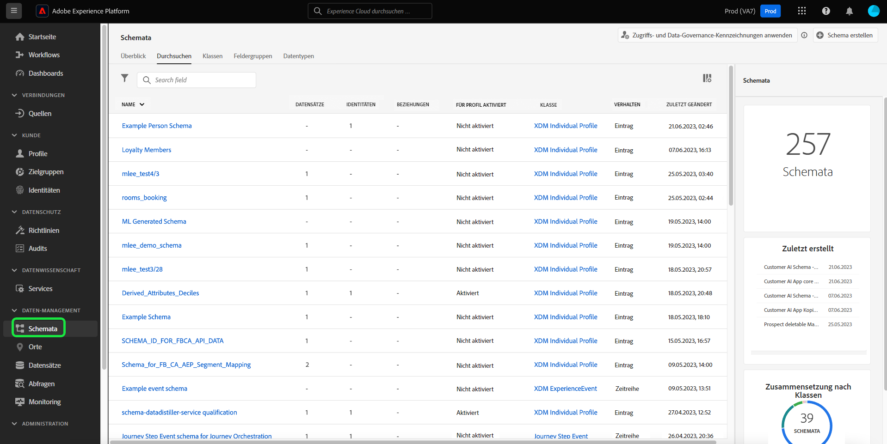
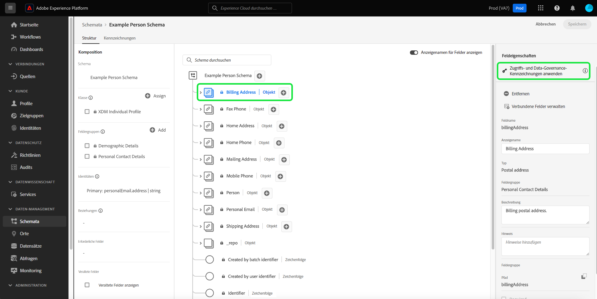
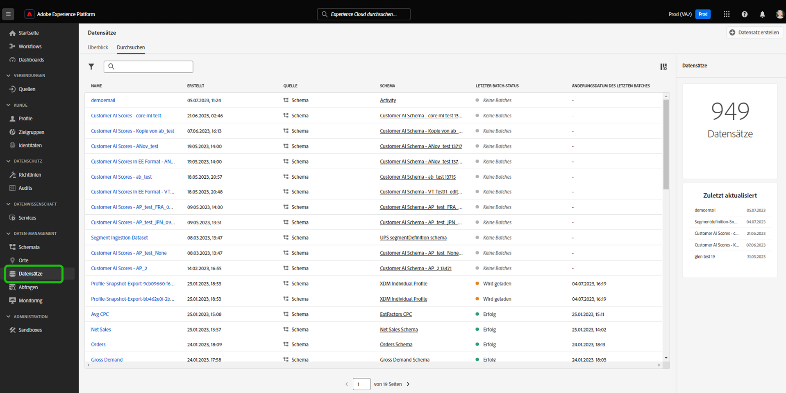
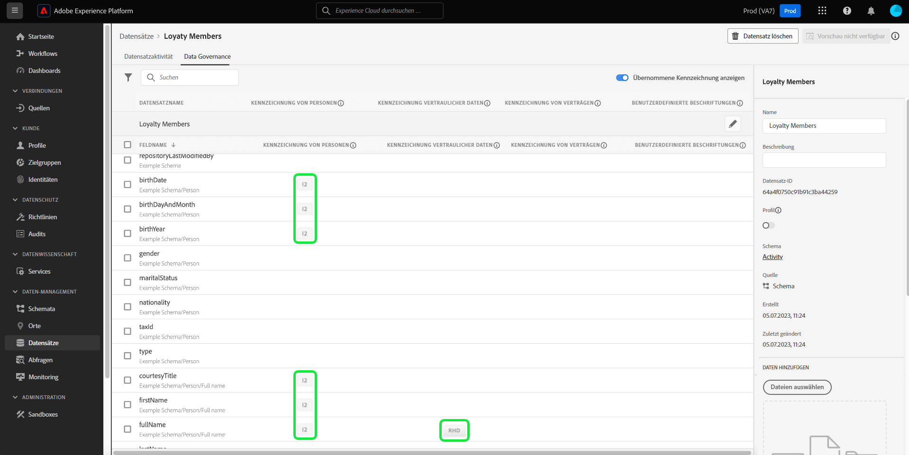
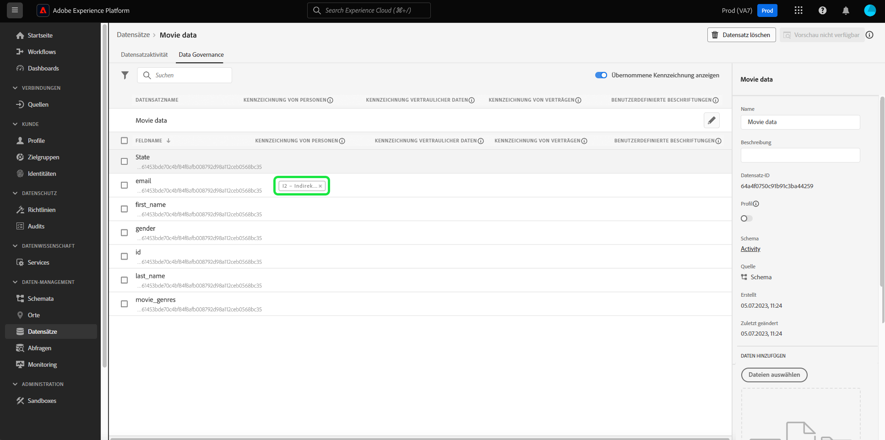
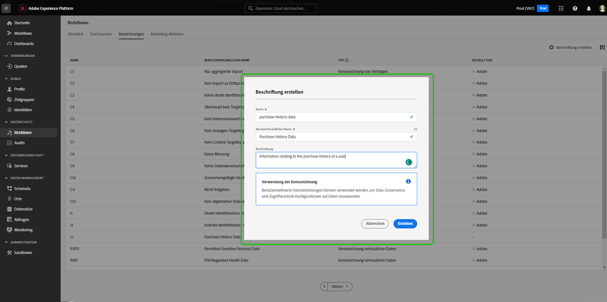

# Verwalten von Datennutzungsbeschriftungen in der Benutzeroberfläche {#user-guide}

>[!CONTEXTUALHELP]
>id="platform_privacyConsole_dataGovernance_description"
>title="Steuern der Datennutzung in Platform"
>abstract="<h2>Beschreibung</h2>
Mit dem Data Governance-Framework in Experience Platform können Sie Attribute und Schemas anhand von Datennutzungsbeschränkungen beschriften und Richtlinien einrichten, die diese Einschränkungen für bestimmte Marketing-Aktionen identifizieren und berücksichtigen.
"

Dieses Benutzerhandbuch beschreibt die Schritte zum Arbeiten mit Datennutzungskennzeichnungen in der Benutzeroberfläche von [!DNL Experience Platform]. 

## Verwalten von Kennzeichnungen auf Schemaebene

Um Datennutzungsbezeichnungen auf Schemaebene zu verwalten, müssen Sie ein vorhandenes Schema auswählen oder ein neues erstellen. Wählen Sie nach der Anmeldung bei Adobe Experience Platform die Option **[!UICONTROL Schemas]** im linken Navigationsbereich, um die **[!UICONTROL Schemas]** Arbeitsbereich. Auf dieser Seite werden alle erstellten Schemas, die zu Ihrer Organisation gehören, sowie nützliche Details zu den einzelnen Schemata aufgelistet.

Im nächsten Abschnitt werden die Schritte zum Erstellen eines neuen Schemas beschrieben, auf das Bezeichnungen angewendet werden sollen. Wenn Sie Beschriftungen für ein vorhandenes Schema bearbeiten möchten, wählen Sie das Schema aus der Liste aus und überspringen Sie voran zu [Hinzufügen von Datennutzungsbezeichnungen zum Schema](#add-labels).

### Erstellen eines neuen Schemas

Um ein neues Schema zu erstellen, wählen Sie **[!UICONTROL Schema erstellen]** in der oberen rechten Ecke der **[!UICONTROL Schemas]** Arbeitsbereich. Siehe Handbuch unter [Erstellen eines Schemas mit dem Schema Editor](../../xdm/tutorials/create-schema-ui.md#create) für vollständige Anweisungen. Alternativ können Sie [Erstellen eines Schemas mithilfe der Schema Registry-API](../../xdm/tutorials/create-schema-api.md) falls erforderlich.

### Hinzufügen von Datennutzungsbezeichnungen zum Schema {#add-labels-to-schema}

Nach dem Erstellen eines neuen Schemas oder Auswählen eines vorhandenen Schemas aus der Liste in der [!UICONTROL Durchsuchen] des [!UICONTROL Schemas] Arbeitsbereich ein Feld aus Ihrem Schema im Schema-Editor auswählen. Im [!UICONTROL Feldeigenschaften] Seitenleiste auswählen **[!UICONTROL Anwenden von Zugriffs- und Data Governance-Beschriftungen]**.

Es wird ein Dialogfeld angezeigt, in dem Sie Datennutzungsbezeichnungen auf Schema- und Feldebene anwenden und verwalten können. Vollständige Anweisungen zu finden Sie im XDM-Tutorial . [Hinzufügen oder Bearbeiten von Datennutzungsbezeichnungen für XDM-Schemas](../../xdm/tutorials/labels.md#select-schema-field).

### Hinzufügen von Datennutzungsbezeichnungen zu einem bestimmten Datensatz {#add-labels-to-dataset}

>[!CONTEXTUALHELP]
>id="platform_privacyConsole_dataGovernance_instructions"
>title="Anleitung"
>abstract="<ol><li>Wählen Sie im linken Navigationsbereich die Option <a href="https://experienceleague.adobe.com/docs/experience-platform/data-governance/labels/user-guide.html?lang=de">Datensätze</a> und dann den Datensatz aus, den Sie beschränken möchten.</li><li>Wählen Sie in der Ansicht „Datensatzdetails“ die Registerkarte <b>Data Governance</b> aus.</li><li>Wählen Sie die Datensatzfelder aus, die Sie beschränken möchten, und wählen Sie dann <b>Governance-Kennzeichnungen bearbeiten</b> aus, um die Daten anhand von Nutzungsbeschränkungen zu kennzeichnen.</li><li>Wählen Sie nach der Kennzeichnung Ihrer Daten im linken Navigationsbereich die Option <a href="https://experienceleague.adobe.com/docs/experience-platform/data-governance/policies/overview.html?lang=de">Richtlinien</a> und dann die Option <b>Richtlinie erstellen</b> aus.</li><li>Erstellen Sie eine <a href="https://experienceleague.adobe.com/docs/experience-platform/data-governance/policies/user-guide.html?lang=de#create-governance-policy">Data Governance-Richtlinie</a> und wählen Sie dann die Datennutzungskennzeichnungen aus, auf die die Richtlinie angewendet werden soll.</li><li>Wählen Sie die Marketing-Aktion(en) aus, die die Richtlinie für alle Daten mit diesen Kennzeichnungen verweigern soll. Nachdem die Richtlinie erstellt wurde, wählen Sie sie aus der Liste aus und aktivieren Sie sie mithilfe des Umschalters in der rechten Leiste.</li><li>Für jede aktivierte Richtlinie verhindert Platform, dass Daten mit den angegebenen Kennzeichnungen für die definierten Marketing-Aktionen verwendet werden. Diese Durchsetzung erfolgt automatisch, wenn Sie versuchen, gekennzeichnete Daten für ein Ziel mit zugehörigen Marketing-Aktionen zu aktivieren (Anwendungsfälle).</li></ol>"

>[!IMPORTANT]
>
>Beschriftungen können nicht mehr auf Felder auf Datensatzebene angewendet werden. Dieser Workflow wird nicht mehr für die Anwendung von Bezeichnungen auf Schemaebene unterstützt. Alle Bezeichnungen, die zuvor auf Datensatzobjektebene angewendet wurden, werden bis zum 31. Mai 2024 weiterhin über die Platform-Benutzeroberfläche unterstützt. Um sicherzustellen, dass Ihre Bezeichnungen über alle Schemas hinweg konsistent sind, müssen alle Bezeichnungen, die zuvor auf Datensatzebene an Felder angehängt wurden, von Ihnen im Laufe des kommenden Jahres auf Schemaebene migriert werden. Anweisungen finden Sie in der Dokumentation zu [Migrieren von zuvor angewendeten Bezeichnungen aus dem Datensatz auf Schemaebene](../e2e.md#migrate-labels).

Beschriftungen können auf den gesamten Datensatz aus der **[!UICONTROL Data Governance]** des **[!UICONTROL Datensätze]** Arbeitsbereich. Der Arbeitsbereich ermöglicht die Verwaltung von Datennutzungsbezeichnungen auf Datensatzebene.

![Die [!UICONTROL Data Governance] des [!UICONTROL Datensätze] Arbeitsbereich mit Data Governance hervorgehoben.](../images/labels/dataset-governance.png)

Um Datennutzungsbezeichnungen auf Datensatzebene zu bearbeiten, wählen Sie zunächst das Stiftsymbol () in der Zeile des Datensatznamens.

![Die [!UICONTROL Data Governance] des [!UICONTROL Datensätze] Arbeitsbereich mit hervorgehobenem Stiftsymbol zum Bearbeiten.](../images/labels/dataset-level-edit.png)

Der Dialog **[!UICONTROL Governance-Beschriftungen bearbeiten]** wird geöffnet. Aktivieren Sie im Dialogfeld die Kontrollkästchen neben den Beschriftungen, die Sie auf den Datensatz anwenden möchten. Denken Sie daran, dass diese Beschriftungen von allen Feldern im Datensatz übernommen werden. Während Sie die einzelnen Kontrollkästchen auswählen, wird die Kopfzeile **[!UICONTROL Angewandte Beschriftungen]** aktualisiert, sodass sie die ausgewählten Beschriftungen anzeigt. Nachdem Sie die gewünschten Beschriftungen ausgewählt haben, wählen Sie **[!UICONTROL Änderungen speichern]**.

Die **[!UICONTROL Data Governance]** Der Arbeitsbereich wird wieder angezeigt und zeigt die Bezeichnungen an, die Sie auf Datensatzebene in der ersten Zeile der Tabelle angewendet haben. Sie können auch die durch einzelne Karten angezeigten Bezeichnungen sehen, die bis zu jedem Feld im Datensatz vererbt werden.

![Die [!UICONTROL Data Governance] des [!UICONTROL Datensätze] Arbeitsbereich mit angewendeten Bezeichnungen auf Datensatzebene und vererbten Bezeichnungen für Datensatzfelder.](../images/labels/applied-dataset-labels.png)

### Entfernen von Kennzeichnungen aus einem Datensatz {#remove-labels-from-a-dataset}

Auf Datensatzebene hinzugefügte Beschriftungen weisen neben ihrer Karte ein &quot;x&quot;auf. Dadurch können Sie die Bezeichnungen aus dem gesamten Datensatz entfernen. Vererbte Beschriftungen neben jedem Feld haben kein &quot;x&quot;neben ihnen und erscheinen &quot;grau ausgeblendet&quot;. Diese **Vererbte Beschriftungen sind schreibgeschützt**, d. h. sie können nicht auf Feldebene entfernt oder bearbeitet werden.

<!-- ## View labels at the dataset field level {#view-labels-at-dataset-field-level} -->

<!-- To view labels inherited by the dataset from the schema level, select **[!UICONTROL Datasets]** to navigate to the datasets workspace and select the relevant dataset from the list. 

Next, select the **[!UICONTROL Data Governance]** tab to show the labels that have been applied to the dataset. You can also see that the labels are inherited down to each of the fields within the dataset.

The inherited labels beside each field do not have an "x" next to them and appear "greyed out" with no ability to remove or edit. This is because **inherited fields are read-only**, meaning they cannot be removed at the field level. -->

<!--Beleive can cut above here  -->

Die **[!UICONTROL Vererbte Beschriftungen anzeigen]** -Umschalter ist standardmäßig aktiviert, sodass Sie alle vom Schema bis zu seinen Feldern übernommenen Bezeichnungen sehen können. Wenn Sie den Umschalter deaktivieren, werden alle übernommenen Beschriftungen im Datensatz ausgeblendet.

<!-- Labels applied to the dataset appear in read-only form within the **[!UICONTROL Data Governance]** view for that dataset. 

 -->

>[!NOTE]
>
>Beschriftungen, die angewendet wurden, bevor die Funktion zur Kennzeichnung von Datensätzen eingestellt wurde, können aus dem Datensatz entfernt werden, indem Sie den relevanten Datensatz suchen und das Abbrechen-Symbol auf der Beschriftung auswählen.
>
>Anweisungen finden Sie in der Dokumentation zu [Migrieren von zuvor angewendeten Bezeichnungen aus dem Datensatz auf Schemaebene](../e2e.md#migrate-labels).

## Verwalten von Kennzeichnungen auf Schemaebene

Sie können Kennzeichnungen direkt zu einem Schema oder zu Feldern innerhalb dieses Schemas hinzufügen. Alle Felder, die auf der Schemaebene angewendet werden, werden auf alle Datensätze übertragen, die auf diesem Schema basieren.

Weitere Informationen finden Sie in der Anleitung zur [Verwaltung von Kennzeichnungen auf Schemaebene](../../xdm/tutorials/labels.md).

## Verwalten von benutzerdefinierten Kennzeichnungen {#manage-custom-labels}

>[!CONTEXTUALHELP]
>id="platform_governance_createlabels"
>title="Erstellen von Kennzeichnungen"
>abstract="Mit Kennzeichnungen können Sie Datensätze und Felder entsprechend den für diese Daten geltenden Nutzungsrichtlinien kategorisieren. Platform stellt Ihnen eine Reihe von Standardkennzeichnungen zur Verfügung, aber Sie können auch benutzerdefinierte Kennzeichnungen erstellen, die speziell auf Ihre Organisation zugeschnitten sind."

Sie können Ihre eigenen benutzerspezifischen Nutzungskennzeichnungen im Arbeitsbereich **[!UICONTROL Richtlinien]** in der Benutzeroberfläche von [!DNL Experience Platform] erstellen. Wählen Sie **[!UICONTROL Richtlinien]** in der linken Navigation und anschließend **[!UICONTROL Kennzeichnungen]**, um eine Liste der vorhandenen Kennzeichnungen zu sehen. Wählen Sie dort **[!UICONTROL Kennzeichnung erstellen]**.

Das Dialogfeld **[!UICONTROL Kennzeichnung erstellen]** wird angezeigt. Geben Sie nun die folgenden Informationen für die neue Kennzeichnung ein:

* **[!UICONTROL Name]**: Eine eindeutige Kennung für die Bezeichnung. Dieser Wert wird für Suchen verwendet und sollte daher kurz und knapp sein.
* **[!UICONTROL Anzeigename]**: Ein Anzeigename für die Bezeichnung.
* **[!UICONTROL Beschreibung]**: (Optional) Eine Beschreibung für die Kennzeichnung, um mehr Kontext bereitzustellen.

Klicken Sie abschließend auf **[!UICONTROL Erstellen]**.

Das Dialogfeld wird geschlossen und die neu erstellte benutzerdefinierte Kennzeichnung wird in der Liste unter der Registerkarte **[!UICONTROL Kennzeichnungen]** angezeigt.

Die Kennzeichnung kann jetzt unter **[!UICONTROL Benutzerdefinierte Kennzeichnungen]** ausgewählt werden, wenn Kennzeichnungen für Datensätze und Felder bearbeitet oder Datennutzungsrichtlinien erstellt werden.

## Nächste Schritte

Nachdem Sie Datennutzungskennzeichnungen auf Datensatz- und Feldebene hinzugefügt haben, können Sie damit beginnen, Daten in [!DNL Experience Platform] zu erfassen. Weitere Informationen erhalten Sie in der [Dokumentation zur Datenaufnahme](../../ingestion/home.md).

Sie können jetzt auch Datennutzungsrichtlinien auf Basis der von Ihnen angewendeten Kennzeichnungen definieren. Weitere Informationen finden Sie unter [Datennutzungsrichtlinien – Übersicht](../policies/overview.md).

<!-- The workflow of this video is now outdated. This can be enabled once the video has been updated

## Additional resources

The following video is intended to support your understanding of Data Governance, and outlines how to apply labels to a dataset and individual fields.

>[!VIDEO](https://video.tv.adobe.com/v/29709?quality=12&enable10seconds=on&speedcontrol=on) -->
