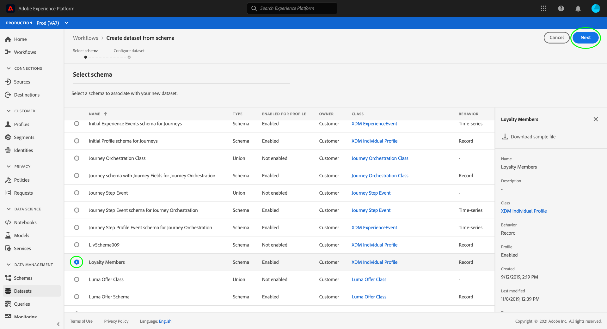
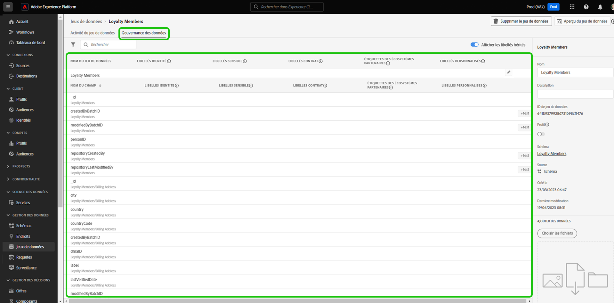
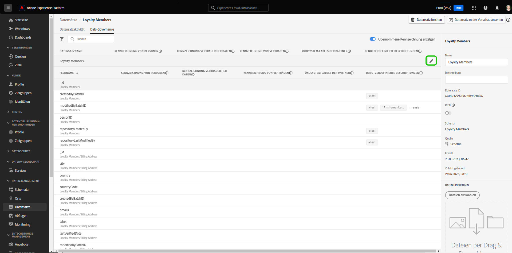
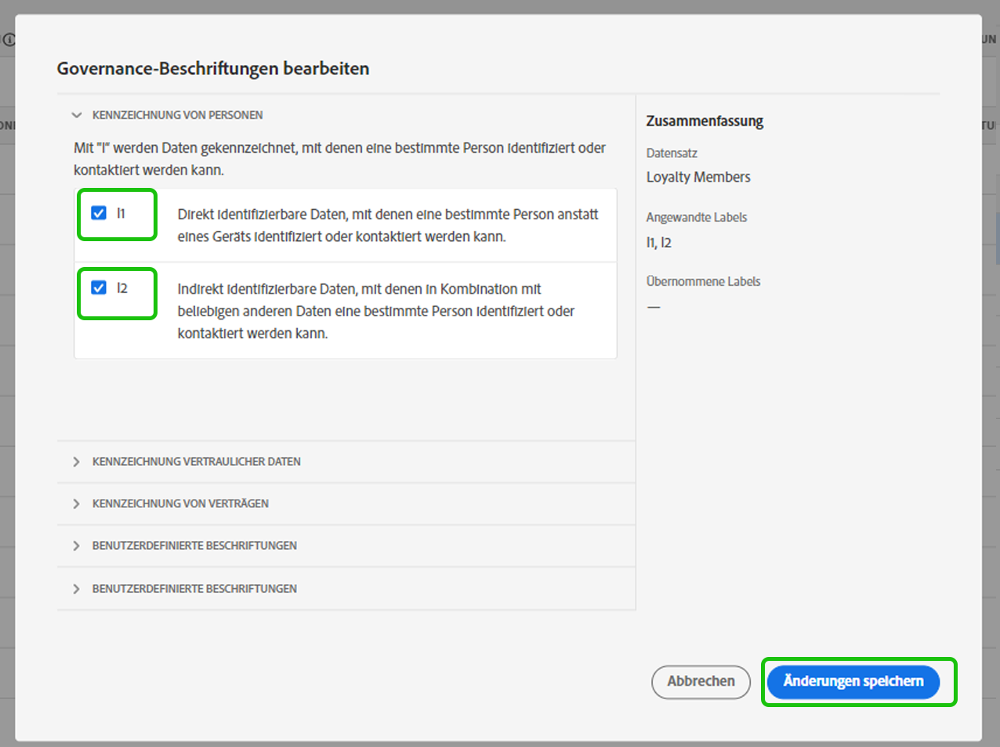
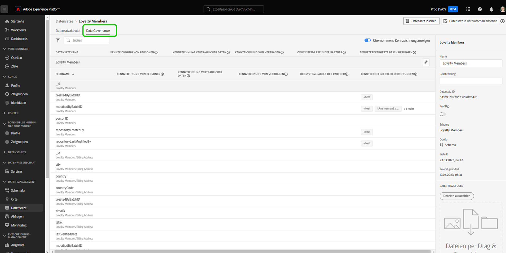
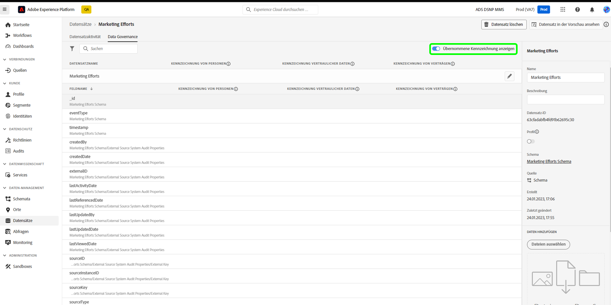
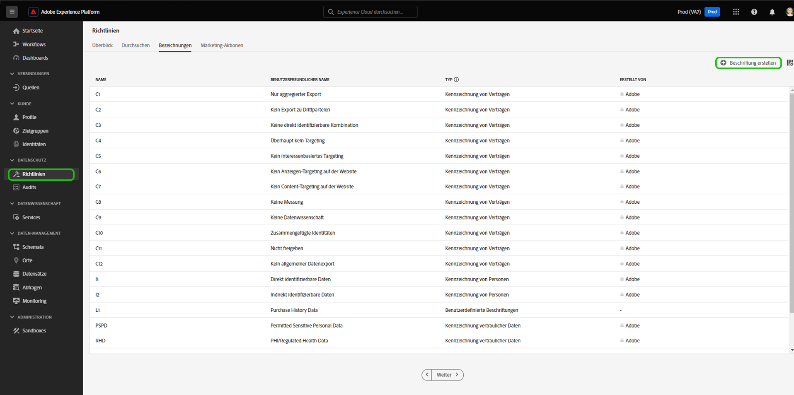
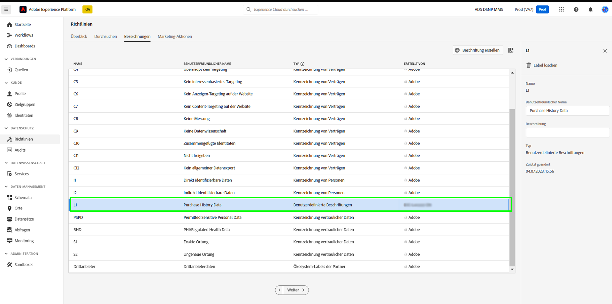
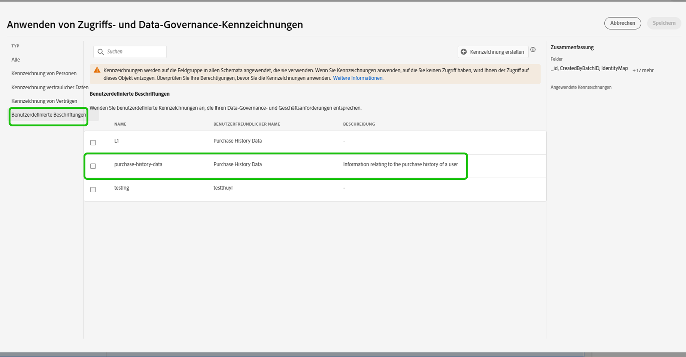

# Verwalten von Datennutzungsbeschriftungen in der Benutzeroberfläche

Dieses Benutzerhandbuch beschreibt die Schritte zum Arbeiten mit Datennutzungsbeschriftungen in der Benutzeroberfläche von [!DNL Experience Platform]. Bevor Sie dieses Handbuch lesen, konsultieren Sie die [Übersicht zu Data Governance](../home.md), wo Sie eine detailliertere Einführung in das Data Governance-Framework erhalten.

## Verwalten von Beschriftungen auf der Datensatzebene

Zum Verwalten der Datennutzungsbeschriftungen auf Datensatzebene müssen Sie einen vorhandenen Datensatz auswählen oder einen neuen erstellen. Wählen Sie nach der Anmeldung bei Adobe Experience Platform den Punkt **[!UICONTROL Datensätze]** in der linken Navigation aus, um den Arbeitsbereich **[!UICONTROL Datensätze]** zu öffnen. Auf dieser Seite werden alle erstellten Datensätze, die zu Ihrem Unternehmen gehören, sowie nützliche Details zu jedem Datensatz angezeigt.

Im nächsten Abschnitt finden Sie Schritte zum Erstellen eines neuen Datensatzes, auf den Beschriftungen angewendet werden sollen. Wenn Sie Beschriftungen für einen vorhandenen Datensatz bearbeiten möchten, wählen Sie den Datensatz aus der Liste aus und fahren Sie mit dem Punkt [Hinzufügen von Datennutzungsbeschriftungen zum Datensatz](#add-labels) fort.

### Neuen Datensatz erstellen

>[!NOTE]
>
>In diesem Beispiel wird ein Datensatz mit einem vorkonfigurierten [!DNL Experience Data Model]-Schema (XDM) erstellt. Weitere Informationen zu XDM-Schemas finden Sie unter [XDM-Systemübersicht](../../xdm/home.md) und [Grundlagen der Schemakomposition](../../xdm/schema/composition.md).

Um einen neuen Datensatz zu erstellen, klicken Sie in der oberen rechten Ecke des Arbeitsbereichs **[!UICONTROL Datensätze]** auf **[!UICONTROL Datensatz erstellen]**.

Der Bildschirm **[!UICONTROL Datensatz erstellen]** wird angezeigt. Wählen Sie dort **[!UICONTROL Datensatz aus Schema erstellen]**.

Der Bildschirm **[!UICONTROL Schema auswählen]** wird angezeigt. Dort werden alle verfügbaren Schemas aufgelistet, die Sie zum Erstellen eines Datensatzes verwenden können. Wählen Sie die Optionsschaltfläche neben einem Schema aus, um es auszuwählen. Im Bereich **[!UICONTROL Schemas]** auf der rechten Seite werden weitere Details zum ausgewählten Schema angezeigt. Nachdem Sie ein Schema ausgewählt haben, wählen Sie **[!UICONTROL Weiter]**.

Der Bildschirm **[!UICONTROL Datensatz konfigurieren]** wird angezeigt. Geben Sie einen Namen (erforderlich) und eine Beschreibung (optional, aber empfohlen) für Ihren neuen Datensatz ein und wählen Sie anschließend **[!UICONTROL Fertigstellen]**.

Die Seite **[!UICONTROL Datensatz-Aktivität]**, die Informationen zum neu erstellten Datensatz enthält, wird angezeigt. In diesem Beispiel trägt der Datensatz den Namen „Treueprogramm-Mitglieder“, daher zeigt die obere Navigation **„Datensätze“ > „Treueprogramm-Mitglieder“** an.

### Hinzufügen von Datennutzungskennzeichnungen zum Datensatz {#add-labels}

Nachdem Sie einen neuen Datensatz erstellt oder einen vorhandenen Datensatz aus der Liste im Arbeitsbereich **[!UICONTROL Datensätze]** ausgewählt haben, wählen Sie **[!UICONTROL Data Governance]**, um den Arbeitsbereich **[!UICONTROL Data Governance]** zu öffnen. Der Arbeitsbereich ermöglicht Ihnen das Verwalten von Datennutzungsbeschriftungen auf Datensatz- und Feldebene.

Um die Datennutzungsbeschriftungen auf Datensatzebene zu bearbeiten, wählen Sie zunächst das Stiftsymbol neben dem Datensatznamen aus.

Der Dialog **[!UICONTROL Governance-Beschriftungen bearbeiten]** wird geöffnet. Aktivieren Sie im Dialogfeld die Kontrollkästchen neben den Beschriftungen, die Sie auf den Datensatz anwenden möchten. Denken Sie daran, dass diese Beschriftungen von allen Feldern im Datensatz übernommen werden. Während Sie die einzelnen Kontrollkästchen auswählen, wird die Kopfzeile **[!UICONTROL Angewandte Beschriftungen]** aktualisiert, sodass sie die ausgewählten Beschriftungen anzeigt. Nachdem Sie die gewünschten Beschriftungen ausgewählt haben, wählen Sie **[!UICONTROL Änderungen speichern]**.

Der Arbeitsbereich **[!UICONTROL Data Governance]** öffnet sich wieder und zeigt die Beschriftungen an, die Sie auf Datensatzebene angewendet haben. Sie können auch sehen, dass die Beschriftungen für die einzelnen Feldern im Datensatz übernommen werden.

Beachten Sie, dass neben den Beschriftungen auf Datensatzebene ein „x“ angezeigt wird, sodass Sie die Beschriftungen entfernen können. Für die übernommenen Beschriftungen neben jedem Feld wird kein „x“ angezeigt, stattdessen sind sie ausgegraut und es gibt keine Möglichkeit, sie hier zu entfernen oder zu bearbeiten. Dies liegt daran, dass **übernommene Felder schreibgeschützt sind** und folglich nicht auf Feldebene entfernt werden können.

Der Umschalter **[!UICONTROL Übernommene Beschriftungen anzeigen]** ist standardmäßig aktiviert. Dadurch können Sie alle Beschriftungen sehen, die vom Datensatz auf seine Felder übertragen wurden. Wenn Sie den Umschalter deaktivieren, werden alle übernommenen Beschriftungen im Datensatz ausgeblendet.

## Verwalten von Bezeichnungen auf Datensatzfeldebene

Wenn Sie den Arbeitsablauf zum [Hinzufügen und Bearbeiten von Datennutzungskennzeichnungen auf Datensatzebene](#add-labels) fortsetzen, können Sie im Arbeitsbereich **[!UICONTROL Data Governance]** auch Kennzeichnungen auf Feldebene für diesen Datensatz verwalten.

Um die Datennutzungskennzeichnungen auf ein einzelnes Feld anzuwenden, aktivieren Sie das Kontrollkästchen neben dem Feldnamen und wählen Sie **[!UICONTROL Governance-Kennzeichnungen bearbeiten]**.

Das Dialogfeld **[!UICONTROL Governance-Kennzeichnungen bearbeiten]** wird angezeigt. Im Dialogfeld werden Kopfzeilen mit ausgewählten Feldern, angewendeten Kennzeichnungen und übernommenen Kennzeichnungen angezeigt. Beachten Sie, dass die übernommenen Kennzeichnungen (C2 und C5) im Dialog ausgegraut sind. Es handelt sich um schreibgeschützte Kennzeichnungen, die von der Datensatzebene übernommen werden und daher nur auf Datensatzebene bearbeitet werden können.

Wählen Sie Kennzeichnungen auf Feldebene aus, indem Sie das Kontrollkästchen neben der jeweiligen Kennzeichnung aktivieren, die Sie verwenden möchten. Wenn Sie Kennzeichnungen auswählen, wird die Kopfzeile **[!UICONTROL Angewandte Kennzeichnungen]** aktualisiert und zeigt Kennzeichnungen an, die auf die Felder angewendet werden, die in der Kopfzeile **[!UICONTROL Ausgewählte Felder]** angezeigt werden. Nachdem Sie die Kennzeichnungen auf Feldebene ausgewählt haben, wählen Sie **[!UICONTROL Änderungen speichern]**.

Der Arbeitsbereich **[!UICONTROL Data Governance]** wird wieder angezeigt und zeigt nun ausgewählte(n) Kennzeichnung(en) auf Feldebene in der Zeile neben dem Feldnamen an. Beachten Sie, dass neben der Kennzeichnung auf Feldebene ein „x“ steht, über das Sie die Kennzeichnung entfernen können.

Sie können diese Schritte wiederholen, um weiterhin Kennzeichnungen auf Feldebene für zusätzliche Felder hinzuzufügen und zu bearbeiten. Sie können auch mehrere Felder auswählen, um Kennzeichnungen auf Feldebene gleichzeitig anzuwenden.

Es ist wichtig, sich zu merken, dass die Vererbung nur von der obersten Ebene nach unten möglich ist wird (Datensatz → Felder). Das bedeutet, dass auf Feldebene angewendete Kennzeichnungen nicht in andere Felder oder Datensätze übertragen werden.

## Verwalten von Bezeichnungen auf Schemaebene

Sie können einem Schema oder Feldern innerhalb dieses Schemas direkt Beschriftungen hinzufügen. Alle auf Schemaebene angewendeten Felder werden auf alle Datensätze übertragen, die auf diesem Schema basieren.

Siehe Tutorial zu [Verwalten von Beschriftungen auf Schemaebene](../../xdm/tutorials/labels.md) für weitere Informationen.

## Verwalten von benutzerdefinierten Kennzeichnungen {#manage-custom-labels}

>[!CONTEXTUALHELP]
>id="platform_governance_createlabels"
>title="Erstellen von Bezeichnungen"
>abstract="Mit Beschriftungen können Sie Datensätze und Felder entsprechend den für diese Daten geltenden Nutzungsrichtlinien kategorisieren. Platform bietet einen Standardsatz von Bezeichnungen, die Sie verwenden können. Sie können aber auch benutzerdefinierte Bezeichnungen erstellen, die für Ihr Unternehmen spezifisch sind."

Sie können Ihre eigenen benutzerspezifischen Nutzungskennzeichnungen im Arbeitsbereich **[!UICONTROL Richtlinien]** in der Benutzeroberfläche von [!DNL Experience Platform] erstellen. Wählen Sie **[!UICONTROL Richtlinien]** in der linken Navigation und anschließend **[!UICONTROL Kennzeichnungen]**, um eine Liste der vorhandenen Kennzeichnungen zu sehen. Wählen Sie dort **[!UICONTROL Kennzeichnung erstellen]**.

Das Dialogfeld **[!UICONTROL Kennzeichnung erstellen]** wird angezeigt. Geben Sie nun die folgenden Informationen für die neue Kennzeichnung ein:

* **[!UICONTROL Kennung]**: Eine eindeutige Kennung für die Kennzeichnung. Dieser Wert wird für Suchen verwendet und sollte daher kurz und knapp sein.
* **[!UICONTROL Name]**: Ein Anzeigename für die Kennzeichnung.
* **[!UICONTROL Beschreibung]**: (Optional) Eine Beschreibung für die Kennzeichnung, um mehr Kontext bereitzustellen.

Klicken Sie abschließend auf **[!UICONTROL Erstellen]**.

Das Dialogfeld wird geschlossen und die neu erstellte benutzerdefinierte Kennzeichnung wird in der Liste unter der Registerkarte **[!UICONTROL Kennzeichnungen]** angezeigt.

Die Kennzeichnung kann jetzt unter **[!UICONTROL Benutzerdefinierte Kennzeichnungen]** ausgewählt werden, wenn Kennzeichnungen für Datensätze und Felder bearbeitet oder Datennutzungsrichtlinien erstellt werden.

 

## Nächste Schritte

Nachdem Sie Datennutzungskennzeichnungen auf Datensatz- und Feldebene hinzugefügt haben, können Sie damit beginnen, Daten in [!DNL Experience Platform] zu erfassen. Weitere Informationen erhalten Sie in der [Dokumentation zur Datenaufnahme](../../ingestion/home.md).

Sie können jetzt auch Datennutzungsrichtlinien auf Basis der von Ihnen angewendeten Kennzeichnungen definieren. Weitere Informationen finden Sie unter [Datennutzungsrichtlinien – Übersicht](../policies/overview.md).

## Zusätzliche Ressourcen

Das folgende Video hilft Ihnen, Data Governance besser zu verstehen, und beschreibt, wie Kennzeichnungen auf einen Datensatz und einzelne Felder angewendet werden.

>[!VIDEO](https://video.tv.adobe.com/v/29709?quality=12&enable10seconds=on&speedcontrol=on)
