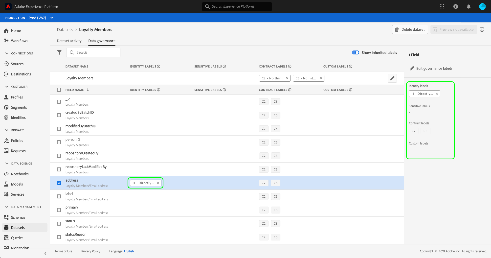

# Verwalten von Datenverwendungsbeschriftungen in der Benutzeroberfläche

Dieses Benutzerhandbuch beschreibt die Schritte zum Arbeiten mit Datenverwendungsbeschriftungen in der [!DNL Experience Platform]-Benutzeroberfläche. Bevor Sie das Handbuch verwenden, lesen Sie bitte den [[!DNL Data Governance] overview](../home.md) für eine stabilere Einführung in das [!DNL Data Governance]-Framework.

## Verwalten von Beschriftungen auf der Ebene des Datensatzes

Zur Verwaltung der Datenverwendungsbeschriftungen auf Datensatzebene müssen Sie einen vorhandenen Datensatz auswählen oder einen neuen erstellen. Nach der Anmeldung bei Adobe Experience Platform wählen Sie **[!UICONTROL Datensätze]** in der linken Navigation aus, um den Arbeitsbereich **[!UICONTROL Datensätze]** zu öffnen. Auf dieser Seite werden alle erstellten Datensätze, die zu Ihrem Unternehmen gehören, sowie nützliche Details zu jedem Datensatz Liste.

Im nächsten Abschnitt finden Sie Schritte zum Erstellen eines neuen Datensatzes, auf den Beschriftungen angewendet werden sollen. Wenn Sie Bezeichnungen für einen vorhandenen Datensatz bearbeiten möchten, wählen Sie den Datensatz aus der Liste aus und fahren Sie fort mit [Hinzufügen von Bezeichnungen zur Datenverwendung zum Datensatz](#add-labels).

### Neuen Datensatz erstellen

>[!NOTE]
>
>In diesem Beispiel wird ein Datensatz mit einem vorkonfigurierten [!DNL Experience Data Model] (XDM)-Schema erstellt. Weitere Informationen zu XDM-Schemas finden Sie unter [XDM-Systemübersicht](../../xdm/home.md) und [Grundlagen der Schema-Komposition](../../xdm/schema/composition.md).

Um einen neuen Datensatz zu erstellen, wählen Sie **[!UICONTROL Datensatz erstellen]** in der oberen rechten Ecke des Arbeitsbereichs **[!UICONTROL Datensätze]**.

Der Bildschirm **[!UICONTROL Datensatz erstellen]** wird angezeigt. Wählen Sie **[!UICONTROL Datensatz aus Schema]** erstellen.

Der Bildschirm **[!UICONTROL Schema auswählen]** wird angezeigt, in dem alle verfügbaren Schema Liste werden, die Sie zum Erstellen eines Datensatzes verwenden können. Wählen Sie das Optionsfeld neben einem Schema aus, um es auszuwählen. Im Bereich **[!UICONTROL Schema]** auf der rechten Seite werden weitere Details zum ausgewählten Schema angezeigt. Nachdem Sie ein Schema ausgewählt haben, wählen Sie **[!UICONTROL Weiter]**.

Der Bildschirm **[!UICONTROL Datensatz konfigurieren]** wird angezeigt. Geben Sie einen Namen (erforderlich) und eine Beschreibung (optional, aber empfohlen) für Ihren neuen Datensatz ein und wählen Sie **[!UICONTROL Fertigstellen]**.

Die Aktivität **[!UICONTROL Datensatz]** wird mit Informationen zum neu erstellten Datensatz angezeigt. In diesem Beispiel trägt der Datensatz den Namen &quot;Treuemitglieder&quot;, daher zeigt die Top-Navigation **Datensätze > Treuemitglieder** an.

### hinzufügen die Beschriftungen für die Datenverwendung mit dem Dataset {#add-labels}

Nachdem Sie einen neuen Datensatz erstellt oder einen vorhandenen Datensatz aus der Liste im Arbeitsbereich **[!UICONTROL Datensätze]** ausgewählt haben, wählen Sie **[!UICONTROL Datenverwaltung]**, um den Arbeitsbereich **[!UICONTROL Datenverwaltung]** zu öffnen. Der Arbeitsbereich ermöglicht Ihnen die Verwaltung von Beschriftungen für die Datenverwendung auf Datensatzebene und Feldebene.

Um die Beschriftungen für die Datenverwendung auf Datensatzebene zu bearbeiten, wählen Sie im Beginn das Stiftsymbol neben dem Datasetnamen aus.

Das Dialogfeld **[!UICONTROL Governance-Bezeichnungen bearbeiten]** wird geöffnet. Aktivieren Sie im Dialogfeld die Kontrollkästchen neben den Beschriftungen, die Sie auf den Datensatz anwenden möchten. Denken Sie daran, dass diese Beschriftungen von allen Feldern im Datensatz übernommen werden. Die Kopfzeile **[!UICONTROL Angewandte Bezeichnungen]** wird aktualisiert, wenn Sie die einzelnen Felder markieren, und zeigt die ausgewählten Bezeichnungen an. Nachdem Sie die gewünschten Bezeichnungen ausgewählt haben, wählen Sie **[!UICONTROL Änderungen speichern]**.

Der Arbeitsbereich **[!UICONTROL Datenverwaltung]** wird wieder angezeigt und zeigt die Beschriftungen an, die Sie auf Datensatzebene angewendet haben. Sie können auch sehen, dass die Beschriftungen bis zu den einzelnen Feldern im Datensatz geerbt werden.

Beachten Sie, dass neben den Beschriftungen auf Datensatzebene ein &quot;x&quot;angezeigt wird, sodass Sie die Beschriftungen entfernen können. Die geerbten Beschriftungen neben jedem Feld haben kein &quot;x&quot; neben ihnen und erscheinen als &quot;grau ausgegraut&quot;, ohne dass sie entfernt oder bearbeitet werden können. Dies liegt daran, dass geerbte Felder schreibgeschützt sind, d. h. sie können nicht auf Feldebene entfernt werden.****

Der Umschalter **[!UICONTROL Vererbte Bezeichnungen anzeigen]** ist standardmäßig aktiviert. Dadurch können Sie alle Bezeichnungen sehen, die vom Datensatz bis zu seinen Feldern geerbt wurden. Wenn Sie den Umschalter deaktivieren, werden alle geerbten Beschriftungen im Datensatz ausgeblendet.

## Verwalten von Beschriftungen auf Feldebene

Wenn Sie den Arbeitsablauf für [Hinzufügen und Bearbeiten von Beschriftungen zur Datenverwendung auf Datensatzebene](#add-labels) fortsetzen, können Sie auch Beschriftungen auf Feldebene im Arbeitsbereich **[!UICONTROL Datenverwaltung]** für diesen Datensatz verwalten.

Um die Beschriftungen für die Datenverwendung auf ein einzelnes Feld anzuwenden, aktivieren Sie das Kontrollkästchen neben dem Feldnamen und wählen Sie **[!UICONTROL Governance-Bezeichnungen bearbeiten]**.

Das Dialogfeld **[!UICONTROL Governance-Bezeichnungen bearbeiten]** wird angezeigt. Im Dialogfeld werden Kopfzeilen mit ausgewählten Feldern, angewendeten Beschriftungen und geerbten Beschriftungen angezeigt. Beachten Sie, dass die geerbten Beschriftungen (C2 und C5) im Dialogfeld grau dargestellt werden. Es handelt sich um schreibgeschützte Bezeichnungen, die von der Datensatzebene übernommen werden und daher nur auf Datensatzebene bearbeitet werden können.

Wählen Sie Beschriftungen auf Feldebene aus, indem Sie das Kontrollkästchen neben der jeweiligen Beschriftung aktivieren, die Sie verwenden möchten. Wenn Sie Beschriftungen auswählen, wird die Kopfzeile **[!UICONTROL Angewandte Beschriftungen]** aktualisiert und zeigt Beschriftungen an, die auf die Felder angewendet werden, die in der Kopfzeile **[!UICONTROL Ausgewählte Felder]** angezeigt werden. Nachdem Sie die Feldbezeichnungen ausgewählt haben, wählen Sie **[!UICONTROL Änderungen speichern]**.

Der Arbeitsbereich **[!UICONTROL Datenverwaltung]** wird wieder angezeigt, in dem die ausgewählten Beschriftungen auf Feldebene in der Zeile neben dem Feldnamen angezeigt werden. Beachten Sie, dass neben der Beschriftung auf Feldebene ein &quot;x&quot;steht, sodass Sie die Beschriftung entfernen können.

Sie können diese Schritte wiederholen, um weiterhin Beschriftungen auf Feldebene für zusätzliche Felder hinzuzufügen und zu bearbeiten, einschließlich der Auswahl mehrerer Felder, um Beschriftungen auf Feldebene gleichzeitig anzuwenden.

Es ist wichtig, sich zu merken, dass die Vererbung nur von der obersten Ebene nach unten verschoben wird (Dataset → Felder), d. h. dass auf Feldebene angewendete Beschriftungen nicht in andere Felder oder Datensätze übertragen werden.

## Benutzerdefinierte Beschriftungen verwalten

Sie können Ihre eigenen benutzerdefinierten Nutzungsbezeichnungen im Arbeitsbereich **[!UICONTROL Richtlinien]** der [!DNL Experience Platform]-Benutzeroberfläche erstellen. Wählen Sie **[!UICONTROL Richtlinien]** in der linken Navigation und dann **[!UICONTROL Bezeichnungen]** aus, um eine Liste der vorhandenen Bezeichnungen Ansicht. Wählen Sie **[!UICONTROL Beschriftung]** erstellen.

Das Dialogfeld **[!UICONTROL Beschriftung erstellen]** wird angezeigt. Geben Sie von hier aus die folgenden Informationen für die neue Beschriftung ein:

* **[!UICONTROL Bezeichner]**: Eine eindeutige Kennung für die Bezeichnung. Dieser Wert wird für Nachschlagezwecke verwendet und sollte daher kurz und knapp sein.
* **[!UICONTROL Name]**: Ein Anzeigename für die Beschriftung.
* **[!UICONTROL Beschreibung]**: (Optional) Eine Beschreibung für die Bezeichnung, um weiteren Kontext bereitzustellen.

Wenn Sie fertig sind, wählen Sie **[!UICONTROL Erstellen]**.

Das Dialogfeld wird geschlossen und die neu erstellte benutzerdefinierte Bezeichnung wird in der Liste unter der Registerkarte **[!UICONTROL Beschriftungen]** angezeigt.

Die Beschriftung kann jetzt unter **[!UICONTROL Benutzerdefinierte Beschriftungen]** ausgewählt werden, wenn die Beschriftungen für Datasets und Felder bearbeitet oder Datenverwendungsrichtlinien erstellt werden.

 

## Nächste Schritte

Nachdem Sie Datenverwendungsbezeichnungen auf der Ebene des Datensatzes und der Felder hinzugefügt haben, können Sie beginnen, Daten in [!DNL Experience Platform] zu erfassen. Weitere Informationen erhalten Sie im Beginn in der [Datenerhebungsdokumentation](../../ingestion/home.md).

Sie können jetzt auch Datenverwendungsrichtlinien auf Basis der von Ihnen angewendeten Beschriftungen definieren. Weitere Informationen finden Sie unter [Übersicht über Datenverwendungsrichtlinien](../policies/overview.md).

## Zusätzliche Ressourcen

Das folgende Video soll Ihr Verständnis von [!DNL Data Governance] unterstützen und beschreibt, wie Beschriftungen auf einen Datensatz und einzelne Felder angewendet werden.

>[!VIDEO](https://video.tv.adobe.com/v/29709?quality=12&enable10seconds=on&speedcontrol=on)
