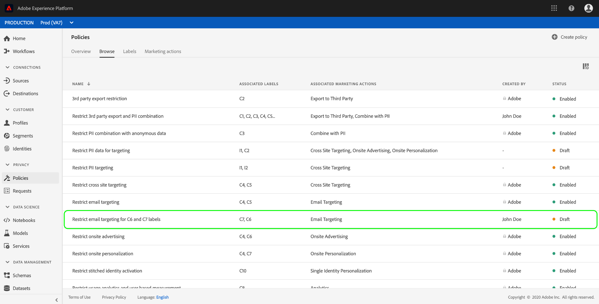
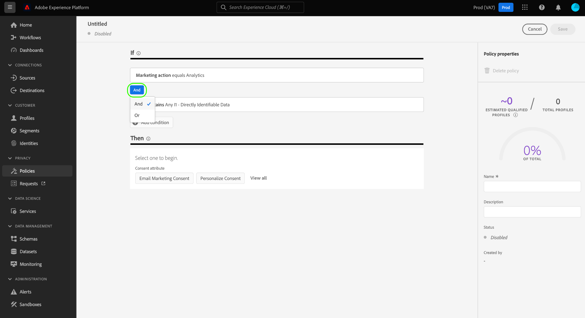
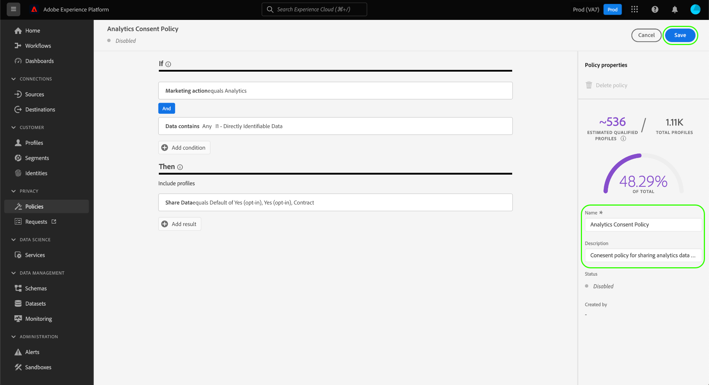
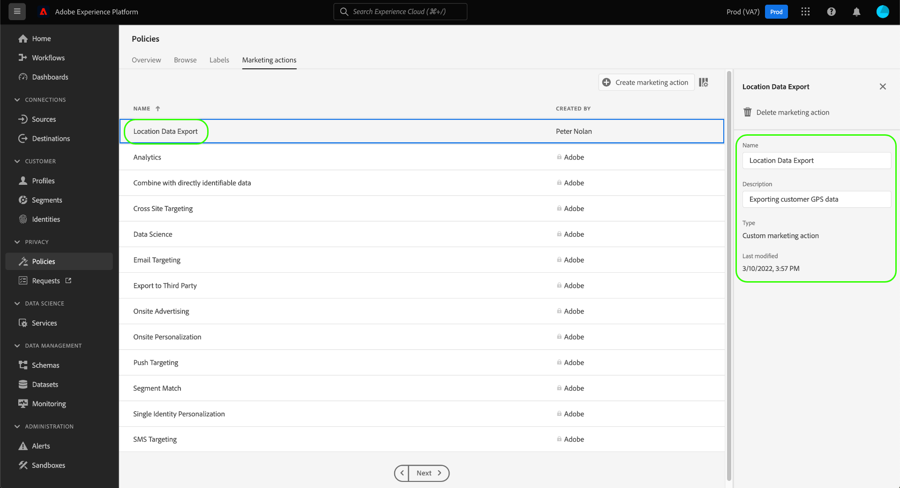

# Verwalten von Datennutzungsrichtlinien in der Benutzeroberfläche {#user-guide}

>[!CONTEXTUALHELP]
>id="platform_privacyConsole_dataUsagePolicies_description"
>title="Integrieren und Durchsetzen des Kundeneinverständnisses in Ihren Profildaten"
>abstract="<h2>Beschreibung</h2>
Mit Platform können Sie die von Ihren Kundinnen und Kunden erfassten Einverständnisdaten in ihre jeweiligen Profile integrieren. Anschließend können Sie Einverständnisrichtlinien einrichten, um zu bestimmen, ob diese Daten in Segmente aufgenommen werden können, die für bestimmte Ziele aktiviert sind.
"

Dieses Dokument beschreibt, wie Sie den Arbeitsbereich **[!UICONTROL Richtlinien]** in der Adobe Experience Platform-Benutzeroberfläche verwenden, um Richtlinien zur Datennutzung zu erstellen und zu verwalten.

>[!NOTE]
>
>Informationen über die Verwaltung von Zugriffssteuerungsrichtlinien in der Benutzeroberfläche finden Sie dagegen im [Handbuch für die Benutzeroberfläche der attributbasierten Zugriffssteuerung](../../access-control/abac/ui/policies.md).

>[!IMPORTANT]
>
>Alle Datennutzungsrichtlinien (einschließlich der von Adobe bereitgestellten Kernrichtlinien) sind standardmäßig deaktiviert. Damit eine einzelne Richtlinie zur Durchsetzung in Betracht gezogen werden kann, müssen Sie diese Richtlinie manuell aktivieren. Anweisungen dazu, wie Sie dies in der Benutzeroberfläche tun, finden Sie im Abschnitt [Aktivieren von Richtlinien](#enable).

## Voraussetzungen

Dieses Handbuch setzt ein Verständnis der folgenden [!DNL Experience Platform]-Konzepte voraus:

* [Data Governance](../home.md)
* [Datennutzungsrichtlinien](./overview.md)

## Aufrufen bestehender Richtlinien {#view-policies}

Klicken Sie in der Benutzeroberfläche von [!DNL Experience Platform] auf **[!UICONTROL Richtlinien]**, um den Arbeitsbereich **[!UICONTROL Richtlinien]** zu öffnen. Auf der Registerkarte **[!UICONTROL Durchsuchen]** wird eine Liste der verfügbaren Richtlinien angezeigt, einschließlich der zugehörigen Bezeichnungen, Marketing-Aktionen und Status.

Wenn Sie Zugriff auf Einverständnisrichtlinien haben, wählen Sie den Umschalter **[!UICONTROL Einverständnisrichtlinien]**, um die Richtlinien auf der Registerkarte [!UICONTROL Durchsuchen] anzuzeigen.

Klicken Sie auf eine aufgelistete Richtlinie, um deren Beschreibung und Typ anzuzeigen. Wenn eine benutzerdefinierte Richtlinie ausgewählt ist, werden zusätzliche Steuerelemente zum Bearbeiten, Löschen oder [Aktivieren/Deaktivieren der Richtlinie](#enable) angezeigt.

## Erstellen einer benutzerdefinierten Richtlinie {#create-policy}

Um eine neue benutzerdefinierte Datennutzungsrichtlinie zu erstellen, klicken Sie in der oberen rechten Ecke der Registerkarte **[!UICONTROL Durchsuchen]** im Arbeitsbereich **[!UICONTROL Richtlinien]** auf **[!UICONTROL Richtlinie erstellen]**.

Je nachdem, ob Sie am Betatest für Einverständnisrichtlinien teilnehmen oder nicht, tritt eine der folgenden Situationen ein:

* Wenn Sie nicht am Betatest teilnehmen, werden Sie sofort zum Workflow zum [Erstellen einer Data Governance-Richtlinie](#create-governance-policy) weitergeleitet.
* Wenn Sie am Betatest teilnehmen, bietet ein Dialogfeld eine zusätzliche Option zum [Erstellen einer Einverständnisrichtlinie](#consent-policy).
   

### Erstellen einer Data Governance-Richtlinie {#create-governance-policy}

Der Workflow **[!UICONTROL Richtlinie erstellen]** wird angezeigt. Geben Sie zunächst einen Namen und eine Beschreibung für die neue Richtlinie an.

Wählen Sie anschließend die Datennutzungsbezeichnungen aus, auf denen die Richtlinie basieren soll. Wenn Sie mehrere Bezeichnungen auswählen, können Sie entscheiden, ob die Daten alle Bezeichnungen oder nur eine der Bezeichnungen enthalten müssen, damit die Richtlinie angewendet wird. Klicken Sie auf **[!UICONTROL Weiter]**, wenn Sie fertig sind.

Der Schritt **[!UICONTROL Marketing-Aktionen auswählen]** wird angezeigt. Wählen Sie die entsprechenden Marketing-Aktionen aus der bereitgestellten Liste und klicken Sie dann auf **[!UICONTROL Weiter]**, um fortzufahren.

>[!NOTE]
>
>Bei Auswahl mehrerer Marketing-Aktionen interpretiert die Richtlinie diese als „OR“-Regel. Mit anderen Worten: Die Richtlinie findet Anwendung, wenn **beliebige** der ausgewählten Marketing-Aktionen ausgeführt werden.

Der Schritt **[!UICONTROL Überprüfung]** wird angezeigt, in dem Sie die Details der neuen Richtlinie vor der Erstellung überprüfen können. Wenn Sie zufrieden sind, klicken Sie auf **[!UICONTROL Fertig stellen]**, um die Richtlinie zu erstellen.

Die Registerkarte **[!UICONTROL Durchsuchen]** wird erneut angezeigt, wo die neu erstellte Richtlinie jetzt mit dem Status „Entwurf“ aufgelistet wird. Informationen zum Aktivieren der Richtlinie finden Sie im nächsten Abschnitt.

### Erstellen einer Einverständnisrichtlinie {#consent-policy}

>[!CONTEXTUALHELP]
>id="platform_privacyConsole_dataUsagePolicies_instructions"
>title="Anleitung"
>abstract="<ul><li>Stellen Sie sicher, dass Sie Voreinstellungsdaten über den OneTrust-Quell-Connector oder das Standard-XDM-Schema zur Zustimmung in Ihre Vereinigungsschemata aufnehmen.</li><li>Wählen Sie im linken Navigationsbereich <a href="https://experienceleague.adobe.com/docs/experience-platform/data-governance/policies/overview.html?lang=de">Richtlinien</a> und dann die Option <a href="https://experienceleague.adobe.com/docs/experience-platform/data-governance/policies/user-guide.html?lang=de#create-governance-policy">Richtlinie erstellen</a> aus.</li><li>Beschreiben Sie im Abschnitt <b>Wenn</b> die Bedingungen oder Aktionen, die die Richtlinienüberprüfung auslösen sollen.</li><li>Geben Sie im Abschnitt <b>Dann</b> die Einverständnisattribute an, die vorhanden sein müssen, damit ein Profil in die Aktion, die die Richtlinie ausgelöst hat, einbezogen wird.</li><li>Klicken Sie auf <b>Speichern</b>, um die Richtlinie zu erstellen. Um die Richtlinie zu aktivieren, klicken Sie in der rechten Leiste auf den Umschalter <b>Status</b>.</li><li>Experience Platform erzwingt automatisch Ihre aktivierten Einverständnisrichtlinien, wenn Sie Segmente für Ziele aktivieren, und liefert Details dazu, wie sich die einzelnen Richtlinien auf Ihre Zielgruppengröße auswirken.</li><li>Weitere Hilfe zu dieser Funktion finden Sie im Handbuch zum <a href="https://experienceleague.adobe.com/docs/experience-platform/data-governance/policies/user-guide.html?lang=de#consent-policy">Erstellen von Einverständnisrichtlinien</a> auf Experience League.</li></ul>"

>[!IMPORTANT]
>
>Einverständnisrichtlinien sind nur für Organisationen verfügbar, die **Adobe Healthcare Shield** oder **Adobe Privacy &amp; Security Shield** erworben haben.

Wenn Sie sich für das Erstellen einer Einverständnisrichtlinie entschieden haben, wird ein weiterer Bildschirm angezeigt, in dem Sie die neue Richtlinie konfigurieren können.

Um Einverständnisrichtlinien verwenden zu können, müssen in Ihren Profildaten Einverständnisattribute vorhanden sein. Detaillierte Schritte zum Einschließen der erforderlichen Attribute in Ihr Vereinigungsschema finden Sie im Handbuch zur [Einverständnisverarbeitung in Experience Platform](../../landing/governance-privacy-security/consent/adobe/overview.md).

Einverständnisrichtlinien bestehen aus zwei logischen Komponenten:

* **[!UICONTROL If]**: Die Bedingung, die eine Richtlinienüberprüfung auslöst. Dies kann auf der Durchführung einer bestimmten Marketing-Aktion, dem Vorhandensein bestimmter Datennutzungskennzeichnungen oder einer Kombination aus beidem beruhen.
* **[!UICONTROL Then]**: Die Einverständnisattribute, die vorhanden sein müssen, damit ein Profil in die Aktion, die die Richtlinie ausgelöst hat, einbezogen wird.

#### Konfigurieren von Bedingungen {#consent-conditions}

>[!CONTEXTUALHELP]
>id="platform_governance_policies_consentif"
>title="If-Bedingung"
>abstract="Definieren Sie zunächst die Bedingungen, unter denen die Richtlinienüberprüfung ausgelöst wird. Bedingungen können die Durchführung bestimmter Marketing-Aktionen, das Vorhandensein bestimmter Data Governance-Bezeichnungen oder eine Kombination aus beidem umfassen."

Im Abschnitt **[!UICONTROL If]** wählen Sie die Marketing-Aktionen und/oder Datennutzungskennzeichnungen aus, die diese Richtlinie auslösen sollen. Wählen Sie **[!UICONTROL Alle anzeigen]** und **[!UICONTROL Titel auswählen]** aus, um die vollständigen Listen der verfügbaren Marketing-Aktionen bzw. Bezeichnungen anzuzeigen.

Nachdem Sie mindestens eine Bedingung hinzugefügt haben, können Sie **[!UICONTROL Bedingung hinzufügen]** auswählen, um weitere Bedingungen nach Bedarf hinzuzufügen, indem Sie den entsprechenden Bedingungstyp aus der Dropdown-Liste auswählen.

Wenn Sie mehrere Bedingungen auswählen, können Sie mit dem zwischen ihnen angezeigten Symbol die Beziehung zwischen den Bedingungen von „AND“ in „OR“ oder umgekehrt ändern.

#### Auswählen von Einverständnisattributen {#consent-attributes}

>[!CONTEXTUALHELP]
>id="platform_governance_policies_consentthen"
>title="Then-Bedingung"
>abstract="Nachdem Sie eine „If“-Bedingung definiert haben, wählen Sie im Abschnitt „Then“ mindestens ein Einverständnisattribut aus dem Vereinigungsschema aus. Dies ist das Attribut, das vorhanden sein muss, damit Profile in die Aktion einbezogen werden, die durch diese Richtlinie geregelt wird."

Wählen Sie im Abschnitt **[!UICONTROL Then]** mindestens ein Einverständnisattribut aus dem Vereinigungsschema aus. Dies ist das Attribut, das vorhanden sein muss, damit Profile in die Aktion einbezogen werden, die durch diese Richtlinie geregelt wird. Sie können eine der angebotenen Optionen aus der Liste auswählen oder auf **[!UICONTROL Alle anzeigen]** klicken, um das Attribut direkt aus dem Vereinigungsschema auszuwählen.

Wählen Sie beim Auswählen des Einverständnisattributs die Attributwerte aus, auf die diese Richtlinie prüfen soll.

Nachdem Sie mindestens ein Einverständnisattribut ausgewählt haben, wird der Bereich **[!UICONTROL Richtlinieneigenschaften]** aktualisiert, um die geschätzte Anzahl von Profilen anzuzeigen, die im Rahmen dieser Richtlinie zulässig wären, einschließlich des Prozentsatzes am gesamten Profilspeicher. Diese Schätzung wird automatisch aktualisiert, wenn Sie die Richtlinienkonfiguration anpassen.

Um der Richtlinie weitere Einverständnisattribute hinzuzufügen, wählen Sie **[!UICONTROL Ergebnis hinzufügen]** aus.

Sie können der Richtlinie nach Bedarf weitere Bedingungen und Zustimmungsattribute hinzufügen und diese anpassen. Wenn Sie mit der Konfiguration zufrieden sind, geben Sie einen Namen und eine optionale Beschreibung für die Richtlinie ein, bevor Sie auf **[!UICONTROL Speichern]** klicken.

Die Einversändnisrichtlinie wird jetzt erstellt, wobei ihr Status standardmäßig auf [!UICONTROL Deaktiviert] festgelegt wird. Um die Richtlinie sofort zu aktivieren, klicken Sie in der rechten Leiste auf den Umschalter **[!UICONTROL Status]**.

#### Überprüfen der Richtliniendurchsetzung

Nachdem Sie eine Einverständnisrichtlinie erstellt und aktiviert haben, können Sie sich in einer Vorschau ansehen, wie sie sich auf die Zielgruppen auswirkt, wenn Segmente für Ziele aktiviert werden. Weitere Informationen finden Sie im Abschnitt zur [Bewertung der Einverständnisrichtlinie](../enforcement/auto-enforcement.md#consent-policy-evaluation).

## Aktivieren oder Deaktivieren einer Richtlinie {#enable}

Alle Datennutzungsrichtlinien (einschließlich der von Adobe bereitgestellten Kernrichtlinien) sind standardmäßig deaktiviert. Damit eine einzelne Richtlinie bei der Durchsetzung berücksichtigt werden kann, müssen Sie diese Richtlinie manuell über die API oder die Benutzeroberfläche aktivieren.

Sie können benutzerdefinierte Datennutzungsrichtlinien im Arbeitsbereich **[!UICONTROL Richtlinien]** auf der Registerkarte **[!UICONTROL Durchsuchen]** aktivieren oder deaktivieren. Wählen Sie eine benutzerdefinierte Richtlinie aus der Liste, um auf der rechten Seite die entsprechenden Details anzuzeigen. Klicken Sie unter **[!UICONTROL Status]** auf die Schaltfläche zum Umschalten, um die Richtlinie zu aktivieren oder zu deaktivieren.

## Aufrufen von Marketing-Aktionen {#view-marketing-actions}

Wählen Sie im Arbeitsbereich **[!UICONTROL Richtlinien]** die Registerkarte **[!UICONTROL Marketing-Aktionen]**, um eine Liste der verfügbaren Marketing-Aktionen anzuzeigen, die von Adobe und Ihrem eigenen Unternehmen definiert worden sind.

## Erstellen einer Marketing-Aktion {#create-marketing-action}

Um eine neue benutzerdefinierte Marketing-Aktion zu erstellen, wählen Sie **[!UICONTROL Marketing-Aktion erstellen]** in der oberen rechten Ecke der Registerkarte **[!UICONTROL Marketing-Aktionen]** im Arbeitsbereich **[!UICONTROL Richtlinien]**.

Das Dialogfeld **[!UICONTROL Marketing-Aktion erstellen]** wird angezeigt. Geben Sie einen Namen und eine Beschreibung für die Marketing-Aktion ein und wählen Sie **[!UICONTROL Erstellen]**.

Die neu erstellte Aktion wird auf der Registerkarte **[!UICONTROL Marketing-Aktionen]** angezeigt. Sie können die Marketing-Aktion jetzt verwenden, wenn Sie [neue Datennutzungsrichtlinien erstellen](#create-policy).

## Bearbeiten oder Löschen einer Marketing-Aktion {#edit-delete-marketing-action}

>[!NOTE]
>
>Es können nur benutzerdefinierte Marketing-Aktionen bearbeitet werden, die von Ihrer Organisation definiert wurden. Durch Adobe definierte Marketing-Aktionen können nicht geändert oder gelöscht werden.

Wählen Sie im Arbeitsbereich **[!UICONTROL Richtlinien]** die Registerkarte **[!UICONTROL Marketing-Aktionen]**, um eine Liste der verfügbaren Marketing-Aktionen anzuzeigen, die von Adobe und Ihrem eigenen Unternehmen definiert worden sind. Wählen Sie eine benutzerdefinierte Marketing-Aktion aus der Liste und bearbeiten Sie dann die Details der Marketing-Aktion mit den entsprechenden Feldern im rechten Bereich.

Wenn die Marketing-Aktion von keiner der vorhandenen Nutzungsrichtlinien verwendet wird, können Sie sie löschen, indem Sie **[!UICONTROL Marketing-Aktion löschen]** auswählen.

>[!NOTE]
>
>Beim Versuch, eine Marketing-Aktion zu löschen, die von einer vorhandenen Richtlinie verwendet wird, wird eine Fehlermeldung angezeigt, die darauf hinweist, dass der Löschversuch fehlgeschlagen ist.

## Nächste Schritte

Dieses Dokument hat Ihnen einen Überblick darüber verschafft, wie Datennutzungsrichtlinien in der Benutzeroberfläche von [!DNL Experience Platform] verwaltet werden. Anweisungen zum Verwalten von Richtlinien mit [!DNL Policy Service API] finden Sie im [Entwicklerhandbuch](../api/getting-started.md). Informationen zum Erzwingen von Datennutzungsrichtlinien finden Sie in der [Übersicht zur Durchsetzung von Richtlinien](../enforcement/overview.md).

Das folgende Video zeigt, wie Sie in der [!DNL Experience Platform]-Benutzeroberfläche mit Nutzungsrichtlinien arbeiten:

>[!VIDEO](https://video.tv.adobe.com/v/32977?quality=12&learn=on)
