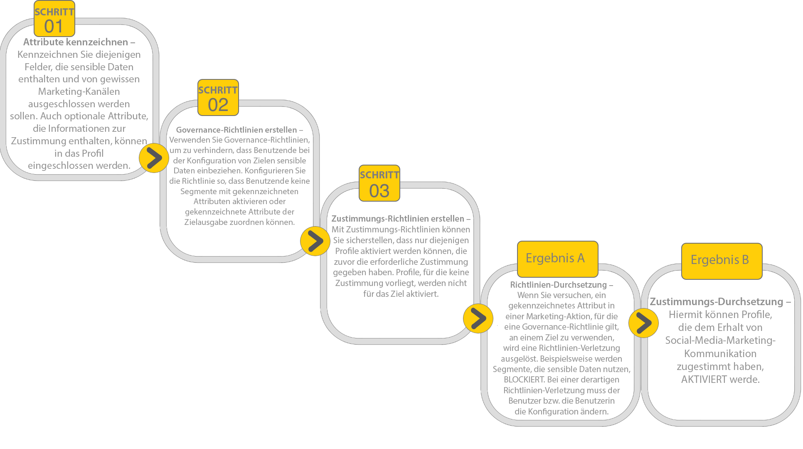

# Verwalten von Datennutzungsrichtlinien in der Benutzeroberfläche {#user-guide}

>[!CONTEXTUALHELP]
>id="platform_privacyConsole_dataUsagePolicies_description"
>title="Integrieren und Durchsetzen des Kundeneinverständnisses in Ihren Profildaten"
>abstract="<h2>Beschreibung</h2>
Mit Experience Platform können die von Kundinnen und Kunden erfassten Einverständnisdaten in ihre jeweiligen Profile integriert werden. Anschließend können Sie Einverständnisrichtlinien einrichten, um zu bestimmen, ob diese Daten in Segmente aufgenommen werden können, die für bestimmte Ziele aktiviert sind.
"

In diesem Dokument wird beschrieben, wie Sie den **[!UICONTROL Policies]**-Arbeitsbereich in der Adobe Experience Platform-Benutzeroberfläche verwenden, um Datennutzungsrichtlinien zu erstellen und zu verwalten.

>[!NOTE]
>
>Informationen über die Verwaltung von Zugriffssteuerungsrichtlinien in der Benutzeroberfläche finden Sie dagegen im [Handbuch für die Benutzeroberfläche der attributbasierten Zugriffssteuerung](../../access-control/abac/ui/policies.md).

>[!IMPORTANT]
>
>Alle Datennutzungsrichtlinien (einschließlich der von Adobe bereitgestellten Kernrichtlinien) sind standardmäßig deaktiviert. Damit eine einzelne Richtlinie zur Durchsetzung in Betracht gezogen werden kann, müssen Sie diese Richtlinie manuell aktivieren. Anweisungen dazu, wie Sie dies in der Benutzeroberfläche tun, finden Sie im Abschnitt [Aktivieren von Richtlinien](#enable).

## Voraussetzungen

Dieses Handbuch setzt ein Verständnis der folgenden [!DNL Experience Platform]-Konzepte voraus:

* [Data Governance](../home.md)
* [Datennutzungsrichtlinien](./overview.md)

## Aufrufen bestehender Richtlinien {#view-policies}

Wählen Sie in der [!DNL Experience Platform]-Benutzeroberfläche die Option **[!UICONTROL Policies]** aus, um den **[!UICONTROL Policies]**-Arbeitsbereich zu öffnen. Auf der Registerkarte **[!UICONTROL Browse]** wird eine Liste der verfügbaren Richtlinien angezeigt, einschließlich der zugehörigen Bezeichnungen, Marketing-Aktionen und Status.

Wenn Sie Zugriff auf Einverständnisrichtlinien haben, wählen Sie den Umschalter **[!UICONTROL Consent policies]** aus, um die Richtlinien auf der Registerkarte [!UICONTROL Browse] anzuzeigen.

Klicken Sie auf eine aufgelistete Richtlinie, um deren Beschreibung und Typ anzuzeigen. Wenn eine benutzerdefinierte Richtlinie ausgewählt ist, werden zusätzliche Steuerelemente zum Bearbeiten, Löschen oder [Aktivieren/Deaktivieren der Richtlinie](#enable) angezeigt.

## Erstellen einer benutzerdefinierten Richtlinie {#create-policy}

Um eine neue benutzerdefinierte Datennutzungsrichtlinie zu erstellen, klicken Sie in der oberen rechten Ecke der Registerkarte **[!UICONTROL Create policy]** im Arbeitsbereich **[!UICONTROL Browse]** auf **[!UICONTROL Policies]** .

Das Dialogfeld [!UICONTROL Choose type of policy] wird angezeigt. Wählen Sie entweder eine [Einverständnisrichtlinie](#consent-policy) oder eine [Data-Governance-Richtlinie](#create-governance-policy).

### Gemeinsames Verwenden von Data-Governance- und Einverständnisrichtlinien {#combine-policies}

>[!NOTE]
>
>Einverständnisrichtlinien sind derzeit nur für Organisationen verfügbar, die Adobe Healthcare Shield oder Adobe Privacy &amp; Security Shield erworben haben.

Governance- und Einverständnisrichtlinien können gemeinsam verwendet werden, um robuste Regeln für die Verwaltung von Zielgruppen zu erstellen, die einem Ziel zugeordnet sind. Einverständnisrichtlinien sind integrativ, d. h., sie bestimmen, welche Profile in das jeweilige Marketing-Erlebnis eingeschlossen werden können. Im Gegensatz dazu schließen Governance-Richtlinien die Verwendung bestimmter gekennzeichneter Attribute von einer Konfiguration zwecks Aktivierung aus.

Auf Grundlage dieses Verhaltens können Sie eine Kombination aus Richtlinien und Einverständnisregeln einrichten, die die richtigen Profile enthalten, Sie jedoch daran hindern, Daten einzuschließen, die Ihren festgelegten Unternehmensregeln zuwiderlaufen. Ein Beispiel wäre, wenn Sie sensible Daten von der Einbeziehung ausschließen möchten, aber dennoch einverstandene Benutzende für das Marketing über soziale Medien ansprechen können. Die erforderlichen Schritte für dieses Szenario sind in der unten stehenden Infografik beschrieben.

### Erstellen einer Data Governance-Richtlinie {#create-governance-policy}

Der **[!UICONTROL Create policy]** Workflow wird angezeigt. Geben Sie zunächst einen Namen und eine Beschreibung für die neue Richtlinie an.

Wählen Sie anschließend die Datennutzungs-Labels aus, auf denen die Richtlinie basieren soll. Wenn Sie mehrere Labels auswählen, können Sie entscheiden, ob die Daten alle Labels oder nur eines der Labels enthalten müssen, damit die Richtlinie angewendet wird. Wählen Sie **[!UICONTROL Next]** aus, wenn Sie fertig sind.

Der Schritt **[!UICONTROL Select marketing actions]** wird angezeigt. Wählen Sie die entsprechenden Marketing-Aktionen aus der bereitgestellten Liste und klicken Sie dann auf **[!UICONTROL Next]** , um fortzufahren.

>[!NOTE]
>
>Bei Auswahl mehrerer Marketing-Aktionen interpretiert die Richtlinie diese als „OR“-Regel. Mit anderen Worten: Die Richtlinie findet Anwendung, wenn **beliebige** der ausgewählten Marketing-Aktionen ausgeführt werden.

Der Schritt **[!UICONTROL Review]** wird angezeigt, in dem Sie die Details der neuen Richtlinie vor der Erstellung überprüfen können. Wenn Sie zufrieden sind, wählen Sie **[!UICONTROL Finish]** aus, um die Richtlinie zu erstellen.

Die Registerkarte **[!UICONTROL Browse]** wird erneut angezeigt, wo die neu erstellte Richtlinie jetzt mit dem Status „Entwurf“ aufgeführt wird. Informationen zum Aktivieren der Richtlinie finden Sie im nächsten Abschnitt.

### Erstellen einer Einverständnisrichtlinie {#consent-policy}

>[!CONTEXTUALHELP]
>id="platform_privacyConsole_dataUsagePolicies_instructions"
>title="Anleitung"
>abstract="<ul><li>Stellen Sie sicher, dass Sie Voreinstellungsdaten über den OneTrust-Quell-Connector oder das Standard-XDM-Schema zur Zustimmung in Ihre Vereinigungsschemata aufnehmen.</li><li>Wählen Sie im linken Navigationsbereich <a href="https://experienceleague.adobe.com/docs/experience-platform/data-governance/policies/overview.html?lang=de">Richtlinien</a> und dann die Option <a href="https://experienceleague.adobe.com/docs/experience-platform/data-governance/policies/user-guide.html?lang=de#create-governance-policy">Richtlinie erstellen</a> aus.</li><li>Beschreiben Sie im Abschnitt <b>Wenn</b> die Bedingungen oder Aktionen, die die Richtlinienüberprüfung auslösen sollen.</li><li>Geben Sie im Abschnitt <b>Dann</b> die Einverständnisattribute an, die vorhanden sein müssen, damit ein Profil in die Aktion, die die Richtlinie ausgelöst hat, einbezogen wird.</li><li>Klicken Sie auf <b>Speichern</b>, um die Richtlinie zu erstellen. Um die Richtlinie zu aktivieren, klicken Sie in der rechten Leiste auf den Umschalter <b>Status</b>.</li><li>Experience Platform erzwingt automatisch Ihre aktivierten Einverständnisrichtlinien, wenn Sie Segmente für Ziele aktivieren, und liefert Details dazu, wie sich die einzelnen Richtlinien auf Ihre Zielgruppengröße auswirken.</li><li>Weitere Hilfe zu dieser Funktion finden Sie im Handbuch zum <a href="https://experienceleague.adobe.com/docs/experience-platform/data-governance/policies/user-guide.html?lang=de#consent-policy">Erstellen von Einverständnisrichtlinien</a> auf Experience League.</li></ul>"

>[!IMPORTANT]
>
>Einverständnisrichtlinien sind nur für Organisationen verfügbar, die **Adobe Healthcare Shield** oder **Adobe Privacy &amp; Security Shield** erworben haben.

Wenn Sie sich für das Erstellen einer Einverständnisrichtlinie entschieden haben, wird ein weiterer Bildschirm angezeigt, in dem Sie die neue Richtlinie konfigurieren können.

Um Einverständnisrichtlinien verwenden zu können, müssen in Ihren Profildaten Einverständnisattribute vorhanden sein. Detaillierte Schritte zum Einschließen der erforderlichen Attribute in Ihr Vereinigungsschema finden Sie im Handbuch zur [Einverständnisverarbeitung in Experience Platform](../../landing/governance-privacy-security/consent/adobe/overview.md).

Einverständnisrichtlinien bestehen aus zwei logischen Komponenten:

* **[!UICONTROL If]**: Die Bedingung, durch die die Richtlinienüberprüfung Trigger wird. Dies kann auf der Durchführung einer bestimmten Marketing-Aktion, dem Vorhandensein bestimmter Datennutzungs-Labels oder einer Kombination aus beidem beruhen.
* **[!UICONTROL Then]**: Die Einverständnisattribute, die vorhanden sein müssen, damit ein Profil in die Aktion, die die Richtlinie ausgelöst hat, einbezogen wird.

>[!NOTE]
>
>Einverständnisrichtlinien unterstützen den erweiterten Regelaufbau mit verschiedenen Feldtypen und Operatoren. Eine vollständige Referenz der unterstützten Feldtypen, Operatoren und Beispiele für die Regelerstellung finden Sie in der [Referenz zu Einverständnisrichtlinien](./consent-policy-rule-building-reference.md).

#### Konfigurieren von Bedingungen {#consent-conditions}

>[!CONTEXTUALHELP]
>id="platform_governance_policies_consentif"
>title="If-Bedingung"
>abstract="Definieren Sie zunächst die Bedingungen, unter denen die Richtlinienüberprüfung ausgelöst wird. Bedingungen können die Durchführung bestimmter Marketing-Aktionen, das Vorhandensein bestimmter Data Governance-Kennzeichnungen oder eine Kombination aus beidem umfassen. Verwenden Sie EINE UND/ODER-Logik, um komplexe bedingte Beziehungen zwischen mehreren Bedingungen zu erstellen."

Wählen Sie im Abschnitt **[!UICONTROL If]** die Marketing-Aktionen und/oder Datennutzungskennzeichnungen aus, die Trigger zu dieser Richtlinie haben sollen. Wählen Sie **[!UICONTROL View all]** und **[!UICONTROL Select labels]** aus, um die vollständigen Listen der verfügbaren Marketing-Aktionen bzw. Bezeichnungen anzuzeigen.

Nachdem Sie mindestens eine Bedingung hinzugefügt haben, können Sie **[!UICONTROL Add condition]** auswählen, um weitere Bedingungen nach Bedarf hinzuzufügen, indem Sie den entsprechenden Bedingungstyp aus der Dropdown-Liste auswählen.

Wenn Sie mehrere Bedingungen auswählen, können Sie mit dem zwischen ihnen angezeigten Symbol die Beziehung zwischen den Bedingungen von „AND“ in „OR“ oder umgekehrt ändern.

#### Auswählen von Einverständnisattributen {#consent-attributes}

>[!CONTEXTUALHELP]
>id="platform_governance_policies_consentthen"
>title="Then-Bedingung"
>abstract="Nachdem Sie eine „If“-Bedingung definiert haben, wählen Sie im Abschnitt „Then“ mindestens ein Einverständnisattribut aus dem Vereinigungsschema aus. Sie müssen durch Container-Felder (Objekt, Zuordnung, Array) navigieren, um primitive Felder (Zeichenfolge, Zahl, Boolescher Wert usw.) für die Regelerstellung zu erreichen. Dieses primitive Feld ist das Attribut, das vorhanden sein muss, damit Profile in die Aktion einbezogen werden, die durch diese Richtlinie geregelt wird."

Wählen Sie im Abschnitt **[!UICONTROL Then]** mindestens ein Einverständnisattribut aus dem Vereinigungsschema aus. Dies ist das Attribut, das vorhanden sein muss, damit Profile in die Aktion einbezogen werden, die durch diese Richtlinie geregelt wird. Sie können eine der vorgeschlagenen Optionen auswählen oder **[!UICONTROL View all]** auswählen, um das Attribut direkt aus dem Vereinigungsschema auszuwählen.

>[!NOTE]
>
>Einverständnisrichtlinien unterstützen primitive Feldtypen (String, Number, Boolean, Date) und Container-Typen (Object, Map, Array). Sie können in Container navigieren, um bestimmte Attribute auszuwählen, und EINE UND/ODER-Logik anwenden, um Regeln zu kombinieren. Eine vollständige Referenz der unterstützten Feldtypen, Operatoren und Beispiele für die Regelerstellung finden Sie unter [Referenz zum Erstellen von Einverständnisrichtlinien](./consent-policy-rule-building-reference.md).

Wenn Sie **[!UICONTROL View all]** auswählen, wird das Dialogfeld **[!UICONTROL Select consent attribute]** angezeigt. Wählen Sie die Einverständnisattribute aus, auf die diese Richtlinie prüfen soll. Alternativ können Sie in diesem Dialogfeld **[!UICONTROL Advanced Schema search]** auswählen, um ein verschachteltes primitives Feld auszuwählen, das im Rahmen der Richtlinie bewertet werden soll. Wählen Sie **[!UICONTROL Done]** aus, um Ihre Einstellungen zu bestätigen.

### Erweiterte Schemasuche {#advanced-schema-search}

Wählen Sie im Dialogfeld **[!UICONTROL Select consent attribute]** die Option **[!UICONTROL Advanced Schema search]** aus, um das Dialogfeld **[!UICONTROL Select union schema field]** zu öffnen. Wählen Sie in dieser Ansicht Attribute auf Stammebene oder verschachtelte Attribute von primitiven Feldtypen wie Zeichenfolge, Zahl, boolescher Wert und Datum sowie Container-Typen wie Objekt, Zuordnung und Array aus.

#### Felder mit festem Wert für eine Richtlinienbedingung {#fixed-value-fields}

Wenn Sie ein Feld mit festem Wert als Richtlinienbedingung auswählen, zeigt das Bedienfeld [!UICONTROL Selected attributes] die vordefinierten Werte an, die in Ihrem Datenschema definiert sind.

>[!NOTE]
>
>Wenn ein Feld mit einem festen Satz von Werten konfiguriert ist (z. B. als Aufzählung oder ein anderes gesteuertes Vokabular), erzwingt der Policy Builder diese Einschränkung, um sicherzustellen, dass Bedingungen nur anhand gültiger, standardisierter Daten ausgewertet werden.

Um die Datenqualität und -konsistenz zu gewährleisten, rendert die Benutzeroberfläche diese Werte als auswählbare Kontrollkästchen statt als Freitextfelder. Dieser Ansatz reduziert die manuelle Validierung und hilft Ihrer Einverständnisrichtlinie, Daten zuverlässig auszuwerten.

Um die Bedingung zu definieren, aktivieren Sie die Kontrollkästchen für die Werte, die von der Richtlinie ausgewertet werden sollen.

#### Zuordnen von Datentypfeldern für eine Richtlinienbedingung {#map-data-type-fields}

Wenn Sie ein primitives Feld auswählen, das in einem Zuordnungs -Datentyp enthalten ist, werden zusätzliche Konfigurationsoptionen im **[!UICONTROL Selected attributes]** angezeigt. Verwenden Sie diese Optionen, um Einverständnisprüfungen über mehrere Schlüssel hinweg zu konfigurieren, ohne dass für jeden Schlüssel eine separate Richtlinie erforderlich ist. Diese Konfigurationsmethode vereinfacht die Richtlinienverwaltung, indem die Anzahl der zu erstellenden Richtlinien verringert wird.

##### Konfigurieren von Attributen für Zuordnungsdatentyp {#configure-map-attributes}

Gehen Sie wie folgt vor, um ein Attribut vom Typ Zuordnung zu konfigurieren:

Wählen Sie im Vereinigungsschemadiagramm ein primitives Feld (z. B. eine Zeichenfolge oder eine Zahl) aus, das in einem Zuordnungsdatentyp enthalten ist. Das **[!UICONTROL Selected attributes]** wird aktualisiert, um zusätzliche Konfigurationsoptionen für dieses Feld anzuzeigen.

Konfigurieren Sie im **[!UICONTROL Selected attributes]**, wie die Richtlinie Zuordnungsschlüssel auswertet, indem Sie das Kontrollkästchen **[!UICONTROL Find any matching item]** aktivieren oder deaktivieren.

| Option | Aktion | Richtlinienverhalten |
| --- | --- | --- |
| **[!UICONTROL Find any matching item]** Kontrollkästchen ist **aktiviert** | Das **[!UICONTROL within]** Textfeld ist deaktiviert. | Die Richtlinie prüft **jeden Schlüssel** innerhalb der Zuordnung. Jeder Schlüssel, bei dem das verschachtelte Feld die Wertbedingung erfüllt, wird als Übereinstimmung für die Richtlinie betrachtet. Dies ist nützlich, um die globale Compliance über dynamisch codierte Attribute hinweg zu erzwingen. |
| **[!UICONTROL Find any matching item]** Kontrollkästchen ist **deaktiviert** | Sie müssen im Textfeld **[!UICONTROL within]** einen bestimmten Schlüsselnamen eingeben. | Die Richtlinie prüft nur den im Feld **[!UICONTROL within]** angegebenen Zuordnungsschlüssel. Es werden nur Profile abgeglichen, bei denen das verschachtelte Feld für einen bestimmten Schlüssel den definierten Wert erfüllt. Dies ist für Richtlinien nützlich, die auf ein bestimmtes Programm oder einen bestimmten Häufigkeitsschlüssel abzielen (z. B. `frequencyMap.m1`). |

Geben Sie den Wert für das ausgewählte primitive Feld ein, das von der Richtlinie ausgewertet werden soll. Wenn der Feldtyp beispielsweise `Integer` ist, geben Sie einen numerischen Wert ein.

Wählen Sie **[!UICONTROL Select]** aus, um Ihre Konfiguration zu bestätigen und zum Richtlinien-Builder zurückzukehren.

Nachdem Sie mindestens ein Einverständnisattribut ausgewählt haben, wird der **[!UICONTROL Policy properties]** aktualisiert, um die geschätzte Anzahl der unter dieser Richtlinie enthaltenen Profile sowie den Prozentsatz der betroffenen Profile im Profilspeicher anzuzeigen. Die geschätzte Profilanzahl wird automatisch aktualisiert, wenn Sie die Richtlinienkonfiguration ändern.

Um weitere Einverständnisattribute hinzuzufügen, wählen Sie **[!UICONTROL Add result]** aus. Dadurch wird eine weitere Regel für das Einschließen von Profilen basierend auf diesen Attributen erstellt.

>[!NOTE]
>
>Um ein vorhandenes Attribut zu bearbeiten, wählen Sie den Attributnamen und dann das Stiftsymbol (). Das Dialogfeld **[!UICONTROL Select union schema field]** wird geöffnet, in dem Sie Änderungen vornehmen können.
>
>

Fahren Sie mit dem Hinzufügen oder Anpassen von Bedingungen und Einverständnisattributen fort, bis die Richtlinie Ihren Anforderungen entspricht. Geben Sie abschließend einen Namen und (optional) eine Beschreibung ein und wählen Sie dann **[!UICONTROL Save]** aus, um die Richtlinie zu erstellen.

Die Einverständnisrichtlinie wird jetzt erstellt, und ihr Status ist standardmäßig auf [!UICONTROL Disabled] festgelegt. Um die Richtlinie sofort zu aktivieren, klicken Sie in der rechten Leiste auf den Umschalter **[!UICONTROL Status]** .

#### Überprüfen der Richtliniendurchsetzung

Nachdem Sie eine Einverständnisrichtlinie erstellt und aktiviert haben, können Sie sich in einer Vorschau ansehen, wie sie sich auf die Zielgruppen auswirkt, wenn Segmente für Ziele aktiviert werden. Weitere Informationen finden Sie im Abschnitt zur [Auswertung der Einverständnisrichtlinie](../enforcement/auto-enforcement.md#consent-policy-evaluation).

## Aktivieren oder Deaktivieren einer Richtlinie {#enable}

Alle Datennutzungsrichtlinien (einschließlich der von Adobe bereitgestellten Kernrichtlinien) sind standardmäßig deaktiviert. Damit eine einzelne Richtlinie bei der Durchsetzung berücksichtigt werden kann, müssen Sie diese Richtlinie manuell über die API oder die Benutzeroberfläche aktivieren.

Sie können Richtlinien über die Registerkarte **[!UICONTROL Browse]** im Arbeitsbereich **[!UICONTROL Policies]** aktivieren oder deaktivieren. Wählen Sie eine benutzerdefinierte Richtlinie aus der Liste, um auf der rechten Seite die entsprechenden Details anzuzeigen. Wählen Sie unter **[!UICONTROL Status]** die Umschaltfläche aus, um die Richtlinie zu aktivieren oder zu deaktivieren.

## Aufrufen von Marketing-Aktionen {#view-marketing-actions}

Wählen Sie im Arbeitsbereich **[!UICONTROL Policies]** die Registerkarte **[!UICONTROL Marketing actions]** , um eine Liste der verfügbaren Marketing-Aktionen anzuzeigen, die von Adobe und Ihrem eigenen Unternehmen definiert wurden.

## Erstellen einer Marketing-Aktion {#create-marketing-action}

Um eine neue benutzerdefinierte Marketing-Aktion zu erstellen, wählen Sie **[!UICONTROL Create marketing action]** oben rechts auf der Registerkarte **[!UICONTROL Marketing actions]** im Arbeitsbereich **[!UICONTROL Policies]** aus.

Das Dialogfeld **[!UICONTROL Create marketing action]** wird angezeigt. Geben Sie einen Namen und eine Beschreibung für die Marketing-Aktion ein und wählen Sie dann **[!UICONTROL Create]** aus.

Die neu erstellte Aktion wird auf der Registerkarte **[!UICONTROL Marketing actions]** angezeigt. Sie können die Marketing-Aktion jetzt verwenden, wenn Sie [neue Datennutzungsrichtlinien erstellen](#create-policy).

## Bearbeiten oder Löschen einer Marketing-Aktion {#edit-delete-marketing-action}

>[!NOTE]
>
>Es können nur benutzerdefinierte Marketing-Aktionen bearbeitet werden, die von Ihrer Organisation definiert wurden. Durch Adobe definierte Marketing-Aktionen können nicht geändert oder gelöscht werden.

Wählen Sie im Arbeitsbereich **[!UICONTROL Policies]** die Registerkarte **[!UICONTROL Marketing actions]** , um eine Liste der verfügbaren Marketing-Aktionen anzuzeigen, die von Adobe und Ihrem eigenen Unternehmen definiert wurden. Wählen Sie eine benutzerdefinierte Marketing-Aktion aus der Liste und bearbeiten Sie dann die Details der Marketing-Aktion mit den entsprechenden Feldern im rechten Bereich.

Wenn die Marketing-Aktion von keiner der vorhandenen Nutzungsrichtlinien verwendet wird, können Sie sie löschen, indem Sie **[!UICONTROL Delete marketing action]** auswählen.

>[!NOTE]
>
>Beim Versuch, eine Marketing-Aktion zu löschen, die von einer vorhandenen Richtlinie verwendet wird, wird eine Fehlermeldung angezeigt, die darauf hinweist, dass der Löschversuch fehlgeschlagen ist.

## Nächste Schritte

Dieses Dokument hat Ihnen einen Überblick darüber verschafft, wie Datennutzungsrichtlinien in der Benutzeroberfläche von [!DNL Experience Platform] verwaltet werden. Anweisungen zum Verwalten von Richtlinien mit [!DNL Policy Service API] finden Sie im [Entwicklerhandbuch](../api/getting-started.md). Informationen zum Erzwingen von Datennutzungsrichtlinien finden Sie in der [Übersicht zur Durchsetzung von Richtlinien](../enforcement/overview.md).

Das folgende Video zeigt, wie Sie in der [!DNL Experience Platform]-Benutzeroberfläche mit Nutzungsrichtlinien arbeiten:

>[!VIDEO](https://video.tv.adobe.com/v/32977?quality=12&learn=on)
