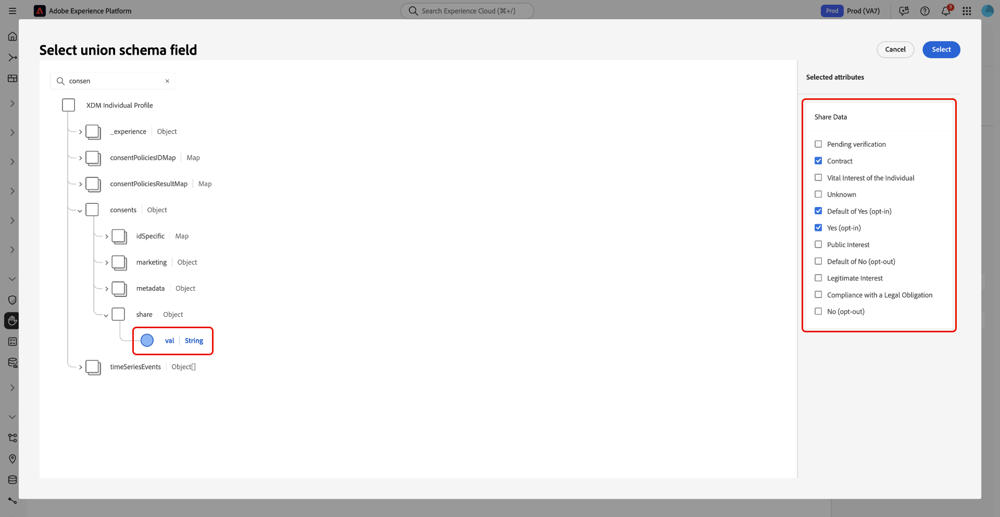

# Verwalten von Datennutzungsrichtlinien in der Benutzeroberfläche

Adobe Experience Platform Data Governance bietet eine Benutzeroberfläche, über die Sie Datennutzungsrichtlinien erstellen und verwalten können. Dieses Dokument bietet einen Überblick über die Aktionen, die Sie im **Richtlinien** Arbeitsbereich im [!DNL Experience Platform] -Benutzeroberfläche.

>[!IMPORTANT]
>
>Alle Datennutzungsrichtlinien (einschließlich der von Adobe bereitgestellten Kernrichtlinien) sind standardmäßig deaktiviert. Damit eine einzelne Richtlinie zur Durchsetzung in Betracht gezogen werden kann, müssen Sie diese Richtlinie manuell aktivieren. Anweisungen dazu, wie Sie dies in der Benutzeroberfläche tun, finden Sie im Abschnitt [Aktivieren von Richtlinien](#enable).

## Voraussetzungen

Dieses Handbuch setzt ein Verständnis der folgenden [!DNL Experience Platform]-Konzepte voraus:

* [Data Governance](../home.md)
* [Datennutzungsrichtlinien](./overview.md)

## Aufrufen bestehender Richtlinien {#view-policies}

Klicken Sie in der Benutzeroberfläche von [!DNL Experience Platform] auf **[!UICONTROL Richtlinien]**, um den Arbeitsbereich **[!UICONTROL Richtlinien]** zu öffnen. Auf der Registerkarte **[!UICONTROL Durchsuchen]** wird eine Liste der verfügbaren Richtlinien angezeigt, einschließlich der zugehörigen Bezeichnungen, Marketing-Aktionen und Status.

If you have access to consent policies (currently in beta), select the **[!UICONTROL Consent policies]** toggle to view them in the [!UICONTROL Browse] tab.

Klicken Sie auf eine aufgelistete Richtlinie, um deren Beschreibung und Typ anzuzeigen. Wenn eine benutzerdefinierte Richtlinie ausgewählt ist, werden zusätzliche Steuerelemente zum Bearbeiten, Löschen oder [Aktivieren/Deaktivieren der Richtlinie](#enable) angezeigt.

## Erstellen einer benutzerdefinierten Richtlinie {#create-policy}

Um eine neue benutzerdefinierte Datennutzungsrichtlinie zu erstellen, klicken Sie in der oberen rechten Ecke der Registerkarte **[!UICONTROL Durchsuchen]** im Arbeitsbereich **[!UICONTROL Richtlinien]** auf **[!UICONTROL Richtlinie erstellen]**.

Depending on whether you are part of the beta for consent policies, one of the following occurs:

* Wenn Sie nicht Teil der Beta-Version sind, werden Sie sofort zum Workflow für [Erstellen einer Data Governance-Richtlinie](#create-governance-policy).
* Wenn Sie Teil der Beta-Version sind, bietet ein Dialogfeld eine zusätzliche Option zum [eine Zustimmungsrichtlinie erstellen](#consent-policy).
   

### Create a data governance policy {#create-governance-policy}

Der Workflow **[!UICONTROL Richtlinie erstellen]** wird angezeigt. Geben Sie zunächst einen Namen und eine Beschreibung für die neue Richtlinie an.

Wählen Sie anschließend die Datennutzungsbezeichnungen aus, auf denen die Richtlinie basieren soll. Wenn Sie mehrere Bezeichnungen auswählen, können Sie entscheiden, ob die Daten alle Bezeichnungen oder nur eine der Bezeichnungen enthalten müssen, damit die Richtlinie angewendet wird. Klicken Sie auf **[!UICONTROL Weiter]**, wenn Sie fertig sind.

Der Schritt **[!UICONTROL Marketing-Aktionen auswählen]** wird angezeigt. Wählen Sie die entsprechenden Marketing-Aktionen aus der bereitgestellten Liste und klicken Sie dann auf **[!UICONTROL Weiter]**, um fortzufahren.

>[!NOTE]
>
>Bei Auswahl mehrerer Marketing-Aktionen interpretiert die Richtlinie diese als „OR“-Regel. Mit anderen Worten: Die Richtlinie findet Anwendung, wenn **beliebige** der ausgewählten Marketing-Aktionen ausgeführt werden.

Der Schritt **[!UICONTROL Überprüfung]** wird angezeigt, in dem Sie die Details der neuen Richtlinie vor der Erstellung überprüfen können. Wenn Sie zufrieden sind, klicken Sie auf **[!UICONTROL Fertig stellen]**, um die Richtlinie zu erstellen.

Die Registerkarte **[!UICONTROL Durchsuchen]** wird erneut angezeigt, wo die neu erstellte Richtlinie jetzt mit dem Status „Entwurf“ aufgelistet wird. Informationen zum Aktivieren der Richtlinie finden Sie im nächsten Abschnitt.

### Erstellen einer Einwilligungsrichtlinie (Beta) {#consent-policy}

>[!IMPORTANT]
>
>Consent policies are currently in beta and your organization may not have access to them yet.

Wenn Sie sich dafür entschieden haben, eine Zustimmungsrichtlinie zu erstellen, wird ein neuer Bildschirm angezeigt, in dem Sie die neue Richtlinie konfigurieren können.

In order to make use of consent policies, you must have consent attributes present in your profile data. Siehe Handbuch unter [Zustimmungsverarbeitung in Experience Platform](../../landing/governance-privacy-security/consent/adobe/overview.md) für detaillierte Schritte zum Einschließen der erforderlichen Attribute in Ihr Vereinigungsschema.

Einverständnisrichtlinien bestehen aus zwei logischen Komponenten:

* **[!UICONTROL If]**: The condition that will trigger the policy check. Dies kann auf einer bestimmten Marketing-Aktion, dem Vorhandensein bestimmter Datennutzungsbezeichnungen oder einer Kombination aus beiden basieren.
* **[!UICONTROL Dann]**: Die Zustimmungsattribute, die vorhanden sein müssen, damit ein Profil in die Aktion aufgenommen wird, die die Richtlinie ausgelöst hat.

#### Bedingungen konfigurieren

Under the **[!UICONTROL If]** section, select the marketing actions and/or data usage labels that should trigger this policy. Auswählen **[!UICONTROL Alle anzeigen]** und **[!UICONTROL Titel auswählen]** , um die vollständigen Listen der verfügbaren Marketing-Aktionen bzw. -Beschriftungen anzuzeigen.

Nachdem Sie mindestens eine Bedingung hinzugefügt haben, können Sie **[!UICONTROL Bedingung hinzufügen]** um weitere Bedingungen nach Bedarf hinzuzufügen, wählen Sie den entsprechenden Bedingungstyp aus der Dropdown-Liste aus.

Wenn Sie mehr als eine Bedingung auswählen, können Sie das zwischen ihnen angezeigte Symbol verwenden, um die bedingte Beziehung zwischen &quot;AND&quot;und &quot;OR&quot;zu wechseln.

#### Select consent attributes

Unter dem **[!UICONTROL Dann]** Wählen Sie mindestens ein Zustimmungsattribut aus dem Vereinigungsschema aus. Dies ist das Attribut, das vorhanden sein muss, damit Profile in die Aktion einbezogen werden, die von dieser Richtlinie geregelt wird. You can choose one of the provided options from the list, or select **[!UICONTROL View all]** to choose the attribute directly from the union schema.

Wählen Sie beim Auswählen des Zustimmungsattributs die Werte für das Attribut aus, nach dem diese Richtlinie geprüft werden soll.

Nachdem Sie mindestens ein Zustimmungsattribut ausgewählt haben, wird die **[!UICONTROL Richtlinieneigenschaften]** -Bedienfeldaktualisierungen, um die geschätzte Anzahl von Profilen anzuzeigen, die im Rahmen dieser Richtlinie zulässig wären, einschließlich des Prozentsatzes des gesamten Profilspeichers. Diese Schätzung wird automatisch aktualisiert, wenn Sie die Richtlinienkonfiguration anpassen.

Um weitere Zustimmungsattribute zur Richtlinie hinzuzufügen, wählen Sie **[!UICONTROL Ergebnis hinzufügen]**.

Sie können der Richtlinie weiterhin beliebig Bedingungen und Zustimmungsattribute hinzufügen und anpassen. Wenn Sie mit der Konfiguration zufrieden sind, geben Sie einen Namen und eine optionale Beschreibung für die Richtlinie ein, bevor Sie **[!UICONTROL Speichern]**.

The consent policy is now created, and its status is set to [!UICONTROL Disabled] by default. Um die Richtlinie sofort zu aktivieren, wählen Sie die **[!UICONTROL Status]** in der rechten Leiste ein-/ausschalten.

## Aktivieren oder Deaktivieren einer Richtlinie {#enable}

Alle Datennutzungsrichtlinien (einschließlich der von Adobe bereitgestellten Kernrichtlinien) sind standardmäßig deaktiviert. Damit eine einzelne Richtlinie zur Durchsetzung berücksichtigt werden kann, müssen Sie diese Richtlinie manuell über die API oder Benutzeroberfläche aktivieren.

Sie können benutzerdefinierte Datennutzungsrichtlinien im Arbeitsbereich **[!UICONTROL Richtlinien]** auf der Registerkarte **[!UICONTROL Durchsuchen]** aktivieren oder deaktivieren. Wählen Sie eine benutzerdefinierte Richtlinie aus der Liste, um auf der rechten Seite die entsprechenden Details anzuzeigen. Klicken Sie unter **[!UICONTROL Status]** auf die Schaltfläche zum Umschalten, um die Richtlinie zu aktivieren oder zu deaktivieren.

## Aufrufen von Marketing-Aktionen {#view-marketing-actions}

Wählen Sie im Arbeitsbereich **[!UICONTROL Richtlinien]** die Registerkarte **[!UICONTROL Marketing-Aktionen]**, um eine Liste der verfügbaren Marketing-Aktionen anzuzeigen, die von Adobe und Ihrem eigenen Unternehmen definiert worden sind.

## Erstellen einer Marketing-Aktion {#create-marketing-action}

Um eine neue benutzerdefinierte Marketing-Aktion zu erstellen, wählen Sie **[!UICONTROL Marketing-Aktion erstellen]** in der oberen rechten Ecke der Registerkarte **[!UICONTROL Marketing-Aktionen]** im Arbeitsbereich **[!UICONTROL Richtlinien]**.

Das Dialogfeld **[!UICONTROL Marketing-Aktion erstellen]** wird angezeigt. Geben Sie einen Namen und eine Beschreibung für die Marketing-Aktion ein und wählen Sie **[!UICONTROL Erstellen]**.

Die neu erstellte Aktion wird auf der Registerkarte **[!UICONTROL Marketing-Aktionen]** angezeigt. Sie können die Marketing-Aktion jetzt verwenden, wenn Sie [neue Datennutzungsrichtlinien erstellen](#create-policy).

## Bearbeiten oder Löschen einer Marketing-Aktion {#edit-delete-marketing-action}

>[!NOTE]
>
>Es können nur benutzerdefinierte Marketing-Aktionen bearbeitet werden, die von Ihrer Organisation definiert wurden. Durch Adobe definierte Marketing-Aktionen können nicht geändert oder gelöscht werden.

Wählen Sie im Arbeitsbereich **[!UICONTROL Richtlinien]** die Registerkarte **[!UICONTROL Marketing-Aktionen]**, um eine Liste der verfügbaren Marketing-Aktionen anzuzeigen, die von Adobe und Ihrem eigenen Unternehmen definiert worden sind. Wählen Sie eine benutzerdefinierte Marketing-Aktion aus der Liste und bearbeiten Sie dann die Details der Marketing-Aktion mit den entsprechenden Feldern im rechten Bereich.

Wenn die Marketing-Aktion von keiner der vorhandenen Nutzungsrichtlinien verwendet wird, können Sie sie löschen, indem Sie **[!UICONTROL Marketing-Aktion löschen]** auswählen.

>[!NOTE]
>
>Beim Versuch, eine Marketing-Aktion zu löschen, die von einer vorhandenen Richtlinie verwendet wird, wird eine Fehlermeldung angezeigt, die darauf hinweist, dass der Löschversuch fehlgeschlagen ist.

## Nächste Schritte

Dieses Dokument hat Ihnen einen Überblick darüber verschafft, wie Datennutzungsrichtlinien in der Benutzeroberfläche von [!DNL Experience Platform] verwaltet werden. Anweisungen zum Verwalten von Richtlinien mit [!DNL Policy Service API] finden Sie im [Entwicklerhandbuch](../api/getting-started.md). Informationen zum Erzwingen von Datennutzungsrichtlinien finden Sie in der [Übersicht zur Durchsetzung von Richtlinien](../enforcement/overview.md).

Das folgende Video zeigt, wie Sie in der [!DNL Experience Platform]-Benutzeroberfläche mit Nutzungsrichtlinien arbeiten:

>[!VIDEO](https://video.tv.adobe.com/v/32977?quality=12&learn=on)
