# Handbuch zur Datenvorbereitungs-Benutzeroberfläche

In diesem Dokument erfahren Sie, wie Sie in der Adobe Experience Platform-Benutzeroberfläche mithilfe von Datenvorbereitungsfunktionen CSV-Dateien einem XDM-Schema zuordnen können.

## Erste Schritte

Für dieses Tutorial werden Kenntnisse der folgenden Platform-Komponenten benötigt:

* [[!DNL Experience Data Model (XDM)] System](../../xdm/home.md): Das standardisierte Framework, mit dem Customer-Experience-Daten von Platform strukturiert werden.
   * [Grundlagen der Schemakomposition](../../xdm/schema/composition.md): Machen Sie sich mit den grundlegenden Bausteinen von XDM-Schemas vertraut, einschließlich der wichtigsten Prinzipien und Best Practices bei der Schemaerstellung.
   * [Tutorial zum Schema-Editor](../../xdm/tutorials/create-schema-ui.md): Erfahren Sie, wie Sie benutzerdefinierte Schemas mithilfe der Benutzeroberfläche des Schema-Editors erstellen können.
* [Identity Service](../../identity-service/home.md): Verschaffen Sie sich einen besseren Überblick über einzelne Kunden und deren Verhalten, indem Sie Identitäten geräte- und systemübergreifend verknüpfen.
* [[!DNL Real-time Customer Profile]](../../profile/home.md): Bietet ein einheitliches Echtzeit-Kundenprofil, das auf aggregierten Daten aus verschiedenen Quellen basiert.
* [Quellen](../../sources/home.md): Experience Platform ermöglicht die Aufnahme von Daten aus verschiedenen Quellen und bietet Ihnen die Möglichkeit, die eingehenden Daten mithilfe von Platform-Services zu strukturieren, zu kennzeichnen und anzureichern.

## Datenflussdetails

>[!TIP]
>
>Sie können auf Datenflussdetails zugreifen, indem Sie eine beliebige Quelle aus dem Quellkatalog auswählen. Weiterführende Informationen finden Sie in der [Quellenübersicht](../../sources/home.md).

Bevor Sie Ihre CSV-Daten einem XDM-Schema zuordnen können, müssen Sie zunächst die Details Ihres Datenflusses festlegen.

Auf der Seite [!UICONTROL Datenflussdetails] können Sie auswählen, ob Sie Ihre CSV-Daten in einen vorhandenen Zieldatensatz oder einen neuen Zieldatensatz aufnehmen möchten. Ein vorhandener Datensatz enthält ein vordefiniertes Zielschema, dem Ihre Daten zugeordnet werden. Für einen neuen Datensatz müssen Sie ein vorhandenes Schema auswählen oder ein neues Schema erstellen, dem Ihre Daten zugeordnet werden sollen.

### Vorhandenen Zieldatensatz verwenden

Um Ihre CSV-Daten in einen vorhandenen Datensatz einzufügen, wählen Sie **[!UICONTROL Vorhandener Datensatz]**. Sie können einen vorhandenen Datensatz entweder über die Option [!UICONTROL Erweiterte Suche] oder durch Scrollen durch die Liste der vorhandenen Datensätze im Dropdown-Menü abrufen.

Wenn Sie einen Datensatz ausgewählt haben, geben Sie einen Namen für Ihren Datenfluss und eine optionale Beschreibung an.

Während dieses Vorgangs können Sie auch die Optionen [!UICONTROL Fehlerdiagnose] und [!UICONTROL Partielle Aufnahme] aktivieren. [!UICONTROL Fehlerdiagnose] ermöglicht eine detaillierte Erstellung von Fehlermeldungen für alle fehlerhaften Datensätze, die in Ihrem Datenfluss auftreten, während [!UICONTROL Partielle Aufnahme] die Aufnahme von fehlerhaften Daten bis zu einem gewissen Schwellenwert, den Sie manuell definieren, ermöglicht. Weitere Informationen finden Sie in der [Übersicht zur partiellen Batch-Aufnahme](../../ingestion/batch-ingestion/partial.md).

### Verwenden eines neuen Zieldatensatzes

Um Ihre CSV-Daten in einen neuen Datensatz aufzunehmen, wählen Sie **[!UICONTROL Neuer Datensatz]** aus und geben Sie dann einen Namen für den Ausgabedatensatz und eine optionale Beschreibung an. Wählen Sie als Nächstes mithilfe der Option [!UICONTROL Erweiterte Suche] oder durch Scrollen durch die Liste der vorhandenen Schemas im Dropdown-Menü ein Schema zum Zuordnen aus.

Wenn Sie ein Schema ausgewählt haben, geben Sie einen Namen für Ihren Datenfluss und eine optionale Beschreibung an. Wenden Sie dann die Einstellungen [!UICONTROL Fehlerdiagnose] und [!UICONTROL Partielle Aufnahme] an, sofern Sie sie für Ihren Datenfluss benötigen. Wenn Sie fertig sind, klicken Sie auf die Schaltfläche **[!UICONTROL Weiter]**.

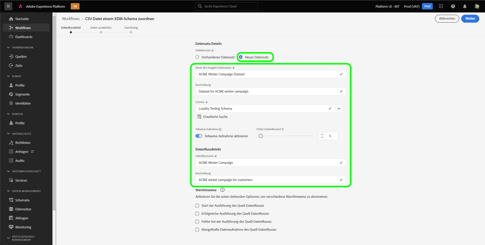

## Auswählen von Daten

Der Schritt [!UICONTROL Auswählen von Daten] wird angezeigt und bietet Ihnen eine Schnittstelle zum Hochladen Ihrer lokalen Dateien und zur Vorschau ihrer Struktur und Inhalte. Wählen Sie **[!UICONTROL Dateien auswählen]** aus, um eine CSV-Datei von Ihrem lokalen System hochzuladen. Alternativ können Sie die CSV-Datei, die Sie hochladen möchten, per Drag-and-Drop in das Bedienfeld [!UICONTROL Dateien per Drag-and-Drop verschieben] ziehen.

>[!TIP]
>
>Derzeit werden nur CSV-Dateien für den lokalen Datei-Upload unterstützt. Die maximale Dateigröße pro Datei beträgt 1 GB.

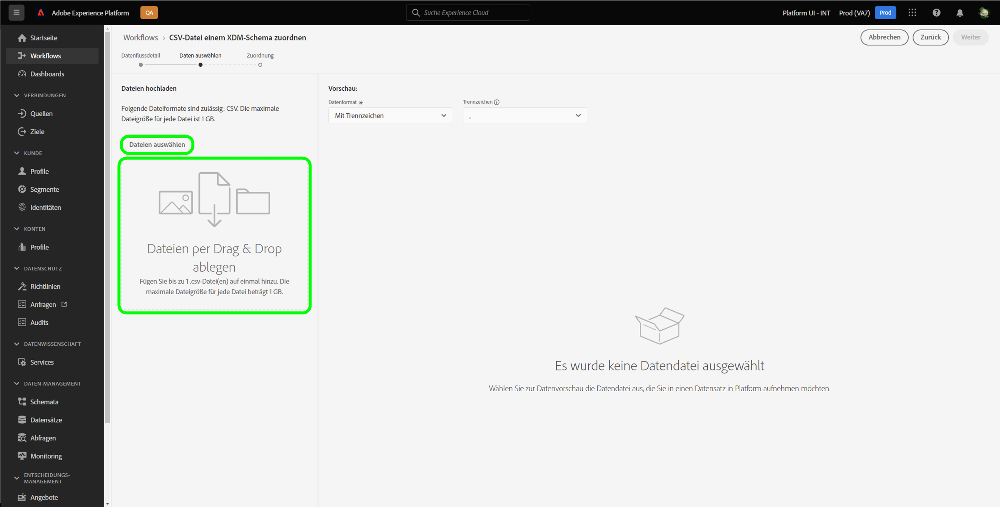

Nachdem Ihre Datei hochgeladen wurde, wird die Vorschau-Oberfläche aktualisiert, um Inhalt und Struktur der Datei anzuzeigen.

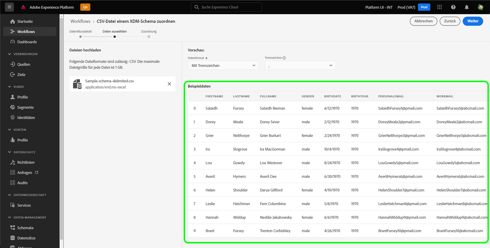

Je nach Datei können Sie Spaltentrennzeichen wie Tabulatoren, Kommas, senkrechte Striche oder ein benutzerdefiniertes Spaltentrennzeichen für die Quelldaten auswählen. Wählen Sie den Dropdown-Pfeil **[!UICONTROL Trennzeichen]** und dann das entsprechende Trennzeichen aus dem Menü aus.

Wenn Sie fertig sind, klicken Sie auf **[!UICONTROL Weiter]**.

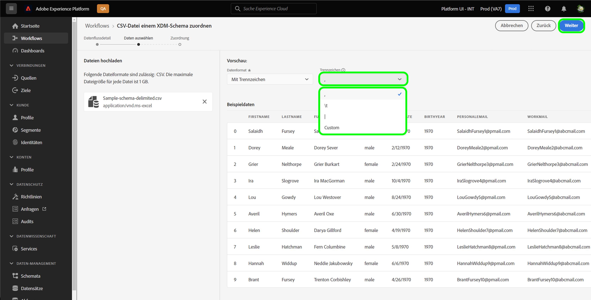

## Zuordnung

Die Schnittstelle **[!UICONTROL Zuordnung]** bietet Ihnen ein umfassendes Tool zur Zuordnung von Quellfeldern aus Ihrem Quellschema zu den entsprechenden XDM-Zielfeldern im Zielschema.

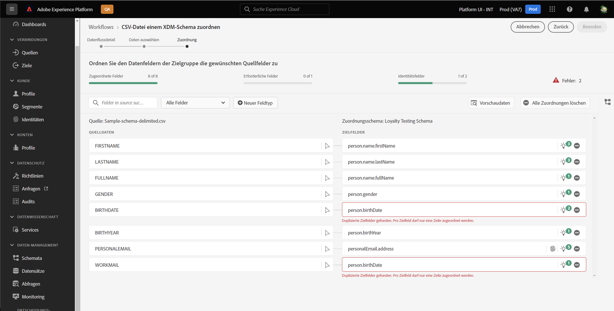

### Grundlegendes zur Zuordnungsschnittstelle {#mapping-interface}

Die Zuordnungsschnittstelle enthält ein Dashboard, das Informationen zum Zustand Ihrer Zuordnungsfelder im Rahmen des Aufnahme-Workflows enthält. Im Dashboard werden die folgenden Details zu Ihren Zuordnungsfeldern angezeigt:

| Eigenschaft | Beschreibung |
| --- | --- |
| [!UICONTROL Zugeordnete Felder] | Zeigt die Gesamtzahl der Quellfelder an, die, unabhängig von Fehlern, einem XDM-Zielfeld zugeordnet wurden. |
| [!UICONTROL Erforderliche Felder] | Zeigt die Anzahl der erforderlichen Zuordnungsfelder an. |
| [!UICONTROL Identitätsfelder] | Zeigt die Gesamtzahl der als Identität definierten Zuordnungsfelder an. Diese Zuordnungsfelder werden durch ein Fingerabdrucksymbol dargestellt. |
| [!UICONTROL Fehler] | Zeigt die Anzahl fehlerhafter Zuordnungsfelder an. |

Die Zuordnungsschnittstelle bietet außerdem ein Bedienfeld mit Optionen, mithilfe derer Sie Ihre Zuordnungsfelder besser nutzen oder filtern können.

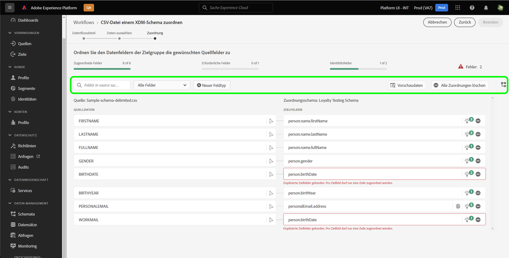

Um nach einem bestimmten Zuordnungssatz zu suchen, wählen Sie **[!UICONTROL Suchen in Quellfeldern]** und geben Sie den Namen der Quelldaten ein, die Sie isolieren möchten.

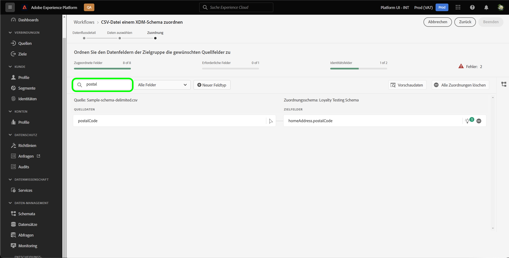

Wählen Sie **[!UICONTROL Alle Quellfelder]** aus, um ein Dropdown-Menü mit Filteroptionen anzuzeigen, über das Sie Ihre Ansicht der Zuordnungsschnittstelle eingrenzen können.

Die Filteroptionen sind:

| Quellfelder | Beschreibung |
| --- | --- |
| [!UICONTROL Alle Quellfelder] | Diese Option zeigt alle Quellfelder Ihres Quellschemas an. Diese Option wird standardmäßig angezeigt. |
| [!UICONTROL Erforderliche Felder] | Diese Option filtert das Quellschema so, dass nur die Felder angezeigt werden, die zum Durchführen der Zuordnung erforderlich sind. |
| [!UICONTROL Identitätsfelder] | Diese Option filtert das Quellschema so, dass nur die Felder angezeigt werden, die für die Identität gekennzeichnet sind. |
| [!UICONTROL Zugeordnete Felder] | Diese Option filtert das Quellschema so, dass nur die Felder angezeigt werden, die bereits zugeordnet wurden. |
| [!UICONTROL Nicht zugeordnete Felder] | Diese Option filtert das Quellschema so, dass nur die Felder angezeigt werden, die noch zugeordnet werden müssen. |
| [!UICONTROL Felder mit Empfehlung] | Diese Option filtert das Quellschema so, dass nur die Felder angezeigt werden, die Zuordnungsempfehlungen enthalten. |

Wählen Sie **[!UICONTROL Felder mit Fehlern]** aus, um alle Zuordnungsfelder mit Fehlern anzuzeigen.

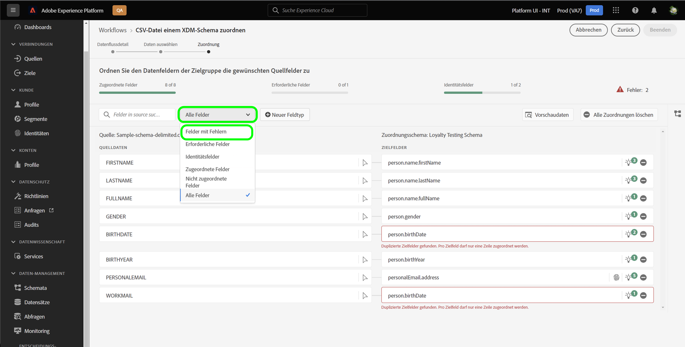

Eine isolierte Ansicht fehlerhafter Zuordnungsfelder wird angezeigt, sodass Sie Fehler mithilfe intelligenter Zuordnungsempfehlungen oder der manuellen Zuordnungsstruktur beheben können.

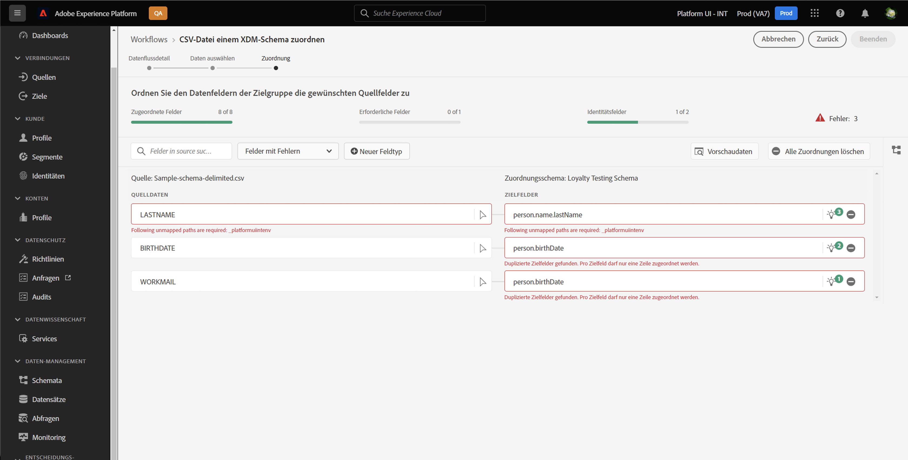

### Hinzufügen eines neuen Feldtyps

Sie können ein neues Zuordnungsfeld oder ein berechnetes Feld hinzufügen, indem Sie im Menü **[!UICONTROL Neuer Feldtyp]** auswählen.

#### Neues Zuordnungsfeld

Um ein neues Zuordnungsfeld hinzuzufügen, wählen Sie **[!UICONTROL Neuer Feldtyp]** und dann im angezeigten Dropdown-Menü **[!UICONTROL Neues Feld hinzufügen]** aus.

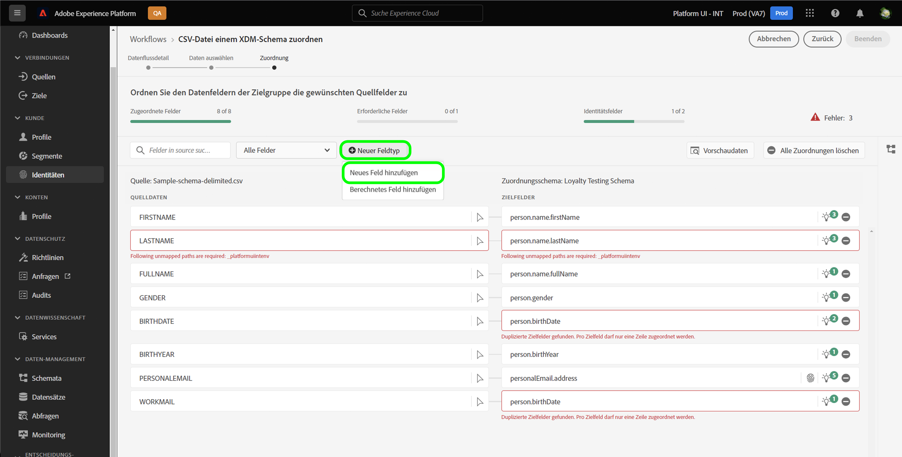

Wählen Sie als Nächstes das Quellfeld aus, das Sie aus der angezeigten Quellschemastruktur hinzufügen möchten, und dann **[!UICONTROL Auswählen]**.

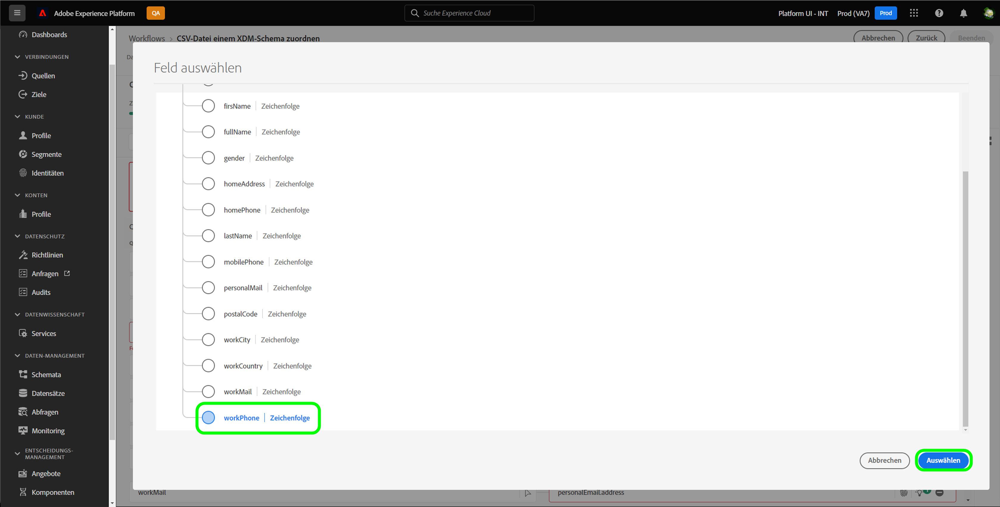

Die Zuordnungsschnittstelle wird mit dem ausgewählten Quellfeld und einem leeren Zielfeld aktualisiert. Wählen Sie **[!UICONTROL Zielfeld zuordnen]**, um mit dem Zuordnen des neuen Quellfelds zum entsprechende XDM-Zielfeld zu beginnen.

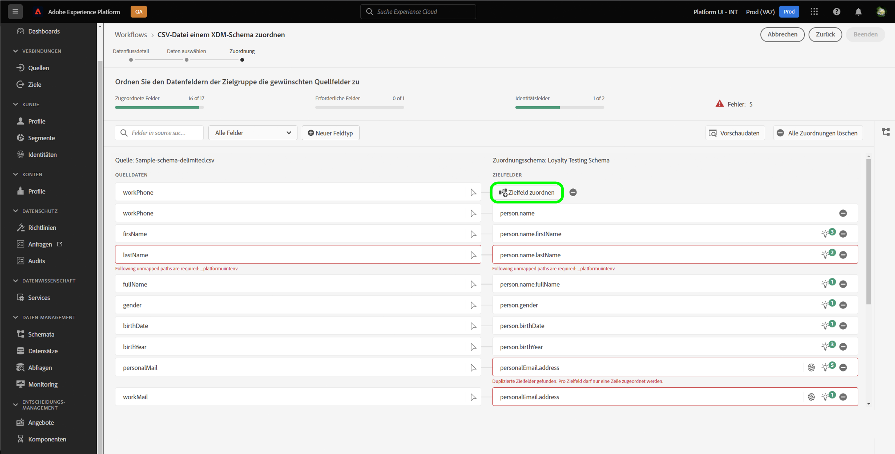

Eine interaktive Zielschemastruktur wird angezeigt, in der Sie manuell das Zielschema durchsuchen und das entsprechende XDM-Zielfeld für Ihr Quellfeld finden können.

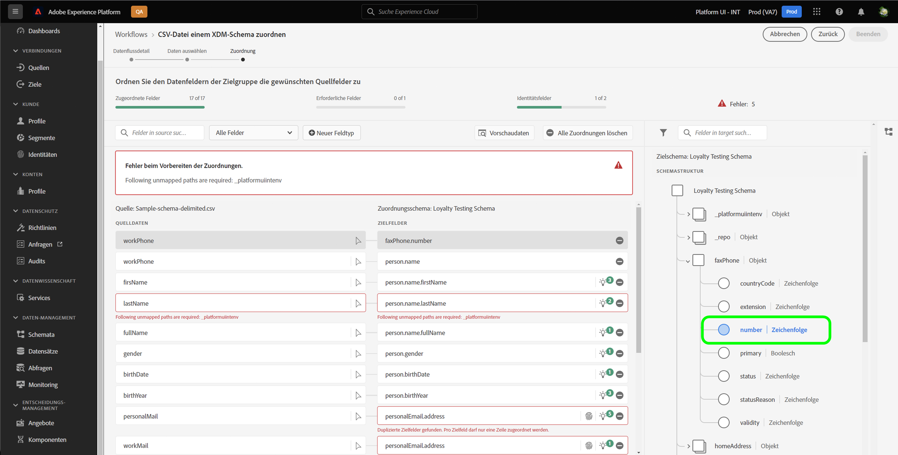

Wenn Sie fertig sind, wählen Sie das Schemasymbol aus, um die Benutzeroberfläche für das Zielschema zu schließen.

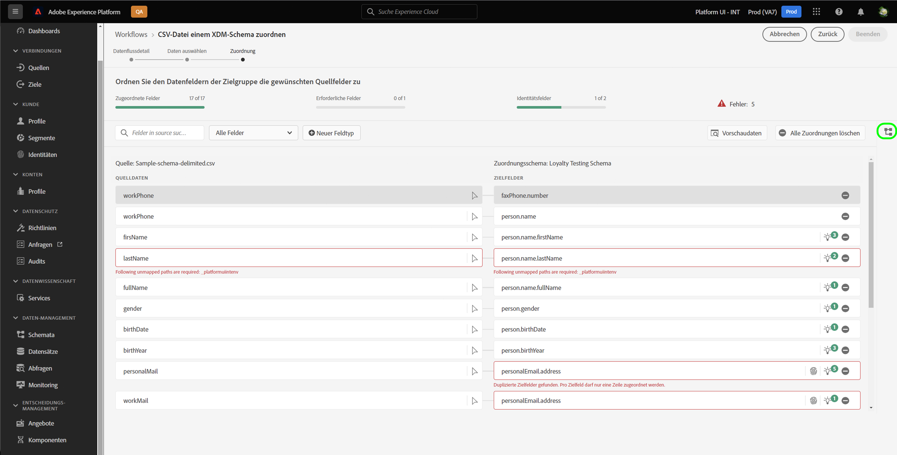

#### Berechnete Felder {#calculated-fields}

Berechnete Felder ermöglichen die Erstellung von Werten anhand der Attribute im Eingabeschema. Diese Werte können dann Attributen im Zielschema zugewiesen und mit einem Namen und einer Beschreibung versehen werden, um eine einfachere Referenz zu ermöglichen. Berechnete Felder haben eine maximale Länge von 4096 Zeichen.

Um ein berechnetes Feld zu erstellen, wählen Sie **[!UICONTROL Neuer Feldtyp]** und dann **[!UICONTROL Berechnetes Feld hinzufügen]** aus.

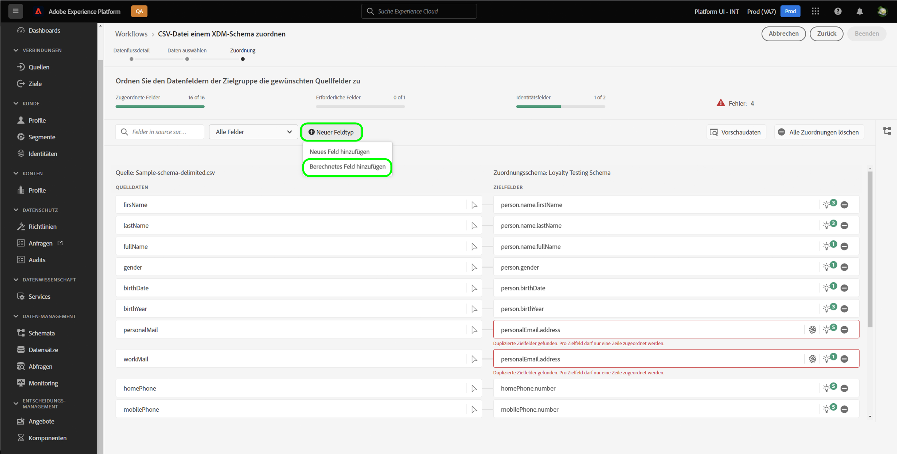

Das Bedienfeld **[!UICONTROL Berechnetes Feld erstellen]** wird angezeigt. Das linke Dialogfeld enthält die Felder, Funktionen und Operatoren, die in berechneten Feldern unterstützt werden. Wählen Sie eine der Registerkarten aus, um Funktionen, Felder oder Operatoren zum Ausdruckseditor hinzuzufügen.

| Tab | Beschreibung |
| --- | ----------- |
| [!UICONTROL Funktion] | Auf der Registerkarte „Funktionen“ werden die Funktionen aufgelistet, die zur Transformation der Daten verfügbar sind. Weitere Informationen zu den Funktionen, die Sie in berechneten Feldern verwenden können, finden Sie im Handbuch [Verwendung der Funktionen zur Datenvorbereitung (Mapper)](../functions.md). |
| [!UICONTROL Feld] | Auf der Registerkarte „Felder“ werden die im Quellschema verfügbaren Felder und Attribute aufgelistet. |
| [!UICONTROL Operator] | Auf der Registerkarte „Operatoren“ werden die zur Transformation der Daten verfügbaren Operatoren aufgelistet. |

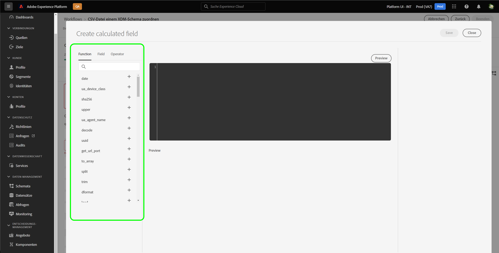

Mithilfe des Ausdruckseditors in der Mitte können Sie manuell Felder, Funktionen und Operatoren hinzufügen. Wählen Sie den Editor aus, um mit der Erstellung eines Ausdrucks zu beginnen. Wenn Sie fertig sind, wählen Sie **[!UICONTROL Speichern]** aus, um fortzufahren.

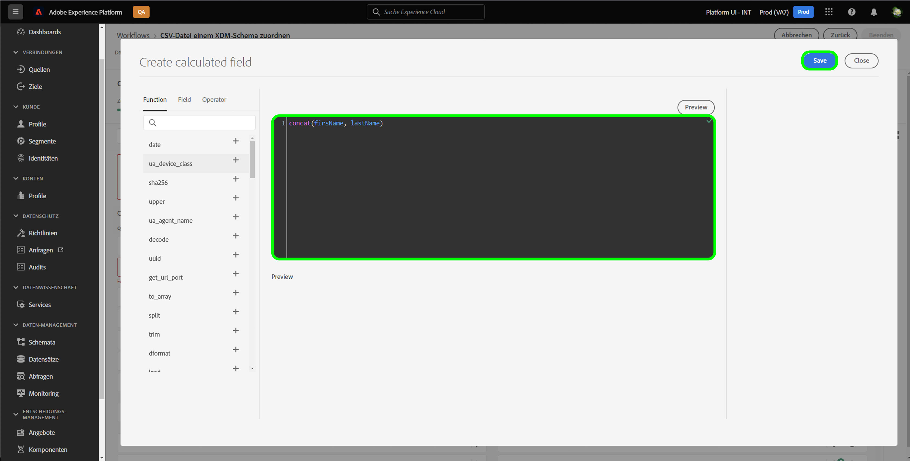

### Import-Mapping {#import}

Sie können die Zuordnung eines vorhandenen Datenflusses wiederverwenden, um die manuelle Konfigurationszeit Ihrer Datenaufnahme zu reduzieren und Fehler zu begrenzen. Auswählen **[!UICONTROL Import-Mapping]** , um eine vorhandene Zuordnung wiederzuverwenden.

Die [!UICONTROL Import-Mapping] -Fenster angezeigt, sodass Sie eine Liste mit Datenflüssen zur Auswahl erhalten.

Wählen Sie das Vorschausymbol aus, um die Zuordnung des ausgewählten Datenflusses in der Vorschau anzuzeigen.

Im Vorschaufenster können Sie die vorhandene Zuordnung vor dem Import in Ihren Datenfluss überprüfen. Nachdem Sie die Zuordnung überprüft haben, können Sie **[!UICONTROL Zurück]** , um zur Liste der Datenflüsse zurückzukehren und einen anderen Satz von Zuordnungen zu überprüfen, oder Sie können **[!UICONTROL Auswählen]** um fortzufahren.

Alternativ können Sie die zu importierende Zuordnung aus der Liste der Datenflüsse auswählen. Wählen Sie den Datenfluss aus, der die zu importierende Zuordnung enthält, und wählen Sie dann **[!UICONTROL Auswählen]** um fortzufahren.

Die Benutzeroberfläche wird mit dem importierten Mapping aktualisiert.

>[!NOTE]
>
>Alle vorhandenen Zuordnungssätze, die Sie erstellen oder die Empfehlungen für die ML-Zuordnung erstellen, werden durch die Zuordnung ersetzt, die Sie aus einem vorhandenen Datenfluss importiert haben.

Wählen Sie **[!UICONTROL Vorschaudaten]** aus, um die Zuordnungsergebnisse von bis zu 100 Zeilen mit Beispieldaten aus dem ausgewählten Datensatz anzuzeigen.

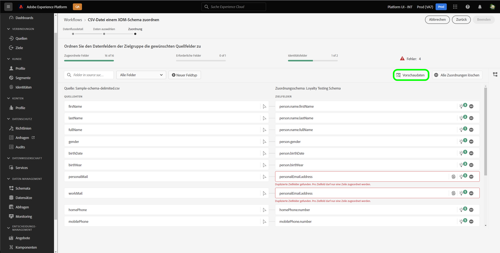

Während der Vorschau wird die Identitätsspalte als erstes Feld priorisiert, da dies die wichtigste Information ist und sie bei der Validierung der Zuordnungsergebnisse erforderlich ist. Wenn Sie fertig sind, wählen Sie **[!UICONTROL Schließen]** aus.

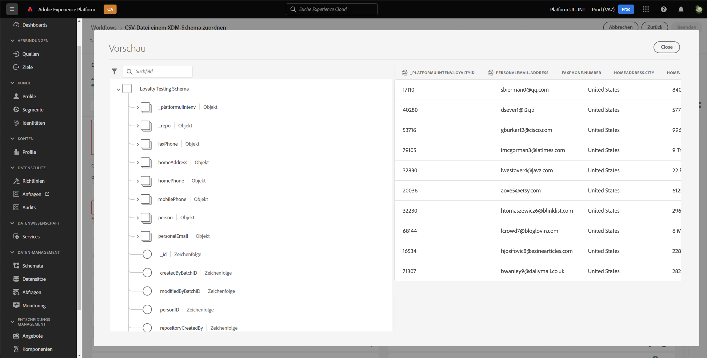

Um alle Zuordnungsfelder zu entfernen, wählen Sie **[!UICONTROL Alle Zuordnungen löschen]** aus.

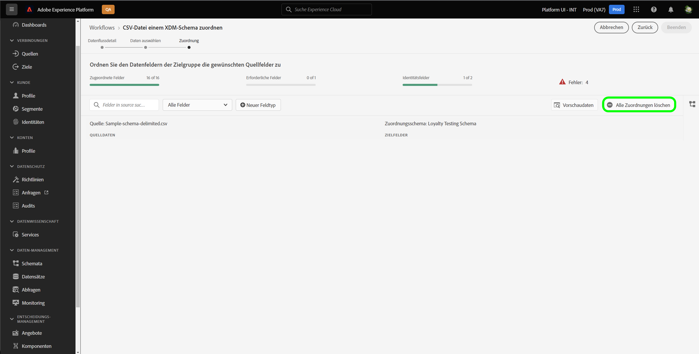

### Verwenden der Benutzeroberfläche für Zuordnungen

Platform bietet automatisch intelligente Empfehlungen für automatisch zugeordnete Felder, die auf dem von Ihnen ausgewählten Zielschema oder Datensatz basieren. Sie können die Zuordnungsregeln manuell an Ihre Anwendungsfälle anpassen oder duplizierte Zuordnungsfelder korrigieren, um Fehler zu beheben.

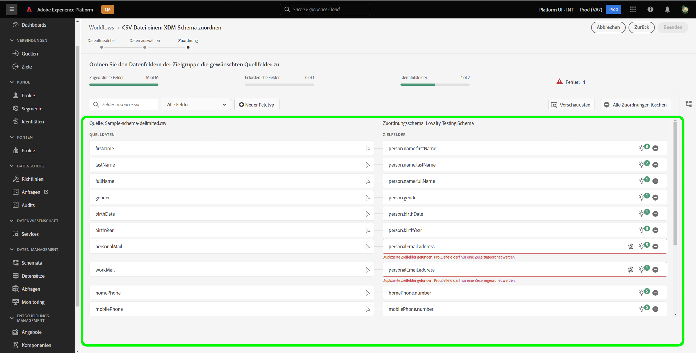

Wählen Sie das Glühbirnensymbol in dem Zielfeld aus, das Sie anpassen möchten.

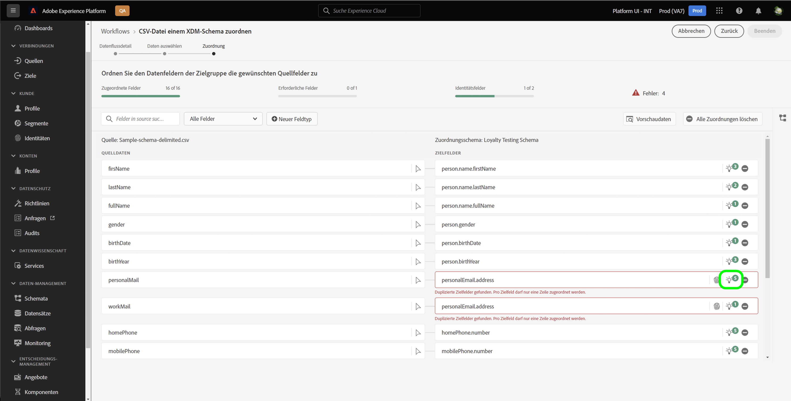

Das Popup-Fenster [!UICONTROL Zuordnungsempfehlungen] wird mit einer Liste empfohlener Zielfelder angezeigt, die einem bestimmten Quellfeld zugeordnet werden können. Standardmäßig wird die erste Empfehlung automatisch angewendet.

Manchmal ist mehr als eine Empfehlung für das Quellschema verfügbar. In diesem Fall zeigt die Zuordnungskarte die wichtigste Empfehlung an, gefolgt von einem Symbol, das die Anzahl der verfügbaren zusätzlichen Empfehlungen enthält. Durch Auswahl des Glühbirnensymbols wird eine Liste der zusätzlichen Empfehlungen angezeigt. Sie können eine der alternativen Empfehlungen auswählen, indem Sie das Kontrollkästchen neben der Empfehlung aktivieren, die Sie stattdessen zuordnen möchten.

Hier können Sie das ausgewählte Zielfeld ändern, um einen Fehler zu beheben oder Ihren Anwendungsfall abzustimmen.

Alternativ können Sie **[!UICONTROL Manuell auswählen]** auswählen, um die interaktive Zielschema-Zuordnungsstruktur manuell zu verwenden.

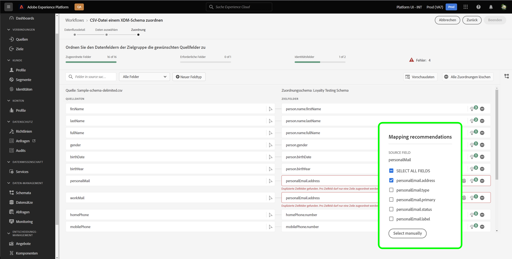

Die Zielschemazuordnungs-Benutzeroberfläche wird in derselben Ansicht wie die Zuordnungsfelder angezeigt, sodass Sie Zuordnungspaare im selben Bildschirm ändern können. Wählen Sie das Zielfeld aus, das Ihrem Anwendungsfall entspricht oder Ihre Fehler behebt.

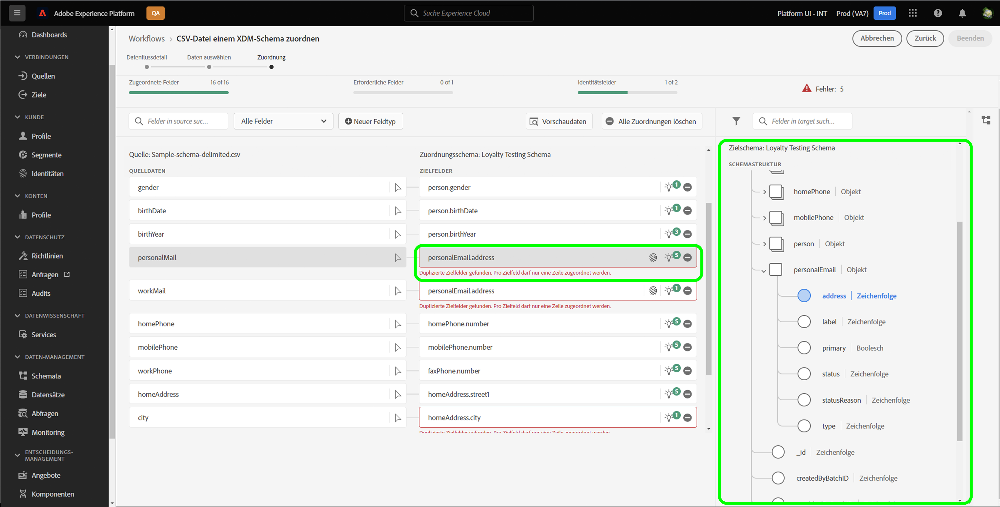

Wenn Sie fertig sind, wählen Sie **[!UICONTROL Beenden]** aus, um fortzufahren.

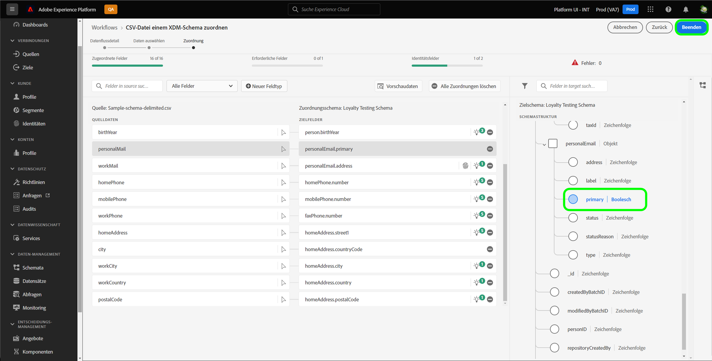

## Nächste Schritte

Durch Lesen dieses Dokuments haben Sie mithilfe der Zuordnungs-Benutzeroberfläche in der Platform-Benutzeroberfläche erfolgreich eine CSV-Datei einem Ziel-XDM-Schema zugeordnet. Weiterführende Informationen finden Sie in folgenden Dokumenten:

* [Datenvorbereitung – Übersicht](../home.md)
* [Quellen – Übersicht](../../sources/home.md)
* [Überwachen von Datenflüssen aus Quellen in der Benutzeroberfläche](../../dataflows/ui/monitor-sources.md)
