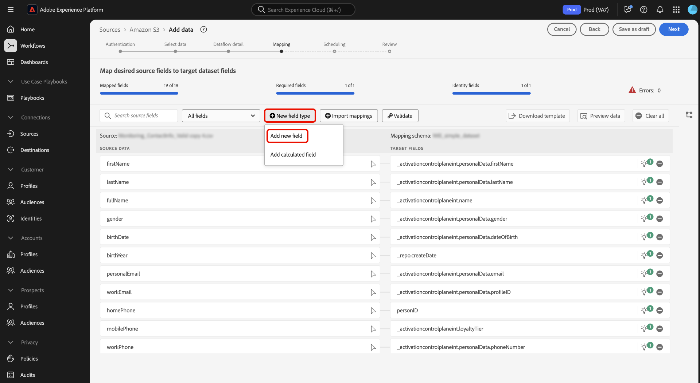

# Handbuch zur Datenvorbereitungs-Benutzeroberfläche

Lesen Sie dieses Handbuch, um zu erfahren, wie Sie [Datenvorbereitungs](../home.md)-Zuordnungsfunktionen in der Adobe Experience Platform-Benutzeroberfläche verwenden können, um CSV-Dateien einem [Experience-Datenmodell (XDM)-Schema &#x200B;](../../xdm/home.md).

## Erste Schritte

Dieses Tutorial setzt ein Grundverständnis der folgenden Experience Platform-Komponenten voraus:

* [[!DNL Experience Data Model (XDM)] System](../../xdm/home.md): Das standardisierte Framework, mit dem Experience Platform Kundenerlebnisdaten organisiert.
   * [Grundlagen der Schemakomposition](../../xdm/schema/composition.md): Machen Sie sich mit den grundlegenden Bausteinen von XDM-Schemata vertraut, einschließlich der wichtigsten Prinzipien und Best Practices bei der Schemaerstellung.
   * [Tutorial zum Schema-Editor](../../xdm/tutorials/create-schema-ui.md): Erfahren Sie, wie Sie benutzerdefinierte Schemata mithilfe der Benutzeroberfläche des Schema-Editors erstellen können.
* [Identity Service](../../identity-service/home.md): Verschaffen Sie sich einen besseren Überblick über einzelne Kunden und deren Verhalten, indem Sie Identitäten geräte- und systemübergreifend verknüpfen.
* [[!DNL Real-Time Customer Profile]](../../profile/home.md): Bietet ein einheitliches Echtzeit-Kundenprofil, das auf aggregierten Daten aus verschiedenen Quellen basiert.
* [Quellen](../../sources/home.md): Experience Platform ermöglicht die Aufnahme von Daten aus verschiedenen Quellen und bietet Ihnen die Möglichkeit, die eingehenden Daten mithilfe von Experience Platform-Services zu strukturieren, zu kennzeichnen und anzureichern.

## Zugriff auf die Zuordnungsschnittstelle in der Benutzeroberfläche

Sie können über zwei verschiedene Pfade auf die Zuordnungsschnittstelle in der Benutzeroberfläche zugreifen.

1. Wählen Sie in der Experience Platform-Benutzeroberfläche **[!UICONTROL Workflows]** im linken Navigationsbereich und dann **[!UICONTROL CSV zu XDM-Schema zuordnen]** aus. Geben Sie als Nächstes Ihre Datenflussdetails an und wählen Sie die Daten aus, die Sie aufnehmen möchten. Wenn Sie fertig sind, gelangen Sie zur Zuordnungsschnittstelle, über die Sie die Zuordnung zwischen Ihren Quelldaten und einem XDM-Schema konfigurieren können.
2. Sie können auch über den Arbeitsbereich „Quellen“ auf die Zuordnungsschnittstelle zugreifen.

## Zuordnen von CSV-Dateien zu einem XDM-Schema

Verwenden Sie die Zuordnungsschnittstelle und das umfassende Toolset, das sie bereitstellt, um Datenfelder aus Ihrem Quellschema erfolgreich ihren entsprechenden XDM-Zielfeldern im Zielschema zuzuordnen.

### Grundlegendes zur Zuordnungsschnittstelle {#mapping-interface}

Im Dashboard oben in der Benutzeroberfläche finden Sie Informationen zum Zustand Ihrer Zuordnungsfelder im Kontext des Aufnahme-Workflows. Im Dashboard werden die folgenden Details zu Ihren Zuordnungsfeldern angezeigt:

| Eigenschaft | Beschreibung |
| --- | --- |
| [!UICONTROL Zugeordnete Felder] | Zeigt die Gesamtzahl der Quellfelder an, die, unabhängig von Fehlern, einem XDM-Zielfeld zugeordnet wurden. |
| [!UICONTROL Erforderliche Felder] | Zeigt die Anzahl der erforderlichen Zuordnungsfelder an. |
| [!UICONTROL Identitätsfelder] | Zeigt die Gesamtzahl der als Identität definierten Zuordnungsfelder an. Diese Zuordnungsfelder werden durch ein Fingerabdrucksymbol dargestellt. |
| [!UICONTROL Fehler] | Zeigt die Anzahl fehlerhafter Zuordnungsfelder an. |

{style="table-layout:auto"}

Als Nächstes können Sie die in der Kopfzeile aufgelisteten Optionen verwenden, um besser zu interagieren oder durch Ihre Zuordnungsfelder zu filtern.

| Option | Beschreibung |
| --- | --- |
| [!UICONTROL Quellfelder suchen] | Navigieren Sie mithilfe der Suchleiste zu einem bestimmten Quellfeld. |
| [!UICONTROL Alle Felder] | Wählen Sie **[!UICONTROL Alle Felder]** aus, um ein Dropdown-Menü mit Optionen zum Filtern Ihrer Zuordnungen nach anzuzeigen. Zu den verfügbaren Filteroptionen gehören:<ul><li>**[!UICONTROL Erforderliche Felder]**: Filtert die Benutzeroberfläche so, dass nur die zum Abschließen des Workflows erforderlichen Felder angezeigt werden.</li><li> **[!UICONTROL Identitätsfelder]**: Filtert die Benutzeroberfläche so, dass nur als Identitäten markierte Felder angezeigt werden.</li><li>**[!UICONTROL Zugeordnete Felder]**: Filtert die Benutzeroberfläche so, dass nur Felder angezeigt werden, die bereits zugeordnet wurden.</li><li>**[!UICONTROL Nicht zugeordnete Felder]**: Filtert die Benutzeroberfläche so, dass nur Felder angezeigt werden, die noch zugeordnet werden müssen.</li><li>**[!UICONTROL Felder mit Fehlern]**: Filtert die Benutzeroberfläche so, dass nur Felder mit Fehlern angezeigt werden.</li></ul> |
| [!UICONTROL Neuer Feldtyp] | Wählen Sie **[!UICONTROL Neuer Feldtyp]** aus, um entweder ein neues Feld oder ein berechnetes Feld hinzuzufügen. Weitere Informationen finden Sie im Abschnitt zum [&#x200B; eines neuen Feldtyps](#add-a-new-field-type). |
| [!UICONTROL Zuordnungen importieren] | Wählen Sie **[!UICONTROL Zuordnungen importieren]** aus, um Zuordnungen aus einer vorhandenen Datei oder einem Datenfluss zu importieren. Weitere Informationen finden Sie im Abschnitt zum [&#x200B; von Zuordnungen](#import-mapping). |
| [!UICONTROL Validieren] | Wählen Sie **[!UICONTROL Validieren]** aus, um Ihre Zuordnungen auf Fehler zu überprüfen. |
| [!UICONTROL Vorlage herunterladen] | Wählen Sie **[!UICONTROL Vorlage herunterladen]** aus, um eine CSV-Datei Ihrer Zuordnungen zu exportieren und herunterzuladen. |
| [!UICONTROL Vorschau der Daten] | Wählen Sie **[!UICONTROL Datenvorschau]** aus, um das Bedienfeld „Vorschau“ zu verwenden und die Struktur und den Inhalt Ihres Quelldatensatzes zu überprüfen. |
| [!UICONTROL Alle löschen] | Wählen Sie **[!UICONTROL Alle löschen]** aus, um alle Zuordnungen in der Benutzeroberfläche zu löschen. |

{style="table-layout:auto"}

### Hinzufügen eines neuen Feldtyps {#add-a-new-field-type}

Sie können ein neues Zuordnungsfeld oder ein berechnetes Feld hinzufügen, indem Sie im Menü **[!UICONTROL Neuer Feldtyp]** auswählen.

#### Neues Zuordnungsfeld

Um ein neues Zuordnungsfeld hinzuzufügen, wählen Sie **[!UICONTROL Neuer Feldtyp]** und dann im angezeigten Dropdown-Menü **[!UICONTROL Neues Feld hinzufügen]** aus.

Wählen Sie als Nächstes das Quellfeld aus, das Sie aus der angezeigten Quellschemastruktur hinzufügen möchten, und dann **[!UICONTROL Auswählen]**.

Die Zuordnungsschnittstelle wird mit dem ausgewählten Quellfeld und einem leeren Zielfeld aktualisiert. Wählen Sie **[!UICONTROL Zielfeld zuordnen]**, um mit dem Zuordnen des neuen Quellfelds zum entsprechende XDM-Zielfeld zu beginnen.

Eine interaktive Zielschemastruktur wird angezeigt, in der Sie manuell das Zielschema durchsuchen und das entsprechende XDM-Zielfeld für Ihr Quellfeld finden können.

#### Berechnete Felder {#calculated-fields}

Berechnete Felder ermöglichen die Erstellung von Werten anhand der Attribute im Eingabeschema. Diese Werte können dann Attributen im Zielschema zugewiesen und mit einem Namen und einer Beschreibung versehen werden, um eine einfachere Referenz zu ermöglichen. Berechnete Felder haben eine maximale Länge von 4096 Zeichen.

Um ein berechnetes Feld zu erstellen, wählen Sie **[!UICONTROL Neuer Feldtyp]** und dann **[!UICONTROL Berechnetes Feld hinzufügen]** aus.

Das **[!UICONTROL Berechnetes Feld erstellen]** wird angezeigt. Verwenden Sie die -Benutzeroberfläche, um Ihre berechneten Felder einzugeben, und verweisen Sie auf das Dialogfeld auf der linken Seite, um unterstützte Felder, Funktionen und Operatoren zu finden.

| Tab | Beschreibung |
| --- | ----------- |
| [!UICONTROL Funktion] | Auf der Registerkarte „Funktionen“ werden die Funktionen aufgelistet, die zur Transformation der Daten verfügbar sind. Weitere Informationen zu den Funktionen, die Sie in berechneten Feldern verwenden können, finden Sie im Handbuch [Verwendung der Funktionen zur Datenvorbereitung (Mapper)](../functions.md). |
| [!UICONTROL Feld] | Auf der Registerkarte „Felder“ werden die im Quellschema verfügbaren Felder und Attribute aufgelistet. |
| [!UICONTROL Operator] | Auf der Registerkarte „Operatoren“ werden die zur Transformation der Daten verfügbaren Operatoren aufgelistet. |

Mithilfe des Ausdruckseditors in der Mitte können Sie manuell Felder, Funktionen und Operatoren hinzufügen. Wählen Sie den Editor aus, um mit der Erstellung eines Ausdrucks zu beginnen. Wenn Sie fertig sind, wählen Sie **[!UICONTROL Speichern]** aus, um fortzufahren.

### Zuordnung importieren {#import-mapping}

Sie können die manuelle Konfigurationszeit für Ihren Datenaufnahmeprozess reduzieren und Fehler begrenzen, indem Sie die Funktion „Mapping importieren“ der Datenvorbereitung verwenden. Sie können Zuordnungen aus einem vorhandenen Fluss oder aus einer exportierten Datei importieren.

>[!BEGINTABS]

>[!TAB Zuordnung aus Fluss importieren]

Wenn Sie mehrere Datenflüsse haben, die auf ähnlichen Quelldateien und Zielschemata basieren, können Sie vorhandene Zuordnungen importieren und für neue Datenflüsse wiederverwenden.

Um eine Zuordnung aus einem vorhandenen Datenfluss zu importieren, wählen Sie **[!UICONTROL Zuordnungen importieren]** und dann **[!UICONTROL Zuordnung aus Fluss importieren]** aus.

Verwenden Sie als Nächstes das Popup-Fenster, um den Datenfluss zu suchen, dessen Zuordnung Sie importieren möchten. In diesem Schritt können Sie auch die Suchfunktion verwenden, um einen bestimmten Datenfluss zu isolieren und seine Zuordnungen abzurufen. Wenn Sie fertig sind, wählen **[!UICONTROL Auswählen]**.

>[!TAB Zuordnung aus Datei importieren]

In einigen Fällen müssen Sie möglicherweise eine große Anzahl von Zuordnungen für Ihre Daten implementieren. Sie können dies manuell mit der Zuordnungsschnittstelle tun. Sie können Ihre Zuordnungsvorlage aber auch exportieren und Ihre Zuordnungen in einer Offline-Tabelle konfigurieren, um Zeit zu sparen und Zeitüberschreitungen bei der Verwendung von Experience Platform zu vermeiden.

Um eine Zuordnung aus einer exportierten Datei zu importieren, wählen Sie **[!UICONTROL Zuordnungen importieren]** und dann **[!UICONTROL Zuordnung aus Datei importieren]** aus.

Verwenden Sie als Nächstes [!UICONTROL &#x200B; Fenster &#x200B;]Vorlage hochladen“, um eine CSV-Kopie Ihrer Zuordnungen herunterzuladen. Anschließend können Sie Ihre Zuordnungen lokal auf Ihrem Gerät konfigurieren und eine beliebige Software verwenden, die die Bearbeitung von CSV-Dateitypen unterstützt. In diesem Schritt müssen Sie sicherstellen, dass Sie nur die Felder verwenden, die in Ihrer Quelldatei und im Zielschema bereitgestellt werden.

+++Auswählen, um ein Beispiel für eine exportierte Zuordnungsdatei anzuzeigen

+++

Wenn Sie fertig sind, wählen **[!UICONTROL Datei hochladen]** und die aktualisierte CSV-Datei Ihrer Zuordnungen aus. Warten Sie einen kurzen Moment, bis das System verarbeitet wurde, und wählen Sie dann **[!UICONTROL Fertig]** aus.

>[!ENDTABS]

Nachdem Sie die Zuordnungen abgeschlossen haben, können Sie jetzt auf **[!UICONTROL Beenden]** klicken und mit dem nächsten Schritt fortfahren, um Ihren Datenfluss abzuschließen.

>[!TIP]
>
>Warten Sie nach Abschluss der Erstellung der Zuordnungen bis zu 10 Minuten, bevor Sie mit der Datenaufnahme beginnen. Diese Wartezeit stellt sicher, dass Ihre neuen Zuordnungen vollständig gespeichert und im System verfügbar sind.

## Nächste Schritte

Sie können jetzt mithilfe der Zuordnungsschnittstelle in der Experience Platform-Benutzeroberfläche erfolgreich eine CSV-Datei einem Ziel-XDM-Schema zuordnen. Weitere Informationen finden Sie in den folgenden Dokumenten:

* [Datenvorbereitung – Übersicht](../home.md)
* [Quellen – Übersicht](../../sources/home.md)
* [Überwachen von Datenflüssen aus Quellen in der Benutzeroberfläche](../../dataflows/ui/monitor-sources.md)
